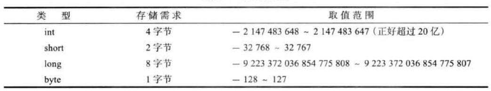
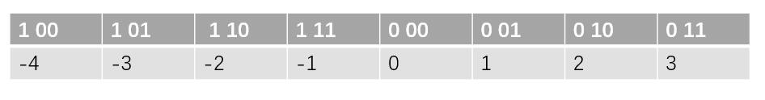
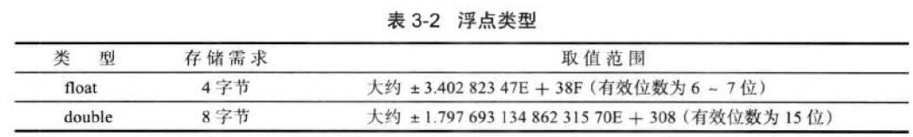

# 八大基本数据类型
## 四种整形
四种整形分别是byte,short,int,long，所占用的字节数分别是，1，2，4，8，计算机中一个字节是8bit。这四种整形都是有符号位数。


[为什么byte占用一个字节8bit，可以表示-128到+127?](https://blog.csdn.net/qq_23418393/article/details/57421688)

简单来说，就是计算机把byte类型中的数据在内存中表示为，机器说的补码形式，补码的规则是，整数的补码符号位为0，负数的补码符号位为1，因此剩余七位用来表示
数据值，正数0 1111111表示+127,负数的最小值计算机内部并表示方式为 1
0000000。推荐阅读：计算机组成原理的数据的运算与表示这一章，关于计算机内部数据的存储和表示。
下图是四位数的补码表示


```java
byte a = Byte.MAX_VALUE; #
a+=1;
System.out.println(a); //输出-128
```
上述基本类型的整数都有默认值0，注意如果是局部变量没有初始化是没有默认值。静态变量或者类的非静态变量默认值是0
```java
public class test {
    private  static  int intDefault;
    int intDefault2;
    public static void main(String[] args) {
        System.out.println(test.intDefault+"   "+ new test().intDefault2);
    }
}
```
### 整形数据的源码解析
待更新
## 两种浮点型


推荐阅读：《计算机组成原理》的数据的运算和表示这一章，IEEE 754标准的浮点数标准。
## 一种char字符型
char表示按个字符，通常表示字符常量，一般采用Unicode编码单元进行标识十六进制，范围\u0000到
\uffff占用两个字节。
## 一种boolean类型
true or false 一般虚拟机底层实现是用int类型的1或者0表示

```java
    boolean b=true;
    字节码层面实现如下。
   Code:
       0: iconst_1
       1: istore_1
       2: return
```
# 面向对象
## 面向对象和面向过程

### 平台无关性如何实现

### 基于JVM实现的语言

## 面向对象三大特性
### 封装
### 继承
### 多态
### 面向对象五大原则
