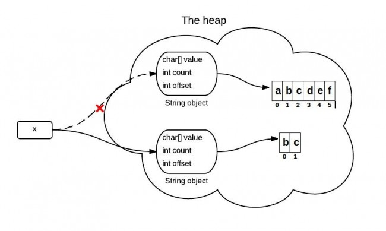

# 字符串
[可以参考hollis大神关于字符串的详解](https://www.hollischuang.com/archives/1330)
## 字符串的不可变性

不可变字符串的好处：编译器让字符串共享，jdk的设计者认为共享带来的效率提升胜过字符串拼接，修改带来的低效率。

### 为什么字符串设计成不可变？
> String是Java中一个不可变的类，所以他一旦被实例化就无法被修改。不可变类的实例一旦创建，其成员变量的值就不能被修改。不可变类有很多优势。本文总结了为什么字符串被设计成不可变的。将涉及到内存、同步和数据结构相关的知识。

**字符串设计成不可变最重要目的是，安全，高效。**

### 字符串可变后果

**后果1.字符串常量池**

>字符串池是方法区中的一部分特殊存储。当一个字符串被被创建的时候，首先会去这个字符串池中查找，如果找到，直接返回对该字符串的引用。
>下面的代码只会在堆中创建一个字符串

```java
String string1 = "abcd";
String string2 = "abcd";
```
如果字符串可变的话，当**两个引用指向指向同一个字符串时，对其中一个做修改就会影响另外一个**。


**后果2.违反某些集合的设计**

```java
如果字符串可变
HashSet<String> set = new HashSet<String>();
set.add(new String("a"));
set.add(new String("b"));
set.add(new String("c"));

for(String a: set)
    a.value = "a";
```
>如果字符串可以被改变，那么以上用法将有可能违反Set的设计原则，因为Set要求其中的元素不可以重复。上面的代码只是为了简单说明该问题，其实String类中并没有value这个字段值。


### 不可变好处1. hashcode不变

>Java中经常会用到字符串的哈希码（hashcode）。例如，在HashMap中，字符串的不可变能保证其hashcode永远保持一致，这样就可以避免一些不必要的麻烦。这也就意味着每次在使用一个字符串的hashcode的时候不用重新计算一次，这样更加高效。

```java
private int hash;//this is used to cache hash code.
```

> 以上代码中hash变量中就保存了一个String对象的hashcode，因为String类不可变，所以一旦对象被创建，该hash值等于0，第一次执行该对象的hashcode方法时候计算hashcode，以后获取hashcode是直接返回hash,具体请看hashcode的源码。并且并发情况下获取string的hash
> code不会导致数据异常，源码中没有加锁，自已自行分析原因。字符串一旦创建的话，就保持了其hashcode不变，因此可以作为hashmap的key。

### 不可变好处2. 使用安全

>String被广泛的使用在其他Java类中充当参数。比如网络连接、打开文件等操作。如果字符串可变，那么类似操作可能导致安全问题。因为某个方法在调用连接操作的时候，他认为会连接到某台机器，但是实际上并没有（其他引用同一String对象的值修改会导致该连接中的字符串内容被修改）。可变的字符串也可能导致反射的安全问题，因为他的参数也是字符串。

```java
boolean connect(string s){
    if (!isSecure(s)) { 
throw new SecurityException(); 
}
    //如果s在该操作之前被其他的引用所改变，那么就可能导致问题。   
    causeProblem(s);
}
```

**线程安全**
因为不可变对象不能被改变，所以他们可以自由地在多个线程之间共享。不需要任何同步处理


### 定义一个字符串
String s = "abcd"; String s2 = s; 

### 字符串连接
s = s.concat("ef"); 

### 总结
一旦一个string对象在内存(堆)中被创建出来，他就无法被修改。特别要注意的是，String类的所有方法都没有改变字符串本身的值，都是返回了一个新的对象。
如果你需要一个可修改的字符串，应该使用StringBuffer 或者
StringBuilder。否则会有大量时间浪费在垃圾回收上，因为每次试图修改都有新的string对象被创建出来。

## 字符串常见源码解析
[解析来源hollis](http://47.103.216.138/archives/99)

### 字符串定义
```java
public final class String implements java.io.Serializable, Comparable<String>, CharSequence{}
```
从该类的声明中我们可以看出String是final类型的，表示该类不能被继承，同时该类实现了三个接口：java.io.Serializable、 Comparable<String>、 CharSequence

### 属性
```java
private final char value[];
```
这是一个字符数组，并且是final类型，他用于存储字符串内容，从fianl这个关键字中我们可以看出，String的内容一旦被初始化了是不能被更改的。 虽然有这样的例子： String s = “a”; s = “b” 但是，这并不是对s的修改，而是重新指向了新的字符串， 从这里我们也能知道，String其实就是用char[]实现的。

```java
private int hash;
```

缓存字符串的hash Code，默认值为 0

```java
private static final long serialVersionUID = -6849794470754667710L;
private static final ObjectStreamField[] serialPersistentFields = new ObjectStreamField[0];
```
因为String实现了Serializable接口，所以支持序列化和反序列化支持。Java的序列化机制是通过在运行时判断类的serialVersionUID来验证版本一致性的。在进行反序列化时，JVM会把传来的字节流中的serialVersionUID与本地相应实体（类）的serialVersionUID进行比较，如果相同就认为是一致的，可以进行反序列化，否则就会出现序列化版本不一致的异常(InvalidCastException)。

** [该如何创建字符串，使用” “还是构造函数？](http://47.103.216.138/archives/1249) **

### 构造方法
**1.使用字符数组、字符串构造一个String(最常见的字符串构造)**

我们知道，其实String就是使用字符数组（char[]）实现的。所以我们可以使用一个字符数组来创建一个String，那么这里值得注意的是，
当我们使用字符数组创建String的时候，会用到Arrays.copyOf方法和Arrays.copyOfRange方法。这两个方法是将原有的字符数组中的内容逐一的复制到
String中的字符数组中。同样，我们也可以用一个String类型的对象来初始化一个String。这里将直接将源String中的value和hash两个属性直接赋值给目标String。
因为String一旦定义之后是不可以改变的，所以也就不用担心改变源String的值会影响到目标String的值。
```java
 字符数组构造字符串源码
 public String(char value[]) {
        //这个value就是上面那个private final数组，用来存储字符串中数据，且永远不变
        this.value = Arrays.copyOf(value, value.length); //根据原来的数组数值，拷贝一个新的数组
        //Arrays.copyof会调用System.arraycopy方法，然后调用native方法
    }
    实例化一个字符串
    char data[] = {'a', 'b', 'c'};
    String str = new String(data);
    使用String类型的对象初始化字符串，源码
    public String(String original) {
        this.value = original.value;
        this.hash = original.hash;
    }
    
```
**2.基于StringBuffer和StringBuilder构造String(很少用)**

作为String的两个“兄弟”，StringBuffer和StringBuider也可以被当做构造String的参数。
jdk1.8注释说，通过对字符串缓冲区StringBuffer和StringBuilder的内容被复制；字符串缓冲区的后续修改不会影响新创建的字符串。
通常使用Stringbuffer或者StringBuilder的toString()方法获取字符串可能运行得更快，通常是首选并且StringBuilder的toString
方法没有synchronized,因此速度更快。
```java
 public String(StringBuffer buffer) {
        synchronized(buffer) {
            this.value = Arrays.copyOf(buffer.getValue(), buffer.length());
        }
    }

    public String(StringBuilder builder) {
        this.value = Arrays.copyOf(builder.getValue(), builder.length());
    }
    
    StringBuilder的toString方法获取string
    public String toString() {
    // Create a copy, don't share the array
    return new String(value, 0, count);
     }
    this.value = Arrays.copyOfRange(value, offset, offset+count);
```

**3.被特殊保护的构造方法**


```java
String(char[] value, boolean share) {
    // assert share : "unshared not supported";
    this.value = value;
}
```
jdk官方文档说这是包私有的构造器（因为构造器权限修饰符为default
同一个包或者本类可以访问），有这个构造器的原因是因为速度快（数组共享，直接引用赋值）
并且share只能是true，加share 的原因是因为我们已经有一个公开的构造器，
String(char[] value)，并且这个公开的构造器是调用Arrays.copy复制的。
**加入这个share的只是为了区分于String(char[] value)方法，** 

- 性能好：这个很简单，一个是直接给数组赋值（相当于直接将 String 的 value 的指针指向char[]数组），一个是逐一拷贝，当然是直接赋值快了。
- 节约内存：该方法之所以设置为
  default，是因为一旦该方法设置为公有，在外面可以访问的话，如果构造方法没有对 arr
  进行拷贝，那么其他人就可以在字符串外部修改该数组，由于它们引用的是同一个数组，因此对
  arr 的修改就相当于修改了字符串，那就破坏了字符串的不可变性。
- 安全的：对于调用他的方法来说，由于无论是原字符串还是新字符串，其 value 数组本身都是 String 对象的私有属性，从外部是无法访问的，因此对两个字符串来说都很安全。


**如果该构造器共有的话，就破坏了字符串的不可变性**

```java
如果该构造器共有,由于该构造方法是共享数组，因此如果外部数组修改，则该字符串也会改变。
        char data[] = {'a', 'b', 'c'};
        String str = new String(data,true);
        data[0]='d';
```
**那么该构造器到底具体应用在哪里提升了性能，解决了内存呢？** 

```java
String类的concat源码
 public String concat(String str) {
        int otherLen = str.length();
        if (otherLen == 0) {
            return this;
        }
        int len = value.length;
        char buf[] = Arrays.copyOf(value, len + otherLen);//
        str.getChars(buf, len);
        return new String(buf, true);//这里没有使用new String(buf)，因此少了一次数组内存分配和数值拷贝。提升性能。
    }
    例子使用：
        String str=new String("ABC");
        String abc = str.concat("abc");
        System.out.println(abc);

```
字符串的连接一般设计思路

1. 先分配好所需的内存数组长度 =oldlenth+otherlenth
1. 复制旧的数组到新的数组中。 
1. 复制新增的字符串到新数组中。
1. 利用String类的构造器初始化新的数组。

jdk的设计者为了提升String类concat的连接性能，直接把新数组的value指向了第三步的新数组。节约了一次数组内存分配，提高了性能。因此
jdk的操刀者可谓是每行代码都很经典。这种性能的提升，不会导致大量空间不被使用，因此不会导致内存溢出。


### 检测字符串相等equals()

```java
 equals源码，重写了Object类的equals方法，Object.equals只是使用==号进行比较。
 public boolean equals(Object anObject) {
        if (this == anObject) {
            return true;
        }
        if (anObject instanceof String) {
            String anotherString = (String)anObject;
            int n = value.length;
            if (n == anotherString.value.length) {
                char v1[] = value;
                char v2[] = anotherString.value;
                int i = 0;
                while (n-- != 0) {
                    if (v1[i] != v2[i])
                        return false;
                    i++;
                }
                return true;
            }
        }
        return false;
    }
```
1. 该方法首先判断this == anObject ？，也就是说判断要比较的对象和当前对象是不是同一个对象，如果是直接返回true，如不是再继续比较
1. 然后在判断anObject是不是String类型的，如果不是，直接返回false,如果是再继续比较
1. 到了能终于比较字符数组的时候，他还是先比较了两个数组的长度，不一样直接返回false，一样再逐一**逆序**比较值。

### String类中的hashCode

保证：相同的字符串hashcode一定一样，不同的字符串hashcode可能一样
```java
hashcode原本是Object类中的方法，在String类中被重写。
//计算公式s[0]*31^(n-1) + s[1]*31^(n-2) + ... + s[n-1]
public int hashCode() {
        int h = hash;
        //第一次string对象调用hashcode,h=0因为 h是成员变量，new String没有初始化
        //默认是0，等以后初始化后，h!=0，不是第一次获取hashcode因此直接返回hashcode
        
        if (h == 0 && value.length > 0) { 
            char val[] = value;

            for (int i = 0; i < value.length; i++) {
                h = 31 * h + val[i];
            }
            hash = h;
        }
        return h;
    }
    
    
```
s[i]是string的第i个字符，n是String的长度。那为什么这里用31，而不是其它数呢?
计算机的乘法涉及到移位计算。当一个数乘以2时，就直接拿该数左移一位即可！选择31原因是因为31是一个素数！
所谓素数：
质数又称素数。指在一个大于1的自然数中，除了1和此整数自身外，没法被其他自然数整除的数。
在存储数据计算hash地址的时候，我们希望尽量减少有同样的hash地址，所谓“冲突”。如果使用相同hash地址的数据过多，那么这些数据所组成的hash链就更长，从而降低了查询效率！所以在选择系数的时候要选择尽量长的系数并且让乘法尽量不要溢出的系数，因为如果计算出来的hash地址越大，所谓的“冲突”就越少，查找起来效率也会提高。

31可以 由i*31== (i<<5)-1来表示，现在很多虚拟机里面都有做相关优化，使用31的原因可能是为了更好的分配hash地址，并且31只占用5bits！

在java乘法中如果数字相乘过大会导致溢出的问题，从而导致数据的丢失.

而31则是素数（质数）而且不是很长的数字，最终它被选择为相乘的系数的原因不过与此！
在Java中，整型数是32位的，也就是说最多有2^32= 4294967296个整数，将任意一个字符串，经过hashCode计算之后，
得到的整数应该在这4294967296数之中。那么，最多有 4294967297个不同的字符串作hashCode之后，肯定有两个结果是一样的, 
**hashCode可以保证相同的字符串的hash值肯定相同，但是，hash值相同并不一定是value值就相同**。

### intern方法(美团技术文章)

[深入理解intern方法，美团技术文章，挺深的，需要接虚拟机内存知识](https://tech.meituan.com/2014/03/06/in-depth-understanding-string-intern.html)

```java
public native String intern();
```
该方法返回一个字符串对象的内部化引用。
众所周知：**String类维护一个初始为空的字符串的对象池**，当intern方法被调用时，如果对象池中已经包含这一个相等的字符串对象则返回对象池中的实例，否则添加字符串到对象池并返回该字符串的引用。
如果两个字符串s1.intern()==s2.intern()等于true,当且仅当s1.equals(s2);保证了如果内容相同的字符串返回同样的常量池string引用。

### String对“+”的重载
我们知道，Java是不支持重载运算符，String的“+”是java中唯一的一个重载运算符，那么java使如何实现这个加号的呢？我们先看一段代码：
```java
public static void main(String[] args) { String string="hollis"; String
string2 = string + "chuang"; } 

反编译结果
public static void main(String args[]){
   String string = "hollis";
   String string2 = (new StringBuilder(String.valueOf(string))).append("chuang").toString();
}
```
看了反编译之后的代码我们发现，其实String对“+”的支持其实就是使用了StringBuilder以及他的append、toString两个方法。

**IDEA 反编译，通过右键.java文件，show bytecode outline出现cfrDecomplie**

### "高性能"的subString带来的内存溢出


## jdk1.6和1.7如何实现subString

```java
代码例子 
String s="abc".substring(0,2); 
System.out.println(s);输出ab
```
### jdk1.6subString可能导致内存泄漏
什么是内存泄漏？为对象分配了内存，却不能回收。**简单说1.6版本下内存泄漏是**：初始分配一个很大的字符串bigString，调用subString方法截取很小一部分smallString呢，由于1.6版本写subString是数组共享，bigString和smallString
其实都是指向同一个字符数组（bigString），只是两个字符串的beginIndex和count不同，因此导致大字符串bigString所占用的大内存是放不掉，导致内存泄漏。

**jdk1.6下源码分析**
>String是通过字符数组实现的。在jdk 6 中，String类包含三个成员变量：char value[]， int offset，int count。他们分别用来存储真正的字符数组，数组的第一个位置索引以及字符串中包含的字符个数。
>当调用substring方法的时候，会创建一个新的string对象，但是这个string的值仍然指向堆中的同一个字符数组。这两个对象中只有count和offset
>的值是不同的。


```java
jdk1.6 subString源码
String(int offset, int count, char value[]) {
    this.value = value; //jdk1.6下设计者为了共享数组，直接对数组的引用进行赋值，聪明反被聪明误，导致了内存泄漏。
    this.offset = offset;
    this.count = count;
}

public String substring(int beginIndex, int endIndex) {
    //check boundary
    return  new String(offset + beginIndex, endIndex - beginIndex, value);
}
```

### jdk1.7设计者解决subString导致的内存泄漏
**简单来说就是：**subString获取的smallString不在引用bigString数组，而是从bigString中拷贝部分新的数组。



```java
jdk1.7 subString源码
public String(char value[], int offset, int count) {
    //check boundary
    //求字串直接复制，父串中的一部分，一个新的小数组。
    this.value = Arrays.copyOfRange(value, offset, offset + count);
}

public String substring(int beginIndex, int endIndex) {
    //check boundary
    int subLen = endIndex - beginIndex;
    return new String(value, beginIndex, subLen);
}
```

## switch对String的支持

jdk1.7中，switch中参数支持对byte,short,int,char,**string**,**switch参数只支持整形**。

### 一、switch对整型支持的实现

```java
public class switchDemoInt {
    public static void main(String[] args) {
        int a = 5;
        switch (a) {
        case 1:
            System.out.println(1);
            break;
        case 5:
            System.out.println(5);
            break;
        default:
            break;
        }
    }
}
```
```java
利用cfrDecompile进行反编译
public class test {
    public static void main(String[] args) {
        int a = 5;
        switch (a) {
            case 97: {
                System.out.println((int)1);
                break;
            }
            case 5: {
                System.out.println((int)5);
                break;
            }
        }
    }
}
```
我们发现，反编译后的代码和之前的代码比较除了多了两行注释以外没有任何区别，那么我们就知道，switch对int的判断是直接比较整数的值。

### 二、switch对字符支持的实现

```java
直接上代码：

public class switchDemoInt {
    public static void main(String[] args) {
        char a = 'b';
        switch (a) {
        case 'a':
            System.out.println('a');
            break;
        case 'b':
            System.out.println('b');
            break;
        default:
            break;
        }
    }
}
编译后的代码如下： 
public class switchDemoChar
{
    public switchDemoChar()
    {
    }
    public static void main(String args[])
    {
        char a = 'b';
        switch(a)
        {
        case 97: // 'a'
            System.out.println('a');
            break;
        case 98: // 'b'
            System.out.println('b');
            break;
        }
  }
}
```
通过以上的代码作比较我们发现：对char类型进行比较的时候，实际上比较的是ascii码，编译器会把char型变量转换成对应的int型变量

### 三、switch对字符串支持的实现（jdk1.7之后）

简单来说就是先计算switch(str)参数的hashcode（string类的hashcode返回的是int数值），作为int参数传入，然后再case中str也计算hashcode后，调用str的equals方法进行比较字符串数值之不是相等，因为hashcode相等字符串不一定相等。


```java
还是先上代码：

public class switchDemoString {
    public static void main(String[] args) {
        String str = "world";
        switch (str) {
        case "hello":
            System.out.println("hello");
            break;
        case "world":
            System.out.println("world");
            break;
        default:
            break;
        }
    }
}
对代码进行反编译：

public class switchDemoString
{
    public switchDemoString()
    {
    }
    public static void main(String args[])
    {
        String str = "world";
        String s;
        switch((s = str).hashCode())
        {
        default:
            break;
        case 99162322:
            if(s.equals("hello"))
                System.out.println("hello");
            break;
        case 113318802:
            if(s.equals("world"))
                System.out.println("world");
            break;
        }
    }
}
```
>看到这个代码，你知道原来字符串的switch是通过equals()和hashCode()方法来实现的。记住，switch中只能使用整型，比如byte。short，char(ackii码是整型)以及int。还好hashCode()方法返回的是int，而不是long。通过这个很容易记住hashCode返回的是int这个事实。仔细看下可以发现，进行switch的实际是哈希值，然后通过使用equals方法比较进行安全检查，这个检查是必要的，因为哈希可能会发生碰撞。因此它的性能是不如使用枚举进行switch或者使用纯整数常量，但这也不是很差。因为Java编译器只增加了一个equals方法，如果你比较的是字符串字面量的话会非常快，比如”abc” ==”abc”。如果你把hashCode()方法的调用也考虑进来了，那么还会再多一次的调用开销，因为字符串一旦创建了，它就会把哈希值缓存起来。因此如果这个siwtch语句是用在一个循环里的，比如逐项处理某个值，或者游戏引擎循环地渲染屏幕，这里hashCode()方法的调用开销其实不会很大。

**总结：switch中的参数只支持整形int,其余类型都被化为int**

## 关于string的经典面试题

[请参考hollis大神写的博客](https://www.hollischuang.com/archives/2517)

## 本节比较难理解的部分（未看完）
1.美团技术点评关于intern的文章 

2.上述的面试题

## StringBuffer与StringBuilder的爱恨情仇，面试必问（待更新）

