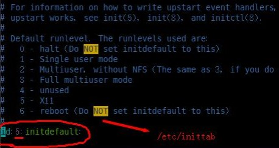

# 实用指令

## 1. 指定运行级别（7个级别）

* 0.关机
* 1.单用户【找回丢失密码】
* 2.多用户状态没有网络服务
* 3.多用户状态有网络服务（最多使用）
* 4.系统未使用保留给用户
* 5.图形界面
* 6.系统重启

* 系统的运行级别配置文件：/etc/inittab

* 切换到指定运行级别的指令：init [012356]

## 2. 帮助指令

### 2.1 man获得帮助信息

> man [命令或配置文件]

* 例如:man ls

### 2.2 help指令

> help [命令或配置文件]

## 3. 文件目录类指令（重点）

### 3.1 文件剪贴删除复制重名等（重点）

* pwd：Print Working Directory，显示当前工作目录的绝对路径。
* ls：-a：显示当前目录所有的文件和目录，包括隐藏的；
  * -l：以列表的方式显示信息。
* cd：cd ~：回到自己的家目录；cd …：回到当前目录的上一级目录。
* mkdir：创建目录；-p：创建多级目录。
* rmdir：删除空目录。rmdir不能删除非空的目录。如果需要删除非空的目录，需要使用rm -rf。
* cp：拷贝文件到指定目录；
  * -r：递归复制整个文件夹。强制覆盖不提示的方法：
  * cp命令改为\cp
* rm：移除文件或目录；
  * -r：递归删除整个文件夹；
  * -f：强制删除不提示。
* mv：移动文件与目录或重命名，两种功能！
* touch：创建空文件。可以一次性创建多个文件
* ln 给文件创建一个软连接
  * 用法:ln -s[源文件或目录][软连接名]

### 3.2 文件查看（重点）

* cat：查看文件内容。只能浏览文件，而不能修改文件。
  * -n：显示行号。
  * 结尾加上 | more：分页显示，不会全部一下显示完。
* more：是一个基于VI编辑器的文本过滤器，它以全屏幕的方式按页显示文本文件的内容。more还内置了很多快捷键：
  * 空白键（Space）：向下翻一页
  * Enter：向下翻一行
  * q：立刻离开more，不再显示该文件内容
  * Ctrl + F：向下滚动一屏
  * Ctrl + B：返回上一屏
  * = :输出当前行的行号
  * :f 输出文件名和当前行的行号
* less：用来分屏查看文件内容，与more相似，但是更强大，支持各种显示终端。less指令在显示文件内容时，并不是一次将整个文件加载之后才显示，而是根据显示需要加载内容。对于显示大型文件具有较高的效率。
* head：显示文件的开头部分。-n 5：看前面5行内容。
* tail：输出文件中尾部的内容。
  * -n 5：看后面5行内容。
  * -f：时事追踪该文档的所有更新
* \>指令：输出重定向。如果不存在会创建文件，否则会将原来的文件内容覆盖。
* \>>指令：追加。如果不存在会创建文件，否则不会覆盖原来的文件内容，而是追加到文件的尾部。
* echo：输出内容到控制台。
* history：查看历史指令

### 3.3 时间和日期

* date：显示当前日期和时间
  * date “+%Y”：显示当前年份
  * date “+%d”：显示当前月份
  * date “+%Y-%m-%d %H:%M:%S”：显示年-月-日 时：分：秒
  * 设置日期：date -s 字符串时间
* cal：查看日历指令；
  * cal [月] [年份]：显示某一年或月的日历

### 3.4 搜索查找类（重点）

* find：从指定目录向下递归的遍历其各个子目录，将满足条件的文件或者目录显示在终端。
  * find (搜索范围) -name (文件名)：按照指定的文件名查找模式查找文件。
  * find (搜索范围) -user (用户名)：按照指定的用户名查找模式查找文件。
  * find (搜索范围) -size (+多少/-多少/多少)：按照指定的文件大小查找模式查找文件（大于多少/小于多少/等于多少）
  * 查询 /目录下所有.txt的文件：find / -name *.txt
* locate：locate (搜索文件)
  * 可以快速定位文件路径。locate指令利用事先建立的系统中所有文件名称及路径的locate数据库实现快速定位给定的文件。
  * locate指令无需遍历整个文件系统，查询速度较快。为了保证查询结果的准确度，管理员必须定期更新locate时刻。
  * 在第一次运行之前，必须使用updatedb指令创建locate数据库。
* grep：过滤查找，表示将前一个命令的处理结果输出传递给后面的命令处理。经常跟管道一起使用。
  * grep [选项] 查找内容 源文件
  * -n：显示匹配行及行号。
  * -i：忽略大小写字母。
  * cat hello.txt | grep yes

### 3.5 压缩和解压类（重点）

* gzip/gunzip：压缩文件/解压
  * gzip (文件)：压缩为.gz文件，原来文件不保留。
  * gunzip (文件)：解压缩，同样也不保留源文件。
* zip/unzip：压缩文件/解压
  * zip [选项] (压缩后文件xxx.zip) (将要压缩的文件)
  * unzip [选项] (要解压的文件xxx.zip)
  * zip -r：递归压缩，即压缩目录
  * unzip -d (目录)：指定解压后的文件的存放目录
* tar：打包指令，最后打包后的文件是.tar.gz的文件
  * tar [选项] xxx.tar.gz (打包的内容)
  * -c：产生.tar打包文件
  * -v：显示详细信息
  * -f：指定压缩后的文件名
  * -z：打包同时压缩
  * -x：解压.tar文件
  * 压缩：tar -zcvf (压缩后文件名) (要压缩的文件)
  * 解压：tar -zxvf (要解压的文件)
  * 解压到指定目录：tar -zxvf (要解压的文件) -C (指定目录)，指定解压到的目录要存在。

## 4. 更多命令

[Linux命令大全](https://www.runoob.com/linux/linux-command-manual.html)

## 5. 面试必备的top命令，面试高频（重点）

[top命令查看cpu,内存 ](https://www.cnblogs.com/fuqu/p/10230385.html)

https://blog.csdn.net/qq_33803102/article/details/121990352

https://zhuanlan.zhihu.com/p/386271892