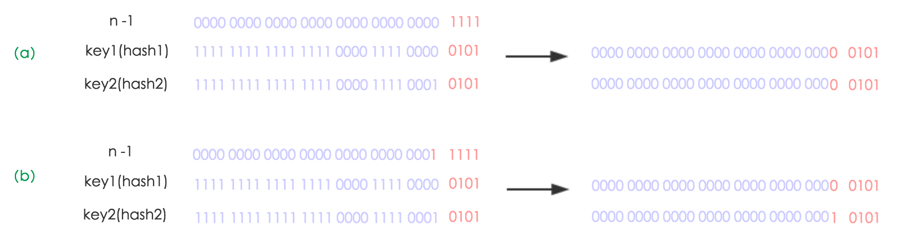

## hashmap中hash算法确定哈希桶位置

### jdk1.8中哈希算法
不管增加、删除、查找键值对，定位到哈希桶数组的位置都是很关键的第一步。前面说过HashMap的数据结构是数组和链表的结合，
所以我们当然希望这个HashMap里面的元素位置尽量分布均匀些，尽量使得每个位置上的元素数量只有一个，那么当我们用hash算法求得这个位置的时候，
马上就可以知道对应位置的元素就是我们要的，不用遍历链表，大大优化了查询的效率。HashMap定位数组索引位置，
直接决定了hash方法的离散性能。先看看源码的实现(方法一+方法二):
```java
方法一：
static final int hash(Object key) {   //jdk1.8 
     int h;
     // h = key.hashCode() 为第一步 取hashCode值
     // h ^ (h >>> 16)  为第二步 高位参与运算
     return (key == null) ? 0 : (h = key.hashCode()) ^ (h >>> 16);
}
方法二：
static int indexFor(int h, int length) {  //jdk1.7的源码，jdk1.8没有这个方法，但是实现原理一样的
     return h & (length-1);  //第三步 取模运算
}
```
**Hash算法本质上就是三步**
1. 取key的hashCode值(key.hashCode())
2. 高位运算h = key.hashCode() ^ (h >>> 16) (**高低位同时参与运算降低冲突**)
3. 取模运算。h & (length-1)（**&运算效率高于%**）

对于任意给定的对象，只要它的hashCode()返回值相同,程序调用方法一所计算得到的Hash码值总是相同的.
好的hash算法的目的计算出来的index下标位置尽可能分散均匀一些。一般可以对数组长度取余%arrayLength获得index.
但是jdk设计者并没有这样做。原因有两个

一、直接取余hash算法冲突高。任何key的hashcode只用到了低位定位index,冲突可能性比较高。因此jdk设计者
通过把hashcode的高低16位做异或运算。目的：hash算法冲突率低、分散均匀.

二、直接取余%操作效率低下。hashcode % length和hashcode&(length-1)“低位掩码”计算最终结果一样，但是
&比取余%运算速度更快。


**拓展**：第二步骤高低位参与运算又称为“扰动函数”，最后我们来看一下Peter Lawley的一篇专栏文章《An introduction to optimising a hashing strategy》里的的一个实验：
他随机选取了352个字符串，在他们散列值完全没有冲突的前提下，对它们做低位掩码(低位与运算)，取数组下标。


结果显示，当HashMap数组长度为512的时候，也就是用掩码取低9位的时候，在没有扰动函数的情况下，发生了103次碰撞，
接近30%。而在使用了扰动函数之后只有92次碰撞。碰撞减少了将近10%。看来扰动函数确实还是有功效的。
Java 8觉得扰动做一次就够了，做4次的话，多了可能边际效用也不大，所谓为了效率考虑就改成一次了。

JDK 源码中 HashMap 的 hash 方法原理是什么？
https://www.zhihu.com/question/20733617

### jdk1.7中哈希算法

```java
哈希算法
final int hash(Object k) {
        int h = hashSeed;
        if (0 != h && k instanceof String) {
            return sun.misc.Hashing.stringHash32((String) k);
        }
        h ^= k.hashCode();
        h ^= (h >>> 20) ^ (h >>> 12);//四次扰动函数,jdk1.8只要一次扰动。高低16异或运算
        return h ^ (h >>> 7) ^ (h >>> 4);
    }
static int indexFor(int h, int length) {
        return h & (length-1); //定位到桶的索引位置
//这也正好解释了为什么HashMap的数组长度要取2的整次幂。因为这样（数组长度-1）正好相当于一个低位掩码”。
    }
```
这段代码是为了对key的hashCode进行扰动计算，防止不同hashCode的高位不同但低位相同导致的hash冲突。
简单点说，就是为了把高位的特征和低位的特征组合起来，降低哈希冲突的概率，也就是说，
尽量做到任何一位的变化都能对最终得到的结果产生影响。举个例子来说，我们现在想向一个HashMap中put一个K-V对，
Key的值为“hollischuang”，经过简单的获取hashcode后，得到的值为“1011000110101110011111010011011”，
如果当前HashTable的大小为16，即在不进行扰动计算的情况下，他最终得到的index结果值为11。
由于15的二进制扩展到32位为“00000000000000000000000000001111”，所以，
一个数字在和他进行按位与操作的时候，前28位无论是什么，计算结果都一样（因为0和任何数做与，结果都为0）。如下图所示。

可以看到，后面的两个hashcode经过位运算之后得到的值也是11 ，虽然我们不知道哪个key的hashcode是上面例子
中的那两个，但是肯定存在这样的key，这就产生了冲突。
那么，接下来，我看看一下经过**扰动算法**最终的计算结果会如何。

从上面图中可以看到，之前会产生冲突的两个hashcode，经过扰动计算之后，最终得到的index的值不一样了，这就很好的避免了冲突。


## hashmap扩容
###  jdk1.7hashmap扩容
扩容(resize)就是重新计算容量，向HashMap对象里不停的添加元素，而HashMap对象内部的数组无法装载更多的元素时，
对象就需要扩大数组的长度，以便能装入更多的元素。当然Java里的数组是无法自动扩容的，方法是使用一个新的数组代替已有的容量小的数组，
就像我们用一个小桶装水，如果想装更多的水，就得换大水桶。我们分析下resize的源码，鉴于JDK1.8融入了红黑树，
较复杂，为了便于理解我们仍然使用JDK1.7的代码，好理解一些，本质上区别不大，具体区别后文再说。


```java
void resize(int newCapacity) {   //传入新的容量  
     Entry[] oldTable = table;    //引用扩容前的Entry数组  
     int oldCapacity = oldTable.length;           
     if (oldCapacity == MAXIMUM_CAPACITY) {  //扩容前的数组大小如果已经达到最大(2^30)了  
         threshold = Integer.MAX_VALUE; //修改阈值为int的最大值(2^31-1)，这样以后就不会扩容了  
         return;  
     }  
   
     Entry[] newTable = new Entry[newCapacity];  //初始化一个新的Entry数组  
    transfer(newTable);                         //！！将数据转移到新的Entry数组里  
    table = newTable;                           //HashMap的table属性引用新的Entry数组  
    threshold = (int)(newCapacity * loadFactor);//修改阈值  
}
```

这里就是使用一个容量更大的数组来代替已有的容量小的数组，transfer()方法将原有Entry数组的元素拷贝到新的Entry数组里。
```java
void transfer(Entry[] newTable) {  
    Entry[] src = table;                   //src引用了旧的Entry数组  
    int newCapacity = newTable.length;  
    for (int j = 0; j < src.length; j++) { //遍历旧的Entry数组  
        Entry<K,V> e = src[j];             //取得旧Entry数组的每个元素  
        if (e != null) {  
            //src[j]与上面的一条链表脱钩。
            src[j] = null;//释放旧Entry数组的对象引用（for循环后，旧的Entry数组不再引用任何对象）  
             do {  
                 Entry<K,V> next = e.next;  
                int i = indexFor(e.hash, newCapacity); //！！重新计算每个元素在数组中的位置  
                e.next = newTable[i]; // 转移的节点的尾指针，指向newTable[i]所指向的第一个节点（头插法），开始newTable[i]
                //如果newTable[i]==null的话，那么e.next指向的就是null
                newTable[i] = e;      //将元素放在数组上 ,数组newTable[i]位置的引用指向刚刚的节点e（头插法） 
                e = next;             //访问下一个Entry链上的元素  
            } while (e != null);  //while循环遍历链表上结点，并且转移到新的数组中
        }  
    }  
}
```

下面举个例子说明下扩容过程。假设了我们的hash算法就是简单的用key mod 一下表的大小（也就是数组的长度）。
其中的哈希桶数组table的size=2， 所以key = 3、7、5，put顺序依次为 5、7、3。在mod 2以后都冲突在table[1]这里了。
这里假设负载因子 loadFactor=1，即当键值对的实际大小size 大于 table的实际大小时进行扩容。接下来的三个步骤是哈希桶数组 
resize成4，然后所有的Node重新rehash的过程。


下面我们讲解下JDK1.8做了哪些优化。经过观测可以发现，我们使用的是2次幂的扩展(指长度扩为原来2倍)，所以，元素的位置要么是在原位置，
要么是在原位置再移动2次幂的位置。看下图可以明白这句话的意思，n为table的长度，
图（a）表示扩容前的key1和key2两种key确定索引位置的示例，图（b）表示扩容后key1和key2两种key确定索引位置的示例，
其中hash1是key1对应的哈希与高位运算结果。 

元素在重新计算hash之后，因为n变为2倍，那么n-1的mask范围在高位多1bit(红色)，因此新的index就会发生这样的变化： 

因此，我们在扩充HashMap的时候，不需要像JDK1.7的实现那样重新计算hash，只需要看看原来的hash值新增的那个bit是1还是0就好了，是0的话索引没变，是1的话索引变成“原索引+oldCap”，可以看看下图为16扩充为32的resize示意图： 

这个设计确实非常的巧妙，既省去了重新计算hash值的时间，而且同时，由于新增的1bit是0还是1可以认为是随机的，因此resize的过程，
均匀的把之前的冲突的节点分散到新的bucket了。这一块就是JDK1.8新增的优化点。有一点注意区别，JDK1.7中rehash的时候，
旧链表迁移新链表的时候，如果在新表的数组索引位置相同，则链表元素会倒置，但是从上图可以看出，JDK1.8不会倒置。


### hashmap并发扩容导致的死循环（jdk1.7头插法）
多线程使用场景中，应该尽量避免使用线程不安全的HashMap，而使用线程安全的ConcurrentHashMap
```java
public class HashMapInfiniteLoop {    
               
            private static HashMap<Integer,String> map = new HashMap<Integer,String>(2，0.75f);   
            public static void main(String[] args) {    
                map.put(5，"C");   
           
                newThread("Thread1") {    
                    public void run() {    
                        map.put(7,"B");   
                        System.out.println(map);   
                    };   
                }.start();   
                newThread("Thread2") {    
                    public void run() {    
                        map.put(3, "A);    
                        System.out.println(map);   
                    };   
                }.start();         
            }   
        }
```
其中，map初始化为一个长度为2的数组，loadFactor=0.75，threshold=2*0.75=1，也就是说当put第二个key的时候，map就需要进行resize。 
通过设置断点让线程1和线程2同时debug到transfer方法的首行。注意此时两个线程已经成功添加数据。放开thread1的断点至transfer方法
的“Entry next = e.next;” 这一行；然后放开线程2的的断点，让线程2进行resize。结果如下图。 

注意，Thread1的 e 指向了key(3)，而next指向了key(7)，其在线程二rehash后，指向了线程二重组后的链表。

线程一被调度回来执行，先是执行 newTalbe[i] = e， 然后是e = next，导致了e指向了key(7)，而下一次循环的next = e.next导致
了next指向了key(3)。


e.next = newTable[i] 导致 key(3).next 指向了 key(7)。注意：此时的key(7).next 已经指向了key(3)， 环形链表就这样出现了。

于是，当我们用线程一调用map.get(11)时，悲剧就出现了——Infinite Loop。


### jdk1.8 hashmap尾插法避免死循环


### 如何检测到死循环
链表如何确认存在循环，这里说了双指针

## hashmap的put操作
### jdk1.7的put操作
1. 如果定位到的数组位置没有元素 就直接插入。
2. 如果定位到的数组位置有元素，遍历以这个元素为头结点的链表，依次和插入的key比较，如果key相同就直接覆盖，不同就采用头插法插入元素。

```java
public V put(K key, V value)
    if (table == EMPTY_TABLE) { 
//初始化hashmap的的Entry数组table,大小是2的次方
    inflateTable(threshold); 
}  
    if (key == null)
//hashmap的key是null,插入到table[0]位置的拉链链表中
        return putForNullKey(value);
//hashcode经过四次扰动函数后得出的哈希值
    int hash = hash(key);
//i=hash & table.length-1
    int i = indexFor(hash, table.length);
//遍历table[i]位置的链表，查看是已经有存在key相同的节点。
    for (Entry<K,V> e = table[i]; e != null; e = e.next) { // 先遍历
        Object k;
//key相同含义。这里e.hash==hash是提前校验，性能损耗远小于equals方法。hashcode不相等，equals一定不相等，hashcode相等的话，才进一步去检查equals
        if (e.hash == hash && ((k = e.key) == key || key.equals(k))) {
            V oldValue = e.value;
            e.value = value;//取代已经存在的value
            e.recordAccess(this);
            return oldValue; 
        }
    }

    modCount++;
    //table[i]位置或者下面挂的链表没有找到，直接插入。
    addEntry(hash, key, value, i);  // 再插入
    return null;
}
// 节点插入到指定index位置。
void addEntry(int hash, K key, V value, int bucketIndex) {
//扩容条件：1、实际容量大于阈值。2、数组下标index位置已经存在元素
        if ((size >= threshold) && (null != table[bucketIndex])) {
            //两倍扩容
            resize(2 * table.length);
            hash = (null != key) ? hash(key) : 0;
            //计算扩容后索引下标。bucketIndex=h & (length-1);
            bucketIndex = indexFor(hash, table.length);
        }
        //头插法直接插入到table[bucketIndex]位置
        createEntry(hash, key, value, bucketIndex);
    }
```

## hashmap的get操作

```java
 public V get(Object key) {
        if (key == null)
//key=null，从table[0]位置对应的链表中查找
            return getForNullKey();
//key!=null，从getEntry方法中寻找节点
        Entry<K,V> entry = getEntry(key);
        return null == entry ? null : entry.getValue();
    }

final Entry<K,V> getEntry(Object key) {
        if (size == 0) {
            return null;
        }
        //计算hash是经过四次扰动后的hashcode
        int hash = (key == null) ? 0 : hash(key);
        //遍历hash所在的数组索引位置下的挂着的链表
        for (Entry<K,V> e = table[indexFor(hash, table.length)];
             e != null;
             e = e.next) {
            Object k;
//这里e.hash==hash是提前校验，性能损耗远小于equals方法。hashcode不相等，equals一定不相等，hashcode相等的话，才进一步去检查equals
            if (e.hash == hash &&
                ((k = e.key) == key || (key != null && key.equals(k))))
                return e;
        }
        return null;
    }
```

## hashmap涉及到的hashcode和equals
hashcode和equals都是Object类的方法，因此所有多项都具有。Object类的hashcode是由
c++代码生成的，保证同一个对象多次执行hashcode时返回哈希值相同，hashcode存储在
对象头中。Object的equals方法就是==判断。
**hashCode的主要作用**是为了配合基于散列的集合一起正常运行,这样的散列集合包括HashSet、HashMap以及HashTable，提高在散列结构存储中查找的效率。

hashCode()具有如下约定：
1. 在Java应用程序程序执行期间，对于同一对象多次调用hashCode()方法时，其返回的哈希码是相同的，前提是将对象进行equals比较时所用的标尺信息未做修改。在Java应用程序的一次执行到另外一次执行，同一对象的hashCode()返回的哈希码无须保持一致；
2. 如果两个对象相等（依据：调用equals()方法），那么这两个对象调用hashCode()返回的哈希码也必须相等；
3. 反之，两个对象调用hasCode()返回的哈希码相等，这两个对象不一定相等。

数学逻辑表示为：  ==   => 两个对象相等 <=>  equals()相等  => hashCode()相等。因此，重写equlas()方法必须重写hashCode()方法，以保证此逻辑严格成立，同时可以推理出：
hasCode()不相等 => equals（）不相等 <=> 两个对象不相等。
 可能有人在此产生疑问：既然比较两个对象是否相等的唯一条件（也是充要条件）是equals，那么为什么还要弄出一个hashCode()，并且进行如此约定，弄得这么麻烦？
其实，这主要体现在hashCode()方法的作用上，其主要用于增强哈希表的性能。以集合类中，以Set为例，当新加一个对象时，需要判断现有集合中是否已经存在与此对象相等的对象，
如果没有hashCode()方法，需要将Set进行一次遍历，并逐一用equals()方法判断两个对象是否相等，此种算法时间复杂度为o(n)。通过借助于hasCode方法，
先计算出即将新加入对象的哈希码，然后根据哈希算法计算出此对象的位置，直接判断此位置上是否已有对象即可。（注：Set的底层用的是Map的原理实现）
对象的hashCode()返回的不是对象所在的物理内存地址。甚至也不一定是对象的逻辑地址，实现方式之一是对象内存地址转换成int数值。

**hashcode与equals关系**
1. 如果两个对象的equals相等，那么这两个对象返回的hashcode必须相等，反之不一定成立。
2. 如果两个对象的hashcode相等，那么他们的equals不一定相等

[重写equals方法时，为什么要重写hashcode](https://blog.csdn.net/qq_35868412/article/details/89380409 "fafsd")

1. 提高效率。对象相等的充要条件是equals（判断性能损耗大于hashcode），使用hashcode方法提前校验，可以避免每一次比对都调用equals方法(hashcode不相等的对象，一定不相等，
hashcode相等的对象才进一步用充要条件equals)，提高效率。比如hashmap中判断对象是否相等方法。e.hash == hash && ((k = e.key) == key || key.equals(k))
2. 保证是同一个对象。如果重写了equals方法，而没有重写hashcode方法，会出现equals相等的对象，hashcode不相等的情况，重写hashcode方法就是为了避免这种情况的出现，确保
equals方法放进hashmap之后能取出来。

如果不重写hashcode会出现什么问题？**之前put进hashmap的数据get不到**
```java
import java.util.HashMap;

public class Apple {
    private String color;
    public Apple(String color) {
        this.color = color;
    }
    public boolean equals(Object obj) {//重写了equals方法
        if(obj==null) return false;
        if (!(obj instanceof Apple))
            return false;   
        if (obj == this)
            return true;
        return this.color.equals(((Apple) obj).color);
    }
    public static void main(String[] args) {
        Apple a1 = new Apple("green");
        Apple a2 = new Apple("red");
        Apple a3=new Apple("green");
        //hashMap stores apple type and its quantity
        HashMap<Apple, Integer> m = new HashMap<Apple, Integer>();
        m.put(a1, 10);//hashmap的get和put判断对象相等和位置 e.hash == hash && ((k = e.key) == key || key.equals(k))
        m.put(a2, 20);
        System.out.println(m.get(a3));//return null
    }
}
```
上面的代码执行过程中，先是创建个两个Apple，一个green apple和一个red apple，然后将这来两个apple存储在map中，存储之后再试图通过map的get
方法获取到其中green apple的实例。读者可以试着执行以上代码，数据结果为null。也就是说刚刚通过put方法放到map中的green apple并没有通过get
方法获取到。你可能怀疑是不是green apple并没有被成功的保存到map中，但是，通过debug工具可以看到，它已经被保存成功了。

上述代码中a1的hashcode和a3的hashcode不相等，所以a1 put进hashmap的table[index]位置不相等，因此get(a3)时候，get不到。


### 两个对象a1,a2，如果这两个对象的hashcode一样，equals不一样被put和get发生什么事？
**本质上就是：简单理解就是两个不同的对象，发生了hashcode冲突而已，可以正常put和get。**
```java_holder_method_tree
e.hash == hash && ((k = e.key) == key || key.equals(k)) hashmpa中最重要代码
//这里e.hash==hash是提前校验，性能损耗远小于equals方法。hashcode不相等，equals一定不相等，hashcode相等的话，才进一步去检查equals
```
**put时候**：hashcode一样 => table[index]所在的数组下标索引一样，a1被放在table[index]位置，之后a2定位到table[index]对应的链表，
循环遍历链表，但是a2.equals(a1) = false，所以头插法加入到table[index]位置。

**get时候**：get(a1) =》定位table[index] 循环遍历链表，a1.hash=Node(a1.hash)&& a1.equals(Node a1)，因此正常取出来了。a2同样道理。


### 两个作为hashmap的key的对象，如果这两个对象的equals一样，hashcode不一样被put到hashmap发生什么事？

就是上面的Apple例子，第一个green绿色的apple放进put后，用第二个的green绿色的apple取不出来。

## hashmap1.8操作

https://github.com/Snailclimb/JavaGuide/blob/master/docs/java/collection/HashMap(JDK1.8)%E6%BA%90%E7%A0%81+%E5%BA%95%E5%B1%82%E6%95%B0%E6%8D%AE%E7%BB%93%E6%9E%84%E5%88%86%E6%9E%90.md

## 面试题
1. 如何让hashmap变得线程安全。
方法一、不让hashmap扩容（扩容条件：(size >= threshold) 如果知道hashmap中最多存放多少元素，比如32个，可以初始化hashmap时候，指定size和加载因子）
方法二、使用hashtable
方法三、ConcurrentHashMap
方法四、Collections.synchronizedMap(hashmap)

HashMap的哈希算法是怎么实现的，为什么要这样实现
### 为什么链表长度超过8才升级成红黑树，直接用红黑树合适吗？链表转红黑树的阈值为什么是8

问题1.为什么是8才变成红黑树

1. 基于概率统计

理想情况下使用随机的哈希码，容器中节点分布在hash桶中的频率遵循泊松分布，按照泊松分
布的计算公式计算出了**桶中元素个数和频率的对照表**，可以看到链表中元素个数为8时的概率已
经非常非常小，所以根据概率统计选择了8。
```
     * 0:    0.60653066
     * 1:    0.30326533
     * 2:    0.07581633
     * 3:    0.01263606
     * 4:    0.00157952
     * 5:    0.00015795
     * 6:    0.00001316
     * 7:    0.00000094
     * 8:    0.00000006  根据泊松分布，在负载因子0.75（HashMap默认）的情况下，单个hash槽内元素个数为8的概率小于百万分之一
为什么是8，而不是9不是10？在为8的时候概率就已经很小了，再往后调整并没有很大意义。
```
- 元素个数小于8，查询成本高，新增成本低。
- 元素个数大于8，查询成本低，新增成本高

2. 数学公式。
只有长度N >= 7的时候，红黑树的平均查找长度lgN才会小于链表的平均查找长度N/2，这个可以画函数图来确定，lgN 与N/2的交点处N约为6.64。
为什么设置为8而不是7呢？一个原因是为了防止出现频繁的链表与树的转换，当大于8的时候链表转红黑树，小于6的时候红黑树转链表，中间这段作为缓冲

问题2. 为什么不用直接用红黑树
链表的查询时间复杂度是O(n)，插入时间复杂度O(1)，红黑树的查询插入时间复杂度O(logn)，很显然，红黑树的复杂度是优于链表的。为什么哈希冲突时候不直接用红黑树呢？
**源码中注释（综合考虑时间空间开销）**：因为树节点所占空间是普通节点的两倍，所以只有当节点足够多（ TREEIFY_THRESHOLD 的值（默认值8）决定的）的时候，才会使用树节点。也就是说，节点少的时候，尽管时间复杂度上，
红黑树比链表好一点，但是红黑树所占空间比较大，并且红黑树还要左旋、右旋、变色等等保持平衡的操作）。认为只能在节点太多的时候，（**其实hashmap大多数情况下还是使用链表**，而不是红黑树，红黑树只是在极端情况下才会转换。）
**链表变红黑树过程体现了**：时间空间平衡的思想，初始节点少用链表，占用空间少，由于节点少查询性能也还行。但是随着链表节点增加到八个（极小概率百万分之一），该链表的查询效率远低于其他小于8的链表，此时
为了保证查询效率用空间换时间，引入了红黑树，红黑树虽然占用空间是链表两倍，但是查询效率远高于链表。


1.8 中为什么要用红黑树？而不用完全平衡二叉树？不用b树？（也就是三种树的区别）
## 资料

https://snailclimb.gitee.io/javaguide/#/docs/java/collection/HashMap(JDK1.8)%E6%BA%90%E7%A0%81+%E5%BA%95%E5%B1%82%E6%95%B0%E6%8D%AE%E7%BB%93%E6%9E%84%E5%88%86%E6%9E%90?id=hashmap-%e7%ae%80%e4%bb%8b

[美团技术点评hashmap1.8](https://www.cnblogs.com/xiarongjin/p/8310691.html)

[HashMap面试专题](https://www.nowcoder.com/discuss/481759?type=post&order=time&pos=&page=1&channel=1009&source_id=search_post)

[b站hashmap和currenthashmap视频](https://www.bilibili.com/video/BV1x741117jq?p=1)
