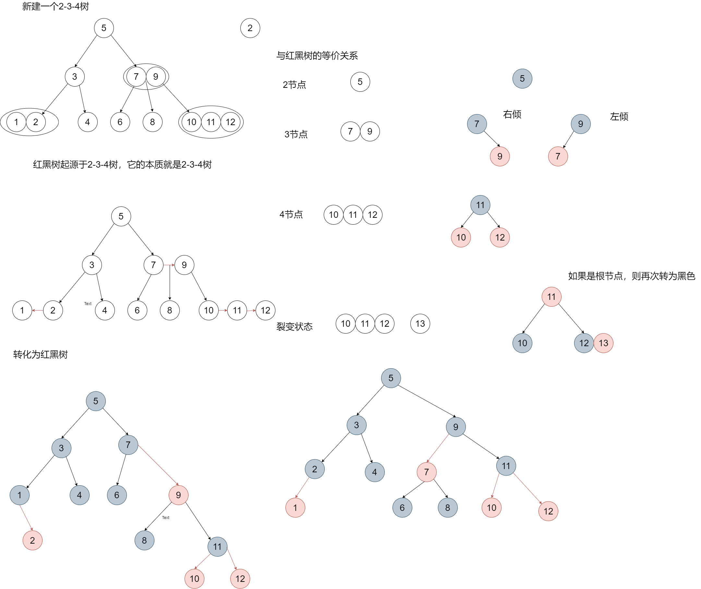
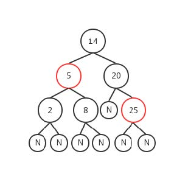

# 二叉查找树 Binarry search tree
二叉查找树（二叉搜索树）：就是一颗二叉树，他的左节点比父节点要小，右节点比父节点要大。他的
高度决定的查找效率。

## 查找（红黑树通用）：查找每个节点我们从根节点开始查找
1. 查找值比当前值大，则搜索右子树
2. 查找值等于当前值，停止查找，返回当前节点
3. 查找值比当前值小，则搜索左子树
## 插入：要插入节点，必须先找到插入节点位置。
依然是从根节点开始比较，小于根节点的话就和左子树
比较，反之与右子树比较，直到左子树为空或者右子树为空，则插入到相应为空的位置。
遍历（红黑树通用）：根据一定顺序来访问整个树，常见的有前序遍历，中序遍历（用的较多），后序
## 遍历
1. 前序遍历：左子树-》根节点-》右子树 123 4 567
2. 中序遍历：根节点-》左子树-》右子树 4 213 657
3. 后续遍历：左子树-》右子树-》根节点 132 576 4

1. **查找最小值（红黑树通用）**：沿着根节点的左子树一路查找，直到最后一个不为空的节点，该节点就是
当前这个树的最小节点

2. **查找最大值（红黑树通用）**：沿着根节点的右子树一路查找，直到最后一个不为空的节点，该节点就是
当前这个树的最大节点

3. **查找前驱节点（红黑树通用**）：小于当前节点的最大值
4. **查找后继节点（红黑树通用）**：大于当前节点的最小值

## 删除：本质上是找前驱或者后继节点来替代

1. 叶子节点直接删除（没有前驱或后继节点）
2. 只有一个子节点的用子节点替代（本质上就是找的前驱节点或者是后继节点，左节点就是前驱节
点，右节点就是后继节点）
3. 有两个子节点的，需要找到替代节点（替代节点就是前驱节点或者后继节点）

删除操作和红黑树一样，只不过红黑树多了着色和旋转过程
## BST存在的问题
**BST存在的问题是**，树在插入的时候会导致倾斜，不同的插入顺序会导致数的高度不一样，而树的高度
直接影响了树的查找效率。最坏的情况所有的节点都在一条斜线上，这样树的**高度为N**。

**解决BST存在的问题**，平衡查找二叉树（Balanced BST）产生了。平衡树的插入和删除的时候，会通过
旋转操作将**高度保持在LogN**。其中两款具有代表性的平衡术分别为**AVL树**（高度平衡树，具备二叉搜索
树的全部特性，而且左右子树高度差不超过1）和**红黑树**。
**AVL树如何实现平衡的**？通过左旋或者右旋（左旋右旋后一定不会破坏二叉搜索树的查找规则，下图演示）

# AVL平衡二叉树

[漫画平衡二叉树](https://mp.weixin.qq.com/s/dYP5-fM22BgM3viWg4V44A "j")

# 234树
2-3-4树是四阶的 B树(Balance Tree)，他属于一种多路查找树，它的结构有以下限制：

- 所有叶子节点都拥有相同的深度。
- 节点只能是 2-节点、3-节点、4-节点之一。
1.  2-节点：包含 1 个元素的节点，有 2 个子节点；
2.  3-节点：包含 2 个元素的节点，有 3 个子节点；
3.  4-节点：包含 3 个元素的节点，有 4 个子节点；
4. 所有节点必须至少包含1个元素
- 元素始终保持排序顺序，**整体上保持二叉查找树的性质**，即父结点大于左子结点，小于右子结点；
而且结点有多个元素时，每个元素必须大于它左边的和它的左子树中元素。

2-3-4树的查询操作像普通的二叉搜索树一样，非常简单，但由于其结点元素数不确定，在一些编程语
言中实现起来并不方便，实现一般使用它的**等同——红黑树**(它们是等价的数据结构。换句话说，对于每个 2-3-4
 树，都存在着至少一个数据元素是相同次序的红黑树)。
 
## 234和红黑树对应关系
 

由红黑树的性质5，和 2-3-4树的性质1，为了便于理解红黑树和 2-3-4树的对应关系，我们可以把红黑树
从根结点到叶子结点的黑色结点个数定义为高度。
**红黑树和 2-3-4树的结点添加和删除都有一个基本规则**：避免子树高度变化，因为无论是 2-3-4树还是红
黑树，一旦子树高度有变动，势必会影响其他子树进行调整，所以我们在插入和删除结点时尽量通过子
树内部调整来达到平衡，**2-3-4树实现平衡**是通过结点的**旋转和结点元素数**变化，**红黑树**是通过结点**旋
转**和**变色**。

AVL树由于实现比较复杂，而且插入和删除性能差（为什么？），在实际环境下的应用不如红黑树。
红黑树的实际应用非常广泛，如Java中的HashMap和TreeSet，Java 8中HashMap的实现因为用
RBTree代替链表（链表长度>8时），性能有所提升。

## 节点插入
### 2-3-4树中结点添加需要遵守以下规则：
1. 插入都是向最下面一层插入；
2. 升元：将插入结点由 2-结点升级成 3-结点，或由 3-结点升级成 4-结点；
3. 向 4-结点插入元素后，需要将中间元素提到父结点升元，原结点变成两个 2-结点，再把元素插入
2-结点中，如果父结点也是 4-结点，则递归向上层升元，至到根结点后将树高加1；
### 规则对应到红黑树里，就是：
1. 新插入的结点颜色为红色，这样才可能不会对红黑树的高度产生影响。
2. 二-结点对应红黑树中的单个黑色结点，插入时直接成功（对应 2-结点升元）。
3. 三-结点对应红黑树中的黑+红子树，插入后将其修复成 红+黑+红 子树（对应 3-结点升元）；
4. 四-结点对应红黑树中的红+黑+红子树，插入后将其修复成红色祖父+黑色父和叔+红色孩子子树，然后
再把祖父结点当成新插入的红色结点递归向上层修复，直至修复成功或遇到 root 结点；

**公式：红黑树+新增一个节点（红色）=对等的2-3-4树+新增一个节点**

## 节点删除
2-3-4树的删除可以全部转换为叶子节点的删除，删除原则是先看能不能和下面的叶子节点合并，能合
并的直接合并完后删除，不能合并的就要找个元素替换上去，最终都是要保持平衡。
1. 合并==》删除
2. 合并==》替换==》删除
3. 合并==》无法替换==》再合并==》删除
**红色节点一定全部都在多元素节点中**
红黑树的删除要比插入要复杂一些，我们还是类比 2-3-4树来讲：

### 234树节点删除规则
1. 查找最近的叶子结点中的元素替代被删除元素，删除替代元素后，从替代元素所处叶子结点开始处
理；
2. 降元：4-结点变 3-结点，3-结点变 2-结点；
3. 2-结点中只有一个元素，所以借兄弟结点中的元素来补充删除后的造成的空结点；
4. 当兄弟结点中也没有多个元素可以补充时，尝试将父结点降元，失败时向上递归，至到子树降元成
功或到 root 结点树高减1；

### 红黑树对应的节点删除规则
1. 查找离当前结点最近的叶子结点作为替代结点（左子树的最右结点或右子树的最左结点都能保证
替换后保证二叉查找树的结点的排序性质，叶子结点的替代结点是自身）替换掉被删除结点，从替
代的叶子结点向上递归修复；

2. 替代结点颜色为红色（对应 2-3-4树中 4-结点或 3-结点）时删除子结点直接成功；
3. 替代结点为黑色（对应 2-3-4树中 2-结点）时，意味着替代结点所在的子树会降一层，需要依次检
验以下三项，以恢复子树高度：
- 兄弟结点的子结点中有红色结点（兄弟结点对应 3-结点或 4-结点）能够“借用”，旋转过来后
修正颜色；
- 父结点是红色结点（父结点对应 3-结点或 4-结点，可以降元）时，将父结点变黑色，自身和
兄弟结点变红色后删除；
- 父结点和兄弟结点都是黑色时，将子树降一层后把父结点当作替代结点递归向上处理。
如

如上图，删除的要点是 找到替代结点，如果替代结点是黑色，递归向上依次判断侄子结点、父结点是否
可以补充被删除的黑色，整体思想就是将删除一个黑色结点造成的影响局限在子树内处理。（）

# 红黑树
定义：红黑树是一种结点带有颜色属性的二叉查找树，但它在二叉查找树之外，还有以下5大性质
1. 节点是红色或黑色。
2. 根是黑色。
3. 所有叶子都是黑色（叶子是NIL节点，这类节点不可以忽视，否则代码会看不懂）。
4. 每个红色节点必须有两个黑色的子节点。（从每个叶子到根的所有路径上不能有两个连续的红色节
点。）
5. 从任一节点到其每个叶子的所有简单路径都包含相同数目的黑色节点（黑色平衡）。

## 变色、旋转
1. 变色：节点的颜色由黑变红或者由红变黑
2. 左旋：以某个节点作为旋转点，其右子节点变为旋转节点的父节点，右子节点的左子节点变为旋转节点
的右子节点，左子节点保持不变。
3. 右旋：以某个节点作为旋转点，其左子节点变为旋转节点的父节点，左子节点的右子节点变为旋转节点
的左子节点，右子节点保持不变。

## 新增
一、找到插入点插入红色。二、左旋右旋达到自平衡。三、平衡后节点变色 (下面以左子树为例)

1. 如果插入的是第一个节点（根节点），红色变黑色
2. 如果父节点为黑色（**对应234树的二节点变三节点**），则直接插入，不需要变色
3. 如果父节点是红色，没有叔叔节点（**对应234树的三节点变四节点**）或者叔叔节点是黑色（此时只能是NIL节点），则以爷爷节点为
支点右旋，旋转之后原来的爷爷节点变红色，原来的父节点变黑色。
4. 如果父节点为红色，叔叔节点也是红色（爷爷一定是黑色，**对应234树的四节点分裂**），则父节点和叔叔节点变
黑色，爷爷节点变红色（如果爷爷节点是根节点，则再变成黑色），爷爷节点此时需要递归（把爷
爷节点当做新插入的节点再次进行比较）

## 删除（删除了黑色节点导致黑色失衡）
一、自己能搞定的自己搞定。二、搞不定的找兄弟和父亲帮忙，三、父亲和兄弟都帮不了那有
福同享，有难同当（父亲和兄弟自损）

###  自己能搞定的自己搞定
1. 如果删除的节点对应于2-3-4树的3节点或者4节点，则直接删除，不用跟兄弟和父亲借
2. 如果删除的是红色节点，则直接删；如果删除的是黑色节点，则红色节点上来替代，变黑即
可
### 搞不定的找兄弟和父亲帮忙
1. 前提是找到“真正“的兄弟节点。
2. 兄弟节点有的借（此时兄弟节点一定是黑色，如果是红色那说明这个节点不是真正的兄弟节
点，需要回到上一步找真正的兄弟节点）
- 兄弟节点有两个子节点的情况（2个子节点肯定是红色，如果是黑色的话相当于此时兄
弟节点对应2-3-4树是2节点，不可能有多余的元素可以借），此时需要旋转变色（具体
见视频讲解）
- 兄弟节点只有一个子节点的情况，此时需要旋转变色

### 兄弟和父亲节点帮不了忙，于是开始递归自损
1. 前提是找到“真正”的兄弟节点（如何找见视频讲解）
2. 兄弟节点没有多余的元素可借（此时兄弟节点一定为黑色2节点），此时兄弟节点所在分支也
要自损一个黑色节点以此达到黑色平衡，最快的方式就是兄弟节点直接变红（相当于就是减
少一个黑色节点），此时一父节点为root的子树又达到了平衡（两边都比之前少一个黑
色）。但是以祖父节点为root的树依然是不平衡的，此时需要递归处理

#红黑树相关视频文档资源
 
[b站红黑树](https://www.bilibili.com/video/BV135411h7wJ?p=4)
[红黑树在线生成网站](https://rbtree.phpisfuture.com/)

# 红黑树面试题
1. [面试题：有了AVL树为什么还要红黑树呢](https://zhuanlan.zhihu.com/p/72505589)
平衡二叉树avl解决了二叉搜索树退化成链表时，查询效率慢问题。avl把查询时间控制在O（logn）
退化成链表的二叉搜索树查询时间0(n)。但是，avl树要求左子树右子树高度差最多是1，要求过于严格
，导致每次插入删除节点时候，几乎都要破坏这个规则，进而通过左旋、右旋调整二叉树。
所以，avl树不适合频繁的插入、删除的场景，因为会导致频繁的avl树调整。因此引入了红黑树，
查询时间复杂度0(logn)，红黑树的插入、删除操作，不会像avl树那样频繁破坏红黑树规则，因此
不会频繁调整，红黑树是一种弱平衡树。一棵有 n 个结点的红黑树高度至多为 2log(n+1) ，查找效率最坏为 O(log(n)) 。

2. 红黑树特性，红黑树用途。红黑树五大特性，用途：红黑树常被用于需求查找效率稳定的场景，
如 Linux 中内核使用它管理内存区域对象、**Java8 中HashMap ，TreeMap的**实现等，IO多路复用epoll的实现采用红黑树组织管理sockfd，以支持快速的增删改查.
ngnix中,用红黑树管理timer,因为红黑树是有序的,可以很快的得到距离当前最小的定时器

3. 红黑树左右子树的高度差能大于1吗。绝对可以，root左边子树红黑交替，root右边子树全是黑

4. 红黑树查询、插入和删除的时间复杂度分别是多少？ 0(logn)

5. 为什么红黑树旋转量级是O(1) ,左旋和右旋的具体过程

6. 红黑树怎么实现平衡的：左旋、右旋和着色。

7. 给定序列手画一下红黑树的构造过程
[在线画图红黑树,其实只要记得234树节点和红黑树对应关系就可以](https://rbtree.phpisfuture.com/)

8. 红黑树为什么查起来快。 红黑树属于平衡二叉树。它不严格是因为它不是严格控制左、右子树高度或节点数之差小于等于1，但红黑树高度依然是平均log(n)，
