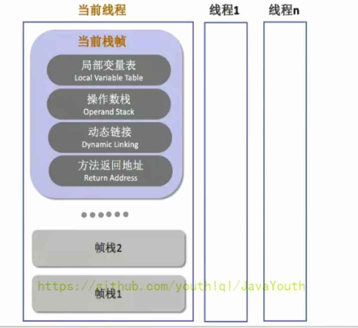
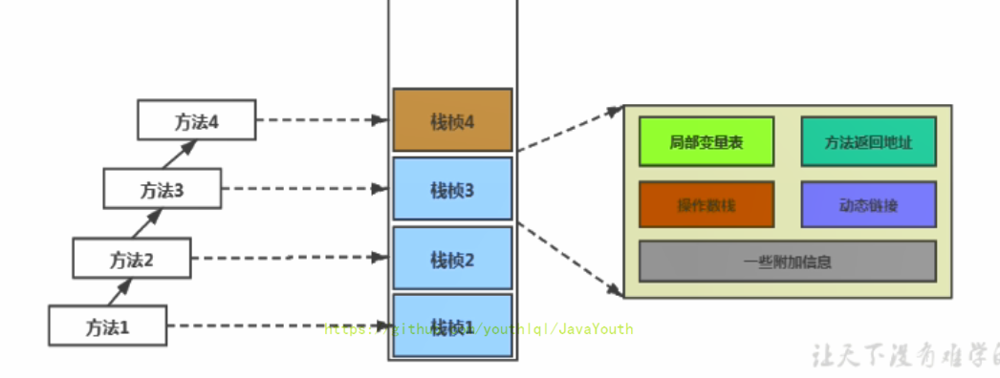
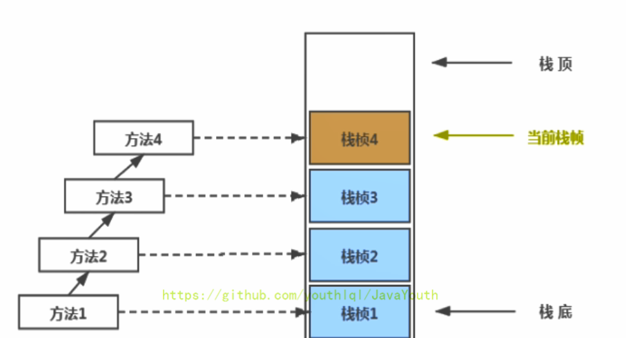
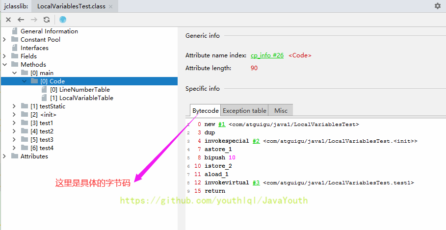
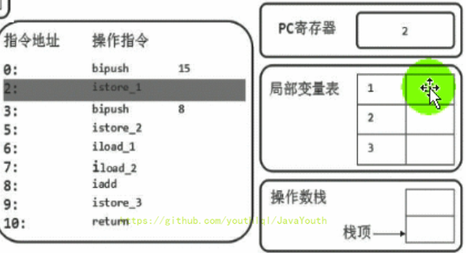
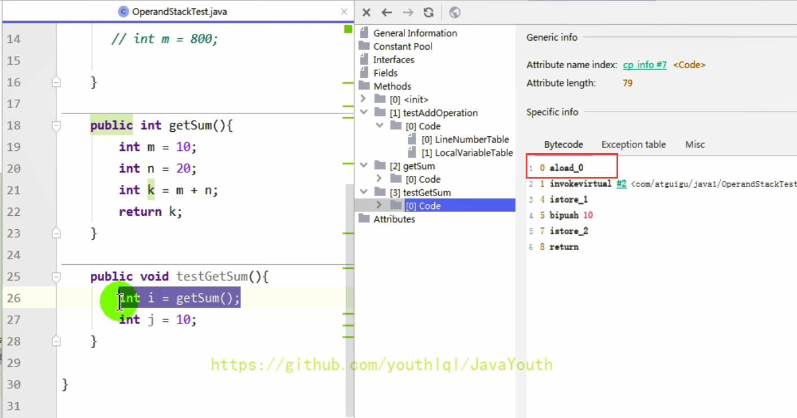
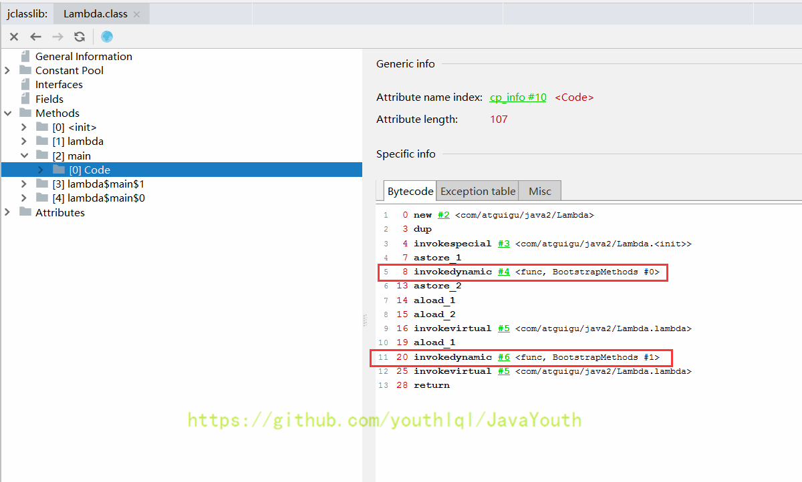

# 运行时数据区概述及线程

## 前言
本节主要讲的是运行时数据区，也就是下图这部分，它是在类加载完成后的阶段


当我们通过前面的：类的加载 --> 验证 --> 准备 --> 解析 --> 初始化，这几个阶段完成后
，就会用到执行引擎对我们的类进行使用，同时执行引擎将会使用到我们运行时数据区


类比一下也就是大厨做饭，我们把大厨后面的东西（切好的菜，刀，调料），比作是运行时数据区。
而厨师可以类比于执行引擎，将通过准备的东西进行制作成精美的菜品。


## 运行时数据区结构

### 运行时数据区与内存划分
1. 内存是非常重要的系统资源，是硬盘和CPU的中间仓库及桥梁，承载着操作系统和应用程序的实
时运行。JVM内存布局规定了Java在运行过程中内存申请、分配、管理的策略，保证了JVM的高效
稳定运行。不同的JVM对于内存的划分方式和管理机制存在着部分差异。结合JVM虚拟机规范，来探
讨一下经典的JVM内存布局。
2. 我们通过磁盘或者网络IO得到的数据，都需要先加载到内存中，然后CPU从内存中获取数据进行
读取，也就是说内存充当了CPU和磁盘之间的桥梁

阿里巴巴手册内存划分1.8


### 线程共享和私有内存空间
1. Java虚拟机定义了若干种程序运行期间会使用到的运行时数据区：其中有一些会随着虚拟机
启动而创建，随着虚拟机退出而销毁。另外一些则是与线程一一对应的，这些与线程对应的数据
区域会随着线程开始和结束而创建和销毁。
2. 灰色的为单独线程私有的，红色的为多个线程共享的。即：
- 线程独有：独立包括程序计数器、栈、本地方法栈
- 线程间共享：堆、堆外内存（永久代或元空间、代码缓存）


## Runtime类
**每个JVM只有一个Runtime实例**。即为运行时环境，相当于内存结构的中间的那个框框：运行
时环境。


## JVM线程和系统线程

### JVM 线程
1. 线程是一个程序里的运行单元。JVM允许一个应用有多个线程并行的执行
2. 在Hotspot JVM里，每个线程都与操作系统的本地线程直接映射 1 VS 1
 当一个Java线程准备好执行以后，此时一个操作系统的本地线程也同时创建。Java线程执行终
 止后，本地线程也会回收.
3. 操作系统负责将线程安排调度到任何一个可用的CPU上。一旦本地线程初始化成功，它就会调用Java线程中的run()方法

### JVM系统线程
- 如果你使用jconsole或者是任何一个调试工具，都能看到在后台有许多线程在运行。这些后台线程不包括调用public static void main(String[])的main线程以及所有这个main线程自己创建的线程。

- 这些主要的后台系统线程在Hotspot JVM里主要是以下几个：
1. **虚拟机线程**：这种线程的操作是需要JVM达到安全点才会出现。这些操作必须在不同的线程中发生的原因是他们都需要JVM达到安全点，这样堆才不会变化。这种线程的执行类型括"stop-the-world"的垃圾收集，线程栈收集，线程挂起以及偏向锁撤销
2. **周期任务线程**：这种线程是时间周期事件的体现（比如中断），他们一般用于周期性操作的调度执行
3. **GC线程**：这种线程对在JVM里不同种类的垃圾收集行为提供了支持
4. **编译线程**：这种线程在运行时会将字节码编译成到本地代码
5. **信号调度线程**：这种线程接收信号并发送给JVM，在它内部通过调用适当的方法进行处理

# 运行时数据区之程序计数器PC

## PC介绍
官方文档网址：https://docs.oracle.com/javase/specs/jvms/se8/html/index.html


1. JVM中的程序计数寄存器（Program Counter Register）中，Register的命名源于CP
U的寄存器，寄存器存储指令相关的现场信息。CPU只有把数据装载到寄存器才能够运行。
2. 这里，并非是广义上所指的物理寄存器，或许将其翻译为PC计数器（或指令计数器）会更加
贴切（也称为程序钩子），并且也不容易引起一些不必要的误会。JVM中的PC寄存器是对物理P
C寄存器的一种抽象模拟。
3. 它是一块很小的内存空间(不是CPU的寄存器PC)，几乎可以忽略不记。也是运行速度最快的存储区域。
4. 在JVM规范中，每个线程都有它自己的程序计数器，**PC是线程私有的**，生命周期与线程的生命周
期保持一致。
5. 任何时间一个线程都只有一个方法在执行，也就是所谓的当前方法。程序计数器会存储当前
线程正在执行的Java方法的JVM指令地址；或者，如果是在执行native方法，则是未指定值（
undefned）。
6. PC看作是当前线程所执行的字节码的行号指示器,它是程序控制流的指示器，分支、循环、跳转、异常处理、线程恢复等基础功能都需要依
赖这个计数器来完成。
7. 字节码解释器工作时就是通过改变这个计数器的值来选取下一条需要执行的字节码指令。
8. 它是唯一一个在Java虚拟机规范中没有规定任何OutofMemoryError情况的区域。

## pc寄存器作用(指示下一条字节码地址)
PC寄存器用来存储指向**下一条字节码指令的地址**，也即将要执行的指令代码。由执行引擎读取下一条
指令，并执行该指令。


### 例子
```java_holder_method_tree
public class PCRegisterTest {

    public static void main(String[] args) {
        int i = 10;
        int j = 20;
        int k = i + j;

        String s = "abc";
        System.out.println(i);
        System.out.println(k);

    }
}
        0: bipush        10
         2: istore_1
         3: bipush        20
         5: istore_2
         6: iload_1
         7: iload_2
         8: iadd
         9: istore_3
        10: ldc           #2                  // String abc
        12: astore        4
        14: getstatic     #3                  // Field java/lang/System.out:Ljava/io/PrintStream;
        17: iload_1
        18: invokevirtual #4                  // Method java/io/PrintStream.println:(I)V
        21: getstatic     #3                  // Field java/lang/System.out:Ljava/io/PrintStream;
        24: iload_3
        25: invokevirtual #4                  // Method java/io/PrintStream.println:(I)V
        28: return
```

左边的数字代表指令地址（指令偏移），即 PC 寄存器中可能存储的值，然后执行引擎读取
 PC 寄存器中的值，并执行该指令。
 


## PC面试题

问题一、使用PC寄存器存储字节码指令地址有什么用呢？或者问为什么使用 PC 寄存器来记录当前线程的执行地址呢？

1. 因为CPU需要不停的切换各个线程，这时候切换回来以后，就得知道接着从哪开始继续执行
2. JVM的字节码解释器就需要通过改变PC寄存器的值来明确下一条应该执行什么样的字节码指令


问题二、PC为什么设定为每个线程私有？

Java虚拟机的多线程是通过线程轮流切换、分配处理器执行时间的方式来实现的，在任何一
个确定的时刻，一个处理器都只会执行一条线程中的指令。因
此，为了线程切换后能恢复到正确的执行位置，每条线程都需要有一个独立的程序计数器，各条线程
之间计数器互不影响，独立存储。

# 运行时数据区之虚拟机栈VMS



## 概述
### 虚拟机栈产生背景
1. 由于跨平台性的设计，Java的指令都是根据栈来设计的。不同平台CPU架构不同，所以不能设计为基于寄存器的【如果设计成基于寄存器的，耦合度高，性能会有所提升，因为可以对具体的CPU架构进行优化，但是跨平台性大大降低】。
2. 优点是跨平台，指令集小，编译器容易实现，缺点是性能下降，实现同样的功能需要更多的指令。

### 内存中的栈和堆
1. 首先栈是运行时的单位，而堆是存储的单位。
2. 即：栈解决程序的运行问题，即程序如何执行，或者说如何处理数据。堆解决的是数据存储的问题，即数据怎么放，放哪里


### 虚拟机栈基本内容
Java虚拟机栈（Java Virtual Machine Stack），早期也叫Java栈。每个线程在创建时
都会创建一个虚拟机栈，其内部保存一个个的栈帧（Stack Frame），对应着一次次的Java
方法调用，栈是线程私有的。
```java_holder_method_tree
public class StackTest {

    public static void main(String[] args) {
        StackTest test = new StackTest();
        test.methodA();
    }

    public void methodA() {
        int i = 10;
        int j = 20;

        methodB();
    }

    public void methodB(){
        int k = 30;
        int m = 40;
    }
}

```


虚拟机栈的生命周期：生命周期和线程一致，也就是线程结束了，该虚拟机栈也销毁了

虚拟机栈的作用
- 主管Java程序的运行，它保存方法的局部变量（8 种基本数据类型、对象的引用地址）、
部分结果，并参与方法的调用和返回。
- 保存局部变量，它是相比于成员变量来说的（或属性）
- 基本数据类型变量 VS 引用类型变量（类、数组、接口）

### 虚拟机栈特点
1. 栈是一种快速有效的分配存储方式，访问速度仅次于PC程序计数器。
2. JVM直接对Java栈的操作只有两个：
- 每个方法执行，伴随着进栈（入栈、压栈）
- 执行结束后的出栈工作
3. 对于栈来说不存在垃圾回收问题,栈不需要GC（方法结束栈帧出栈，线程结束，栈释放），但是可能存在OOM


### 虚拟机栈的异常（面试）
Java 虚拟机规范允许Java栈的大小是**动态（OOM内存溢出）的或者是固定不（栈溢出）**变的。
1. 如果采用固定大小的Java虚拟机栈，那每一个线程的Java虚拟机栈容量可以在线程创建
的时候独立选定。那么当线程请求栈的深度超过当前 Java 虚拟机栈的最大深度的时候，
就抛出 StackOverFlowError 异常。JVM会为每个线程的虚拟机栈分配一定的内存大小
（-Xss参数），因此虚拟机栈能够容纳的栈帧数量是有限的，若栈帧不断进栈而不出栈，最终
会导致**当前线程（当前线程对应的一个虚拟机栈空间被栈帧塞满导致不能塞
新的方法的栈帧，导致当前线程对应的一个虚拟机栈空间耗尽）** **典型无结束条件的递
归函数调用，下图第一个线程对应的虚拟机栈情况**。
```
public void method(){
    this.method() //当前线程的虚拟机栈不断放入新的栈帧，导致StackOverflow
}
```
2. 如果Java虚拟机栈可以动态扩展，并且在尝试扩展的时候无法申请到足够的内存，或者在
**创建新的线程时没有足够的内存去创建对应的虚拟机栈。整个虚拟机栈是按照线程进行
分配的，每创建一个新的线程就得给该线程分配一个虚拟机栈空间，如果创建的线程过多
导致对新线程没有剩余内存分配**，那Java虚拟机将会抛出一个 
OutofMemoryError 异常。下图后面的线程就是这种情况。
```
while (true) {
             Thread thread = new Thread(() -> dontStop());
             //虚拟机栈会为每个新线程分配栈空间，作为整个虚拟机栈的“小虚拟机栈”
             thread.start();//
         }//如果创建线程过多，有很多个“小虚拟机栈”撑爆了大的虚拟机栈则导致OOM
```

### 设置虚拟机栈大小
我们可以使用参数 -Xss 选项来设置**线程的最大栈空间**，栈的大小直接决定了函数调用的最大可达深度。

```java_holder_method_tree
Sets the thread stack size (in bytes). Append the letter k or K to indicate KB, m or M to indicate MB, and g or G to indicate GB. The default value depends on the platform:

Linux/x64 (64-bit): 1024 KB
macOS (64-bit): 1024 KB
Oracle Solaris/x64 (64-bit): 1024 KB
Windows: The default value depends on virtual memory

The following examples set the thread stack size to 1024 KB in different units
-Xss1m
-Xss1024k
-Xss1048576

```
例子
```java_holder_method_tree
public class StackErrorTest {
    private static int count = 1;
    public static void main(String[] args) {
        System.out.println(count);
        count++;
        main(args);
    }
}
未设置虚拟机栈大小
11406次递归StackOverflowError
Exception in thread "main" java.lang.StackOverflowError

设置栈大小-Xss256k
2476
Exception in thread "main" java.lang.StackOverflowError
    at sun.nio.cs.UTF_8.updatePositions(UTF_8.java:77)
```

## 虚拟机栈存储单位（方法 < = > 栈帧）

### 栈中存储什么？
1. 每个线程都有自己私有的虚拟机栈，栈中的数据都是以栈帧（Stack Frame）的格式存在
2. 在这个线程上正在执行的每个方法都各自对应一个栈帧（Stack Frame），栈帧的入栈对应
着方法的调用，栈帧的出栈对应着方法的结束。
3. 栈帧是一个内存区块，是一个数据集，维系着方法执行过程中的各种数据信息

### 栈运行原理
1. JVM直接对Java栈的操作只有两个，就是对**栈帧的压栈和出栈**，遵循先进后出（后进先出）
原则
2. 在一条活动线程中，一个时间点上，只会有一个活动的栈帧。即只有当前正在执行的方法的
栈帧（栈顶栈帧）是有效的。这个栈帧被称为**当前栈帧（Current Frame）**，与当前栈帧相对
应的方法就是**当前方法（Current Method）**，定义这个方法的类就是当前类（Current C
lass）
3. 执行引擎正在运行的所有字节码指令只针对当前栈帧进行操作。
4. 如果在该方法中调用了其他方法，对应的新的栈帧会被创建出来，放在栈的顶端，成为新的
当前帧。



1. **不同线程中所包含的栈帧是不允许存在相互引用的**，即不可能在一个栈帧之中引用
另外一个线程的栈帧。
2. 如果当前方法调用了其他方法，方法返回之际，当前栈帧会传回此方法的执行结果给前一个
栈帧，接着，虚拟机会丢弃当前栈帧，使得前一个栈帧重新成为当前栈帧。
3. Java方法有两种返回函数的方式。
- 一种是正常的函数返回，使用return指令。
- 另一种是方法执行中出现未捕获处理的异常，以抛出异常的方式结束。
- 但不管使用哪种方式，都会导致栈帧被弹出。
每个栈帧中存储着：

1. 局部变量表（Local Variables）
2. 操作数栈（Operand Stack）（或表达式栈）
3. 动态链接（Dynamic Linking）（或指向运行时常量池的方法引用）
4. 方法返回地址（Return Address）（或方法正常退出或者异常退出的定义）
5. 一些附加信息


并行每个线程下的栈都是私有的，因此每个线程都有自己各自的栈，并且每个栈里面都有很多栈帧，栈帧的大小主要由局部变量表 和 操作数栈决定的


## 栈帧内部结构之局部变量表
### 局部变量表概述
1. 局部变量表也被称之为局部变量数组或本地变量表
2. **定义为一个数字数组，主要用于存储方法参数和定义在方法体内的局部变量**，这些数据类型
包括各类基本数据类型、对象引用（reference），以及returnAddress返回值类型。
3. 由于**局部变量表**是建立在线程的栈上，是线程的私有数据，因此**不存在数据安全问题**
4. 局部变量表所需的容量大小（局部变量个数）是在编译期确定下来的，并保存在方法的Code属性的maxim
um local variables数据项中。在方法运行期间是不会改变局部变量表的大小的。
5. 方法嵌套调用的次数由栈的大小决定。一般来说，栈越大，方法嵌套调用次数越多。
- 对一个函数而言，它的参数和局部变量越多，使得局部变量表膨胀，它的栈帧就越大，以满足
方法调用所需传递的信息增大的需求。
- 进而函数调用就会占用更多的栈空间，导致其嵌套调用次数就会减少。
6. 局部变量表中的变量只在当前方法调用中有效。
- 在方法执行时，虚拟机通过使用局部变量表完成参数值到参数变量列表的传递过程。
- 当方法调用结束后，随着方法栈帧的销毁，局部变量表也会随之销毁。
#### 例子
```java_holder_method_tree
public class LocalVariablesTest {
    private int count = 0;

    public static void main(String[] args) {
        LocalVariablesTest test = new LocalVariablesTest();
        int num = 10;
        test.test1();
    }

    //练习：
    public static void testStatic(){
        LocalVariablesTest test = new LocalVariablesTest();
        Date date = new Date();
        int count = 10;
        System.out.println(count);
        //因为this变量不存在于当前方法的局部变量表中！！
//        System.out.println(this.count);
    }

    //关于Slot的使用的理解
    public LocalVariablesTest(){
        this.count = 1;
    }

    public void test1() {
        Date date = new Date();
        String name1 = "atguigu.com";
        test2(date, name1);
        System.out.println(date + name1);
    }

    public String test2(Date dateP, String name2) {
        dateP = null;
        name2 = "songhongkang";
        double weight = 130.5;//占据两个slot
        char gender = '男';
        return dateP + name2;
    }

    public void test3() {
        this.count++;
    }

    public void test4() {
        int a = 0;
        {
            int b = 0;
            b = a + 1;
        }
        //变量c使用之前已经销毁的变量b占据的slot的位置
        int c = a + 1;
    }
}

```

看完字节码后，可得结论：所以局部变量表所需的容量大小是在编译期确定下来的。

#### 例子详细解析
1、0-15 也就是有16行字节码


2、方法异常信息表


3、Misc


4、行号表
Java代码的行号和PC字节码指令行号的对应关系


5、注意：Start PC生效行数和剩余有效行数length 都是针对于字节码文件的行数

1、图中圈的东西表示该局部变量的作用域
2、Start PC==11表示在字节码的11行开始生效，也就是Java代码对应的第15行。而声明int num在java代码的是第14行，说明是从声明的下一行开始生效
3、Length== 5表示局部变量剩余有效行数，main方法字节码指令总共有16行，从11行开始生效，那么剩下就是16-11 ==5。
4、Ljava/lang/String 前面的L表示引用类型

### 关于Slot的理解
1. 参数值的存放总是从局部变量数组索引 0 的位置开始，到数组长度-1的索引结束。
2. 局部变量表，最基本的存储单元是Slot（变量槽），局部变量表中存放编译期可知的各种
基本数据类型（8种），引用类型（reference），returnAddress类型的变量。
3. 在局部变量表里，32位以内的类型只占用一个slot（包括returnAddress类型），
64位的类型占用两个slot（1ong和double）。
4. byte、short、char在储存前辈转换为int，boolean也被转换为int，0表示false，
非0表示true long和double则占据两个slot
5. JVM会为局部变量表中的每一个Slot都分配一个访问索引，通过这个索引即可成功访问到
局部变量表中指定的局部变量值
6. 当一个实例方法被调用的时候，它的方法参数和方法体内部定义的局部变量将会按照顺序被
复制到局部变量表中的每一个slot上。
7. 如果需要访问局部变量表中一个64bit的局部变量值时，只需要使用前一个索引即可。
（比如：访问long或double类型变量）如果当前帧是由构造方法或者实例方法创建的，那么该
对象引用this将会存放在index为0的slot处，其余的参数按照参数表顺序继续排列。（thi
s也相当于一个变量）


### Slot代码示例

this 存放在 index = 0 的位置：
```java_holder_method_tree
    public void test3() {
        this.count++;
    }
```
局部变量表：this 存放在 index = 0 的位置


64位的类型（1ong和double）占用两个slot
```java_holder_method_tree
     public String test2(Date dateP, String name2) {
        dateP = null;
        name2 = "songhongkang";
        double weight = 130.5;//占据两个slot
        char gender = '男';
        return dateP + name2;
    }

```
weight 为 double 类型，index 直接从 3 蹦到了 5


static 无法调用 this,this 不存在与 static 方法的局部变量表中，所以无法调用
```java_holder_method_tree
    public static void testStatic(){
        LocalVariablesTest test = new LocalVariablesTest();
        Date date = new Date();
        int count = 10;
        System.out.println(count);
        //因为this变量不存在于当前方法的局部变量表中！！
//        System.out.println(this.count);
    }

```

### Slot的重复利用
栈帧中的局部变量表中的槽位是可以重用的，如果一个局部变量过了其作用域，那么在其作用域
之后申明新的局部变量变就很有可能会复用过期局部变量的槽位，从而达到节省资源的目的
```java_holder_method_tree
    public void test4() {
        int a = 0;
        {
            int b = 0;
            b = a + 1;
        }
        //变量c使用之前已经销毁的变量b占据的slot的位置
        int c = a + 1;
    }

```
局部变量 c 重用了局部变量 b 的 slot 位置


### 静态变量与局部变量的对比
````java_holder_method_tree
变量的分类：
1、按照数据类型分：① 基本数据类型  ② 引用数据类型
2、按照在类中声明的位置分：
  2-1、成员变量：在使用前，都经历过默认初始化赋值
       2-1-1、类变量: linking的prepare阶段：给类变量默认赋值
              ---> initial阶段：给类变量显式赋值即静态代码块赋值
       2-1-2、实例变量：随着对象的创建，会在堆空间中分配实例变量空间，并进行默认赋值
  2-2、局部变量：在使用前，必须要进行显式赋值的！否则，编译不通过。
````
1. 参数表分配完毕之后，再根据方法体内定义的变量的顺序和作用域分配。
2. 我们知道成员变量有两次初始化的机会，第一次是在“准备阶段”，执行系统初始化，
对类变量设置零值，另一次则是在“初始化”阶段，赋予程序员在代码中定义的初始值。
3. 和类变量初始化不同的是，局部变量表不存在系统初始化的过程，这意味着一旦定义了局
部变量则必须人为的初始化，否则无法使用。

### 补充说明
1. 在栈帧中，与性能调优关系最为密切的部分就是前面提到的局部变量表。在方法执行时，
虚拟机使用局部变量表完成方法的传递。
2. 局部变量表中的变量也是重要的垃圾回收根节点，只要被局部变量表中直接或间接引用的对
象都不会被回收。

## 栈帧内部结构之操作数栈
### 操作数栈的特点
1. 每一个独立的栈帧除了包含局部变量表以外，还包含一个后进先出（LIFO）的 操作数栈，
也可以称之为表达式栈（Expression Stack）
2. 操作数栈，在方法执行过程中，根据字节码指令，往栈中写入数据或提取数据，即入栈（
push）和 出栈（pop）
- 某些字节码指令将值压入操作数栈，其余的字节码指令将操作数取出栈。使用它们后再把结果压入栈，
- 比如：执行复制、交换、求和等操作


### 操作数栈的作用
1. **操作数栈，主要用于保存计算过程的中间结果，同时作为计算过程中变量临时的存储空间**。
2. 操作数栈就是JVM执行引擎的一个工作区，当一个方法刚开始执行的时候，一个新的栈帧
也会随之被创建出来，这时方法的操作数栈是空的。
3. 每一个操作数栈都会拥有一个明确的栈深度用于存储数值，其所需的最大深度在编译期就定
义好了，保存在方法的Code属性中，为maxstack的值。
4.栈中的任何一个元素都是可以任意的Java数据类型
- 32bit的类型占用一个栈单位深度
- 64bit的类型占用两个栈单位深度
5. 操作数栈并非采用访问索引的方式来进行数据访问的，而是只能通过标准的入栈和出栈操作
来完成一次数据访问。只不过操作数栈是用数组这个结构来实现的而已
6. 如果被调用的方法带有返回值的话，其返回值将会被压入当前栈帧的操作数栈中，并更新
PC寄存器中下一条需要执行的字节码指令。
7. 操作数栈中元素的数据类型必须与字节码指令的序列严格匹配，这由编译器在编译器期间
进行验证，同时在类加载过程中的类检验阶段的数据流分析阶段要再次验证。
8. 另外，我们说Java虚拟机的解释引擎是基于栈的执行引擎，其中的栈指的就是操作数栈。


局部变量表就相当于食材，操作数栈就相当于做法步骤

### 操作数栈代码演示
```java_holder_method_tree
    public void testAddOperation() {
        //byte、short、char、boolean：都以int型来保存
        byte i = 15;
        int j = 8;
        int k = i + j;
       // int m = 800;
    }
字节码
 0 bipush 15
 2 istore_1
 3 bipush 8
 5 istore_2
 6 iload_1
 7 iload_2
 8 iadd
 9 istore_3
10 return
```


1、首先执行第一条语句，PC寄存器指向的是0，也就是指令地址为0，然后使用bipush让操作数15入操作数栈。


2、执行完后，PC寄存器往下移，指向下一行代码，下一行代码就是将操作数栈的元素pop弹出存储到局
部变量表1的位置（istore_1），我们可以看到局部变量表的已经增加了一个元素。并且操作
数栈为空了。解释为什么局部变量表索引从 1 开始，因为该方法为实例方法，局部变量表索引为 0 的位置存放的
是 this。


3、然后PC下移，指向的是下一行。让操作数8也入栈，同时执行store操作，存入局部变量表中


4、然后从局部变量表中，依次将数据放在操作数栈中，等待执行 add 操作
iload_1：取出局部变量表中索引为1的数据入操作数栈


5、然后将操作数栈中的两个元素执行相加操作，并存储在局部变量表3的位置


### 操作数栈中类型转换


1. 因为 8 可以存放在 byte 类型中，所以压入操作数栈的类型为 byte ，而不是 int ，所以执行的字节码指令为 bipush 8
2. 但是存储在局部变量的时候，会转成 int 类型的变量：istore_4


m改成800之后，byte存储不了，就成了short型，sipush 800

如果被调用的方法带有返回值，返回值入操作数栈
```java_holder_method_tree
  public int getSum(){
        int m = 10;
        int n = 20;
        int k = m + n;
        return k;
    }

    public void testGetSum(){
        //获取上一个栈桢返回的结果，并保存在操作数栈中
        int i = getSum();
        int j = 10;
    }

```
getSum() 方法字节码指令：最后带着个 ireturn


testGetSum() 方法字节码指令：一上来就加载 getSum() 方法的返回值()


## 栈帧内部结构之动态链接（难理解）

### 动态链接（栈帧指向运行时常量池中对应的方法引用）

1. 每一个栈帧内部都包含一个**指向运行时常量池中该栈帧所属方法的引用**。包含这个引用的目的就
是为了支持当前方法的代码能够实现动态链接（Dynamic Linking），比如：invokedynamic指令
2. 在Java源文件被编译到字节码文件中时，所有的变量和方法引用都作为符号引用 #1，#2这种
（Symbolic Reference）保存在class文件的常量池里。比如：描述一个方法调用了另外的
其他方法时，就是通过常量池中指向方法的符号引用来表示的，那么**动态链接的作用就是为了
将这些符号引用转换为调用方法的直接引用**。
```java_holder_method_tree
public class DynamicLinkingTest {
    int num = 10;
    public void methodA(){
        System.out.println("methodA()....");
    }
    public void methodB(){
        System.out.println("methodB()....");
        methodA();
        num++;
    }

}
对应字节码
  Compiled from "DynamicLinkingTest.java"
public class com.atguigu.java1.DynamicLinkingTest
  minor version: 0
  major version: 52
  flags: ACC_PUBLIC, ACC_SUPER
Constant pool:
   #1 = Methodref          #9.#23         // java/lang/Object."<init>":()V
   #2 = Fieldref           #8.#24         // com/atguigu/java1/DynamicLinkingTest.num:I
   #3 = Fieldref           #25.#26        // java/lang/System.out:Ljava/io/PrintStream;
   #4 = String             #27            // methodA()....
   #5 = Methodref          #28.#29        // java/io/PrintStream.println:(Ljava/lang/String;)V
   #6 = String             #30            // methodB()....
   #7 = Methodref          #8.#31         // com/atguigu/java1/DynamicLinkingTest.methodA:()V
   #8 = Class              #32            // com/atguigu/java1/DynamicLinkingTest
   #9 = Class              #33            // java/lang/Object
  #10 = Utf8               num
  #11 = Utf8               I
  #12 = Utf8               <init>
  #13 = Utf8               ()V
  #14 = Utf8               Code
  #15 = Utf8               LineNumberTable
  #16 = Utf8               LocalVariableTable
  #17 = Utf8               this
  #18 = Utf8               Lcom/atguigu/java1/DynamicLinkingTest;
  #19 = Utf8               methodA
  #20 = Utf8               methodB
  #21 = Utf8               SourceFile
  #22 = Utf8               DynamicLinkingTest.java
  #23 = NameAndType        #12:#13        // "<init>":()V
  #24 = NameAndType        #10:#11        // num:I
  #25 = Class              #34            // java/lang/System
  #26 = NameAndType        #35:#36        // out:Ljava/io/PrintStream;
  #27 = Utf8               methodA()....
  #28 = Class              #37            // java/io/PrintStream
  #29 = NameAndType        #38:#39        // println:(Ljava/lang/String;)V
  #30 = Utf8               methodB()....
  #31 = NameAndType        #19:#13        // methodA:()V
  #32 = Utf8               com/atguigu/java1/DynamicLinkingTest
  #33 = Utf8               java/lang/Object
  #34 = Utf8               java/lang/System
  #35 = Utf8               out
  #36 = Utf8               Ljava/io/PrintStream;
  #37 = Utf8               java/io/PrintStream
  #38 = Utf8               println
  #39 = Utf8               (Ljava/lang/String;)V
{
  int num;
    descriptor: I
    flags:

  public com.atguigu.java1.DynamicLinkingTest();
    descriptor: ()V
    flags: ACC_PUBLIC
    Code:
      stack=2, locals=1, args_size=1
         0: aload_0
         1: invokespecial #1                  // Method java/lang/Object."<init>":()V
         4: aload_0
         5: bipush        10
         7: putfield      #2                  // Field num:I
        10: return
      LineNumberTable:
        line 7: 0
        line 9: 4
      LocalVariableTable:
        Start  Length  Slot  Name   Signature
            0      11     0  this   Lcom/atguigu/java1/DynamicLinkingTest;

  public void methodA();
    descriptor: ()V
    flags: ACC_PUBLIC
    Code:
      stack=2, locals=1, args_size=1
         0: getstatic     #3                  // Field java/lang/System.out:Ljava/io/PrintStream;
         3: ldc           #4                  // String methodA()....
         5: invokevirtual #5                  // Method java/io/PrintStream.println:(Ljava/lang/String;)V
         8: return
      LineNumberTable:
        line 12: 0
        line 13: 8
      LocalVariableTable:
        Start  Length  Slot  Name   Signature
            0       9     0  this   Lcom/atguigu/java1/DynamicLinkingTest;

  public void methodB();
    descriptor: ()V
    flags: ACC_PUBLIC
    Code:
      stack=3, locals=1, args_size=1
         0: getstatic     #3                  // Field java/lang/System.out:Ljava/io/PrintStream;
         3: ldc           #6                  // String methodB()....
         5: invokevirtual #5                  // Method java/io/PrintStream.println:(Ljava/lang/String;)V
         8: aload_0
         9: invokevirtual #7                  // Method methodA:()V
        12: aload_0
        13: dup
        14: getfield      #2                  // Field num:I
        17: iconst_1
        18: iadd
        19: putfield      #2                  // Field num:I
        22: return
      LineNumberTable:
        line 16: 0
        line 18: 8
        line 20: 12
        line 21: 22
      LocalVariableTable:
        Start  Length  Slot  Name   Signature
            0      23     0  this   Lcom/atguigu/java1/DynamicLinkingTest;
}
SourceFile: "DynamicLinkingTest.java"

```
1. 在字节码指令中，methodB() 方法中通过 invokevirtual #7 指令调用了方法 A ，那么 #7 
是个啥呢？

2. 往上面翻，找到常量池的定义：#7 = Methodref #8.#31。
- **先找 #8** ：#8 = Class #32 ：去找 #32 #32 = Utf8 com/atguigu/java1/DynamicLinkingTest
结论：通过 #8 我们**找到了 DynamicLinkingTest 这个类**
- 再来**找 #31**：#31 = NameAndType #19:#13 ：去找 #19 和 #13 #19 = Utf8 
**methodA** ：方法名为 methodA #13 = Utf8 ()V ：方法没有形参，返回值为 void

3. 结论：通过 invokevirtual #7 我们就能找到需要调用的 methodA() 方法，并进行调用
4. 在上面，其实还有很多符号引用，比如 Object、System、PrintStream 等等


### 为什么要用常量池呢？

1. 因为在不同的方法，都可能调用常量或者方法，所以只需要存储一份即可，然后记录其引用即可，节省了空间。
2. 常量池的作用：就是为了提供一些符号和常量，便于指令的识别

### 方法的调用
#### 静态链接与动态链接
**静态链接**：
当一个字节码文件被装载进JVM内部时，如果被调用的目标方法在编译期确定，且运行期保持不变时，
这种情况下将调用方法的符号引用转换为直接引用的过程称之为静态链接。

**动态链接**：
如果被调用的方法在编译期无法被确定下来，也就是说，只能够在程序运行期将调用的方法的符号
转换为直接引用，由于这种引用转换过程具备动态性，因此也被称之为动态链接。

#### 早期绑定与晚期绑定
静态链接与动态链接针对的是方法。早期绑定和晚期绑定范围更广。早期绑定涵盖了静态链接，晚期
绑定涵盖了动态链接。
静态链接和动态链接对应的方法的绑定机制为：早期绑定（Early Binding）和晚期绑定（Late B
inding）。绑定是一个字段、方法或者类在符号引用被替换为直接引用的过程，这仅仅发生一次

**早期绑定：**早期绑定就是指被调用的目标方法如果在编译期可知，且运行期保持不变时，即可将这个方法与所属的类型进行
绑定，这样一来，由于明确了被调用的目标方法究竟是哪一个，因此也就可以使用静态链接的方式将符
号引用转换为直接引用。

**晚期绑定：**如果被调用的方法在编译期无法被确定下来，只能够在程序运行期根据实际的类型绑
定相关的方法，这种绑定方式也就被称之为晚期绑定。

```java_holder_method_tree
class Animal {
    public void eat() {
        System.out.println("动物进食");
    }
}

interface Huntable {
    void hunt();
}

class Dog extends Animal implements Huntable {
    @Override
    public void eat() {
        System.out.println("狗吃骨头");
    }
    @Override
    public void hunt() {
        System.out.println("捕食耗子，多管闲事");
    }
}

class Cat extends Animal implements Huntable {
    public Cat() {
        super();//表现为：早期绑定
    }
    public Cat(String name) {
        this();//表现为：早期绑定
    }
    @Override
    public void eat() {
        super.eat();//表现为：早期绑定
        System.out.println("猫吃鱼");
    }

    @Override
    public void hunt() {
        System.out.println("捕食耗子，天经地义");
    }
}

public class AnimalTest {
    public void showAnimal(Animal animal) {
        animal.eat();//表现为：晚期绑定
    }

    public void showHunt(Huntable h) {
        h.hunt();//表现为：晚期绑定
    }
}

```
invokevirtual 体现为晚期绑定

invokeinterface 也体现为晚期绑定

invokespecial 体现为早期绑定

### 多态与绑定
1. 随着高级语言的横空出世，类似于Java一样的基于面向对象的编程语言如今越来越多，尽管这类
编程语言在语法风格上存在一定的差别，但是它们彼此之间始终保持着一个共性，那就是都支持封装、
继承和多态等面向对象特性，既然这一类的编程语言具备多态特性，那么自然也就具备早期绑定和晚
期绑定两种绑定方式。

2. Java中任何一个普通的方法其实都具备虚函数的特征，它们相当于C++语言中的虚函数（C++中则
需要使用关键字virtual来显式定义）。如果在Java程序中不希望某个方法拥有虚函数的特征时，则
可以使用关键字final来标记这个方法。

#### 虚方法与非虚方法
1. 如果方法在编译期就确定了具体的调用版本，这个版本在运行时是不可变的。这样的方法称为非
虚方法。
2. 静态方法、私有方法、final方法、实例构造器、父类方法都是非虚方法。
3. 其他方法称为虚方法。

#### 虚拟机中调用方法的指令
普通指令：

1. invokestatic：调用静态方法，解析阶段确定唯一方法版本
2. invokespecial：调用<init>方法、私有及父类方法，解析阶段确定唯一方法版本
3. invokevirtual：调用所有虚方法
4. invokeinterface：调用接口方法

动态调用指令：
invokedynamic：动态解析出需要调用的方法，然后执行

前四条指令固化在虚拟机内部，方法的调用执行不可人为干预。而invokedynamic指令则支持由用
户确定方法版本。其中invokestatic指令和invokespecial指令调用的方法称为非虚方法，其
余的（final修饰的除外）称为虚方法。
```java_holder_method_tree
class Father {
    public Father() {
        System.out.println("father的构造器");
    }

    public static void showStatic(String str) {
        System.out.println("father " + str);
    }

    public final void showFinal() {
        System.out.println("father show final");
    }

    public void showCommon() {
        System.out.println("father 普通方法");
    }
}

public class Son extends Father {
    public Son() {
        //invokespecial
        super();
    }

    public Son(int age) {
        //invokespecial
        this();
    }

    //不是重写的父类的静态方法，因为静态方法不能被重写！
    public static void showStatic(String str) {
        System.out.println("son " + str);
    }

    private void showPrivate(String str) {
        System.out.println("son private" + str);
    }

    public void show() {
        //invokestatic
        showStatic("atguigu.com");
        //invokestatic
        super.showStatic("good!");
        //invokespecial
        showPrivate("hello!");
        //invokespecial
        super.showCommon();

        //invokevirtual
        showFinal();//因为此方法声明有final，不能被子类重写，所以也认为此方法是非虚方法。
        //虚方法如下：

        /*
        invokevirtual  你没有显示的加super.，编译器认为你可能调用子类的showCommon(即使son子类没有重写，也          会认为)，所以编译期间确定不下来，就是虚方法。
        */
        showCommon();
        info();

        MethodInterface in = null;
        //invokeinterface
        in.methodA();
    }

    public void info() {

    }

    public void display(Father f) {
        f.showCommon();
    }

    public static void main(String[] args) {
        Son so = new Son();
        so.show();
    }
}

interface MethodInterface {
    void methodA();
}

```
Son 类中 show() 方法的字节码指令如下


#### 关于 invokedynamic 指令

1. JVM字节码指令集一直比较稳定，一直到Java7中才增加了一个invokedynamic指令，这是Jav
a为了实现【动态类型语言】支持而做的一种改进。
2. 但是在Java7中并没有提供直接生成invokedynamic指令的方法，需要借助ASM这种底层字节码
工具来产生invokedynamic指令。直到Java8的Lambda表达式的出现，invokedynamic指
令的生成，在Java中才有了直接的生成方式。
3. Java7中增加的动态语言类型支持的本质是对Java虚拟机规范的修改，而不是对Java语言规则
的修改，这一块相对来讲比较复杂，增加了虚拟机中的方法调用，最直接的受益者就是运行在Jav
a平台的动态语言的编译器。
````java_holder_method_tree
@FunctionalInterface
interface Func {
    public boolean func(String str);
}

public class Lambda {
    public void lambda(Func func) {
        return;
    }

    public static void main(String[] args) {
        Lambda lambda = new Lambda();

        Func func = s -> {
            return true;
        };

        lambda.lambda(func);

        lambda.lambda(s -> {
            return true;
        });
    }
}

````


### 动态语言和静态语言
1. 动态类型语言和静态类型语言两者的区别就在于对类型的检查是在编译期还是在运行期，满足
前者就是静态类型语言，反之是动态类型语言。
2. 说的再直白一点就是，静态类型语言是判断变量自身的类型信息；动态类型语言是判断变量值的
类型信息，变量没有类型信息，变量值才有类型信息，这是动态语言的一个重要特征。

```java_holder_method_tree
Java：String info = "mogu blog"; (Java是静态类型语言的，会先编译就进行类型检查) 
JS：var name = "shkstart"; var name = 10; （运行时才进行检查）
```

### java中方法重写的本质

1. 找到操作数栈顶的第一个元素所执行的对象的实际类型，记作C。
2. 如果在类型C中找到与常量中的描述符合简单名称都相符的方法，则进行访问权限校验。
- 如果通过则返回这个方法的直接引用，查找过程结束
- 如果不通过，则返回java.lang.IllegalAccessError 异常
3. 否则，按照继承关系从下往上依次对C的各个父类进行第2步的搜索和验证过程。
4. 如果始终没有找到合适的方法，则抛出java.lang.AbstractMethodError异常。

上面这个过程称为动态分派
### 虚方法表
1. 在面向对象的编程中，会很频繁的使用到**动态分派**，如果在每次动态分派的过程中都要重新在类
的方法元数据中搜索合适的目标的话就可能影响到执行效率。因此，为了提高性能，JVM采用在类的
方法区建立一个虚方法表（virtual method table）来实现，非虚方法不会出现在表中。使用
索引表来代替查找。【上面动态分派的过程，我们可以看到如果子类找不到，还要从下往上找其父类
，非常耗时】

2. 每个类中都有一个虚方法表，表中存放着各个方法的实际入口。

3. 虚方法表是什么时候被创建的呢？虚方法表会在类加载的链接阶段被创建并开始初始化，类的
变量初始值准备完成之后，JVM会把该类的虚方法表也初始化完毕。

#### 虚方法表例子1
如图所示：如果类中重写了方法，那么调用的时候，就会直接在该类的虚方法表中查找

1. 比如说son在调用toString的时候，Son没有重写过，Son的父类Father也没有重写过，那
就直接调用Object类的toString。那么就直接在虚方法表里指明toString直接指向Object类。
2、下次Son对象再调用toString就直接去找Object，不用先找Son-->再找Father-->最后才到
Object的这样的一个过程(动态分派)。

## 栈帧内部结构之方法返回地址

在一些帖子里，方法返回地址、动态链接、一些附加信息 也叫做帧数据区
1. 存放调用该方法的pc寄存器的值。一个方法的结束，有两种方式：
- 正常执行完成
- 出现未处理的异常，非正常退出
2. 无论通过哪种方式退出，在方法退出后都返回到该方法被调用的位置。方法正常退出时，调用者
的pc计数器的值作为返回地址，即调用该方法的指令的下一条指令的地址。而通过异常退出的，
返回地址是要通过异常表来确定，栈帧中一般不会保存这部分信息。
3. 本质上，**方法的退出就是当前栈帧出栈**的过程。此时，需要恢复上层方法的局部变量表、操作数栈
、将返回值压入调用者栈帧的操作数栈、设置PC寄存器值等，让调用者方法继续执行下去。
4. 正常完成出口和异常完成出口的区别在于：通过异常完成出口退出的不会给他的上层调用者产生
任何的返回值。

### 方法正常退出
1. 执行引擎遇到任意一个方法返回的字节码指令（return），会有返回值传递给上层的方法调用者
，简称正常完成出口；
2. 一个方法在正常调用完成之后，究竟需要使用哪一个返回指令，还需要根据方法返回值的实际数据
类型而定。
3. 在字节码指令中，返回指令包含：
- ireturn：当返回值是boolean，byte，char，short和int类型时使用
- lreturn：Long类型
- freturn：Float类型
- dreturn：Double类型
- areturn：引用类型
- return：返回值类型为void的方法、实例初始化方法、类和接口的初始化方法

### 方法异常退出
1. 在方法执行过程中遇到异常（Exception），并且这个异常没有在方法内进行处理，也就是只要
在本方法的异常表中没有搜索到匹配的异常处理器，就会导致方法退出，简称异常完成出口。
2. 方法执行过程中，抛出异常时的**异常处理，存储在一个异常处理表**，方便在发生异常的时候找到处
理异常的代码

异常处理表：
- 反编译字节码文件，可得到 Exception table
- from ：字节码指令起始地址
- to ：字节码指令结束地址
- target ：出现异常跳转至地址为 11 的指令执行
- type ：捕获异常的类型

## 栈帧内部结构之一些附加信息
栈帧中还允许携带与Java虚拟机实现相关的一些附加信息。例如：对程序调试提供支持的信息

## 总结：虚拟机栈面试题
### 举例栈溢出的情况？
SOF（StackOverflowError），栈大小分为固定的，和动态变化。如果是固定的就可能出现StackOverflowError。如果是动态变化的，内存不足时就可能出现OOM
### 调整栈大小，就能保证不出现溢出么？
不能保证不溢出，只能保证SOF出现的几率小
### 分配的栈内存越大越好么？
不是，一定时间内降低了OOM概率，但是会挤占其它的线程的栈空间，减少线程个数，因为整个虚拟机的内存空间是有限的
### 垃圾回收是否涉及到虚拟机栈？
不会
| 位置 | 是否有Error | 是否存在GC |
| :-----| ----: | :----: |
| PC计数器 | 无 | 不存在 |
| 虚拟机栈 | 有，SOF | 不存在 |
| 本地方法栈 | 有，SOF | 不存在 |
| 堆 | 有，OOM | 存在 |
| 方法区 | 有 | 存在 |
### 方法中定义的局部变量是否线程安全？
具体问题具体分析，如果对象是在内部产生，并在内部消亡，没有返回到外部，那么它就是线程安全
的，反之则是线程不安全的。

1. 如果只有一个线程才可以操作此数据，则必是线程安全的。
2. 如果有多个线程操作此数据，则此数据是共享数据。如果不考虑同步机制的话，会存在线程安全问题。

```java_holder_method_tree
/**
 * 面试题：
 * 方法中定义的局部变量是否线程安全？具体情况具体分析
 *
 *   何为线程安全？
 *      如果只有一个线程才可以操作此数据，则必是线程安全的。
 *      如果有多个线程操作此数据，则此数据是共享数据。如果不考虑同步机制的话，会存在线程安全问题。
 */
public class StringBuilderTest {
    int num = 10;
    //s1的声明方式是线程安全的（只在方法内部用了）
    public static void method1(){
        //StringBuilder:线程不安全
        StringBuilder s1 = new StringBuilder();
        s1.append("a");
        s1.append("b");
        //...
    }
    //sBuilder的操作过程：是线程不安全的（作为参数传进来，可能被其它线程操作）
    public static void method2(StringBuilder sBuilder){
        sBuilder.append("a");
        sBuilder.append("b");
        //...
    }
    //s1的操作：是线程不安全的（有返回值，可能被其它线程操作）
    public static StringBuilder method3(){
        StringBuilder s1 = new StringBuilder();
        s1.append("a");
        s1.append("b");
        return s1;
    }
    //s1的操作：是线程安全的（s1自己消亡了，最后返回的智商s1.toString的一个新对象）
    public static String method4(){
        StringBuilder s1 = new StringBuilder();
        s1.append("a");
        s1.append("b");
        return s1.toString();
    }
    public static void main(String[] args) {
        StringBuilder s = new StringBuilder();
        new Thread(() -> {
            s.append("a");
            s.append("b");
        }).start();
        method2(s);
    }

}

```

# 运行时数据区之本地方法栈NMS

## 本地方法接口Native Method Interface


1. 简单地讲，**一个Native Method是一个Java调用非Java代码的接囗**一个Nati
ve Method是这样一个Java方法：该方法的实现由非Java语言实现，比如C。这
个特征并非Java所特有，很多其它的编程语言都有这一机制，比如在C++中，你可以
用extern 告知C++编译器去调用一个C的函数。
2. “A native method is a Java method whose implementation is
 provided by non-java code.”（本地方法是一个非Java的方法，它的具体实
 现是非Java代码的实现）
3. 在定义一个native method时，并不提供实现体（有些像定义一个Java inte
rface），因为其实现体是由非java语言在外面实现的。
4. 本地接口的作用是融合不同的编程语言为Java所用，它的初衷是融合C/C++程序。

### 举例
需要注意的是：标识符native可以与其它java标识符连用，但是abstract除外
```java_holder_method_tree
public class IHaveNatives {
    public native void Native1(int x);

    public native static long Native2();

    private native synchronized float Native3(Object o);

    native void Native4(int[] ary) throws Exception;

}

```

### 为什么需要Native Method
Java使用起来非常方便，然而有些层次的任务用Java实现起来不容易，或者我们
对程序的效率很在意时，问题就来了
#### 与Java环境外交互
有时Java应用需要与Java外面的硬件环境交互，这是本地方法存在的主要原因。你可以想想Java需要与一些底层系统，如操作系统或某些硬件交换信息时的情况
#### 与操作系统的交互
1. JVM支持着Java语言本身和运行时库，它是Java程序赖以生存的平台，它由一个解释器（解释字节码）和一些连接到本地代码的库组成。
2. 然而不管怎样，它毕竟不是一个完整的系统，它经常依赖于一底层系统的支持。这些底层系统常常是强大的操作系统。
3. 通过使用本地方法，我们得以用Java实现了jre的与底层系统的交互，甚至JVM的一些部分就是用C写的。
4. 还有，如果我们要使用一些Java语言本身没有提供封装的操作系统的特性时，我们也需要使用本地方法。
#### Sun’s Java
Sun的解释器是用C实现的，这使得它能像一些普通的C一样与外部交互。jre大部分是用Java实现的，它也通过一些本地方法与外界交互。

## 本地方法栈NMS详解
1. Java虚拟机栈于管理Java方法的调用，而本地方法栈用于管理本地方法的调用。
2. 本地方法栈，也是线程私有的。
3. 允许被实现成固定或者是可动态扩展的内存大小（在内存溢出方面和虚拟机栈相同）
- 如果线程请求分配的栈容量超过本地方法栈允许的最大容量，Java虚拟机将会抛出一个stackoverflowError 异常。
- 如果本地方法栈可以动态扩展，并且在尝试扩展的时候无法申请到足够的内存，或者在创建新的线程时没有足够的内存去创建对应的本地方法栈，那么Java虚拟机将会抛出一个outofMemoryError异常。
4. 本地方法一般是使用C语言或C++语言实现的。
5. 它的具体做法是Native Method Stack中登记native方法，在Execution Engine 执行时加载本地方法库。

### 注意事项
1. 当某个线程调用一个本地方法时，它就进入了一个全新的并且不再受虚拟机限制的世界。它和虚拟机拥有同样的权限。
- 本地方法可以通过本地方法接口来访问虚拟机内部的运行时数据区
- 它甚至可以直接使用本地处理器中的寄存器
- 直接从本地内存的堆中分配任意数量的内存
2. 并不是所有的JVM都支持本地方法。因为Java虚拟机规范并没有明确要求本地方法栈的使用语言、具体实现方式、数据结构等。如果JVM产品不打算支持native方法，也可以无需实现本地方法栈。
3. **在Hotspot JVM中，直接将本地方法栈和虚拟机栈合二为一。**

