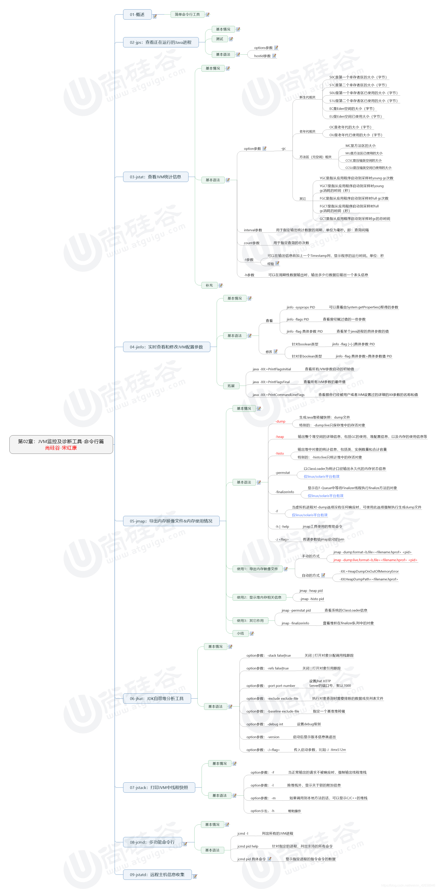
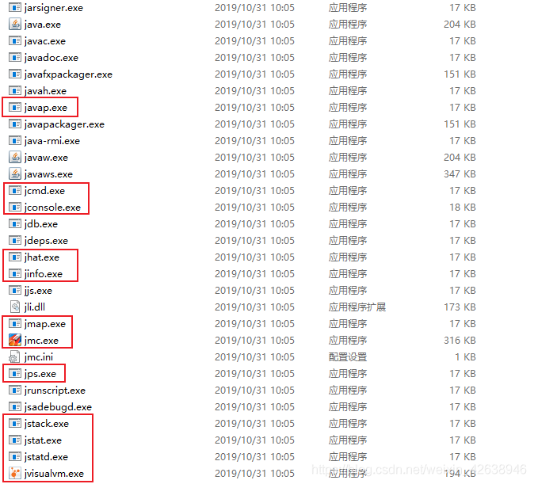
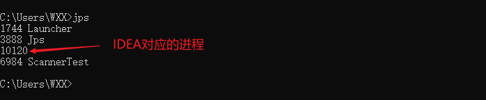
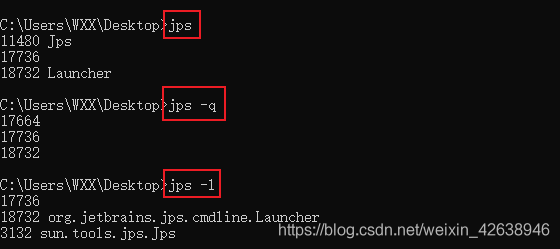
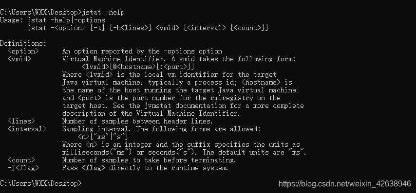
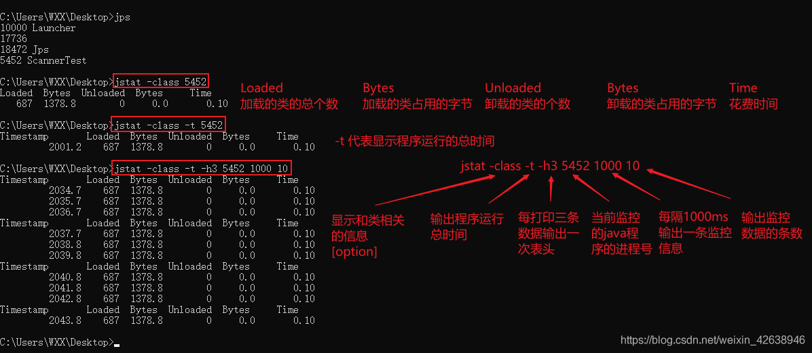
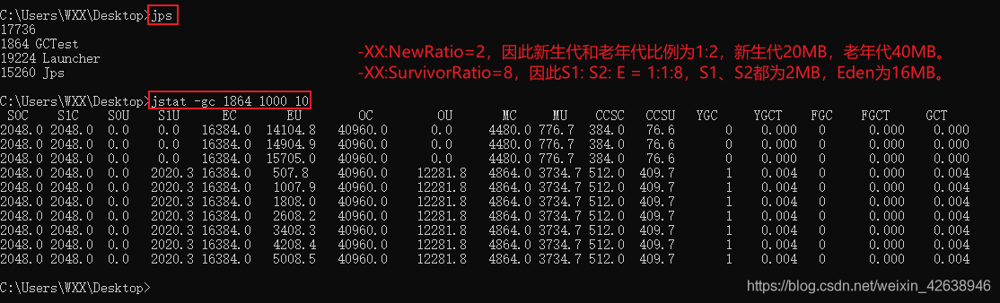
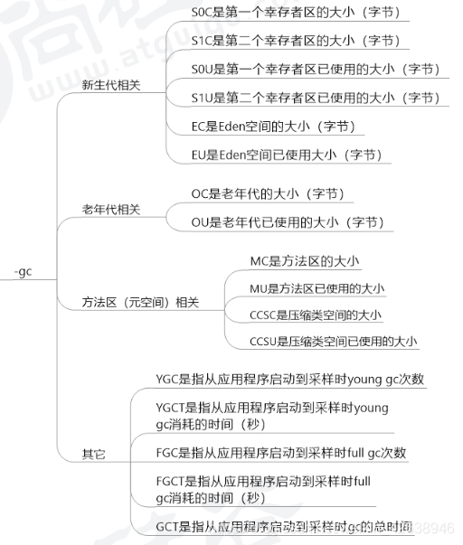
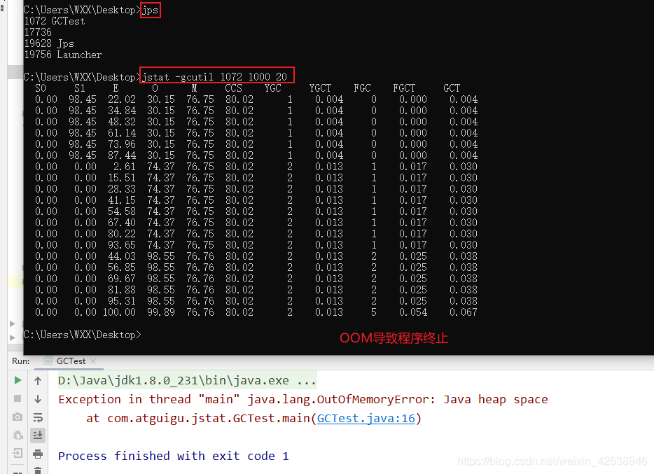

https://blog.csdn.net/weixin_42638946/article/details/113795866

https://blog.csdn.net/weixin_42638946/article/details/113804533

https://blog.csdn.net/qq_44226094/article/details/113698216

虚拟机运行时参数
https://blog.csdn.net/qq_44226094/article/details/113699683

GC日志分析

https://blog.csdn.net/qq_44226094/article/details/113699831


# 命令行-概述
- 性能诊断是软件工程师在日常工作中经常面对和解决的问题，在用户体验至上的今天，解决好应用软件的性能问题能带来非常大的收益。
- Java作为最流行的编程语言之一，其应用性能诊断一直受到业界广泛关注。可能造成Java应用出现性能问题的因素非常多，例如线程控制、磁盘读写、数据库访问、网络I/O、垃圾收集等。想要定位这些问题，一款优秀的性能诊断工具必不可少。
- 体会1：使用数据说明问题，使用知识分析问题，使用工具处理问题
- 体会2：无监控、不调优！

在我们刚接触java学习的时候，大家肯定最先了解的两个命令就是 javac，
java，那么除此之外，还有没有其他的命令可供我们使用呢？我们进入jdk
的bin目录，发现还有一系列辅助工具。这些辅助工具用来获取目标JVM不同
方面、不同层次的信息，帮助开发人员很好的解决Java应用程序的一些疑难
杂症。

# 命令行-jps进程监控
[查看正在运行的Java进程](https://blog.csdn.net/wisgood/article/details/38942449 "aa")
## 基本情况
jps：Java Process Status

显示指定系统内所有的HotSpot虚拟机进程（查看虚拟机进程信息），可用于
查询正在运行的虚拟机进程。

说明：对于本地虚拟机进程来说，进程的本地虚拟机ID与操作系统的进程ID是
一致的，是唯一的。
## 测试
```java_holder_method_tree
public class ScannerTest {
    public static void main(String![] args) {
        Scanner scanner = new Scanner(System.in);
        String info = scanner.next();
    }
}

```
另外注意：每次jps执行都是一个新的进程,即每次jps后对应的jps进程关闭，
下次启动jps后分配新的ID号。

## 基本语法
jps的进本语法：jps ![options] ![hostid]

![options]：
- -q：仅仅显示LVMID（local virtual machine id），即本地虚拟机唯
一id。不显示主类的名称等。
- -l：输出应用程序主类的全类名 或 如果执行的是jar包，则输出jar包的
完整路径
- -m：输出虚拟机进程启动时传递给主类main()的参数,String![] args
- -v：列出虚拟机进程启动时的JVM参数。比如：-Xms100m -Xmx100m是启
动程序指定的JVM参数
- 说明：以上参数可以综合使用。

补充：如果某Java进程关闭了默认开启的UsePerfData参数（即使用参
数-XX:-UsePerfData），那么jps命令（以及下面介绍的jstat）将无法探
知该Java进程


![hostid]：

- RMI注册表中注册的主机名
- 如果想要远程监控主机上的java程序，需要安装jstatd
- 对于具有更严格的安全实践的网络场所而言，可以使用一个自定义的策略文件来显式对特定的可信主机或网络的访问，尽管这种技术很容易受到IP地址欺诈攻击。
- 如果安全问题无法使用一个定制的策略文件来处理，那么最安全的操作是不运行jstatd服务器，而是本地使用jstat和jps工具。进程监控
# 命令行-jstat运行状态
查看JVM的统计信息
## 基本情况
- jstat（JVM Statistics Monitoring Tool）：用于监视虚拟机各种运行状态信息的命令工具。它可以显示本地或者远程虚拟机中的**类装载、内存、垃圾收集、JIT编
译**等运行数据。
- 在没有GUI图形界面，只提供了纯文本控制台环境的服务器上，它将是运行期间定位虚拟机性能问题的首选工具。常用于检测垃圾回收问题以及内存泄露问题。
- 

## 基本语法


`jstat -<option> ![-t] ![-h<lines>] <vmid> ![<interval> ![<count>]]
`

测试命令所用代码：
```
public class ScannerTest {
    public static void main(String![] args) {
        Scanner scanner = new Scanner(System.in);
        String info = scanner.next();
    }
}

```
使用jstat统计类加载卸载情况


option参数
选项option可以由以下值构成：
1. 类装载相关的：
- -class：显示ClassLoader的相关信息：类的装载、卸载数量、总空间、类装载所消耗的时间等

2. 垃圾回收相关的：
测试代码：
```
/**
 * -Xms60m -Xmx60m -XX:SurvivorRatio=8
 */
public class GCTest {
    public static void main(String![] args) {
        ArrayList<byte![]> list = new ArrayList<>();
        for (int i = 0; i < 1000; i++) {
            byte![] arr = new byte![1024 * 100];  // 100KB
            list.add(arr);
            try {
                Thread.sleep(120);
            } catch (InterruptedException e) {
                e.printStackTrace();
            }
        }
    }
}

```

`-gc：显示与GC相关的堆信息。包括Eden区，两个Survivor区、老年代、永久代的用量、已用空间、GC时间合计等信息`



各参数含义


-gccapacity：显示内容与-gc基本相同，但输出主要关注Java堆各个区域使用的最大、最小空间。

-gcutil：显示内容与-gc基本相同，但输出主要关注已使用空间占总空间的百分比。

-gccause：与-gcutil功能一样，但是会额外输出导致最后一次或当前正在发生的GC产生的原因。


-gcnew：显示新生代GC状况

-gcnewcapacity：显示内容与-gcnew基本相同，输出主要关注使用到的最大、最小空间。

-gcold：显示老年代GC状况

-gcoldcapacity：显示内容与-gcold基本相同，输出主要关注使用到的最大、最小空间。

-gcpermcapacity：显示永久代用到的最大、最小空间。

**JIT相关的：**

-compiler：显示JIT编译器编译过的方法、耗时等信息
-printcompilation：输出已被JIT编译的方法


interval参数:用于指定输出统计数据的周期，单位为毫秒。即：查询间隔

count参数:用于指定查询的总次数

-t参数:
可以在输出信息前面加上一个Timestamp列，显示程序的运行时间。单位：秒
经验：我们可以比较Java进程的启动时间以及总GC时间（GCT列），或者两次测量的时间间隔以及总GC时间的增量，来得出GC时间栈运行时间的比例。如果该比例超过20%，则说明目前堆的压力较大；如果该比例超过90%，则说明堆里几乎没有可用空间，随时都可能抛出OOM异常。

-h参数:可以在周期性数据输出时，输出多少行数据后输出一个表头信息

## 补充
**jstat还可以用来判断是否出现内存泄漏。**

第1步：在长时间运行的Java程序中，我们可以运行jstat命令连续获取多行性能数据，并取这几行数据中的OU列
（即已占用的老年代内存）的最小值。

第2步：然后，我们每隔一段较长的时间重复一次上述操作，来获取多组OU最小值。如果这些值呈现上涨趋势，则说
明该Java程序的老年代内存已使用量不断上涨，这意味着无法回收的对象在不断增加，因此有可能存在内存泄露。
# 命令行-jinfo配置参数
## 基本情况
- jinfo（Configuration Info For Java）：查看虚拟机配置参数
信息，也可以用于调整虚拟机的配置参数
- 在很多情况下，Java应用程序不会指定所有的Java虚拟机参数。而此时
，开发人员可能不知道某一个具体的Java虚拟机参数默认值。在这种情
况下，可能需要查找文档获取某个参数的默认值。这个查找过程可能是非
常艰难的。但是有了jinfo工具，开发人员可以很方便地找到Java虚拟机
参数的当前值。
# 官方文档https://docs.oracle.com/en/java/javase/11/tools/jinfo.html


