# 堆的核心概述
## 堆与进程
1. 堆针对一个JVM进程来说是唯一的。也就是**一个进程只有一个JVM实例**，一个JVM实例中就有一个运行时数据区，一个运行时数据区只有一个堆和一个方法区。
2. 但是进程包含多个线程共享同一堆空间的。（比如main方法启动就是启动了一个进程）


- 一个JVM实例只存在一个堆内存，堆也是Java内存管理的核心区域。
- Java堆区在JVM启动的时候即被创建，其空间大小也就确定了，堆是JVM管理的最大一块内存空间，并且堆内存的大小是可以调节的。
- 《Java虚拟机规范》规定，堆可以处于物理上不连续的内存空间中，但在逻辑上它应该被视为连续的。
- 所有的线程共享Java堆，在这里还可以划分线程私有的缓冲区（Thread Local Allocation Buffer，TLAB）。
- 《Java虚拟机规范》中对Java堆的描述是：所有的对象实例以及数组都应当在运行时分配在堆上。（The heap is the run-time data area from which memory for all class instances and arrays is allocated）
从实际使用角度看：“几乎”所有的对象实例都在堆分配内存，但并非全部。因为还有一些对象是在栈上分配的（逃逸分析，标量替换）
- 数组和对象可能永远不会存储在栈上（不一定，比如逃逸分析），因为栈帧中保存引用，这个引用指向对象或者数组在堆中的位置。
- 在方法结束后，堆中的对象不会马上被移除，仅仅在垃圾收集的时候才会被移除。
也就是触发了GC的时候，才会进行回收
如果堆中对象马上被回收，那么用户线程就会收到影响，因为有stop the word
- 堆，是GC（Garbage Collection，垃圾收集器）执行垃圾回收的重点区域。
## 方法区 堆 虚拟机栈 三者的关系
```java_holder_method_tree
public class SimpleHeap {//class分配到方法区
    private int id;//属性、成员变量
    public SimpleHeap(int id) {
        this.id = id;
    }
    public void show() {
        System.out.println("My ID is " + id);//方法中局部变量分配到虚拟机栈中
    }
    public static void main(String[] args) {
        SimpleHeap sl = new SimpleHeap(1);//对象直接分配到堆内存上
        SimpleHeap s2 = new SimpleHeap(2);
        int[] arr = new int[10];
        Object[] arr1 = new Object[10];
    }
}

```
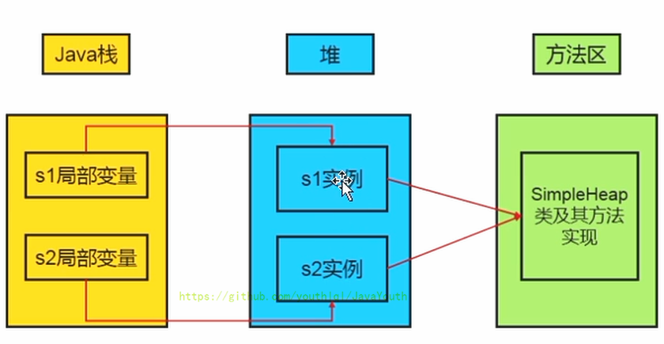

## 不同jdk版本堆内存详细划分
现代垃圾收集器大部分都基于分代收集理论设计，堆空间细分为：

1. Java7 及之前堆内存逻辑上分为三部分：新生区+养老区+永久区
- Young Generation Space 新生区 Young/New，又被划分为Eden区和Survivor区
- Old generation space 养老区 Old/Tenure
- Permanent Space 永久区 Perm
2. Java 8及之后堆内存逻辑上分为三部分：新生区+养老区+元空间
- Young Generation Space 新生区，又被划分为Eden区和Survivor区
- Old generation space 养老区
- Meta Space 元空间 Meta

约定：新生区 <–> 新生代 <–> 年轻代 、 养老区 <–> 老年区 <–> 老年代、 永久区 <–> 永久代

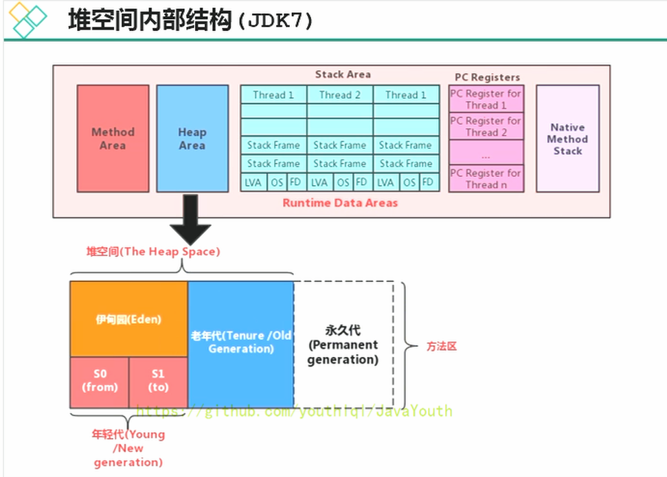

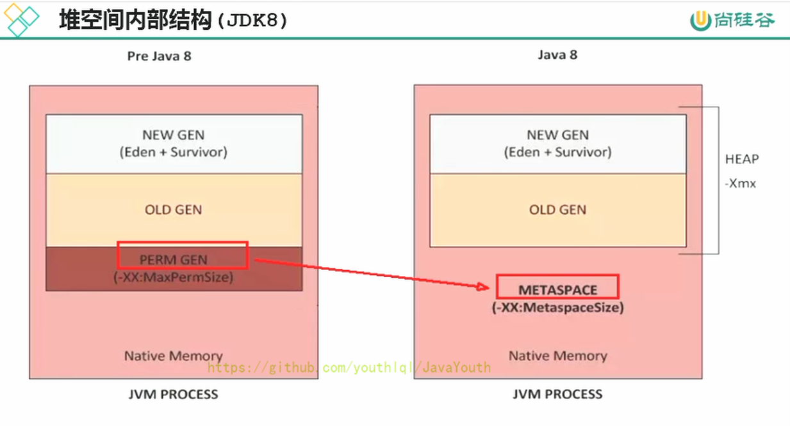

### 新生代老年代
1. 存储在JVM中的Java对象可以被划分为两类：
- 一类是生命周期较短的瞬时对象，这类对象的创建和消亡都非常迅速
- 另外一类对象的生命周期却非常长，在某些极端的情况下还能够与JVM的生命周期保持一致
2. Java堆区进一步细分的话，可以划分为年轻代（YoungGen）和老年代（oldGen）
3. 其中年轻代又可以划分为Eden空间、Survivor0空间和Survivor1空间（有时也叫做from区、to区）

4. 配置新生代与老年代在堆结构的占比
- 默认**-XX:NewRatio**=2，表示新生代占1，老年代占2，新生代占整个堆的1/3
- 可以修改**-XX:NewRatio**=4，表示新生代占1，老年代占4，新生代占整个堆的1/5
5. 在HotSpot中，Eden空间和另外两个survivor空间缺省所占的比例是8 : 1 : 1，
6. 当然开发人员可以通过选项**-XX:SurvivorRatio**调整这个空间比例。比如-XX:SurvivorRatio=8
7. 几乎所有的Java对象都是在Eden区被new出来的。
8. 绝大部分的Java对象的销毁都在新生代进行了（有些大的对象在Eden区无法存储时候，将直接进入老年代），IBM公司的专门研究表明，新生代中80%的对象都是“朝生夕死”的。
9. 可以使用选项"-Xmn"设置新生代最大内存大小，但这个参数一般使用默认值就可以了。

```java_holder_method_tree
新生代老年代各种比例调整
/**
 * -Xms600m -Xmx600m
 * -XX:NewRatio ： 设置新生代与老年代的比例。默认值是2.
 * -XX:SurvivorRatio ：设置新生代中Eden区与Survivor区的比例。默认值是8
 * -XX:-UseAdaptiveSizePolicy ：关闭自适应的内存分配策略  （暂时用不到）
 * -Xmn:设置新生代的空间的大小。 （一般不设置）
 */
public class EdenSurvivorTest {
    public static void main(String[] args) {
        System.out.println("我只是来打个酱油~");
        try {
            Thread.sleep(1000000);
        } catch (InterruptedException e) {
            e.printStackTrace();
        }
    }
}

```

### 堆空间（新生到，老年代）为什么要分代设计？(面试逼问)
为什么要把Java堆分代？不分代就不能正常工作了吗？经研究，不同对象的生命周期不同。70%-99%的对象是临时对象。
其实不分代完全可以，分代的唯一理由就是优化GC性能。
1. 不分代坏处：如果没有分代，那所有的对象都在一块，就如同把一个学校的人都关在一个教室。GC的时候要找到哪些对象没用（哪些学生不想学习，被班主任GC拉出去）
，这样就会对堆的所有区域进行扫描。（性能低）
2. 分代回收好处：而很多对象都是朝生夕死的，如果分代的话，把新创建的对象放到某一地方，当GC的时候先把这块存储“朝生夕死”对
象的区域进行回收，这样就会腾出很大的空间出来。（多回收新生代，少回收老年代，性能会提高很多）

## 基于JvisualVM 查看堆内存

```java_holder_method_tree
public class HeapDemo {
    public static void main(String[] args) {
        System.out.println("start...");
        try {
            TimeUnit.MINUTES.sleep(30);
        } catch (InterruptedException e) {
            e.printStackTrace();
        }
        System.out.println("end...");
    }

}

```

# 堆内存虚拟机参数设置和OOM
## 设置堆内存
1. Java堆区用于存储Java对象实例，那么堆的大小在JVM启动时就已经设定好了，大家可以通过选项"-Xms"和"-Xmx"来进行设置
- -Xms用于表示堆区的起始内存，等价于**-XX:InitialHeapSize**
- -Xmx则用于表示堆区的最大内存，等价于**-XX:MaxHeapSize**
2. 一旦堆区中的内存大小超过“-Xmx"所指定的最大内存时，将会抛出OutofMemoryError异常。
3. 通常会将-Xms和-Xmx两个参数配置相同的值
- 原因：假设两个不一样，初始内存小，最大内存大。在运行期间如果堆内存不够用了，会一直扩容直到最大内存。如果内
存够用且多了，也会不断的缩容释放。频繁的扩容和释放造成不必要的压力，避免在GC之后调整堆内存给服务器带来压力。
- 如果两个设置一样的就少了频繁扩容和缩容的步骤。内存不够了就直接报OOM
4. 默认情况下：初始内存大小：物理电脑内存大小/64，最大内存大小：物理电脑内存大小/4
5. 新生代老年代比例设置：-XX:NewRatio**=2，表示新生代占1，老年代占2，新生代占整个堆的1/3，新生代中Eden和S0,S1内存比例设置：-XX:SurvivorRatio=8
```java_holder_method_tree
/**
 * 测试堆空间常用的jvm参数：
 * -XX:+PrintFlagsInitial : 查看所有的参数的默认初始值
 * -XX:+PrintFlagsFinal  ：查看所有的参数的最终值（可能会存在修改，不再是初始值）
 *      具体查看某个参数的指令： jps：查看当前运行中的进程
 *                             jinfo -flag SurvivorRatio 进程id
 *
 * -Xms：初始堆空间内存 （默认为物理内存的1/64）
 * -Xmx：最大堆空间内存（默认为物理内存的1/4）
 * -Xmn：设置新生代的大小。(初始值及最大值)
 * -XX:NewRatio：配置新生代与老年代在堆结构的占比
 * -XX:SurvivorRatio：设置新生代中Eden和S0/S1空间的比例
 * -XX:MaxTenuringThreshold：设置新生代垃圾的最大年龄
 * -XX:+PrintGCDetails：输出详细的GC处理日志
 * 打印gc简要信息：① -XX:+PrintGC   ② -verbose:gc
 * -XX:HandlePromotionFailure：是否设置空间分配担保

 * 1. 设置堆空间大小的参数
 * -Xms 用来设置堆空间（年轻代+老年代）的初始内存大小
 *      -X 是jvm的运行参数
 *      ms 是memory start
 * -Xmx 用来设置堆空间（年轻代+老年代）的最大内存大小
 *
 * 2. 默认堆空间的大小
 *    初始内存大小：物理电脑内存大小 / 64
 *             最大内存大小：物理电脑内存大小 / 4
 * 3. 手动设置：-Xms600m -Xmx600m
 *     开发中建议将初始堆内存和最大的堆内存设置成相同的值。
 *
 * 4. 查看设置的参数：方式一： jps   /  jstat -gc 进程id
 *                  方式二：-XX:+PrintGCDetails
 */
public class HeapSpaceInitial {
    public static void main(String[] args) {
        //返回Java虚拟机中的堆内存总量
        long initialMemory = Runtime.getRuntime().totalMemory() / 1024 / 1024;
        //返回Java虚拟机试图使用的最大堆内存量
        long maxMemory = Runtime.getRuntime().maxMemory() / 1024 / 1024;
        System.out.println("-Xms : " + initialMemory + "M");
        System.out.println("-Xmx : " + maxMemory + "M");
        System.out.println("系统内存大小为：" + initialMemory * 64.0 / 1024 + "G");
        System.out.println("系统内存大小为：" + maxMemory * 4.0 / 1024 + "G");
        try {
            Thread.sleep(1000000);
        } catch (InterruptedException e) {
            e.printStackTrace();
        }
    }
}
-Xms : 245M
-Xmx : 3618M
系统内存大小为：15.3125G
系统内存大小为：14.1328125G
```
## OOM演示
```java_holder_method_tree
public class OOMTest {
    public static void main(String[] args) {
        ArrayList<Picture> list = new ArrayList<>();
        while(true){
            try {
                Thread.sleep(20);
            } catch (InterruptedException e) {
                e.printStackTrace();
            }
            list.add(new Picture(new Random().nextInt(1024 * 1024)));
        }
    }
}
class Picture{
    private byte[] pixels;
    public Picture(int length) {
        this.pixels = new byte[length];
    }
}
```

1、设置虚拟机参数

-Xms600m -Xmx600m
```java_holder_method_tree
Exception in thread "main" java.lang.OutOfMemoryError: Java heap space
```
2、堆内存变化图
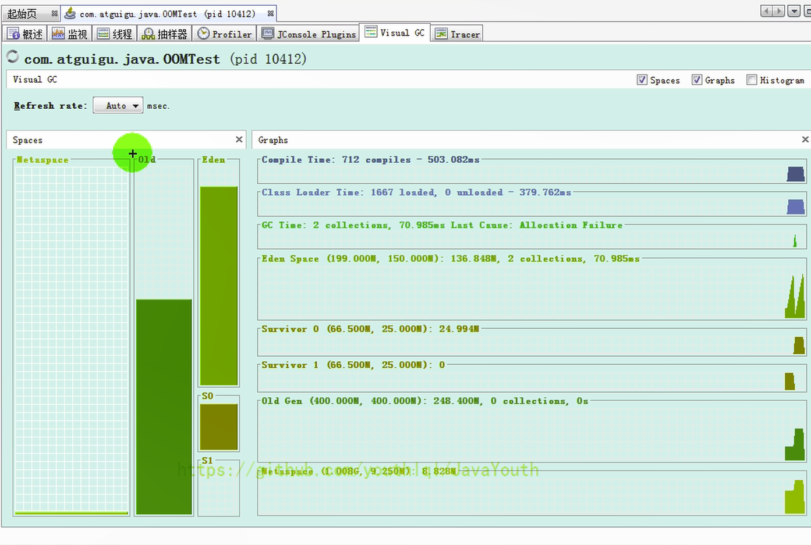

3、原因：大对象byte字节数组导致堆内存溢出
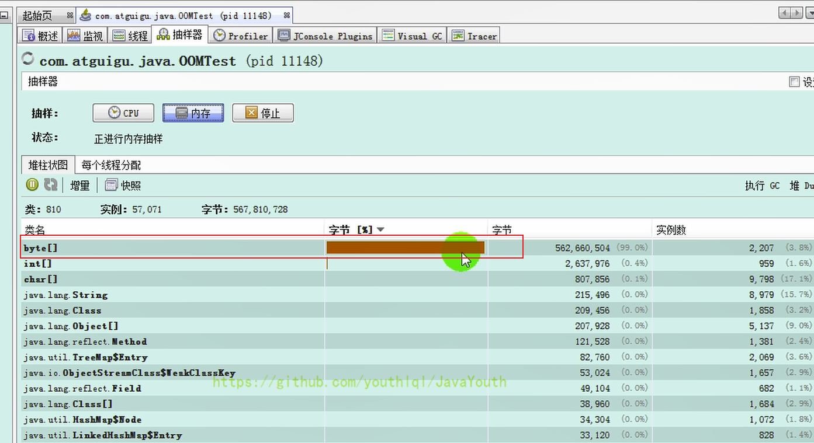

# java对象在堆内存中分配过程
## 一般情况
为新对象分配内存是一件非常严谨和复杂的任务，JVM的设计者们不仅需要考虑内存如何分配、在哪里分配等问题，并且由于内存分配算法与内存回收算法密切相关，所以还需要考虑GC执行完内存回收后是否会在内存空间中产生内存碎片。

具体过程

1. new的对象先放新生代的伊甸园区Eden。此区有大小限制。
2. 当伊甸园的空间填满时，程序又需要创建对象，JVM的垃圾回收器将对伊甸园区进行垃圾回收（MinorGC），将伊甸园区中的不再被其他对象所引用的对象进行销毁。再加载新的对象放到伊甸园区。
3. 然后将伊甸园中的未被GC回收的幸存者对象移动到幸存者0区。
4. 如果再次触发垃圾回收，此时上次幸存下来的放到幸存者0区的，如果没有回收，就会放到幸存者1区。
5. 如果再次经历垃圾回收，此时会重新放回幸存者0区，接着再去幸存者1区。
6. 啥时候能去养老区呢？可以设置次数。默认是15次。可以设置新生区进入养老区的年龄限制，设置 JVM 参数：**-XX:MaxTenuringThreshold**=N 进行设置
7. 在养老区，相对悠闲。当养老区内存不足时，再次触发GC：Major GC，进行养老区的内存清理
8. 若养老区执行了Major GC之后，发现依然无法进行对象的保存，就会产生OOM异常。

图解过程

1. 我们创建的对象，一般都是存放在Eden区的，当我们Eden区满了后，就会触发GC操作，一般被称为 YGC / Minor GC操作,GC回收了Eden中红色代表没有任何
被引用的对象，绿色的Eden代表不可以被回收的对象，此时转移到S0区
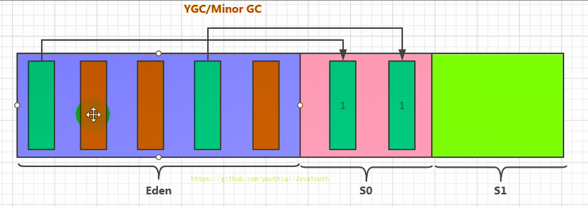
2. 当我们进行一次垃圾收集后，红色的对象将会被回收，而绿色的独享还被占用着，存放在S0(Survivor From)区。同时我们给每个对象设置了一个年龄计数器，
经过一次回收后还存在的对象，将其年龄加 1。
3. 同时Eden区继续存放对象，当Eden区再次存满的时候，又会触发一个MinorGC操作，此时GC将会把 Eden和Survivor From中的对象进行一次垃圾收集，
把存活的对象放到 Survivor To（S1）区，同时让存活的对象年龄 + 1(存放在对象的对象头中)。
下一次再进行YGC的时候，
1、这一次的s0区为空，所以成为下一次GC的S1区。
2、这一次的s1区则成为下一次GC的S0区。
3、也就是说s0区和s1区在互相转换。
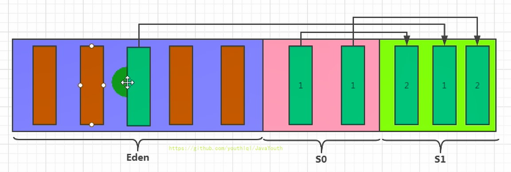
4. 对象生成和垃圾回收，当Survivor中的对象的年龄达到15的时候，将会触发一次 Promotion 晋升的操作，也就是将S1中age=15的对象晋升到老年
代中.


**关于垃圾回收：频繁在新生区收集，很少在养老区收集，几乎不在永久区/元空间收集。**
## 特殊情况
1. 如果来了一个新对象，先看看 Eden 是否放的下？
- 如果 Eden 放得下，则直接放到 Eden 区
- 如果 Eden 放不下，则触发 YGC ，执行垃圾回收，看看还能不能放下？
2. 将对象放到老年区又有两种情况：
- 如果 Eden 执行了 YGC 还是无法放不下该对象，那没得办法，只能说明是超大对象，只能直接放到老年代
- 那万一老年代都放不下，则先触发FullGC ，再看看能不能放下，放得下最好，但如果还是放不下，那只能报 OOM
3. 如果 Eden 区满了，将对象往幸存区拷贝时，发现幸存区放不下啦，那只能便宜了某些新对象，让他们直接晋升至老年区


## 对象内存分配策略
1. 优先分配到Eden：开发中比较长的字符串或者数组，会直接存在老年代，但是因为新创建的对象都是朝生夕死的，所以这个大对象可能
也很快被回收，但是因为老年代触发Major GC的次数比 Minor GC要更少，因此可能回收起来就会比较慢
2. 大对象直接分配到老年代：尽量避免程序中出现过多的大对象
3. 长期存活的对象分配到老年代
4. 动态对象年龄判断：如果Survivor区中相同年龄的所有对象大小的总和大于Survivor空间的一半，年龄大于或等于该年龄的对象可
以直接进入老年代，无须等到MaxTenuringThreshold中要求的年龄。
5. 空间分配担保： -XX:HandlePromotionFailure 。

## 空间分配担保机制
在发生Minor GC之前，虚拟机会检查老年代最大可用的连续空间是否大于新生代所有对象的总空间。

1. 如果大于，则此次Minor GC是安全的
2. 如果小于，则虚拟机会查看**-XX:HandlePromotionFailure**设置值是否允担保失败。
- 如果HandlePromotionFailure=true，那么会继续检查老年代最大可用连续空间是否大于历次晋升到老年代的对象的平均大小。
    1. 如果大于，则尝试进行一次Minor GC，但这次Minor GC依然是有风险的；
    2. 如果小于，则放弃Minor GC转而进行一次Full GC，
- 如果HandlePromotionFailure=false，则进行一次Full GC。

# GC分类
1. 我们都知道，JVM的调优的一个环节，也就是垃圾收集，我们需要尽量的避免垃圾回收，因为在垃圾回收的过程中，容易出现STW（Stop the World）的问题，
而 Major GC 和 Full GC出现STW的时间，是Minor GC的10倍以上
2. JVM在进行GC时，并非每次都对上面三个内存区域一起回收的，大部分时候回收的都是指新生代。针对Hotspot VM的实现，它里面的GC按照回收区域又分为两大
种类型：一种是部分收集（Partial GC），一种是整堆收集（FullGC）

针对HotSpot VM的实现，它里面的GC其实准确分类只有两大种：
- 部分收集Partial GC：不是完整收集整个Java堆的垃圾收集。其中又分为：
1. 新生代收集（Minor GC/Young GC）：只是新生代（Eden，s0，s1）的垃圾收集
2. 老年代收集（Old GC）：只是老年代的圾收集。
3. 目前，只有CMS GC会有单独收集老年代的行为。
4. 注意，很多时候Major GC会和Full GC混淆使用，需要具体分辨是老年代回收还是整堆回收。
5. 混合收集（Mixed GC）：收集整个新生代以及部分老年代的垃圾收集。目前，只有G1 GC会有这种行为
- 整堆收集（Full GC/majorGC）：收集young gen、old gen、perm gen的垃圾收集(Major GC通常是跟full GC是等价的，收集整个GC堆)


**由于历史原因，外界各种解读，majorGC和Full GC有些混淆。**

## Young GC（Minor GC）
因为Java对象大多都具备朝生夕灭的特性，所以Minor GC非常频繁，一般回收速度也比较快，Minor GC会引发STW（Stop The World），
暂停其它用户的线程，等垃圾回收结束，用户线程才恢复运行。
### 触发YGC的条件（Minor GC）（面试必问 ）
1. 当new一个对象准备分配到Eden区时候，发现Eden区满了，剩余内存放不下新对象，就会触发Minor GC。Survivor满不会主动引发GC，在Eden区满的时候处罚YGC，会顺带触发s0区的GC，也就是被动触发GC（每次Minor GC会清理年轻代的内存）
2. 有一些收集器的回收实现是在 full gc 前会让先执行以下 young gc。
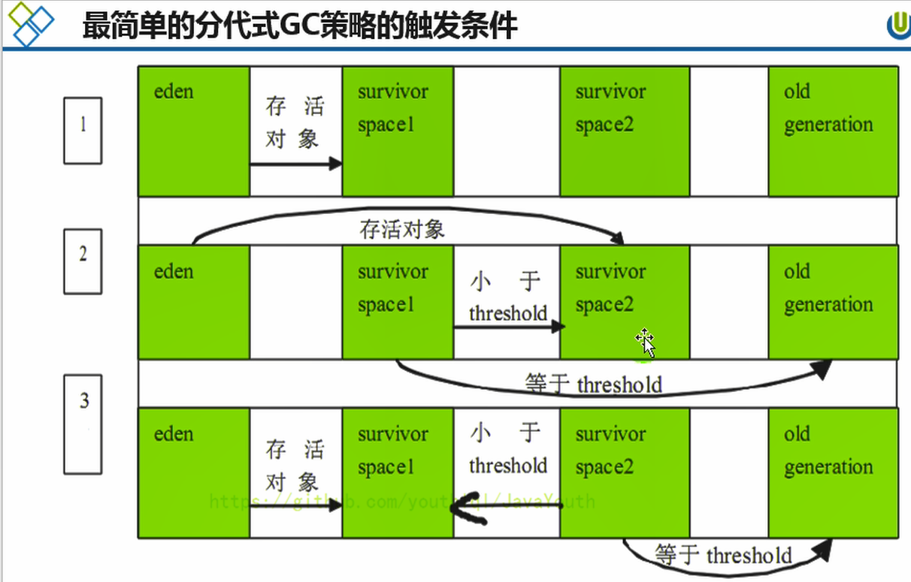

### Minor GC的过程
当发生 Minor GC后，Eden 区和 from 指向的 Survivor 区中的存活对象会被复制(此处采用标记 - 复制算法)到 to 指向的 Su
rvivor区中，然后交换 from 和 to指针，以保证下一次 Minor GC时，to 指向的 Survivor区还是空的。young GC后有部分存活age=5的对象S1会晋升到
old gen，所以young GC后old gen的占用量通常会有所升高。

## Major GC/Full GC（面试必问）
### Major/Full GC 概述
收集整个Java堆和方法区的垃圾收集。指发生在老年代的GC，对象从老年代消失时，我们说 “Major Gc” 或 “Full GC” 发生了，出现了MajorGc，经常会伴随至少一次
的Minor GC。（但非绝对的，在Parallel Scavenge收集器的收集策略里就有直接进行MajorGC的策略选择过程）
也就是在老年代空间不足时，会先尝试触发Minor GC，如果之后空间还不足，则触发Major GC
Major GC的速度一般会比Minor GC慢10倍以上，STW的时间更长。如果Major GC后，内存还不足，就报OOM了

### Major GC/Full GC 触发条件（面试必问）
说明：**Full GC 是开发或调优中尽量要避免的。这样STW时间会短一些**

[Full GC触发条件总结以及解决策略](https://blog.csdn.net/Hollake/article/details/90484027,"A")

1. 调用System.gc()时，系统建议执行FullGC，但是不必然执行
2. 老年代空间不足，大对象直接在老年代申请分配，如果此时老年代空间不足则会触发 full gc
3. 方法区空间不足，永久代的话如果永久代满了也会触发 full gc
4. 通过Minor GC后，根据之前统计数据发现年轻代平均晋升大小比现在老年代剩余空间要大(有oom风险)，则不会触发young GC而是转为触发full GC
5. 由Eden区、survivor space0（From Space）区向survivor space1（To Space）区复制时，对象大小大于To Space可用内
存，则把该对象转存到老年代或者age到达了阈值，且老年代的可用内存小于该对象大小

# TLAB为对象分配内存（保证线程安全）

## TLAB（Thread Local Allocation Buffer）产生背景
这个得从内存申请说起。一般而言生成对象需要向堆中的新生代申请内存空间，而堆又是全局共享的，像新生代内存又是规整的，
是通过一个指针来划分的。

内存是紧凑的，新对象创建指针就右移对象大小 size 即可，这叫指针加法（bump [up] the pointer）。
可想而知如果多个线程都在分配对象，那么这个**堆内存分配指针就会成为热点资源**，需要**互斥那分配的效率**就低了。

## 什么是TLAB

TLAB 的思想其实很简单，就是划一块区域给一个线程，这样每个线程只需要在自己的那亩地申请对象内存，不需要争抢热点指针。
当这块内存用完了之后再去申请指针进行分配内存即可。jvm搞了个 TLAB（Thread Local Allocation Buffer），它包含在
Eden空间内,为一个线程分配的内存申请区域。这个堆内存Eden区域**只允许这一个线程申请分配对象，但是允许所有线程共享访问这块内存区域**。

不过**每次申请的大小不固定**，会根据该线程启动到现在的历史信息来调整，比如这个线程一直在分配内存那么 TLAB 就大一些，如果这个线程基本上不会申请分配内存那 TLAB 就小一些。

还有 TLAB 会浪费空间，我们来看下这个图。
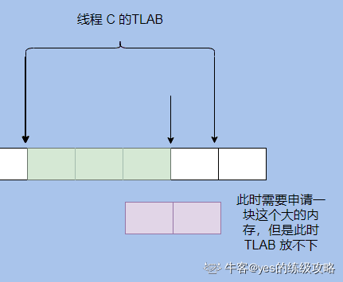
可以看到 TLAB 内部只剩一格大小，申请的对象需要两格，这时候需要再申请一块 TLAB ，之前的那一格就浪费了。
在 HotSpot 中会生成一个填充对象来填满这一块，因为堆需要线性遍历，遍历的流程是通过对象头得知对象的大小，然后跳过这个大小就能找到下一个对象，所以不能有空洞。
当然也可以通过空闲链表等外部记录方式来实现遍历。还有 **TLAB 只能分配小对象，大的对象还是需要在共享的 eden 区通过point指针分配**
。所以总的来说 **TLAB 是为了避免对象分配时的竞争而设计的**。
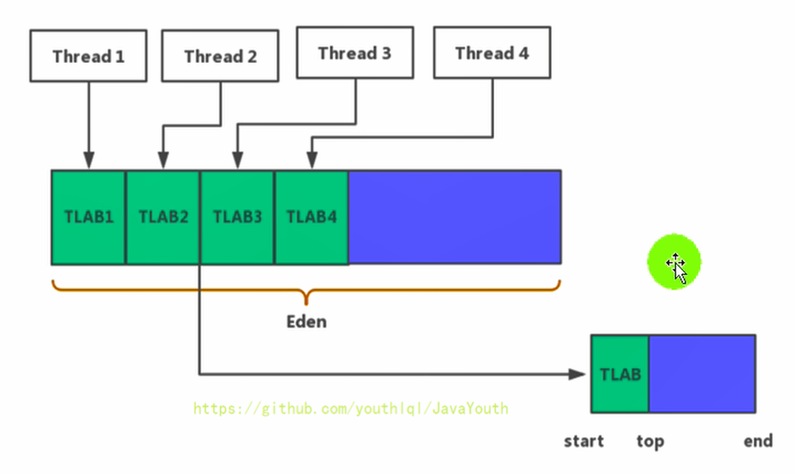

## TLAB补充
1. 不管不是所有的对象实例都能够在TLAB中成功分配内存，但**JVM确实是将TLAB作为内存分配的首选**
2. 在程序中，开发人员可以通过选项“**-XX:UseTLAB**”设置是否开启TLAB空间
3. 默认情况下，TLAB空间的内存非常小，仅占有整个Eden空间的1%，当然我们可以通过选项“**-XX:TLABWasteTargetPercent**”
设置TLAB空间所占用Eden空间的百分比大小。
4. 一旦对象在TLAB空间分配内存失败时，JVM就会尝试着通过使用加锁（锁住堆内存分配指针）机制确保数据操作的原子性，从而直接在Eden空间中分配内存

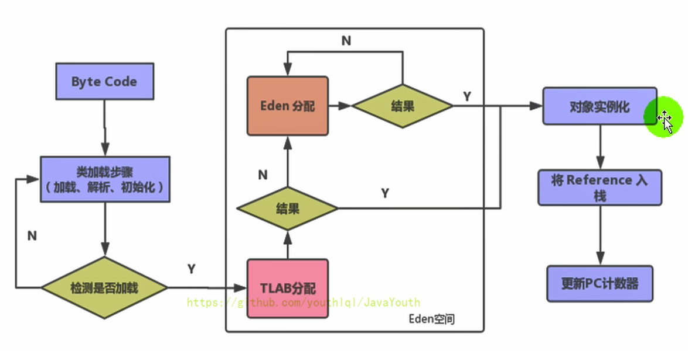

# 所有的对象都是在堆上分配的吗？（面试必问）

[求你了，别再说Java对象都是在堆内存上分配空间的了！ hollis](https://www.hollischuang.com/archives/4521 "A")
[oracle官方对于逃逸分析技术的讲解](https://docs.oracle.com/en/java/javase/11/vm/java-hotspot-virtual-machine-performance-enhancements.html#GUID-6BD8FCB5-995B-4AE9-BFAA-B2C7DE2BA5CD "a")

**最终答案：在HotSpot虚拟机上，所有的对象实例都是创建在堆上**。有一种否定之否定的感觉，正常我们都认为对象的内存
分配开始在堆上，但是经过JIT编译器的逃逸分析后，如果方法内对象没有逃逸，那么方法中创建的对象不会分配在堆上，
导致给我们的感觉是“这个对象应该是分配到栈上了”，因此很容易得到的结论就是对象并不是都分配在堆上，也可能是栈上。
但是，其实上面的未逃逸的对象，其实是被JIT编译器的标量替换技术，把聚合量对象分割成多个标量存储在虚拟机栈中。
因此对象并没有分配到栈上。

```java_holder_method_tree
Oracle 官方说法。
 It does not replace a heap allocation with a stack allocation for objects that do not globally escape.
 逃逸分析技术对于未逃逸出方法的对象，不会用堆分配代替堆分配
```
**所有对象分配到堆上 - 》 “逃逸分析导致对象好像在栈上”  -》 “标量替换技术对象是被分割放到栈上” -》 所有的对象还是分配到堆只不过有的对象被分割放到栈上。**

1. 随着JIT编译期的发展与**逃逸分析技术逐渐成熟，栈上分配、标量替换优化技术**将会导致一些微妙的变化，所有的对象都分
配到堆上也渐渐变得不那么“绝对”了。
2. 在Java虚拟机中，对象是在Java堆中分配内存的，这是一个普遍的常识。但是，有一种特殊情况，那就是如果经过
**逃逸分析（Escape Analysis）** 后发现，一个对象并没有逃逸出方法的话，那么就 **可能被优化成栈上分配**。这样就无需在堆上分配内存，
也无须进行垃圾回收了。这也是最常见的堆外存储技术。
3. 此外，前面提到的基于OpenJDK深度定制的TaoBao VM，其中创新的GCIH（GC invisible heap）技术实现off-heap，将生命周期较长的Java对象从heap中移至heap外，并且GC不能管理GCIH内部的Java对象，以此达到降低GC的回收频率和提升GC的回收效率的目的。

## 什么是逃逸分析
如何将堆上的对象分配到栈，需要使用逃逸分析手段。这是一种可以有效减少Java程序中同步负载和内存堆分配压力的跨函数全局
数据流分析算法。通过逃逸分析，Java Hotspot编译器能够分析出一个新的对象的引用的使用范围从而决定是否要将这个对象分配到堆上。

逃逸分析的基本行为就是分析对象动态作用域：
- 当new一个对象在方法中被定义后，对象只在方法内部使用，则认为没有发生逃逸 -> 对象直接分配到方法栈帧之中，随着方法入栈出栈死活。
- 当new一个对象在方法中被定义后，它被外部方法所引用，则认为发生逃逸。例如作为调用参数传递到其他地方中。
使用逃逸分析，编译器可以对代码做如下优化：

逃逸分析参数设置

1. 在JDK 1.7 版本之后，HotSpot中默认就已经开启了逃逸分析
2. 如果使用的是较早的版本，开发人员则可以通过：
- 选项“-XX:+DoEscapeAnalysis"显式开启逃逸分析
- 通过选项“-XX:+PrintEscapeAnalysis"查看逃逸分析的筛选结果

## 逃逸分析导致对象在栈上分配（底层是标量替换技术）
**其实对象并没有在栈上分配，只是基于标量替换技术把对象这个聚合量分割成多个标量存储在虚拟机栈中。**

将堆分配转化为栈分配。如果一个对象在子程序中被分配，要使指向该对象的指针永远不会发
生逃逸，对象可能是栈上分配的候选，而不是堆上分配。JIT编译器在编译期间根据逃逸分析
的结果，发现如果一个对象并没有逃逸出方法的话，就可能被优化成栈上分配。分配完成后，
继续在调用栈内执行，最后线程结束，栈空间被回收，局部变量对象也被回收。这样就无须进
行垃圾回收了。

1、没有发生逃逸的对象v，则可以分配到栈（无线程安全问题）上，随着方法执行的结束，栈空间就被移除（也就无需GC）
```java_holder_method_tree
public void my_method() {
    V v = new V();
    // use v
    // ....
    v = null;
}

```
2、下面代码中的 StringBuffer sb 发生了逃逸，不能在栈上分配
```java_holder_method_tree
public static StringBuffer createStringBuffer(String s1, String s2) {
    StringBuffer sb = new StringBuffer();
    sb.append(s1);
    sb.append(s2);
    return sb;//逃逸出了方法
}
```
3、如果想要StringBuffer sb不发生逃逸，可以这样写
```java_holder_method_tree
public static String createStringBuffer(String s1, String s2) {
    StringBuffer sb = new StringBuffer();
    sb.append(s1);
    sb.append(s2);
    return sb.toString();//new 一个字符串新对象，sb没有逃逸出方法
}

/**
 * 逃逸分析
 *
 *  如何快速的判断是否发生了逃逸分析，大家就看new的对象实体是否有可能在方法外被调用。
 */
public class EscapeAnalysis {

    public EscapeAnalysis obj;

    /*
    方法返回EscapeAnalysis对象，发生逃逸
     */
    public EscapeAnalysis getInstance(){
        return obj == null? new EscapeAnalysis() : obj;
    }
    /*
    为成员属性赋值，发生逃逸
     */
    public void setObj(){
        this.obj = new EscapeAnalysis();
    }
    //思考：如果当前的obj引用声明为static的？仍然会发生逃逸。

    /*
    对象的作用域仅在当前方法中有效，没有发生逃逸
     */
    public void useEscapeAnalysis(){
        EscapeAnalysis e = new EscapeAnalysis();
    }
    /*
    引用成员变量的值，发生逃逸
     */
    public void useEscapeAnalysis1(){
        EscapeAnalysis e = getInstance();
        //getInstance().xxx()同样会发生逃逸
    }
}

```

### 逃逸分析导致对象栈上分配举例1

如果关闭逃逸分析：对象肯定分配在堆上，因为发生了GC，耗时长
```java_holder_method_tree
/**
 * 栈上分配测试
 * -Xmx128m -Xms128m -XX:-DoEscapeAnalysis -XX:+PrintGCDetails
 */
public class StackAllocation {
    public static void main(String[] args) {
        long start = System.currentTimeMillis();
        for (int i = 0; i < 10000000; i++) {
            alloc();
        }
        // 查看执行时间
        long end = System.currentTimeMillis();
        System.out.println("花费的时间为： " + (end - start) + " ms");
        // 为了方便查看堆内存中对象个数，线程sleep
        try {
            Thread.sleep(1000000);
        } catch (InterruptedException e1) {
            e1.printStackTrace();
        }
    }

    private static void alloc() {
        User user = new User();//未发生逃逸
    }

    static class User {

    }
}
输出结果
[GC (Allocation Failure) [PSYoungGen: 33280K->808K(38400K)] 33280K->816K(125952K), 0.0483350 secs] [Times: user=0.00 sys=0.00, real=0.06 secs] 
[GC (Allocation Failure) [PSYoungGen: 34088K->808K(38400K)] 34096K->816K(125952K), 0.0008411 secs] [Times: user=0.00 sys=0.00, real=0.00 secs] 
[GC (Allocation Failure) [PSYoungGen: 34088K->792K(38400K)] 34096K->800K(125952K), 0.0008427 secs] [Times: user=0.00 sys=0.00, real=0.00 secs] 
[GC (Allocation Failure) [PSYoungGen: 34072K->808K(38400K)] 34080K->816K(125952K), 0.0012223 secs] [Times: user=0.08 sys=0.00, real=0.00 secs] 
花费的时间为： 114 ms

如果设置足够多的内存：我们使用jmap命令，来查看下当前堆内存中有多少个User对象：
 jmap -histo 2809
 num     #instances         #bytes  class name
----------------------------------------------
   1:           524       87282184  [I
   2:       1000000       16000000  StackAllocation$User
   3:          6806        2093136  [B
   4:          8006        1320872  [C
   5:          4188         100512  java.lang.String
   6:           581          66304  java.lang.Class
jmap执行结果中我们可以看到，堆中共创建了100万个StackAllocation$User实例
```
开启逃逸分析的情况:对象在虚拟机栈中的栈帧中分配消失，无GC,耗时短5ms
```java_holder_method_tree
虚拟机参数：-Xmx128m -Xms128m -XX:+DoEscapeAnalysis -XX:+PrintGCDetails
输出结果：
花费的时间为： 5 ms

 ~ jmap -histo 2859 我们使用jmap命令，来查看下当前堆内存中有多少个User对象：
 num     #instances         #bytes  class name
----------------------------------------------
   1:           524      101944280  [I
   2:          6806        2093136  [B
   3:         83619        1337904  StackAllocation$User
   4:          8006        1320872  [C
   5:          4188         100512  java.lang.String
   6:           581          66304  java.lang.Class

```
开启了逃逸分析之后（-XX:+DoEscapeAnalysis），在堆内存中只有8万多个StackAllo
cTest$User对象。也就是说在经过JIT优化之后，堆内存中分配的对象数量，从100万降到了
8万,但是并不是0，**根本原因是逃逸分析技术不是很成熟，无法保证逃逸分析的性能消耗一定能高于他的消耗。**
## 逃逸分析导致对象锁同步省略（锁消除）
如果一个对象被发现只有一个线程被访问到，那么对于这个对象的操作可以不考虑同步。
我们知道线程同步的代价是相当高的，同步的后果是降低并发性和性能。在动态编译同步块的
时候，JIT编译器可以借助逃逸分析来判断同步块所使用的锁对象是否只能够被一个线程访问
而没有被发布到其他线程。如果没有，那么**JIT编译器在编译这个同步块的时候就会取消对这
部分代码的同步**。这样就能大大提高并发性和性能。这个取消同步的过程就叫同步省略，
也叫锁消除。

### 锁消除实例
```java_holder_method_tree
public void f() {
    Object obj = new Object();
    synchronized(obj) {
        System.out.println(hollis);
    }
}

```
代码中对hollis这个对象加锁，但是hollis对象的生命周期只在f()方法中，并不会被其他
线程所访问到，所以在JIT编译阶段就会被优化掉，优化成：
```java_holder_method_tree
public void f() {
    Object obj = new Object();
    System.out.println(obj);
}

```
```java_holder_method_tree
 0 new #2 <java/lang/Object>
 3 dup
 4 invokespecial #1 <java/lang/Object.<init>>
 7 astore_1
 8 aload_1
 9 dup
10 astore_2
11 monitorenter
12 getstatic #3 <java/lang/System.out>
15 aload_1
16 invokevirtual #4 <java/io/PrintStream.println>
19 aload_2
20 monitorexit
21 goto 29 (+8)
24 astore_3
25 aload_2
26 monitorexit
27 aload_3
28 athrow
29 return

```
注意：字节码文件中并没有进行优化，可以看到加锁和释放锁的操作依然存在，**同步省略操作
是在解释运行时发生的**

## 逃逸分析导致分离对象或标量替换
有的对象可能不需要作为一个连续的内存结构存在也可以被访问到，那么对象的部分（或全部）可以不存储在内存，而是存储在CPU寄存器中。
标量（scalar）是指一个无法再分解成更小的数据的数据。Java中的原始数据类型就是标量。
相对的，那些还可以分解的数据叫做聚合量（Aggregate），Java中的对象就是聚合量，因为
他可以分解成其他聚合量和标量。在JIT阶段，如果经过逃逸分析，发现一个对象不会被外
界访问的话，那么经过JIT优化，就会把这个对象拆解成若干个其中包含的若干个成员变量
来代替。这个过程就是标量替换。

### 分离对象或标量替换例子(打散分配到栈上)
```java_holder_method_tree
public static void main(String args[]) {
    alloc();
}
private static void alloc() {
    Point point = new Point(1,2);
    System.out.println("point.x" + point.x + ";point.y" + point.y);
}
class Point {//聚合量
    private int x;//标量：基本类型
    private int y;//标量：基本类型
}

```

以上代码经过逃逸分析发现，point对象不会逃逸，并且聚合量Point可以分解成两个标量，x,y。
```java_holder_method_tree
private static void alloc() {
    int x = 1;
    int y = 2;
    System.out.println("point.x = " + x + "; point.y=" + y);
}

```
那么标量替换有什么好处呢？就是可以**大大减少堆内存的占用**。因为一旦不需要创建对象了，那么就不再需要分配堆内存了。
**标量替换为对象栈上分配提供了很好的基础**。

### 标量替换参数设置
参数 -XX:+ElimilnateAllocations：开启了标量替换（默认打开），允许将对象打散分配在栈上。


一 未开启标量替换：-Xmx100m -Xms100m -XX:+DoEscapeAnalysis -XX:+PrintGC -XX:-EliminateAllocations
```java_holder_method_tree
/**
 * 标量替换测试
 *  -Xmx100m -Xms100m -XX:+DoEscapeAnalysis -XX:+PrintGC -XX:-EliminateAllocations
 * @author shkstart  shkstart@126.com
 * @create 2020  12:01
 */
public class ScalarReplace {//聚合量
    public static class User {
        public int id;//标量：基本数据类型
        public String name;//聚合量：引用数据类型
    }
    public static void alloc() { //
        User u = new User();//未发生逃逸，不短分配对象。
        u.id = 5;
        u.name = "www.atguigu.com";
    }
    public static void main(String[] args) {
        long start = System.currentTimeMillis();
        for (int i = 0; i < 10000000; i++) {
            alloc();//分配一千万个User对象
        }
        long end = System.currentTimeMillis();
        System.out.println("花费的时间为： " + (end - start) + " ms");
    }
}

```
日志:开启了逃逸分析，但是没开启标量替换：对象在堆中分配，发生了GC
```java_holder_method_tree
[GC (Allocation Failure)  25600K->880K(98304K), 0.0012658 secs]
[GC (Allocation Failure)  26480K->832K(98304K), 0.0012124 secs]
[GC (Allocation Failure)  26432K->784K(98304K), 0.0009719 secs]
[GC (Allocation Failure)  26384K->832K(98304K), 0.0009071 secs]
[GC (Allocation Failure)  26432K->768K(98304K), 0.0010643 secs]
[GC (Allocation Failure)  26368K->824K(101376K), 0.0012354 secs]
[GC (Allocation Failure)  32568K->712K(100864K), 0.0011291 secs]
[GC (Allocation Failure)  32456K->712K(100864K), 0.0006368 secs]
花费的时间为： 99 ms
```

开启标量替换：-Xmx100m -Xms100m -XX:+DoEscapeAnalysis -XX:+PrintGC -XX:+EliminateAllocations

日志：时间减少很多，且无GC。对象在虚拟机栈中的方法栈帧中分配内存，随着方法结束被回收。
````java_holder_method_tree
花费的时间为： 6 ms
````
上述代码在主函数中调用了1亿次alloc()方法，进行对象创建由于User对象实例需要占据约
16字节的空间，因此累计分配空间达到将近1.5GB。如果堆空间小于这个值，就必然会发生GC
。使用如下参数运行上述代码：
```java_holder_method_tree
-server -Xmx100m -Xms100m -XX:+DoEscapeAnalysis -XX:+PrintGC -XX:+EliminateAllocations
```
- 参数 -server：启动Server模式，因为在server模式下，才可以启用逃逸分析。
- 参数 -XX:+DoEscapeAnalysis：启用逃逸分析
- 参数 -Xmx10m：指定了堆空间最大为10MB
- 参数 -XX:+PrintGC：将打印GC日志。
- 参数 -XX:+EliminateAllocations：开启了标量替换（默认打开），允许将对象打散分配在栈上，比如对象拥有id和name两个字段，
那么这两个字段将会被视为两个独立的局部变量进行分配.


## 逃逸分析技术优缺点

### 优点
未发生逃逸的对象内存分配发生在虚拟机栈中的栈帧中，随着方法的执行对象创建，随着方法的结束对象消失，不会GC，
因此节省了虚拟机堆中的内存。

### 缺点

1. 关于逃逸分析的论文在1999年就已经发表了，但直到JDK1.6才有实现，而且这项技术到如今也并不是十分成熟的。
但是它也是即时编译器优化技术中一个十分重要的手段。
2. 逃逸分析本身也是一个相对耗时的过程，无法保证使用逃逸分析的性能消耗一定能高于未经过逃逸分析的程序。虽然经过逃逸分析可以做标量替换、栈上分配、和锁
消除。
3. 一个极端的例子，就是经过逃逸分析之后，所有的对象都逃逸。那这个逃逸分析的过程就白白浪费掉，并且增加了耗时。
4. 注意到有一些观点，认为通过逃逸分析，JVM会在栈上分配那些不会逃逸的对象，这在理论上是可行的，但是取决于
JVM设计者的选择。据我所知，Oracle Hotspot JVM中并未这么做（**刚刚演示的效果对象在栈上分配，是因为HotSpot实现了标量
替换**（看起来好像是对象分配到栈上，其实是基于标量替换，对象被分割成一个个标量存储在虚拟机栈中）），
这一点在逃逸分析相关的文档里已经说明，所以可以明确在**HotSpot虚拟机上，所有的对象实例
都是创建在堆上**。
5. 目前很多书籍还是基于JDK7以前的版本，JDK已经发生了很大变化，intern字符串的缓存和静态变量曾经都被分配
在永久代上，而永久代已经被元数据区取代。但是**intern字符串缓存和静态变量**并不是被转移到元数据区，而是**直接在
堆上分配**，所以这一点同样符合前面一点的结论：**对象实例都是分配在堆上**。


