# 方法区概述

## 堆栈方法区数据交互关系
从线程共享与否的角度来看
ThreadLocal：如何保证多个线程在并发环境下的安全性？典型场景就是数据库连接管理，以及会话管理。


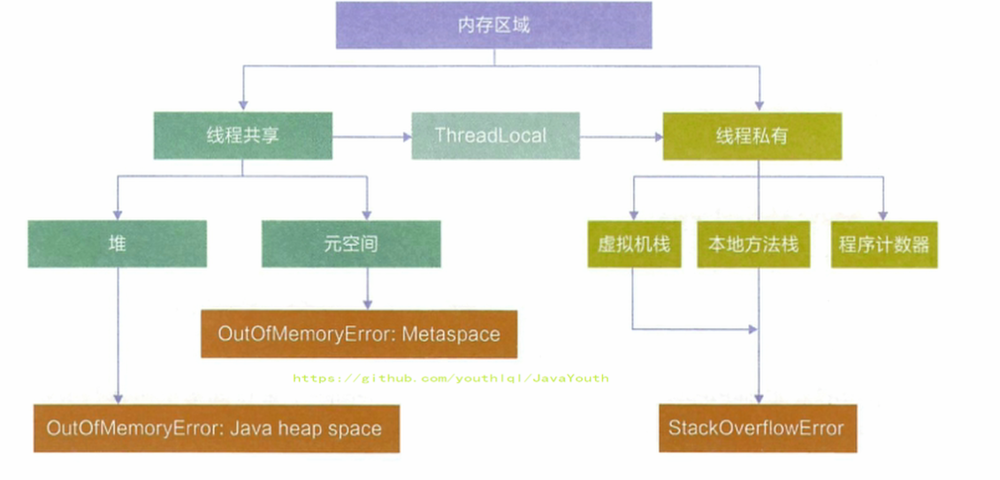

### 举例说明堆栈方法区域交互关系
一个对象的访问定位过程
1. Person 类的 .class 信息存放在方法区中（方法区）
2. person 变量存放在 Java 栈的局部变量表中（虚拟机栈）
3. 真正的 person 对象存放在 Java 堆中（堆内存）
4. 在 person 对象的对象头中，有个指针指向方法区中的 person 类型数据，表明这个 person 对象是用方法区中的 Person 类 new 出来的
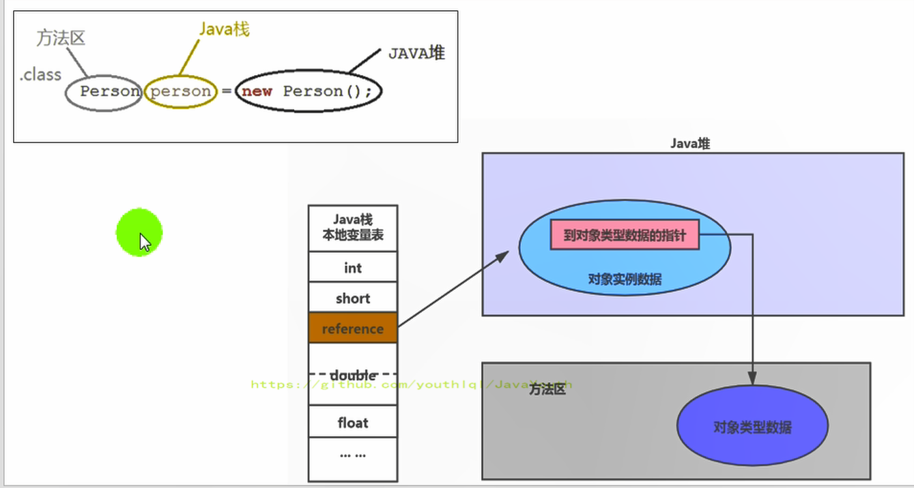

## 怎么理解方法区

[方法区官方文档](https://docs.oracle.com/javase/specs/jvms/se8/html/jvms-2.html#jvms-2.5.4 "afa")

### 方法区在内存哪里？
1. 《Java虚拟机规范》中明确说明：尽管所有的**方法区在逻辑上是属于堆的一部分**，但
一些简单的实现可能不会选择去进行垃圾收集或者进行压缩。但对于HotSpotJVM而言，
方法区还有一个别名叫做Non-Heap（非堆），目的就是要和堆分开。
2. 所以，方法区可以看作是一块独立于Java堆的内存空间。


### 方法区基本理解
**方法区主要存放的是 Class，而堆中主要存放的是实例化的对象**
1. 方法区（Method Area）与Java堆一样，是各个线程共享的内存区域。多个线程同
时加载统一个类时，只能有一个线程能加载该类，其他线程只能等等待该线程加载完毕，然
后直接使用该类，即类只能加载一次。（**虚拟机保证多线程加载同一个类时候进行同步控制**）
2. 方法区在JVM启动的时候被创建，并且它的实际的物理内存空间中和Java堆区一样都
可以是不连续的。（**逻辑上连续，物理上可能不连续**）
3. 方法区的大小，跟堆空间一样，可以选择固定大小或者可扩展。（**方法区大小可调**）
4. 方法区的大小决定了系统可以保存多少个类，如果系统定义了太多的类，导致方法区溢出
，虚拟机同样会抛出内存溢出错误：java.lang.OutofMemoryError:PermGen space
或者java.lang.OutOfMemoryError:Metaspace。
- 加载大量的第三方的jar包
- Tomcat部署的工程过多（30~50个）
- 大量动态的生成反射类
5. 关闭JVM就会释放这个区域的内存。

#### 方法区代码例子
```java_holder_method_tree
public class MethodAreaDemo {
    public static void main(String[] args) {
        System.out.println("start...");
        try {
            Thread.sleep(1000000);
        } catch (InterruptedException e) {
            e.printStackTrace();
        }
        System.out.println("end...");
    }
}

```
简单的程序，加载了1600多个类


## 方法区在不同jdk版本的演进（面试必问）


1.  JDK7 及以前，习惯上把方法区，称为永久代。JDK8开始，使用元空间取代了永
久代。我们可以将方法区类比为Java中的接口，将永久代或元空间类比为Java中具体的
实现类。
2. 本质上，方法区和永久代并不等价。仅是对Hotspot而言的可以看作等价。《Java
虚拟机规范》对如何实现方法区，不做统一要求，因此**永久代、元空间都是方法区的具体实现**。
例如：BEAJRockit / IBM J9 
中不存在方法区的概念。当初使用方法区不是好的idea，因为容易导致java程序OOM（超过-XX:MaxPermsize上限）
3. JDK8，彻底废弃了永久代的概念，改用与JRockit、J9一样在本地内存中实现的元
空间（Metaspace）来代替。（本地内存很大导致元空间几乎不可能OOM）
4. 元空间的本质和永久代类似，都是对JVM规范中方法区的实现。不过**元空间与永久代最
大的区别在于：元空间不在虚拟机设置的内存中，而是使用本地内存,永久代占用虚拟机内存**
5. 永久代、元空间二者并不只是名字变了，内部结构也调整了

### 不同版本JDK方法区的内存划分（面试必问）
| JDK1.6及以前 | 有永久代（permanent generation），静态变量存储在永久代上 |
| :-----| ----: | 
| JDK1.7 | 有永久代，但已经逐步 “去永久代”，字符串常量池，静态变量移除，保存在堆中 |
| JDK1.8 | 无永久代，类型信息，字段，方法，常量保存在本地内存的元空间，但字符串常量池、静态变量仍然在堆中。 | 

JDK6:方法区由永久代实现，使用 JVM 虚拟机内存（虚拟的内存）

JDK7:方法区由永久代实现，使用 JVM 虚拟机内存

JDK8:方法区由元空间实现，使用物理机本地内存


### JDK8为什么要用元空间取代永久代？（面试必问）

官方文档： http://openjdk.java.net/jeps/122

随着Java8的到来，HotSpot VM中再也见不到永久代了。但是这并不意味着类的元数据
信息也消失了。这些数据被移到了一个与堆不相连的物理机本地内存区域，这个区域叫做元空
间（Metaspace）。

**用元空间代替永久代存储类的元数据好处？**
1. **防止方法OOM.** 为永久代设置空间大小是很难确定的。在某些场景下，如果动态加载类过多，容易
产生Perm区的OOM。比如某个实际Web工程中，因为功能点比较多，在运行过程中，
要不断动态加载很多类，经常出现致命错误。但是元空间由于使用本机内存，几乎不发生OOM
2. **对永久代进行调优是很困难的**。方法区的垃圾收集主要回收两部分内容：常
量池中废弃的常量和不再用的class类型，**方法区的调优主要是为了降低Full GC**。
- 有些人认为方法区（如HotSpot虚拟机中的元空间或者永久代）是没有垃圾收集行
为的，其实不然。《Java虚拟机规范》对方法区的约束是非常宽松的，提到过**可以不要
求虚拟机在方法区中实现垃圾收集**。事实上也确实有未实现或未能完整实现方法区类型
卸载的收集器存在（如JDK11时期的ZGC收集器就不支持类卸载）。
- **一般来说方法去GC效果比较难令人满意，尤其是类型的卸载**，条件相当苛刻 
。但是这部分区域的回收有时又确实是必要的。以前Sun公司的Bug列表中，曾出现过
的若干个严重的Bug就是由于低版本的HotSpot虚拟机对此区域未完全回收而导致内存
泄漏。

### JDK7中为什么字符串常量池StringTable调整到堆上？
**目的：更好的回收不用的字符串常量。** JDK7中将StringTable放到了堆空间中。因为永久代的回收效率很低，在Full 
GC的时候才会执行永久代的垃圾回收，而**Full GC是老年代的空间不足、永久代不足时
才会触发**。这就导致StringTable回收效率不高，而我们开发中会有大量的字符串
被创建，回收效率低，导致永久代内存不足。放到堆里，能及时回收内存。

### 不同JDK版本下static静态变量存放在哪里？
```java_holder_method_tree
/**
 * 结论：
 * 1、静态引用对应的对象实体(也就是这个new byte[1024 * 1024 * 100])始终都存在堆空间，
 * 2、只是那个变量(相当于下面的arr变量名)在JDK6,JDK7,JDK8存放位置中有所变化
 *
 * jdk7：
 * -Xms200m -Xmx200m -XX:PermSize=300m -XX:MaxPermSize=300m -XX:+PrintGCDetails
 * jdk 8：
 * -Xms200m -Xmx200m -XX:MetaspaceSize=300m -XX:MaxMetaspaceSize=300m -XX:+PrintGCDetails
 */
public class StaticFieldTest {
    private static byte[] arr = new byte[1024 * 1024 * 100];//100MB

    public static void main(String[] args) {
        System.out.println(StaticFieldTest.arr);
    }
}

```
#### 静态变量引用的对象实体在哪？
jdk6,7,8 new的对象还是存放在堆内存上
JDK6环境下 new对象位置

JDK7环境下 new对象位置

JDK8环境下 new对象位置


#### 静态变量名存在哪里？
这个问题需要用JHSDB工具来进行分析，这个工具是JDK9开始自带的(JDK9以前没有)，在bin目录下可以找到
```java_holder_method_tree
package com.atguigu.java1;

/**
 * 《深入理解Java虚拟机》中的案例：
 * staticObj、instanceObj、localObj存放在哪里？
 */
public class StaticObjTest {
    static class Test {
        static ObjectHolder staticObj = new ObjectHolder();
        ObjectHolder instanceObj = new ObjectHolder();
        void foo() {
            ObjectHolder localObj = new ObjectHolder();
            System.out.println("done");
        }
    }
    private static class ObjectHolder {
    }
    public static void main(String[] args) {
        Test test = new StaticObjTest.Test();
        test.foo();
    }
}

```
JDK6环境下

1. staticObj随着Test的类型信息存放在方法区
2. instanceObj随着Test的对象实例存放在Java堆
3. localObject则是存放在foo()方法栈帧的局部变量表中。
4. 测试发现：三个对象的数据在内存中的地址都落在Eden区范围内，所以结论：**只要是对象实例必然会在Java堆中分配**。
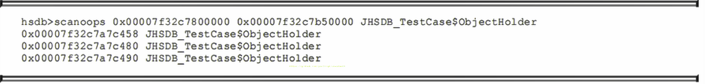
- 0x00007f32c7800000(Eden区的起始地址) ---- 0x00007f32c7b50000(Eden区的终止地址)
- 可以发现三个变量都在这个范围内
- 所以可以得到上面结论
5. 接着，找到了一个引用该staticObj对象的地方，是在一个java.lang.Class的实例里，并且给出了这个实例的地址，通过Inspector查看该对象实例，可以清楚看到这确实是一个java.lang.Class类型的对象实例，里面有一个名为staticobj的实例字段：
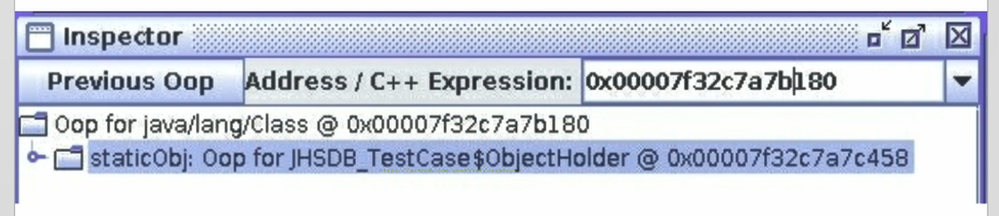
从《Java虚拟机规范》所定义的概念模型来看，所有Class相关的信息都应该存放在方法区之中，但方法区该如何实现，
《Java虚拟机规范》并未做出规定，这就成了一件允许不同虚拟机自己灵活把握的事情。**jdk6 static变量名存放在方法区，
JDK7及其以后版本的HotSpot虚拟
机选择把静态变量与类型在Java语言一端的映射Class对象存放在一起，存储于Java堆之中(Class对象如同堆中其他对象一样，存在于GC堆中)**，
从我们的实验中也明确验证了这一点.

### 如何设置方法区大小
#### JDK7及之前（方法区实现方式是永久代）
1. 通过-XX:Permsize来设置永久代初始分配空间。默认值是20.75M
2. -XX:MaxPermsize来设定永久代最大可分配空间。32位机器默认是64M，64位机器模式是82M
3. 当JVM加载的类信息容量超过了这个值，会报异常OutofMemoryError:PermGen space。
[jdk7设置方法区参数](./imgs/运行时数据区/jdk7设置方法区参数.png)

#### jdk8及之后（方法区的实现方式是元空间）
1. 元数据区大小可以使用参数 -XX:MetaspaceSize 和 -XX:MaxMetaspaceSize
 指定。
2. 默认值依赖于平台，Windows下，-XX:MetaspaceSize 约为21M，-XX:MaxMet
aspaceSize的值是-1，即没有限制（最大就是本机物理内存大小，因此很少OOM）。
3. 与永久代不同，如果不指定大小，默认情况下，虚拟机会耗尽所有的可用系统内存。
如果元数据区发生溢出，虚拟机一样会抛出异常OutOfMemoryError:Metaspace
4. -XX:MetaspaceSize：设置初始的元空间大小。对于一个 64位 的服务器端 J
VM 来说，其默认的 -XX:MetaspaceSize值为21MB。这就是初始的高水位线，**一旦
触及这个水位线，Full GC将会被触发并卸载没用的类**（即这些类对应的类加载器不再存活），然后这个高水位线将会重置。新的高水位线的值取决于GC后释放了多少元空间。如果释放的空间不足，那么在不超过MaxMetaspaceSize时，适当提高该值。如果释放空间过多，则适当降低该值。
5. 如果初始化的高水位线设置过低，上述高水位线调整情况会发生很多次。通过垃
圾回收器的日志可以观察到Full GC多次调用。为了避免频繁地GC，建议将-XX:
MetaspaceSize设置为一个相对较高的值,减少GC次数。
6. 

## 方法区OOM和解决方案
### 演示方法区OOM
代码：OOMTest 类继承 ClassLoader 类，获得 defineClass() 方法，可自己进行类的加载

```java_holder_method_tree
/**
 * jdk6/7中：
 * -XX:PermSize=10m -XX:MaxPermSize=10m
 * jdk8中：
 * -XX:MetaspaceSize=10m -XX:MaxMetaspaceSize=10m
 */
public class OOMTest extends ClassLoader {
    public static void main(String[] args) {
        int j = 0;
        try {
            OOMTest test = new OOMTest();
            for (int i = 0; i < 10000; i++) {
                //创建ClassWriter对象，用于生成类的二进制字节码
                ClassWriter classWriter = new ClassWriter(0);
                //指明版本号，修饰符，类名，包名，父类，接口
                classWriter.visit(Opcodes.V1_8, Opcodes.ACC_PUBLIC, "Class" + i, null, "java/lang/Object", null);
                //返回byte[]
                byte[] code = classWriter.toByteArray();
                //类的加载
                test.defineClass("Class" + i, code, 0, code.length);//Class对象
                j++;
            }
        } finally {
            System.out.println(j);
        }
    }
}

```
不设置元空间的上限,使用默认的 JVM 参数，元空间不设置上限(最大是本机物理内存)
输出结果：
```java_holder_method_tree
10000
```
设置元空间的上限,JVM 参数-XX:MetaspaceSize=10m -XX:MaxMetaspaceSize=10m

```java_holder_method_tree
8531
Exception in thread "main" java.lang.OutOfMemoryError: Metaspace
    at java.lang.ClassLoader.defineClass1(Native Method)
    at java.lang.ClassLoader.defineClass(ClassLoader.java:763)
    at java.lang.ClassLoader.defineClass(ClassLoader.java:642)
    at com.atguigu.java.OOMTest.main(OOMTest.java:29)

```

### 解决方法区OOM
1. 要解决OOM异常或heap space的异常，一般的手段是首先通过内存映像分析工具
（如Ec1ipse Memory Analyzer）对dump出来的堆转储快照进行分析，重点是确认
内存中的对象是否是必要的，也就是要先分清楚到底是出现了内存泄漏（Memory Lea
k）还是内存溢出（Memory Overflow）
2. **内存泄漏**就是有大量的引用指向某些对象，但是这些对象以后不会使用了，但是因
为它们还和GC ROOT有关联，所以导致以后这些对象也不会被回收，这就是内存泄漏的
问题.
3. 如果是内存泄漏，可进一步通过工具查看泄漏对象到GC Roots的引用链。于是就
能找到泄漏对象是通过怎样的路径与GC Roots相关联并导致垃圾收集器无法自动回收
它们的。掌握了泄漏对象的类型信息，以及GC Roots引用链的信息，就可以比较准确地
定位出泄漏代码的位置。
4. 如果不存在内存泄漏，换句话说就是内存中的对象确实都还必须存活着，那就应当
检查虚拟机的堆参数（-Xmx与-Xms），与机器物理内存对比看是否还可以调大，从代
码上检查是否存在某些对象生命周期过长、持有状态时间过长的情况，尝试减少程序运
行期的内存消耗。

## 方法区内部存储结构
### 方法区到底存储了什么东西？
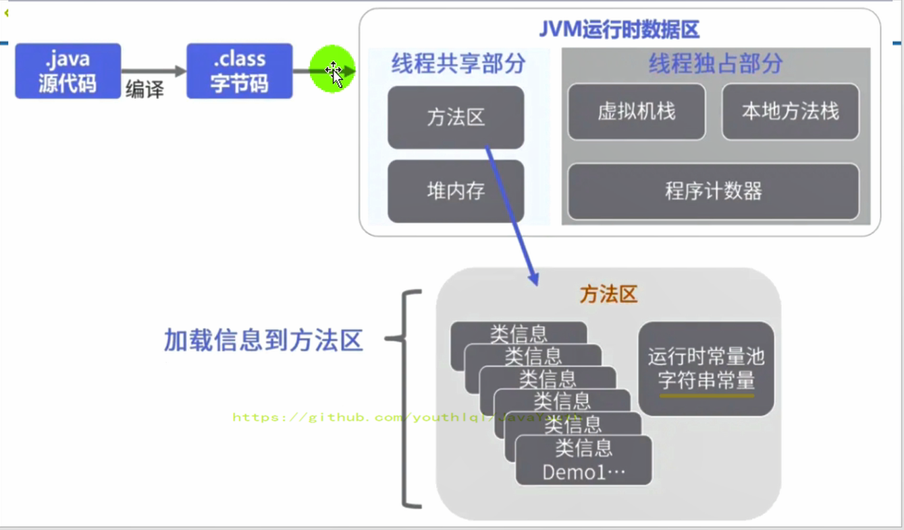
《深入理解Java虚拟机》书中对方法区（Method Area）存储内容描述如下：
它用于**存储已被虚拟机加载的类型信息、常量、静态变量、即时编译器编译后的代码缓存**等。
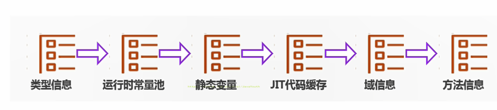

### 方法区内部结构代码举例
```java_holder_method_tree
**
 * 测试方法区的内部构成
 */
public class MethodInnerStrucTest extends Object implements Comparable<String>,Serializable {
    //属性
    public int num = 10;
    private static String str = "测试方法的内部结构";
    //构造器
    //方法
    public void test1(){
        int count = 20;
        System.out.println("count = " + count);
    }
    public static int test2(int cal){
        int result = 0;
        try {
            int value = 30;
            result = value / cal;
        } catch (Exception e) {
            e.printStackTrace();
        }
        return result;
    }

    @Override
    public int compareTo(String o) {
        return 0;
    }
}
javap -v -p MethodInnerStrucTest.class > test.txt
反编译字节码文件，并输出值文本文件中，便于查看。参数 -p 确保能查看 private
 权限类型的字段或方法.

```

### 方法区存储了类型信息（Class）
对每个加载的类型（类class、接口interface、枚举enum、注解annotation），
JVM必须在方法区中存储以下类型信息：
```java_holder_method_tree
//类型信息      
public class com.atguigu.java.MethodInnerStrucTest extends 
java.lang.Object implements java.lang.Comparable<java.lang.
String>, java.io.Serializable
```
- 这个类型的完整有效名称（全名=包名.类名）
- 这个类型直接父类的完整有效名（对于interface或是java.lang.Object，都没有父类）
- 这个类型的修饰符（public，abstract，final的某个子集）
- 这个类型直接接口的一个有序列表

### 方法区存储了成员变量（域Field）
```java_holder_method_tree
  //域信息
  public int num;
    descriptor: I  //descriptor: I 表示字段类型为 Integer
    flags: ACC_PUBLIC//表示字段权限修饰符为 public
  private static java.lang.String str;
    descriptor: Ljava/lang/String;
    flags: ACC_PRIVATE, ACC_STATIC

```
1. JVM必须在方法区中保存类型的所有域的相关信息以及域的声明顺序。上面的num和str
2. 域的相关信息包括：域名称，域类型，域修饰符（public，private，protected，static，final，volatile，transient的某个子集）

### 方法区存储了方法信息（Method）
JVM必须保存所有方法的以下信息，同域信息一样包括声明顺序：
1. 方法名称
2. 方法的返回类型（包括 void 返回类型），void 在 Java 中对应的为 void.class
3. 方法参数的数量和类型（按顺序）
4. 方法的修饰符（public，private，protected，static，final，synchronized，native，abstract的一个子集）
5. 方法的字节码（bytecodes）、操作数栈、局部变量表及大小（abstract和native方法除外）
6. 异常表（abstract和native方法除外），异常表记录每个异常处理的开始位置、结束位置、代码处理在程序计数器中的偏移地址、被捕获的异常类的常量池索引
```java_holder_method_tree
public void test1();
    descriptor: ()V //表示方法返回值类型为 void
    flags: ACC_PUBLIC //表示方法权限修饰符为 public
    Code://stack=3 表示操作数栈深度为 3,locals=2 表示局部变量个数为 2 个（实力方法包含 this）
      stack=3, locals=2, args_size=1//test1() 方法虽然没有参数，但是其 args_size=1 ，这时因为将 this 作为了参数
         0: bipush        20
         2: istore_1
         3: getstatic     #3                  // Field java/lang/System.out:Ljava/io/PrintStream;
         6: new           #4                  // class java/lang/StringBuilder
         9: dup
        10: invokespecial #5                  // Method java/lang/StringBuilder."<init>":()V
        13: ldc           #6                  // String count =
        15: invokevirtual #7                  // Method java/lang/StringBuilder.append:(Ljava/lang/String;)Ljava/lang/StringBuilder;
        18: iload_1
        19: invokevirtual #8                  // Method java/lang/StringBuilder.append:(I)Ljava/lang/StringBuilder;
        22: invokevirtual #9                  // Method java/lang/StringBuilder.toString:()Ljava/lang/String;
        25: invokevirtual #10                 // Method java/io/PrintStream.println:(Ljava/lang/String;)V
        28: return
      LineNumberTable:
        line 17: 0
        line 18: 3
        line 19: 28
      LocalVariableTable://局部变量表
        Start  Length  Slot  Name   Signature
            0      29     0  this   Lcom/atguigu/java/MethodInnerStrucTest;
            3      26     1 count   I

```

### 方法区存储了不用final修饰的类变量(static field)
静态变量和类关联在一起，随着类的加载而加载，他们成为类数据在逻辑上的一部分,
类变量被类的所有该类的实例对象共享，即使没有类实例new Object时，你也可以访问它ClassName.staticVariable

#### 方法区静态变量举例
下代码即使我们把order设置为null，也不会出现空指针异常,这更加表明了 static
 类型的字段和方法随着类的加载而加载，并不属于特定的类实例
```java_holder_method_tree
public class MethodAreaTest {
    public static void main(String[] args) {
        Order order = null;
        order.hello();//即使我们把order设置为null，也不会出现空指针异常
        System.out.println(order.count);
    }
}
class Order {
    public static int count = 1;
    public static final int number = 2;
    public static void hello() {
        System.out.println("hello!");
    }
}
输出结果
hello!
1
```

### 方法区存储了final修饰的静态变量（Final static field 全局常量）
全局常量就是使用 static final 进行修饰，被声明为final的类变量的处理方法则不同，
每个**全局常量数值在编译的时候就会被写死在字节码文件中**。
```java_holder_method_tree
class Order {
    public static int count = 1;
    public static final int number = 2;
    ...
}    

```
查看static修饰的变量字节码
```java_holder_method_tree

  public static int count; //非final修饰的static field 类变量
    descriptor: I //descriptor: I 表示字段类型为 Integer
    flags: ACC_PUBLIC, ACC_STATIC //表示字段权限修饰符为 public，static

  public static final int number;//final修饰的static field，全局常量
    descriptor: I //descriptor: I 表示字段类型为 Integer
    flags: ACC_PUBLIC, ACC_STATIC, ACC_FINAL//权限修饰符多加了一个final
    ConstantValue: int 2 // 编译时候就已经写死了final static修饰的变量

```

### 方法区存储了运行时常量池（Runtime constant pool）
**JVM为每个已加载的类型（类或接口）都维护一个常量池**
[运行时常量池官方文档](https://docs.oracle.com/javase/specs/jvms/se8/html/jvms-4.html "A")
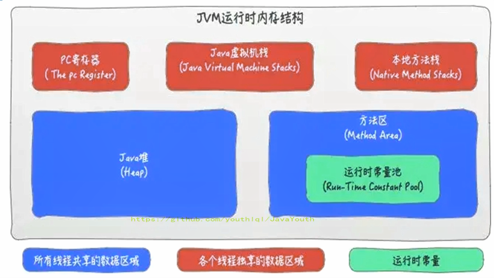
运行时常量池包含在方法区之内，每个类的字节码文件.class内部都包含了常量池（Constant pool），
分清字节码文件的常量池和运行时常量池的关系

#### 字节码文件中的常量池
**主要包含符号引用和字面量。**一个有效的字节码文件中除了包含类的版本信息、字段、方法以及接口等描述符信息外
。还包含一项信息就是常量池表（Constant Pool Table），包括各种字面量和对
类型、域和方法的符号引用。字面量： 10 ， “我是某某”这种数字和字符串都是字面量


##### 一个class文件为什么需要常量池？
一个java源文件中的类、接口，编译后产生一个字节码文件。而Java中的字节码需
要数据支持，通常这种数据会很大以至于不能直接存到字节码里，换另一种方式，可以
存到常量池。这个字节码包含了指向常量池的引用。在动态链接的时候会用到运行时常
量池，之前有介绍。（**如果javaclasss字节码都直接操作变量的直接引用导致字节码文件非常大**）

比如下列代码
```java_holder_method_tree
public class SimpleClass {
    public void sayHello() {
        System.out.println("hello");
    }
}
```
虽然上述代码只有194字节，但是里面却使用了String、System、PrintStream及
Object等结构。这个文件中有6个地方用到了"hello"这个字符串，如果不用常量池，
就需要在6个地方全写一遍，造成臃肿。我们可以将"hello"等所需用到的结构信息记
录在常量池中，并通过符号引用 #数字 的方式，来加载、调用所需的结构。

那么class文件的常量池中都有那些东西呢？

##### 那么class文件的常量池都存储了什么东西？
1. 数量值
2. 字符串值
3. 类引用
4. 字段引用
5. 方法引用
```java_holder_method_tree
 0 bipush 20
 2 istore_1
 3 getstatic #3 <java/lang/System.out>
 6 new #4 <java/lang/StringBuilder>
 9 dup
10 invokespecial #5 <java/lang/StringBuilder.<init>>
13 ldc #6 <count = >
15 invokevirtual #7 <java/lang/StringBuilder.append>
18 iload_1
19 invokevirtual #8 <java/lang/StringBuilder.append>
22 invokevirtual #9 <java/lang/StringBuilder.toString>
25 invokevirtual #10 <java/io/PrintStream.println>
28 return

```
常量池、可以看做是一张表，虚拟机指令根据这张常量表找到要执行的类名、方法名、参数类型、字面
量等类型,#3，#5等等这些带# 的，都是符号引用“间接”引用，减少了class文件的存储空间。

#### 方法区中的运行时常量池
1. 运行时常量池（Runtime Constant Pool）是方法区的一部分，但是量池表（Cons
tant Pool Table）是Class字节码文件的一部分，用于**存放编译期生成的各种字面
量与符号引用**，这部分内容将在类加载后创建并存放到方法区的运行时常量池中。（运行时
常量池就是常量池在程序运行时的称呼）。
2. **JVM为每个已加载的类型（类或接口）都维护一个常量池，也就是说方法区中每个类都有一个运行时常量池**。
池中的数据项像数组项一样，是通过索引访问的。
3. 运行时常量池中包含多种不同的常量，包括编译期就已经明确的数值字面量static final int age=1，
也包括到运行期解析后才能够获得的方法或者字段符号引用 #数字。**此时不再是常量池中的符号地址了
，这里换为真实地址（方法的直接引用）**。运行时常量池，相对于Class文件常量池的另一重要特征是：具备动态性。
4. 当创建类或接口的运行时常量池时，如果构造运行时常量池所需的内存空间超过
了方法区所能提供的最大值，则JVM会抛OutofMemoryError异常。

方法区例子
```java_holder_method_tree
public class MethodAreaDemo {
    public static void main(String[] args) {
        int x = 500;
        int y = 100;
        int a = x / y;
        int b = 50;
        System.out.println(a + b);
    }
}

```

字节码
```java_holder_method_tree
public class com.atguigu.java1.MethodAreaDemo
  minor version: 0
  major version: 51
  flags: ACC_PUBLIC, ACC_SUPER
Constant pool:
   #1 = Methodref          #5.#24         // java/lang/Object."<init>":()V
   #2 = Fieldref           #25.#26        // java/lang/System.out:Ljava/io/PrintStream;
   #3 = Methodref          #27.#28        // java/io/PrintStream.println:(I)V
   #4 = Class              #29            // com/atguigu/java1/MethodAreaDemo
   #5 = Class              #30            // java/lang/Object
   #6 = Utf8               <init>
   #7 = Utf8               ()V
   #8 = Utf8               Code
   #9 = Utf8               LineNumberTable
  #10 = Utf8               LocalVariableTable
  #11 = Utf8               this
  #12 = Utf8               Lcom/atguigu/java1/MethodAreaDemo;
  #13 = Utf8               main
  #14 = Utf8               ([Ljava/lang/String;)V
  #15 = Utf8               args
  #16 = Utf8               [Ljava/lang/String;
  #17 = Utf8               x
  #18 = Utf8               I
  #19 = Utf8               y
  #20 = Utf8               a
  #21 = Utf8               b
  #22 = Utf8               SourceFile
  #23 = Utf8               MethodAreaDemo.java
  #24 = NameAndType        #6:#7          // "<init>":()V
  #25 = Class              #31            // java/lang/System
  #26 = NameAndType        #32:#33        // out:Ljava/io/PrintStream;
  #27 = Class              #34            // java/io/PrintStream
  #28 = NameAndType        #35:#36        // println:(I)V
  #29 = Utf8               com/atguigu/java1/MethodAreaDemo
  #30 = Utf8               java/lang/Object
  #31 = Utf8               java/lang/System
  #32 = Utf8               out
  #33 = Utf8               Ljava/io/PrintStream;
  #34 = Utf8               java/io/PrintStream
  #35 = Utf8               println
  #36 = Utf8               (I)V
{
  public com.atguigu.java1.MethodAreaDemo();
    descriptor: ()V
    flags: ACC_PUBLIC
    Code:
      stack=1, locals=1, args_size=1
         0: aload_0
         1: invokespecial #1                  // Method java/lang/Object."<init>":()V
         4: return
      LineNumberTable:
        line 7: 0
      LocalVariableTable:
        Start  Length  Slot  Name   Signature
            0       5     0  this   Lcom/atguigu/java1/MethodAreaDemo;

  public static void main(java.lang.String[]);
    descriptor: ([Ljava/lang/String;)V
    flags: ACC_PUBLIC, ACC_STATIC
    Code:
      stack=3, locals=5, args_size=1
         0: sipush        500
         3: istore_1
         4: bipush        100
         6: istore_2
         7: iload_1
         8: iload_2
         9: idiv
        10: istore_3
        11: bipush        50
        13: istore        4
        15: getstatic     #2                  // Field java/lang/System.out:Ljava/io/PrintStream;
        18: iload_3
        19: iload         4
        21: iadd
        22: invokevirtual #3                  // Method java/io/PrintStream.println:(I)V
        25: return
      LineNumberTable:
        line 9: 0
        line 10: 4
        line 11: 7
        line 12: 11
        line 13: 15
        line 14: 25
      LocalVariableTable:
        Start  Length  Slot  Name   Signature
            0      26     0  args   [Ljava/lang/String;
            4      22     1     x   I
            7      19     2     y   I
           11      15     3     a   I
           15      11     4     b   I
}
SourceFile: "MethodAreaDemo.java"

```

#### 图解字节码指令执行过程
1、初始状态


2、首先将操作数500压入操作数栈中


3、然后操作数 500 从操作数栈中取出，存储到局部变量表中索引为 1 的位置


4、


5、


6、


7、


8、


9、


10、


11、


12、


13、


14、


15、


16、


符号引用 --> 直接饮用

上面代码调用 System.out.println() 方法时，首先需要看看 System 类有没有
加载，再看看 PrintStream 类有没有加载如果没有加载，则执行加载，执行时，将
常量池中的符号引用（字面量）转换为运行时常量池的直接引用（真正的地址值）

## 方法区的垃圾回收GC
1. **方法区可以有垃圾回收**：有些人认为方法区（如Hotspot虚拟机中的元空间或者永久代）是没有垃圾收集行为的，其实不然。《Java虚拟机规范》对方法区的约束是
非常宽松的，提到过可以不要求虚拟机在方法区中实现垃圾收集。事实上也确实有未实现或未能完整实现方法区类型卸载的收集器存在
（如JDK11时期的ZGC收集器就不支持类卸载）。
2. **（几乎不在此垃圾回收，要求过于苛刻）** 一般来说这个区域的回收效果比较难令人满意，尤其是类型的卸载，条件相当苛刻。但是
这部分区域的回收有时又确实是必要的。以前sun公司的Bug列表中，曾出现过的若干个严重的Bug就是由于低版本的HotSpot虚拟机对此区
域未完全回收而导致内存泄漏。
3. 方法区的垃圾收集主要回收两部分内容：**运行时常量池中废弃的常量(字面量和符号引用)和不再使用的class类型**。

先来说说方法区内运行时**常量池之中主要存放的两大类常量：字面量和符号引用**。字面量比较接近Java语言层次的常量概念，如文本字符串、
被声明为final的常量值等。而符号引用则属于编译原理方面的概念，包括下面三类常量。
- 类和接口的全限定名
- 字段的名称和描述符
- 方法的名称和描述符

### 常量池废弃常量回收

hotSpot虚拟机对常量池的回收策略是很明确的，只要常量池中的常量没有被任何地方引用，就可以被回收。回收废弃常量与回收Java堆中的对象非常类似。

### 通过GC卸载不再使用的类
判定一个常量是否“废弃”还是相对简单，而要判定一个类型是否属于“不再被使用的类”的条件就比较苛刻了。需要同时满足下面三个条件：

- 该**类所有的实例都已经被回收**，也就是Java堆中不存在该类及其任何派生子类的实例。
- 加载**该类的类加载器已经被回收**，这个条件除非是经过精心设计的可替换类加载器的场景，如OSGi、JSP的重加载等，否则通常是很难达成的。
- 该类对应的java.lang.**Class对象没有在任何地方被引用**，无法在任何地方通过反射访问该类的方法。

Java虚拟机被允许对满足上述三个条件的无用类进行回收，这里说的**仅仅是“被允许”**，而并不是和对象一样，没有引用了就必然会回收。关
于是否要对类型进行回收，HotSpot虚拟机提供了-Xnoclassgc参数进行控制，还可以使用-verbose:class 以及 -XX：+TraceClass-L
oading、-XX：+TraceClassUnLoading查看类加载和卸载信息。在大量使用反射、动态代理、CGLib等字节码框架，动态生成JSP以及OSGi
这类频繁自定义类加载器的场景中，通常都需要Java虚拟机具备类型卸载的能力，以保证不会对方法区造成过大的内存压力

## 运行时常量池总截图
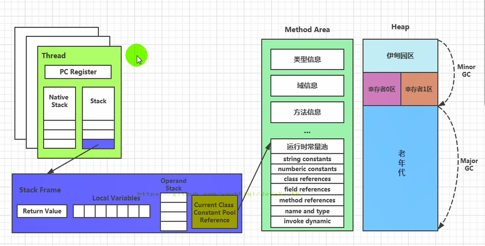

# 方法区引入直接内存
**直接内存就是物理机本地内存，由虚拟机向OS申请的内存空间**。

JVM规定的运行时数据区包含，私有的程序计数器、虚拟机栈、本地方法栈、线程共享
的堆和方法区，因此直接内存并不是虚拟机规范中的内存区域。
JDK4中引入了NIO，通过堆内存存放的DirectByteBuffer类操作直接内存，其实
底层还是调用unsafe类在分配直接内存，一般来说直接内存的读写速度优于java堆，因此
对于频繁读写的场景可以考虑直接内存，通过NIO库允许java程序使用直接内存，用于数据缓冲。

例子：利用堆中DirectByteBuffer对象分配直接内存
```java
/**
 *  IO                  NIO (New IO / Non-Blocking IO)
 *  byte[] / char[]     Buffer
 *  Stream              Channel
 *
 * 查看直接内存的占用与释放
 */
public class BufferTest {
    private static final int BUFFER = 1024 * 1024 * 1024;//1GB

    public static void main(String[] args){
        //直接分配本地内存空间
        ByteBuffer byteBuffer = ByteBuffer.allocateDirect(BUFFER);
        System.out.println("直接内存分配完毕，请求指示！");

        Scanner scanner = new Scanner(System.in);
        scanner.next();

        System.out.println("直接内存开始释放！");
        byteBuffer = null;//堆中DirectByteBuffer被GC回收，关联的直接内存被OS回收
        System.gc();
        scanner.next();
    }
}

```
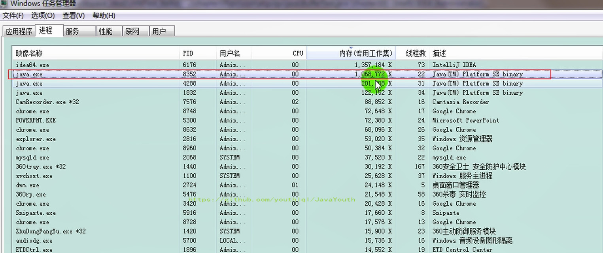

## BIO 与 NIO 简介
### 非直接缓存区（BIO）
原来采用BIO的架构，在读写本地文件时，我们需要从用户态切换成内核态


### 直接缓冲区（NIO）
NIO 直接操作物理磁盘，省去了中间过程
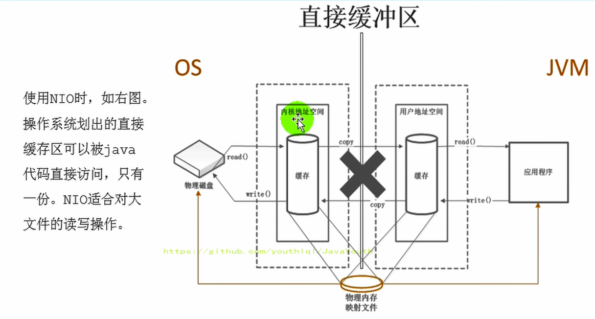

## 直接内存OOM
1. 直接内存使用本地内存，本地内存也有上线，也可能导致OutofMemoryError异常
2. 由于直接内存在Java堆外，因此它的大小不会直接受限于-Xmx指定的最大堆大小，但是
系统内存是有限的，Java堆和直接内存的总和依然受限于操作系统能给出的最大内存。
3. 直接内存的缺点为：分配回收成本较高，不受JVM内存GC回收管理,由OS管理。
4. 直接内存大小可以通过MaxDirectMemorySize设置，默认和堆的最大值-Xmx参数值一致
```java
/**
 * 本地内存的OOM:  OutOfMemoryError: Direct buffer memory
 *
 */
public class BufferTest2 {
    private static final int BUFFER = 1024 * 1024 * 20;//20MB
    public static void main(String[] args) {
        ArrayList<ByteBuffer> list = new ArrayList<>();
        int count = 0;
        try {
            while(true){
                ByteBuffer byteBuffer = ByteBuffer.allocateDirect(BUFFER);
                list.add(byteBuffer);
                count++;
                try {
                    Thread.sleep(100);
                } catch (InterruptedException e) {
                    e.printStackTrace();
                }
            }
        } finally {
            System.out.println(count);
        }
    }
}
Exception in thread "main" java.lang.OutOfMemoryError: Direct buffer memory
    at java.nio.Bits.reserveMemory(Bits.java:694)
    at java.nio.DirectByteBuffer.<init>(DirectByteBuffer.java:123)
    at java.nio.ByteBuffer.allocateDirect(ByteBuffer.java:311)
    at com.atguigu.java.BufferTest2.main(BufferTest2.java:21)
```
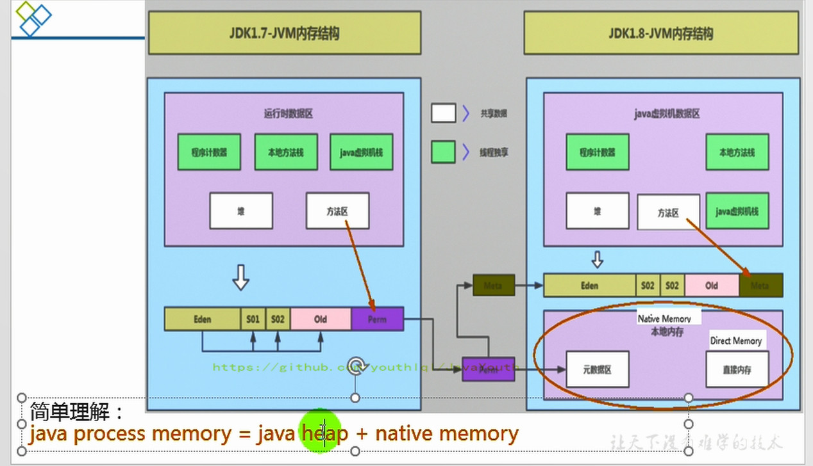

# 常见面试题
1. 百度
- 三面：说一下JVM内存模型吧，有哪些区？分别干什么的？
2. 蚂蚁金服：
- Java8的内存分代改进
- JVM内存分哪几个区，每个区的作用是什么？
- 一面：JVM内存分布/内存结构？栈和堆的区别？堆的结构？为什么两个survivor区？
- 二面：Eden和survior的比例分配
3. 小米：
- jvm内存分区，为什么要有新生代和老年代
4. 字节跳动：
- 二面：Java的内存分区
- 二面：讲讲vm运行时数据库区
- 什么时候对象会进入老年代？
5. 京东：
- JVM的内存结构，Eden和Survivor比例。
- JVM内存为什么要分成新生代，老年代，持久代。新生代中为什么要分为Eden和survivor。
6. 天猫：
- 一面：Jvm内存模型以及分区，需要详细到每个区放什么。
- 一面：JVM的内存模型，Java8做了什么改
7. 拼多多：
- JVM内存分哪几个区，每个区的作用是什么？
8. 美团：
- java内存分配
- jvm的永久代中会发生垃圾回收吗？
- 一面：jvm内存分区，为什么要有新生代和老年代？


