# 垃圾回收相关背景
## 什么是垃圾
1. 垃圾是指在**运行程序中没有任何指针指向的对象**，这个对象就是需要被回收的垃圾。
2. 外文：An object is considered garbage when it can no longer be reached
 from any pointer in the running program.
3. 如果不及时对内存中的垃圾进行清理，那么，这些垃圾对象所占的内存空间会一直保留到应用程序
结束，被保留的空间无法被其他对象使用。甚至可能导致内存溢出。
## 为什么需要GC
1. 对于高级语言来说，一个基本认知是如果不进行垃圾回收，**内存迟早都会被消耗完**，因为不
断地分配内存空间而不进行回收，就好像不停地生产生活垃圾而从来不打扫一样。
2. 除了释放没用的对象，垃圾回收也可以清除内存里的记录碎片。碎片整理将所占用的堆内存
移到堆的一端，以便JVM将整理出的内存分配给新的对象。
3. 随着应用程序所应付的业务越来越庞大、复杂，用户越来越多，没有GC就不能保证应用程序的正
常进行。而经常造成STW的GC又跟不上实际的需求，所以才会不断地尝试对GC进行优化。
## 早期垃圾回收
1. 在早期的C/C++时代，垃圾回收基本上是手工进行的。开发人员可以使用new关键字进行
内存申请，并使用delete关键字进行内存释放。比如以下代码：
```java_holder_method_tree
MibBridge *pBridge= new cmBaseGroupBridge（）；
//如果注册失败，使用Delete释放该对象所占内存区域
if（pBridge->Register（kDestroy）！=NO ERROR）
    delete pBridge；
```
2. 这种方式可以灵活控制内存释放的时间，但是会给开发人员带来频繁申请和释放内存的管理
负担。倘若有一处内存区间由于程序员编码的问题忘记被回收，那么就会**产生内存泄漏**，垃圾对
象永远无法被清除，随着系统运行时间的不断增长，垃圾对象所耗内存可能持续上升，直到
出现内存溢出并造成应用程序崩溃。

3. 有了垃圾回收机制后，上述代码极有可能变成这样
```java_holder_method_tree
MibBridge *pBridge=new cmBaseGroupBridge(); 
pBridge->Register(kDestroy);
Copy to clipboardErrorCopied
```
4. 现在，除了Java以外，C#、Python、Ruby等语言都使用了自动垃圾回收的思想，也是未
来发展趋势，可以说这种自动化的内存分配和来及回收方式已经成为了现代开发语言必备的标准。
## Java的垃圾回收机制
### 自动内存管理
官网介绍：https://docs.oracle.com/javase/8/docs/technotes/guides/vm/gctuning/toc.html

**自动内存管理的优点**

- 自动内存管理，无需开发人员手动参与内存的分配与回收，这样降低内存泄漏和内存溢出的风险
- 没有垃圾回收器，java也会和cpp一样，各种悬垂指针，野指针，泄露问题让你头疼不已。
- 自动内存管理机制，将程序员从繁重的内存管理中释放出来，可以更专心地专注于业务开发

**关于自动内存管理的担忧**

对于Java开发人员而言，自动内存管理就像是一个黑匣子，如果过度依赖于“自动”，那么这将会是一
场灾难，最严重的就会弱化Java开发人员在程序出现内存溢出时定位问题和解决问题的能力。
此时，了解JVM的自动内存分配和内存回收原理就显得非常重要，只有在真正了解JVM是如何管理内
存后，我们才能够在遇见OutofMemoryError时，快速地根据错误异常日志定位问题和解决问题。
当需要排查各种内存溢出、内存泄漏问题时，当垃圾收集成为系统达到更高并发量的瓶颈时，我
们就必须对这些“自动化”的技术实施必要的监控和调节。
### java内存哪些区域发生垃圾回收(重点)
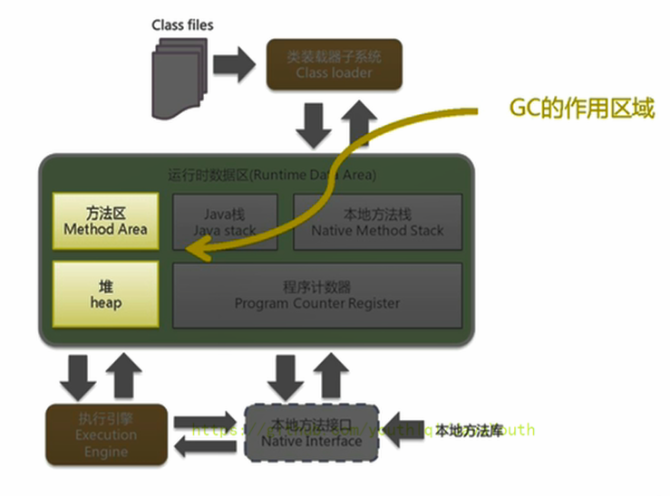
垃圾收集器可以对年轻代回收，也可以对老年代回收，甚至是全栈和方法区的回收，
其中，**Java堆是垃圾收集器的工作重点**
从次数上讲：频繁收集Young区、较少收集Old区、基本不收集Perm区（元空间）
# 垃圾回收算法即GC算法
## 标记阶段：引用计数算法（java并没采用）
### 标记阶段的目的
**垃圾标记阶段：主要是为了判断对象是否应该存活**
1. 在堆里存放着几乎所有的Java对象实例，在GC执行垃圾回收之前，**首先需要区分出内存中哪些
是存活对象，哪些是已经死亡的对象**。只有被标记为己经死亡的对象，GC才会在执行垃圾回收时，
释放掉其所占用的内存空间，因此这个过程我们可以称为垃圾标记阶段。
2. 那么在JVM中究竟是如何标记一个死亡对象呢？简单来说，当一个对象已经不再被任何的存
活对象继续引用时，就可以宣判为已经死亡。
3. 判断对象存活一般有两种方式：**引用计数算法和可达性分析算法（java真实采用的算法）**。
### 引用计数算法（jvm并没采用）
1. 引用计数算法（Reference Counting）比较简单，对**每个对象保存一个整型的引用计数器
属性**。用于记录对象被引用的情况。
2. 对于一个对象A，只要有任何一个对象引用了A，则A的引用计数器就加1；当引用失效时，引
用计数器就减1。只要对象A的引用计数器的值为0，即表示对象A不可能再被使用，可进行回收。
3. 优点：实现简单，垃圾对象便于辨识；判定效率高，回收没有延迟性。
4. 缺点：
- 它需要单独的字段存储计数器，这样的做法**增加了存储空间的开销**。
- 每次赋值都需要更新计数器，伴随着加法和减法操作，这**增加了时间开销**。
- 引用计数器有一个严重的问题，即**无法处理循环引用的情况**。这是一条致命缺陷，
导致在Java的垃圾回收器中没有使用这类算法。

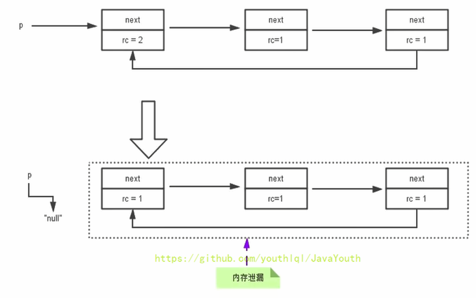

当p的指针断开的时候，内部的引用形成一个循环，计数器都还算1，无法被回收，这就是循环引用，
从而造成内存泄漏，但是**实际上jvm并不会发生循环引用导致的内存泄漏**，因为jvm采用的不是引用计数器法。

#### 证明：java使用的不是引用计数算法
```java_holder_method_tree
/**
 * -XX:+PrintGCDetails
 * 证明：java使用的不是引用计数算法
 */
public class RefCountGC {
    //这个成员属性唯一的作用就是占用一点内存
    private byte[] bigSize = new byte[5 * 1024 * 1024];//5MB

    Object reference = null;

    public static void main(String[] args) {
        RefCountGC obj1 = new RefCountGC();
        RefCountGC obj2 = new RefCountGC();
        obj1.reference = obj2;//obj1,obj2相互循环引用
        obj2.reference = obj1;//obj1,obj2相互循环引用
        obj1 = null;
        obj2 = null;
        //显式的执行垃圾回收行为
        //这里发生GC，obj1和obj2能否被回收？
        System.gc();
    }
}

```
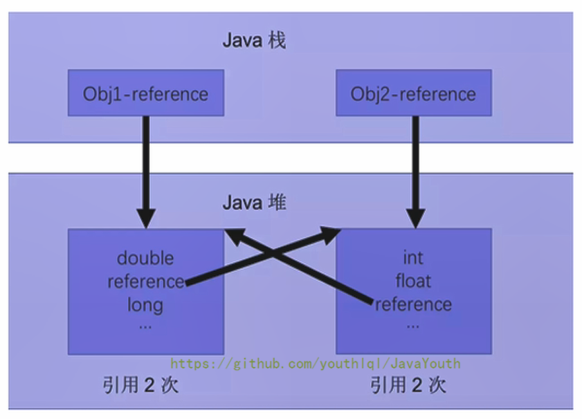
如果不小心直接把obj1.reference和obj2.reference置为null。则在Java堆中的两块内
存依然保持着互相引用，无法被回收。

**没有进行GC时**
把下面的几行代码注释掉，让它来不及
```java_holder_method_tree
        System.gc();//把这行代码注释掉
Heap
 PSYoungGen      total 38400K, used 14234K [0x00000000d5f80000, 0x00000000d8a00000, 0x0000000100000000)
  eden space 33280K, 42% used [0x00000000d5f80000,0x00000000d6d66be8,0x00000000d8000000)
  from space 5120K, 0% used [0x00000000d8500000,0x00000000d8500000,0x00000000d8a00000)
  to   space 5120K, 0% used [0x00000000d8000000,0x00000000d8000000,0x00000000d8500000)
 ParOldGen       total 87552K, used 0K [0x0000000081e00000, 0x0000000087380000, 0x00000000d5f80000)
  object space 87552K, 0% used [0x0000000081e00000,0x0000000081e00000,0x0000000087380000)
 Metaspace       used 3496K, capacity 4498K, committed 4864K, reserved 1056768K
  class space    used 387K, capacity 390K, committed 512K, reserved 1048576K

Process finished with exit code 0

```
**进行GC**
打开那行代码的注释
```java_holder_method_tree
[GC (System.gc()) [PSYoungGen: 13569K->808K(38400K)] 13569K->816K(125952K), 0.0012717 secs] [Times: user=0.00 sys=0.00, real=0.00 secs] 
[Full GC (System.gc()) [PSYoungGen: 808K->0K(38400K)] [ParOldGen: 8K->670K(87552K)] 816K->670K(125952K), [Metaspace: 3491K->3491K(1056768K)], 0.0051769 secs] [Times: user=0.00 sys=0.00, real=0.00 secs] 
Heap
 PSYoungGen      total 38400K, used 333K [0x00000000d5f80000, 0x00000000d8a00000, 0x0000000100000000)
  eden space 33280K, 1% used [0x00000000d5f80000,0x00000000d5fd34a8,0x00000000d8000000)
  from space 5120K, 0% used [0x00000000d8000000,0x00000000d8000000,0x00000000d8500000)
  to   space 5120K, 0% used [0x00000000d8500000,0x00000000d8500000,0x00000000d8a00000)
 ParOldGen       total 87552K, used 670K [0x0000000081e00000, 0x0000000087380000, 0x00000000d5f80000)
  object space 87552K, 0% used [0x0000000081e00000,0x0000000081ea7990,0x0000000087380000)
 Metaspace       used 3498K, capacity 4498K, committed 4864K, reserved 1056768K
  class space    used 387K, capacity 390K, committed 512K, reserved 1048576K

Process finished with exit code 0

```
1. 从打印日志就可以明显看出来，已经进行了GC
2. 如果使用引用计数算法，那么这两个对象将会无法回收。而现在两个对象被回收了，说明Java使用的不是引用计数算法来进行标记的。
### 引用计数小结
1. 引用计数算法，是很多语言的资源回收选择，例如因人工智能而更加火热的Python，它更是同时支持引用计数和垃圾收集机制。
具体哪种最优是要看场景的，业界有大规模实践中仅保留引用计数机制，以提高吞吐量的尝试。
2. **Java并没有选择引用计数，是因为其存在一个基本的难题，循环引用导致内存泄漏**。
3. Python如何解决循环引用？
- 手动解除：很好理解，就是在合适的时机，手动解除循环引用关系。
- 使用弱引用weakref(不增加引用计数器数值)，weakref是Python提供的标准库，旨在解决循环引用。
```
弱引用消除了引用循环的这个问题，本质来讲，弱引用就是一个对象指针，它不会增加它的引用计数
。 你可以通过 weakref 来创建弱引用。例如：
>>> import weakref
>>> a = Node()
>>> a_ref = weakref.ref(a)
>>> a_ref
<weakref at 0x100581f70; to 'Node' at 0x1005c5410>
>>>
为了访问弱引用所引用的对象，你可以像函数一样去调用它即可。如果那个对象还存在就会返回
它，否则就返回一个None。 由于原始对象的引用计数没有增加，那么就可以去删除它了。例如;
>>> print(a_ref())
<__main__.Node object at 0x1005c5410>
>>> del a
Data.__del__
>>> print(a_ref())
None
>>>
通过这里演示的弱引用技术，你会发现不再有循环引用问题了，一旦某个节点不被使用了，垃圾回
收器立即回收它。
```
## 标记阶段：可达性分析算法(jvm采用的方法Gc roots)
**可达性分析算法：也可以称为根搜索算法、追踪性垃圾收集**
1. 相对于引用计数算法而言，可达性分析算法不仅同样具备实现简单和执行高效等特点，更重要的是
该算法可以**有效地解决在引用计数算法中循环引用的问题，防止内存泄漏**的发生。
2. 相较于引用计数算法，这里的可达性分析就是Java、C#选择的。这种类型的垃圾收集通常也叫作
追踪性垃圾收集（Tracing Garbage Collection）
### 可达性分析实现思路GC roots
所谓"GCRoots”根集合就是**一组必须活跃的引用**，其基本思路如下：
1. 可达性分析算法是以根对象集合（GC Roots）为起始点，按照从上至下的方式搜索被根对象集合所
连接的目标对象是否可达。
2. 使用可达性分析算法后，内存中的存活对象都会被根对象集合直接或间接连接着，搜索所走过的路
径称为引用链（Reference Chain）
3. 如果目标对象没有任何引用链相连，则是不可达的，就意味着该对象己经死亡，可以标记为垃圾对象。
4. 在可达性分析算法中，只有能够被根对象集合直接或者间接连接的对象才是存活对象。
   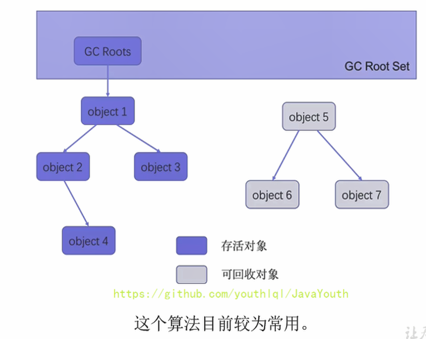
### GC Roots可以是哪些元素（面试重点）？
1. **虚拟机栈中引用的对象**。比如：各个线程被调用的方法中使用到的参数、局部变量等。
2. **本地方法栈**内JNI（通常说的本地方法）引用的对象
3. **方法区中类静态属性引用的对象**。比如：Java类的引用类型静态变量
4. **方法区中常量引用的对象**。比如：字符串常量池（StringTable）里的引用
5. 所有被同步锁synchronized持有的对象
6. Java虚拟机内部的引用。基本数据类型对应的Class对象，一些常驻的异常对象
（如：NullPointerException、OutofMemoryError），系统类加载器。
7. 反映java虚拟机内部情况的JMXBean、JVMTI中注册的回调、本地代码缓存等。
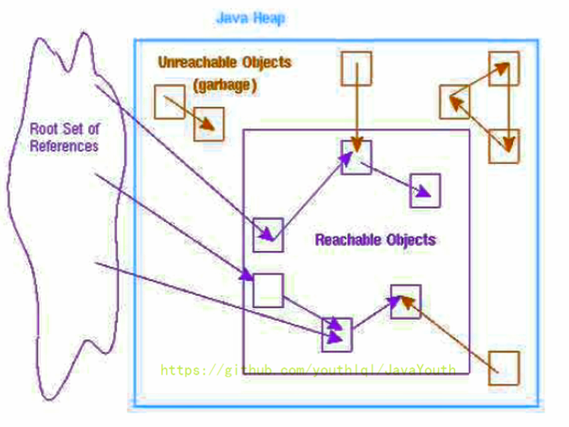

- **总结一句话就是，除了堆空间的周边区域都可以作为gc roots**，比如：虚拟机栈、本地方法栈、方法区、字符串常量池等地
方对堆空间进行引用的，都可以作为GC Roots进行可达性分析
- 除了这些固定的GC Roots集合以外，根据用户所选用的垃圾收集器以及当前回收的内存区域不同，还
可以有其他对象“临时性”地加入，共同构成完整GC Roots集合。比如：分代收集和局部回收（Parti
alGC）。如果只针对Java堆中的某一块区域进行垃圾回收（比如：典型的只针对新生代），必须考虑
到内存区域是虚拟机自己的实现细节，更不是孤立封闭的，这个区域的对象完全有可能被其他区域的对
象所引用，这时候就需要一并将关联的区域对象也加入GC Roots集合中去考虑，才能保证可达性分析
的准确性。

**小技巧**
由于Root采用栈方式存放变量和指针，所以如果一个指针，它保存了堆内存里面的对象，但是自己
又不存放在堆内存里面，那它就是一个Root。
### 注意
1. 如果要使用可达性分析算法来判断内存是否可回收，那么分析工作必须在一个能保障一致性的快
照中进行。这点不满足的话分析结果的准确性就无法保证。
2. 这点也是导致GC进行时必须“Stop The World”的一个重要原因。即使是号称（几乎）不会发
生停顿的CMS收集器中，**枚举根节点时也是必须要停顿STW的**
### mat与jprofile查看GC roots溯源
#### MAT
- MAT是Memory Analyzer的简称，它是一款功能强大的Java堆内存分析器。用于查找内存泄漏以及查看内存消耗情况。
- MAT是基于Eclipse开发的，是一款免费的性能分析工具。
- 大家可以在http://www.eclipse.org/mat/下载并使用MAT

1、虽然Jvisualvm很强大，但是在内存分析方面，还是MAT更好用一些.
2、此小节主要是为了实时分析GC Roots是哪些东西，中间需要用到一个dump的文件

#### 获取dump文件方式
- 方式一：命令行使用 jmap
- 方式二：使用JVisualVM。捕获的heap dump文件是一个临时文件，关闭JVisualVM后自动删除，若要保留，需要将其另存为文件。可通过以下方法捕获heap dump：
##### 捕获dump实例
基于JvisualVM捕获heap dump
1. numList 和 birth 在第一次捕捉内存快照的时候，为 GC Roots
2. 之后 numList 和 birth 置为 null ，对应的引用对象被回收，在第二次捕捉内存快照的时候，就不再是 GC Roots
```java
public class GCRootsTest {
    public static void main(String[] args) {
        List<Object> numList = new ArrayList<>();
        Date birth = new Date();

        for (int i = 0; i < 100; i++) {
            numList.add(String.valueOf(i));
            try {
                Thread.sleep(10);
            } catch (InterruptedException e) {
                e.printStackTrace();
            }
        }
        System.out.println("数据添加完毕，请操作：");
        new Scanner(System.in).next();
        numList = null;
        birth = null;
        System.out.println("numList、birth已置空，请操作：");
        new Scanner(System.in).next();
        System.out.println("结束");
    }
}

```
1、先执行第一步，然后停下来，去生成此步骤dump文件

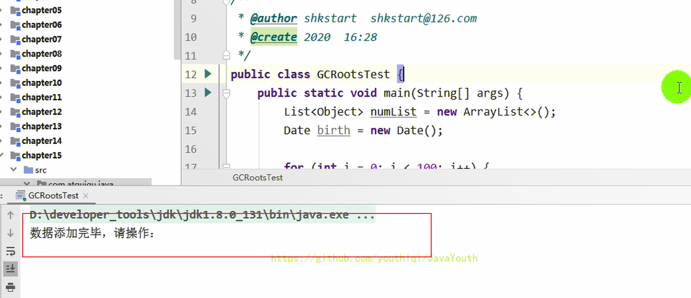

2、 点击【堆 Dump】
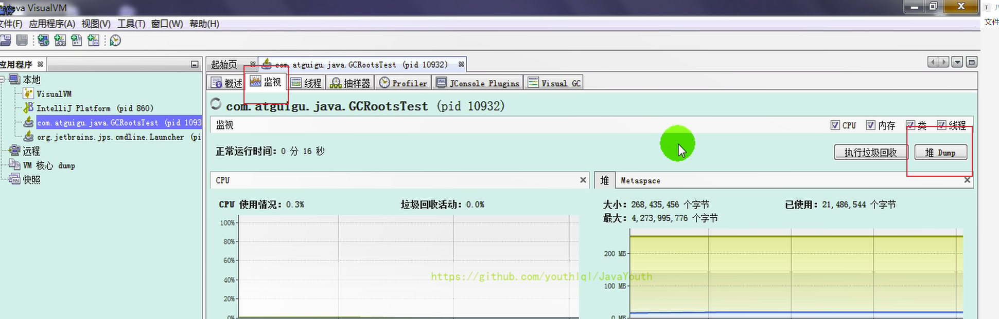
3、右键 --> 另存为即可
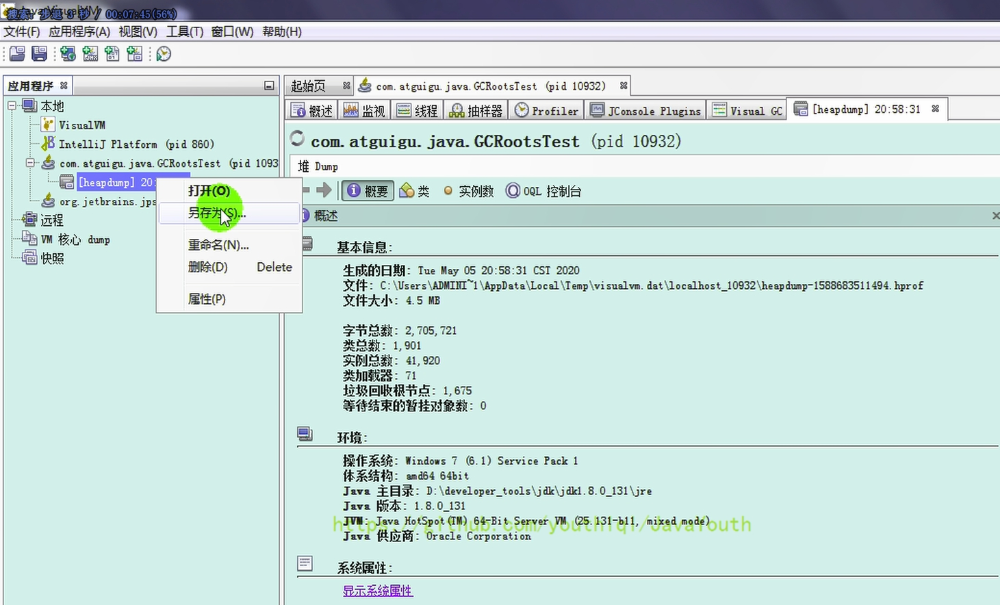
4、输入命令，继续执行程序
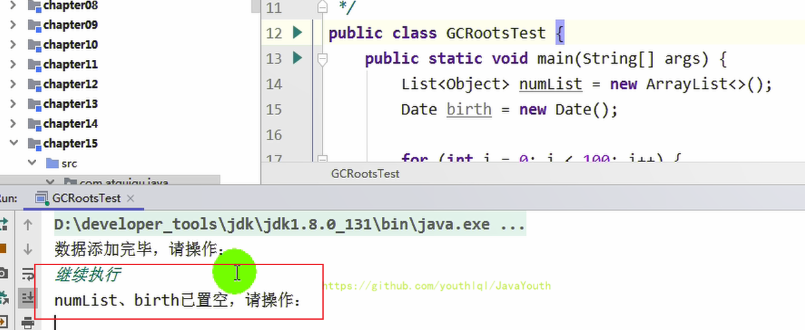
5、我们接着捕获第二张堆内存快照
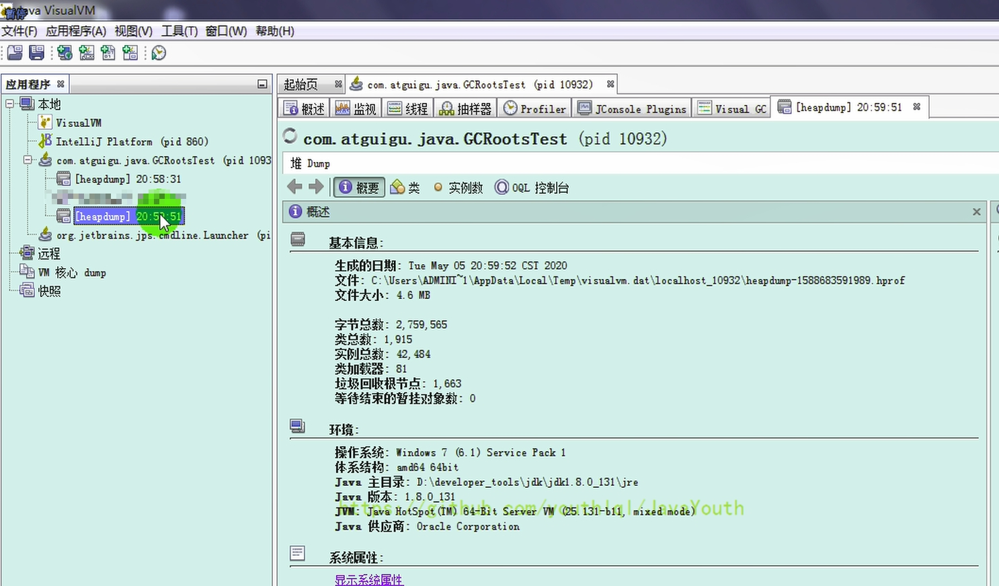

##### 使用mat查看堆内存快照
1、打开 MAT ，选择File --> Open File，打开刚刚的两个dump文件，我们先打开第一个dump文件
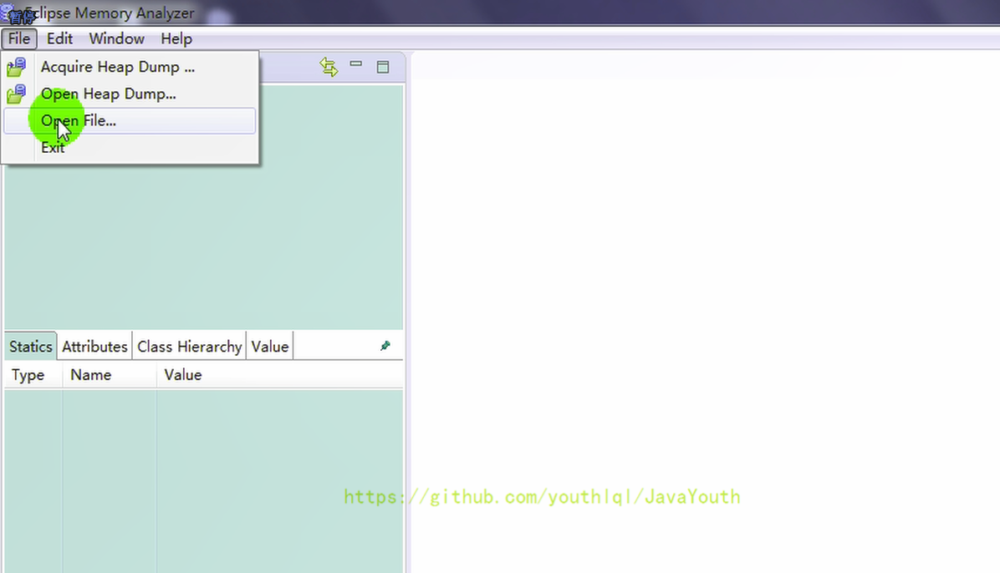
2、选择Java Basics --> GC Roots
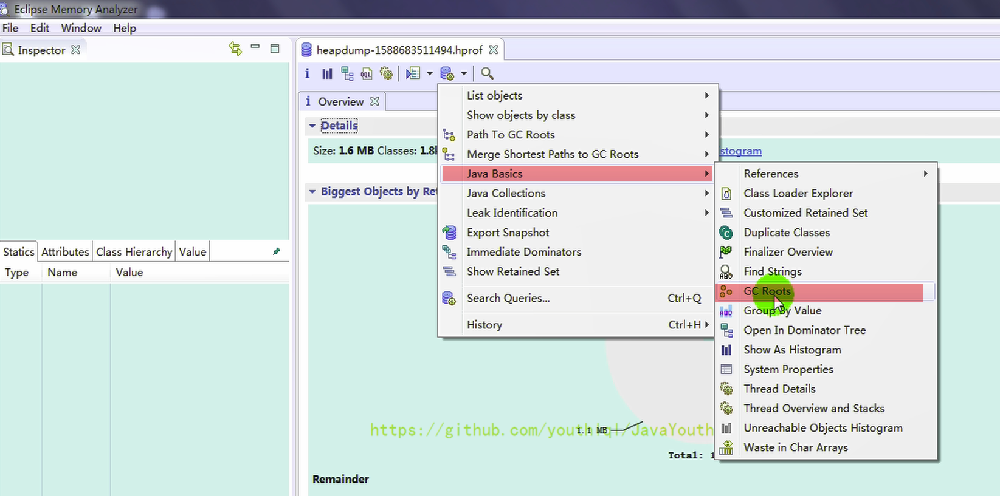
3、第一次捕捉堆内存快照时，GC Roots 中包含我们定义的两个局部变量，类型分别为 ArrayList 和 Date，Total:21
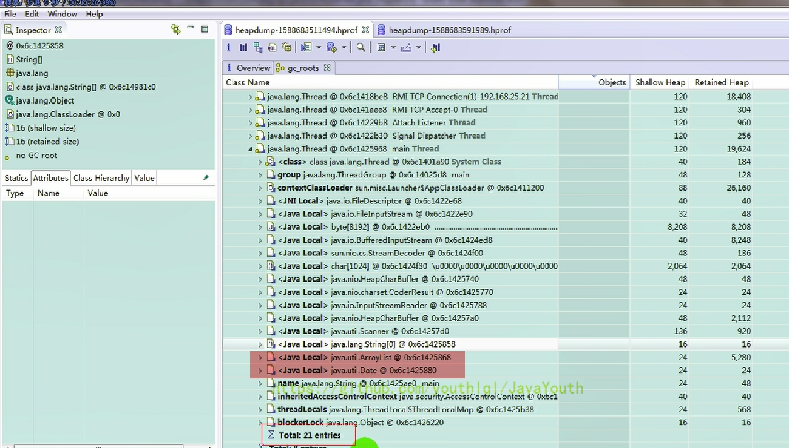
4、打开第二个dump文件，第二次捕获内存快照时，由于两个局部变量引用的对象被释放，所以这
两个局部变量不再作为 GC Roots ，从 Total Entries = 19 也可以看出（少了两个 GC
 Roots）
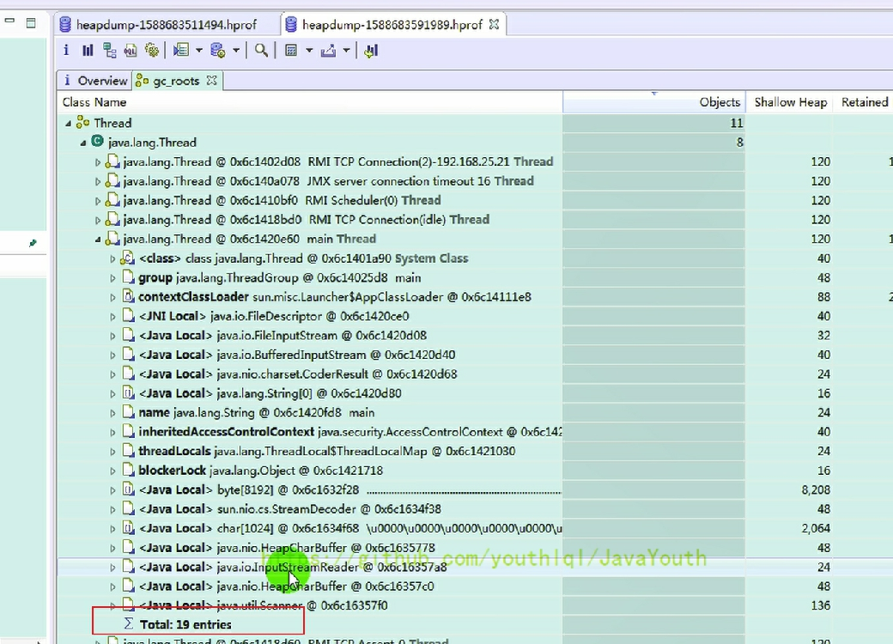
#### JProfiler GC Roots 溯源
1. 在实际开发中，我们很少会查看所有的GC Roots。一般都是查看某一个或几个对象的GC Ro
ot是哪个，这个过程叫GC Roots 溯源
2. 下面我们使用使用 JProfiler 进行 GC Roots 溯源演示
```java
public class GCRootsTest {
    public static void main(String[] args) {
        List<Object> numList = new ArrayList<>();
        Date birth = new Date();

        for (int i = 0; i < 100; i++) {
            numList.add(String.valueOf(i));
            try {
                Thread.sleep(10);
            } catch (InterruptedException e) {
                e.printStackTrace();
            }
        }
        System.out.println("数据添加完毕，请操作：");
        new Scanner(System.in).next();
        numList = null;
        birth = null;
        System.out.println("numList、birth已置空，请操作：");
        new Scanner(System.in).next();

        System.out.println("结束");
    }
}

```
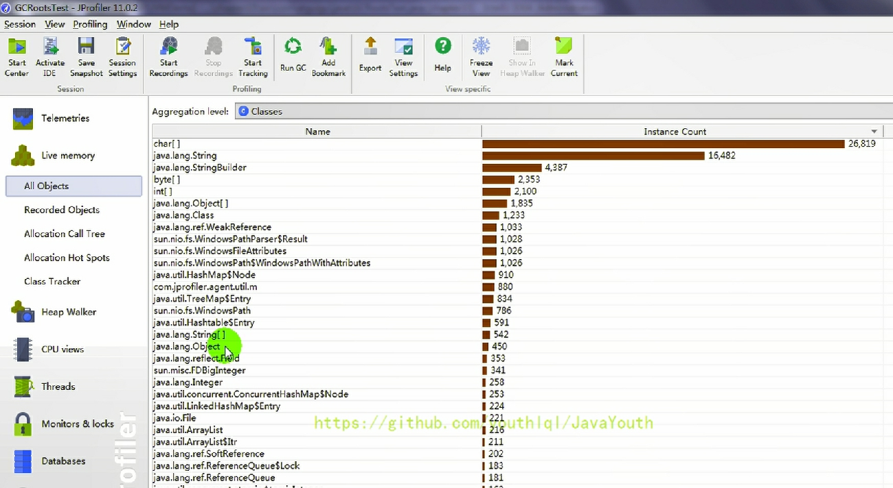
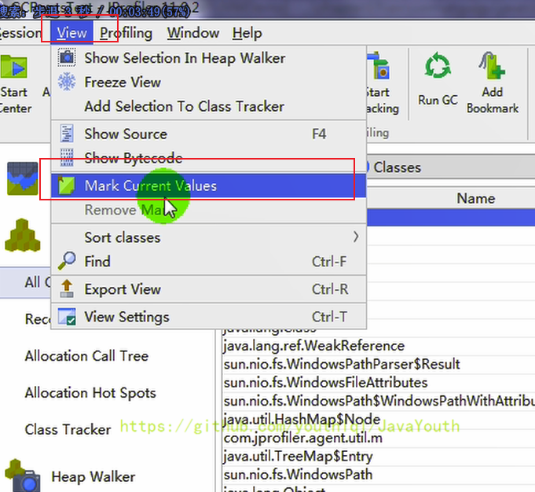
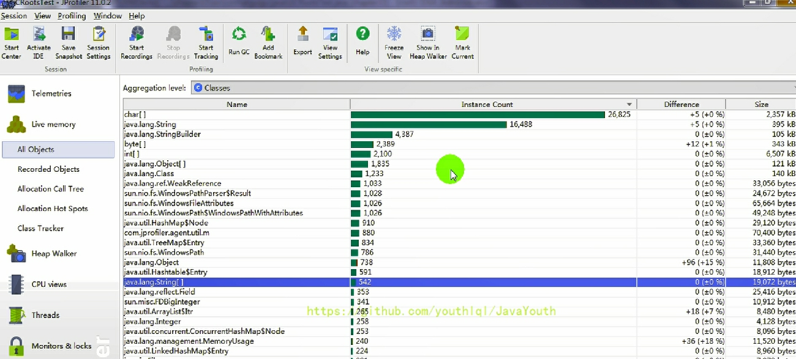
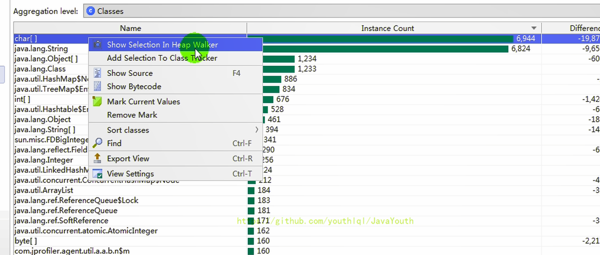
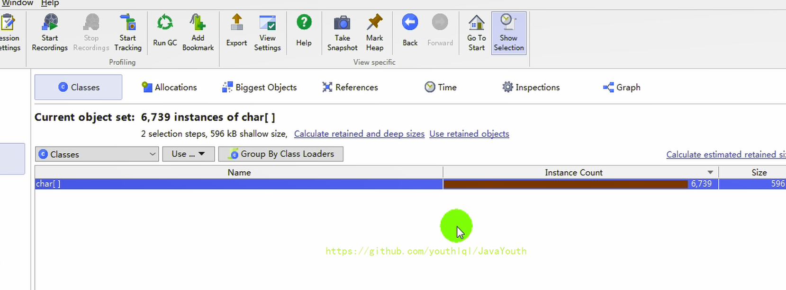

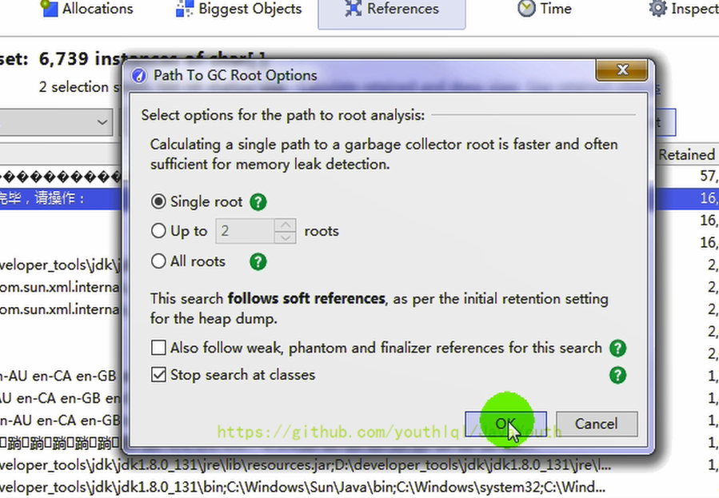
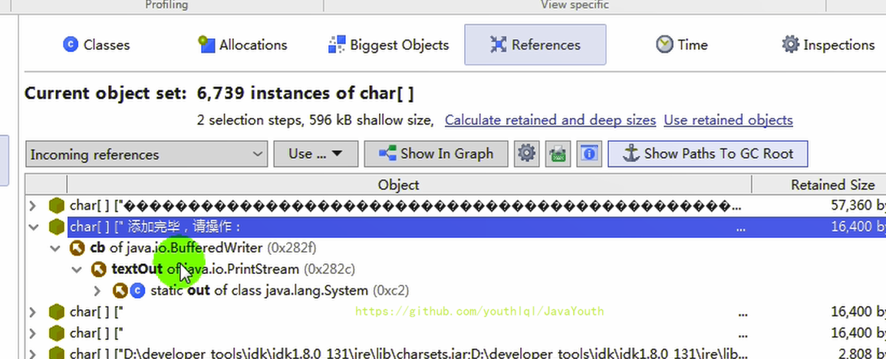

#### JProfiler 分析 OOM
```java_holder_method_tree
/**
 * -Xms8m -Xmx8m 
 * -XX:+HeapDumpOnOutOfMemoryError  这个参数的意思是当程序出现OOM的时候就会在当前工程目录生成一个dump文件
 */
public class HeapOOM {
    byte[] buffer = new byte[1 * 1024 * 1024];//1MB

    public static void main(String[] args) {
        ArrayList<HeapOOM> list = new ArrayList<>();

        int count = 0;
        try{
            while(true){
                list.add(new HeapOOM());
                count++;
            }
        }catch (Throwable e){
            System.out.println("count = " + count);
            e.printStackTrace();
        }
    }
}
com.atguigu.java.HeapOOM
java.lang.OutOfMemoryError: Java heap space
Dumping heap to java_pid14608.hprof ...
java.lang.OutOfMemoryError: Java heap space
    at com.atguigu.java.HeapOOM.<init>(HeapOOM.java:12)
    at com.atguigu.java.HeapOOM.main(HeapOOM.java:20)
Heap dump file created [7797849 bytes in 0.010 secs]
count = 6

```
1、看这个超大对象
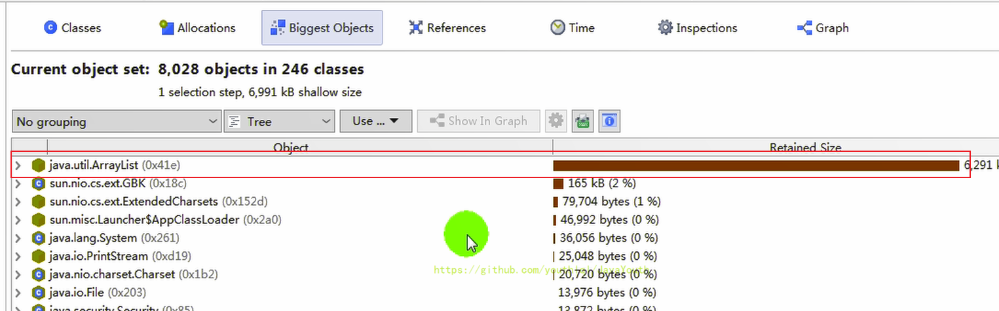
2、揪出 main() 线程中出问题的代码
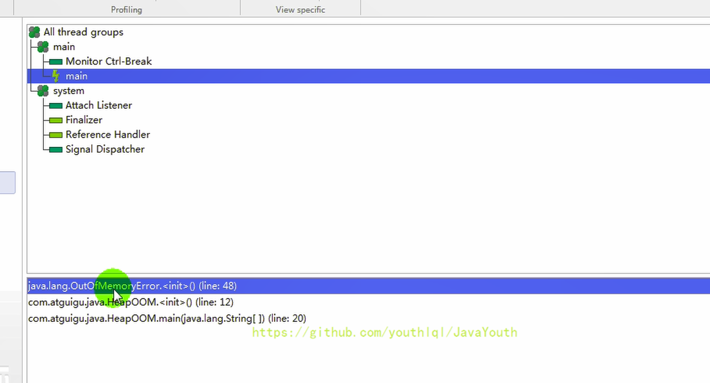
## 对象的finalization机制
### finalize() 方法机制
对象销毁前的回调函数：finalize()
1. Java语言提供了对象终止（finalization）机制来允许开发人员提供对象被销毁之前的自定义处理逻辑。
2. 当垃圾回收器发现没有引用指向一个对象，即：垃圾回收此对象之前，总会先调用这个对象的f
inalize()方法。
3. finalize() 方法允许在子类中被重写，用于在对象被回收时进行资源释放。通常在这个方
法中进行一些资源释放和清理的工作，比如关闭文件、套接字和数据库连接等。

Object 类中 finalize() 源码
```java_holder_method_tree
// 等待被重写
protected void finalize() throws Throwable { }
```
1. 永远不要主动调用某个对象的finalize()方法，应该交给垃圾回收机制调用。理由包括下面三点：
- 在finalize()时可能会导致对象复活。
- finalize()方法的执行时间是没有保障的，它完全由GC线程决定，极端情况下，若不发生GC，则finalize()方法将没有执行机会。
- 一个糟糕的finalize()会严重影响GC的性能。比如finalize是个死循环,则该对象即使没有挂到GC Roots上，也不能被回收，**导致内存泄漏**。
2. 从功能上来说，finalize()方法与C++中的析构函数比较相似，但是Java采用的是基于垃圾回收器的自动内存管理机制，所以finalize()方法在本质上不同于C++中的析构函数。
3. finalize()方法对应了一个finalize线程，因为优先级比较低，即使主动调用该方法，也不
会因此就直接进行回收。

### 对象是应该生存还是可以死亡？
由于finalize()方法的存在，虚拟机中的对象一般处于三种可能的状态。
如果从所有的根节点都无法访问到某个对象，说明对象己经不再使用了。一般来说，此对象需要被回
收。但事实上，也并非是“非死不可”的，这时候它们暂时处于“缓刑”阶段。一个无法触及的对象
有可能在某一个条件下“复活”自己，如果这样，那么对它立即进行回收就是不合理的。为此，定义
虚拟机中的对象可能的三种状态。如下：
1. 可触及的：从根节点开始，可以到达这个对象。（必须活着，不可被gc回收）
2. 可复活的：对象的所有引用都被释放，但是对象有可能在第一次执行finalize()中复活。（可以一次刑场刀下留人，
finalize方法中把当前对象挂到gc roots链上则复活）
3. 不可触及的：对象所有引用被释放，并且第一次执行finalize方法时候没有自救挂到gc roots上或没有重写finalize方法，则对象
进入到不可触及状态。对象在finalize方法中复活，下次该对象的所有引用被释放，则之后
不执行finalize方法，直接进入到不可触及状态。不可触及的对象不可能被复活，因为
finalize()只会被调用一次。(必死无疑)
### 对象是否可以回收判断过程
判定一个对象objA是否可回收，至少要经历两次标记过程
1. 如果对象objA到GC Roots没有引用链，则进行**第一次标记判断是否有引用链**。
2. 进行筛选，判断此对象是否有必要执行finalize()方法
- 如果对象objA没有重写finalize()方法，或者finalize()方法已经被虚拟机调用过，则虚拟机视为“没有必要执行”，objA被判定为不可触及的，必须死。
- 如果对象objA重写了finalize()方法，且还未执行过，那么objA会被插入到F-Queue队
列中，由一个虚拟机自动创建的、低优先级的Finalizer线程触发其finalize()方法执行，这是
唯一一次对象逃脱死亡的机会。
- finalize()方法是对象逃脱死亡的最后机会，稍后GC会对F-Queue队列中的对象进行**第
二次标记 判断是否对象是否非死不可**。如果objA在finalize()方法中与引用链上的任何一个对象建立了联系，那么
在第二次标记时，objA会被移出“即将回收”集合。之后，对象会再次出现没有引用存在的
情况。在这个情况下，finalize()方法不会被再次调用，对象会直接变成不可触及的状态，
也就是说，一个对象的finalize()方法只会被调用一次。

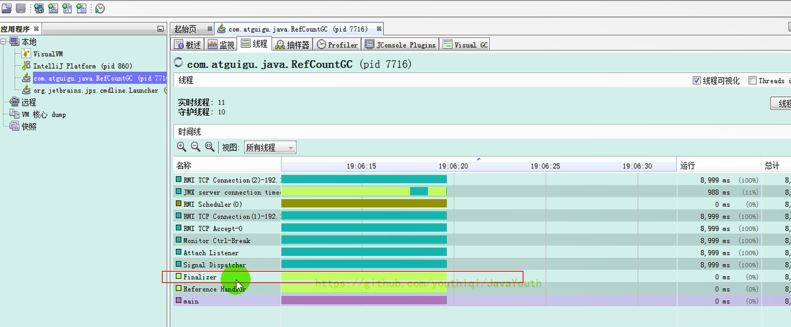
### 代码演示 finalize() 方法让对象复活
我们重写 CanReliveObj 类的 finalize()方法，在调用其 finalize()方法时，
将 obj 指向当前类对象 this
````java_holder_method_tree
/**
 * 测试Object类中finalize()方法，即对象的finalization机制。
 *
 */
public class CanReliveObj {
    public static CanReliveObj obj;//类变量，属于 GC Root


    //此方法只能被调用一次
    @Override
    protected void finalize() throws Throwable {
        super.finalize();
        System.out.println("调用当前类重写的finalize()方法");
        obj = this;//当前待回收的对象在finalize()方法中与引用链上的一个对象obj建立了联系
    }


    public static void main(String[] args) {
        try {
            obj = new CanReliveObj();
            // 对象第一次成功拯救自己
            obj = null;
            System.gc();//调用垃圾回收器
            System.out.println("第1次 gc");
            // 因为Finalizer线程优先级很低，暂停2秒，以等待它
            Thread.sleep(2000);
            if (obj == null) {
                System.out.println("obj is dead");
            } else {
                System.out.println("obj is still alive");
            }
            System.out.println("第2次 gc");
            // 下面这段代码与上面的完全相同，但是这次自救却失败了
            obj = null;
            System.gc();
            // 因为Finalizer线程优先级很低，暂停2秒，以等待它
            Thread.sleep(2000);
            if (obj == null) {
                System.out.println("obj is dead");
            } else {
                System.out.println("obj is still alive");
            }
        } catch (InterruptedException e) {
            e.printStackTrace();
        }
    }
}


````
如果注释掉finalize()方法
```java_holder_method_tree
 //此方法只能被调用一次
    @Override
    protected void finalize() throws Throwable {
        super.finalize();
        System.out.println("调用当前类重写的finalize()方法");
        obj = this;//当前待回收的对象在finalize()方法中与引用链上的一个对象obj建立了联系
    }
第1次 gc
obj is dead
第2次 gc
obj is dead
```
放开finalize()方法
```java_holder_method_tree
第1次 gc
调用当前类重写的finalize()方法
obj is still alive
第2次 gc
obj is dead
```
第一次自救成功挂到了gc roots中的静态变量obj中，但由于 finalize() 方法只会执行一次，所以第二次自救失败

## 清除阶段：标记-清除算法Mark-Sweep
### 背景
标记-清除算法（Mark-Sweep）是一种非常基础和常见的垃圾收集算法，该算法被J.McCarthy等人在1960年提出并并应用于Lisp语言。
### 执行过程
当堆中的有效内存空间（available memory）被耗尽的时候，就会**停止整个程序**
（stop the world），然后进行两项工作，第一项则是标记(标记被引用对象)，第二项则是清除（清除未被引用对象）
1. 标记：Collector从引用**根节点**开始**第一次遍历**，**标记所有被引用的对象**。一般是在对象的Header中
记录为可达对象。注意：标记的是被引用的对象，也就是可达对象，并非标记的是即将被清除的
垃圾对象.
2. 清除：Collector对**堆内存从头到尾**进行线性的**第二次遍历**，如果发现某个对象在其H
eader中没有标记为可达对象，则将其回收。

### 什么是清除？
**空闲链表法**：这里所谓的清除并不是真的置空，而是把需要**清除的对象地址保存在空闲的地址列表里**。下次有
新对象需要加载时，判断垃圾的位置空间是否够，如果够，就存放（也就是覆盖原有的地址）。
关于空闲列表是在为对象分配内存的时候提过：
1. 如果内存规整。采用指针碰撞的方式进行内存分配
2. 如果内存不规整。虚拟机需要维护一个空闲列表，采用空闲列表分配内存。
### 标记-清除算法的缺点
1. 标记清除算法的效率不算高,效率中等。
2. 在进行GC的时候，停止整个应用程序，后执行标记-清除两个阶段，时延导致用户体验较差
3. 这种方式清理出来的空闲内存是不连续的，产生内碎片（对象在内存中一般连续分配，如果有小碎片则无法利用），
并且需要维护一个空闲列表。
## 清除阶段：复制算法Copying（新生代s0,s1使用）
### 背景
为了解决标记-清除算法在垃圾收集效率方面的缺陷，M.L.Minsky于1963年发表了著名的
论文，“使用双存储区的Lisp语言垃圾收集器CA LISP Garbage Collector Algorith
m Using Serial Secondary Storage）”。M.L.Minsky在该论文中描述的算法被
人们称为复制（Copying）算法，它也被M.L.Minsky本人成功地引入到了Lisp语言的一
个实现版本中。
### 核心思想
将活着的内存空间分为两块，每次只使用其中一块，在垃圾回收时将正在使用的内存中的存
活对象复制到未被使用的内存块中，之后清除正在使用的内存块中的所有对象，交换两个
内存的角色，最后完成垃圾回收。

新生代（朝生西死，复制存活的对象少）里面就用到了复制算法，Eden区和S0区存活对象整
体复制到S1区
### 复制算法优缺点
优点
1. 没有标记和清除过程，实现简单，运行高效
2. 复制过去以后空间连续存放，不会出现“碎片”问题，可以使用指针碰撞方式分配对象内存，
不用维护空闲列表。

缺点
1. 此算法的缺点也是很明显的，就是需要两倍的内存空间。
2. 对于G1这种分拆成为大量region的GC，复制而不是移动，意味着GC需要维护region之
间对象引用关系，不管是内存占用或者时间开销也不小，如果存活对象过多，则导致复制大量
对象并且重新排列这些对象的内存地址，却回收很少内存。导致复制算法效率很低，因此
复制算法最适合复制少量存活对象的情况，比如新生代朝生西死的对象s0,s1。
3. 复制算法对象复制过去之后，需要更改对象引用的内存地址。

### 复制算法应用场景
1. 如果系统中的垃圾对象很多，复制算法需要复制的存活对象数量并不会太大，则复制算法效率较高
2. 老年代大量的对象存活，那么复制的对象将会有很多，效率会很低。
3. 在新生代，对常规应用的垃圾回收，一次通常可以回收70% - 99% 的内存空间。回收性
价比很高。所以现在的商业虚拟机都是用这种复制算法回收新生代。
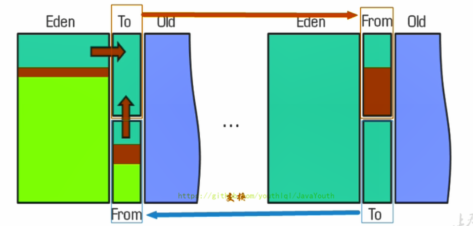
## 清除阶段：标记-压缩算法（Mark-Compact）（老年代回收）
标记-压缩（或标记-整理、Mark - Compact）算法
### 背景
1. 复制算法的**高效性是建立在存活对象少、垃圾对象多的前提下**的。这种情况在新
生代经常发生，但是在老年代，更常见的情况是大部分对象都是存活对象。如果依然使用复
制算法，由于存活对象较多，复制的成本也将很高。因此，基于老年代垃圾回收的特性，
需要使用其他的算法。
2. 标记-清除算法的确可以应用在老年代中，但是该算法不仅**执行效率低下**，而且在执行完内
存回收后还会产生**内存碎片**，所以JVM的设计者需要在此基础之上进行改进。标记-压缩（Mark-Compact）算法由此诞生。
3. 1970年前后，G.L.Steele、C.J.Chene和D.s.Wise等研究者发布标记-压缩算法。在许多现代的垃圾收集器中，人们都使用了标记-压缩算法或其改进版本。

### 执行过程
1. 第一阶段和标记清除算法一样，从根节点开始标记所有被引用对象
2. 第二阶段将所有的存活对象压缩到内存的一端，按顺序排放。之后，清理边界外所有的空间。
   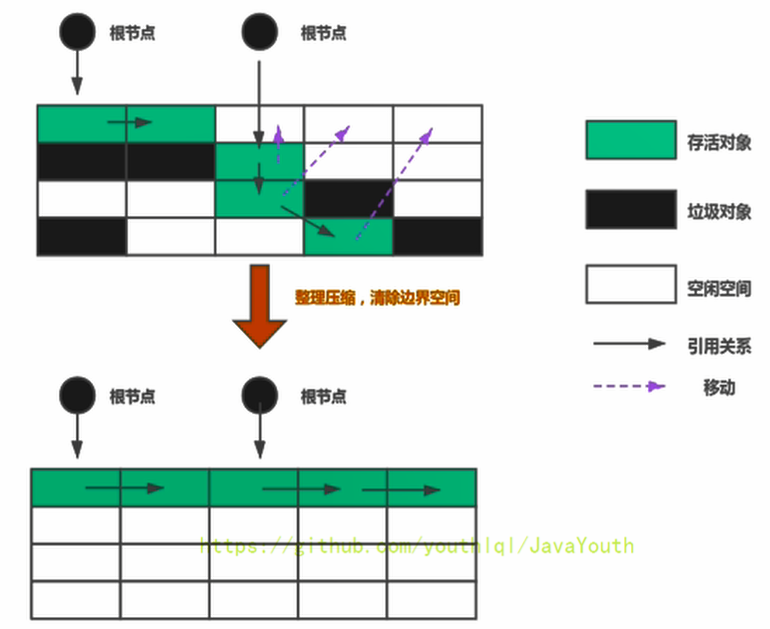
### 标记-压缩算法与标记-清除算法的比较
1. 标记-压缩算法的最终效果等同于标记-清除算法执行完成后，再进行一次内存碎片整理，
因此，也可以把它称为标记-清除-压缩（Mark-Sweep-Compact）算法。
2. 二者的本质差异在于标记-清除算法是一种非移动式的回收算法，标记-压缩是移动式的。
是否移动回收后的存活对象是一项优缺点并存的风险决策。
3. 可以看到，标记的存活对象将会被整理，按照内存地址依次排列，而未被标记的内存会被
清理掉。如此一来，当我们需要给新对象分配内存时，JVM只需要持有一个内存的起始地址即
可，这比维护一个空闲列表显然少了许多开销。（可以使用碰撞指针分配内存）
### 标记-压缩算法的优缺点
优点
1. 消除了标记-清除算法当中，内存区域分散的缺点，我们需要给新对象分配内存时，JVM只需要持有一个内存的起始地址即可。
2. 消除了复制算法当中，内存减半的高额代价。
3. **适用于老年代很多对象都不是垃圾**，复制-压缩过程中，很多对象不需要再次整理位置。

缺点
1. 从效率上来说，标记-整理算法要低于复制算法，标记整理涉及到内存整理。
2. 移动对象的同时，如果对象被其他对象引用，则还需要调整引用的地址（因为HotSpot
虚拟机采用的不是句柄池的方式，而是直接指针）
3. **移动过程中，需要全程暂停用户应用程序。即：STW**

## 三种垃圾清除算法总结
1. 效率上来说，复制算法是当之无愧的老大，但是却浪费了太多内存，可以考虑，物理硬件可以添加。
2. 而为了尽量兼顾上面提到的三个指标，标记-整理算法相对来说更平滑一些，但是效率
上不尽如人意，它比复制算法多了一个标记的阶段，比标记-清除多了一个整理内存的阶段。

|   | 标记清除  | 标记整理  |  复制 |
| ------------ | ------------ | ------------ | ------------ |
|  速率 | 中等  | 最慢  | 最快  |
|  空间开销 |  少（但会堆积碎片） | 少（不堆积碎片  | 通常需要活对象的2倍空间（不堆积碎片）  |
| 移动对象  |  否 | 是  |  是 |
| 适用对象  |  老年代 | 老年代  |  新生代 |

# 拓展：分代收集算法思想(面试重点)
难道就没有一种最优的算法吗？无，没有最好的算法，只有最合适的算法
## 为什么要使用分代收集算法
1. 前面所有这些算法中，并没有一种算法可以完全替代其他算法，它们都具有自己独特的优势和
特点。分代收集算法应运而生。
2. 分代收集算法，是基于这样一个事实：**不同的对象的生命周期是不一样的**。因此，不同
生命周期的对象可以采取不同的收集方式，以便提高回收效率。一般是把**Java堆分为新生代
和老年代**，这样就可以根据各个年代的特点使用不同的回收算法，以**提高垃圾回收的效率**。
3. 在Java程序运行的过程中，会产生大量的对象，其中有些对象是与业务信息相关:
- 比如Http请求中的Session对象、线程、Socket连接，这类对象跟业务直接挂钩，因
此生命周期比较长。**（大概率在老年代中）**
- 但是还有一些对象，主要是程序运行过程中生成的临时变量，这些对象生命周期会比较短
，比如：String对象，由于其不变类的特性，系统会产生大量的这些对象，有些对象甚至
只用一次即可回收。**（大概率在新生代中）**

## 几乎所有的GC都采用分代收集算法执行垃圾回收
在HotSpot中，基于分代的概念，GC所使用的内存回收算法必须结合年轻代和老年代各自的特点。
1. **年轻代（Young Gen）复制算法**
- 年轻代特点：区域相对老年代较小，对象**生命周期短**、存活率低，回收频繁。
- **这种情况复制算法的回收整理**，速度是最快的。复制算法的效率只和当前存活对象大小有关
，因此很适用于年轻代的回收。而复制算法内存利用率不高的问题，通过hotspot中的两
个survivor的设计得到缓解。
2. **老年代（Tenured Gen）标记清除或标记整理**
- 老年代特点：区域较大，对象**生命周期长**、存活率高，回收不及年轻代频繁。
- 这种情况存在大量存活率高的对象，复制算法明显变得不合适。一般是由**标记-清除或者是
标记-清除与标记-整理的混合实现**。

- Mark标记阶段的开销与存活对象的数量成正比。
- Sweep清除阶段的开销与所管理区域的大小成正相关。
- Compact整理阶段的开销与存活对象的数据成正比

1. 以HotSpot中的CMS回收器为例，**CMS老年代是基于Mark-Sweep标记清除**实现的，
对于对象的回收效率很高。对于碎片问题，**CMS采用基于Mark-Compact算法**的Serial Old
回收器作为补偿措施：当内存回收不佳（碎片导致的Concurrent Mode Failure时），
将采用Serial Old执行Full GC以达到对老年代内存的整理。
2. 分代的思想被现有的虚拟机广泛使用。几乎所有的垃圾回收器都区分新生代和老年代
# 拓展：增量收集算法和分区算法
## 增量收集算法
**目的：减少每次STW停顿的时间，但是系统吞吐量降低**

上述现有的算法，在垃圾回收过程中，应用软件将处于一种Stop the World的状态。在
Stop the World状态下，应用程序所有的线程都会挂起，暂停一切正常的工作，等待垃圾
回收的完成。如果垃圾回收时间过长，应用程序会被挂起很久，将严重影响用户体验或者系统
的稳定性。为了解决这个问题，即对实时垃圾收集算法的研究直接导致了增量收集
（Incremental Collecting）算法的诞生。
### 增量收集算法基本思想


1. 如果一次性将所有的垃圾进行处理，需要造成系统长时间的停顿，那么就可以让**垃圾收集线
程和应用程序线程交替执行**。每次，垃圾收集线程只收集一小片区域的内存空间，接着切换到
应用程序线程。依次反复，直到垃圾收集完成。
2. 总的来说，**增量收集算法的基础仍是传统的标记-清除和复制算法**。增量收集算法通过对线程
间冲突的妥善处理，允许垃圾收集线程以分阶段的方式完成标记、清理或复制工作

**比喻：就像洗衣服，如果你把日常的衣服攒起来一个月洗一次，那么洗完一次要很久时间，如果
你每天洗一次则时间很短，停顿的就很短。**

### 增量收集算法的缺点
使用这种方式，由于在垃圾回收过程中，间断性地还执行了应用程序代码，所以**能减少系
统的停顿时间**。但是，因为线程切换和上下文转换的消耗，会使得垃圾回收的总体成本上升
，**造成系统吞吐量的下降**。
## 分区算法
主要针对G1收集器来说的：**每一个小区间都独立使用，独立回收，
目的减少每次gc导致的stw停顿时间**

1. 一般来说，在相同条件下，堆空间越大，一次GC时所需要的时间就越长，有关GC产生的停
顿也越长。为了更好地控制GC产生的停顿时间，将一块大的**内存区域分割成多个小块**，根据目
标的停顿时间，每次合理地回收若干个小区间，而不是整个堆空间，从而减少一次GC所产生的
停顿。
2. 分代算法将按照对象的生命周期长短划分成两个部分，分区算法将整个堆空间划分成连续
的不同小区间。**每一个小区间都独立使用，独立回收**。这种算法的好处是可以控制一次回收多
少个小区间。


