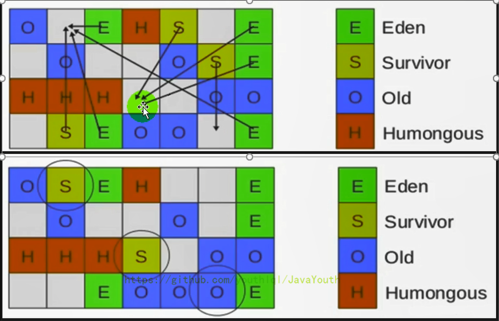
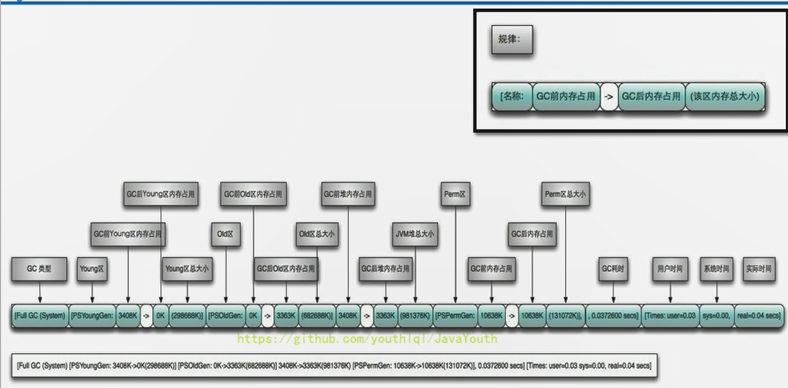

#GC分类和性能指标
## 垃圾收集器分类
### 按照线程数分类
按线程数分（垃圾回收线程数），可以分为串行垃圾回收器和并行垃圾回收器。

1. 串行回收指的是在同一时间段内只允许有一个CPU用于执行垃圾回收操作，此时
工作线程被暂停，直至垃圾收集工作结束。
- 在诸如单CPU处理器或者较小的应用内存等硬件平台不是特别优越的场合，串行
回收器的性能表现可以超过并行回收器和并发回收器。所以，串行回收默认被应
用在客户端的Client模式下的JVM中
- 在并发能力比较强的CPU上，并行回收器产生的停顿时间要短于串行回收器
2. 和串行回收相反，并行收集可以运用多个CPU同时执行垃圾回收，因此提升了
应用的吞吐量，不过并行回收仍然与串行回收一样，采用独占式，使用
了“Stop-the-World”机制。
### 按照工作模式分
分为并发式垃圾回收器和独占式垃圾回收器。
1. 并发式垃圾回收器与应用程序线程交替工作，以尽可能减少应用程序的停
顿时间。
2. 独占式垃圾回收器（Stop the World）一旦运行，就停止应用程序中的所
有用户线程，直到垃圾回收过程完全结束。

### 按照碎片处理方式
压缩式垃圾回收器和非压缩式垃圾回收器。
1. 压缩式垃圾回收器会在回收完成后，对存活对象进行压缩整理，消除回收后的碎片。再分配
对象空间使用指针碰撞
2. 非压缩式的垃圾回收器不进行这步操作，分配对象空间使用空闲列表
### 按工作的内存区间
年轻代垃圾回收器和老年代垃圾回收器
## 垃圾收集器性能指标（重要）
### 指标
1. **吞吐量：** 运行用户代码的时间占总运行时间的比例（总运行时间 = 程序的运行时间 + 内存回收的时间）
2. **暂停时间：** 执行垃圾收集时，程序的工作线程被暂停的时间。
3. 内存占用： Java堆区所占的内存大小。
4. 收集频率：相对于应用程序的执行，收集操作发生的频率。
5. 垃圾收集开销：吞吐量的补数，垃圾收集所用时间与总运行时间的比例。
6. 快速：一个对象从诞生到被回收所经历的时间。

- **吞吐量、暂停时间、内存占用**这三者共同构成一个“不可能三角”。三者总体的表现会随着技术进
步而越来越好。一款优秀的收集器通常最多同时满足其中的两项。
- 这三项里，**暂停时间的重要性日益凸显**。因为随着硬件发展，内存占用多些越来越能容忍
，硬件性能的提升也有助于降低收集器运行时对应用程序的影响，即提高了吞吐量。而内存的
扩大，对延迟反而带来负面效果。
- 简单来说，主要抓住两点：吞吐量，暂停时间
### 吞吐量
1. 吞吐量就是CPU用于运行用户代码的时间与CPU总消耗时间的比值，即吞吐量=运行用户代码时间 /（运行用户代码时间+垃圾收集时间）
比如：虚拟机总共运行了100分钟，其中垃圾收集花掉1分钟，那吞吐量就是99%。
2. 这种情况下，应用程序能容忍较高的暂停时间，因此，高吞吐量的应用程序有更长的时间基准，
快速响应是不必考虑的
3. 吞吐量优先，意味着在单位时间内，STW的时间最短：0.2+0.2=0.4。**垃圾数量一定，垃圾回收
次越少总的垃圾回收时间越少，吞吐量越高，暂停时间越大**

### 暂停时间（pause time）
1. “暂停时间”是指一个时间段内应用程序线程暂停，让GC线程执行的状态。
例如，GC期间100毫秒的暂停时间意味着在这100毫秒期间内没有应用程序线程是活动的
2. 暂停时间优先，意味着尽可能让单次STW的时间最短：0.1+0.1 + 0.1+ 0.1+ 0.1=0.5，但
是总的GC时间可能会长。**垃圾数量一定，垃圾回收次越多总的垃圾回收时间越越多，单次
垃圾回收时间越少，单次停顿时间STW越短，总吞吐量越低。**

### 吞吐量 VS 暂停时间
**总结：在最大吞吐量优先的情况下，降低停顿时间。高吞吐量优先用于后台计算程序，低
暂停时间优先用于交互程序**

1. 高吞吐量较好因为这会让应用程序的最终用户感觉只有应用程序线程在做“生产性”工作。直觉
上，吞吐量越高程序运行越快。
2. 低暂停时间（低延迟）较好，是从最终用户的角度来看，不管是GC还是其他原因导致一个应
用被挂起始终是不好的。这取决于应用程序的类型，有时候甚至短暂的200毫秒暂停都可能打断
终端用户体验。因此，具有较低的暂停时间是非常重要的，特别是对于一个交互式应用程
序（就是和用户交互比较多的场景）。
3. 不幸的是”高吞吐量”和”低暂停时间”是一对相互竞争的目标（矛盾）。
因为如果选择以吞吐量优先，那么必然需要降低内存回收的执行频率，但是这样会导致GC需要更
长的暂停时间来执行内存回收。相反的，如果选择以低延迟优先为原则，那么为了降低每次执行
内存回收时的暂停时间，也只能频繁地执行内存回收，但这又引起了年轻代内存的缩减
和导致程序吞吐量的下降。
4. 在设计（或使用）GC算法时，我们必须确定我们的目标：一个GC算法只可能针对两个目标
之一（即只专注于较大吞吐量或最小暂停时间），或尝试找到一个二者的折衷。

# 不同垃圾收集器概述
## 垃圾收集器发展史
有了虚拟机，就一定需要收集垃圾的机制，这就是Garbage Collection，对应的产品我们
称为Garbage Collector。

1. 1999年随JDK1.3.1一起来的是串行方式的Serial GC，它是第一款GC。ParNew垃圾收集器
是Serial收集器的多线程版本
2. 2002年2月26日，Parallel GC和Concurrent Mark Sweep GC跟随JDK1.4.2一起发布·
3. Parallel GC在JDK6之后成为HotSpot默认GC。
4. 2012年，在JDK1.7u4版本中，G1可用。
5. 2017年，JDK9中G1变成默认的垃圾收集器，以替代CMS。
6. 2018年3月，JDK10中G1垃圾回收器的并行完整垃圾回收，实现并行性来改善最坏情况下的延迟。
7. 2018年9月，JDK11发布。引入Epsilon 垃圾回收器，又被称为 "No-Op(无操作)“ 回收器。同时，引入ZGC：可伸缩的低延迟垃圾回收器（Experimental）
8. 2019年3月，JDK12发布。增强G1，自动返回未用堆内存给操作系统。同时，引入Shenandoah GC：低停顿时间的GC（Experimental）。
9. 2019年9月，JDK13发布。增强ZGC，自动返回未用堆内存给操作系统。
10. 2020年3月，JDK14发布。删除CMS垃圾回收器。扩展ZGC在macOS和Windows上的应用
## 七种经典垃圾收集器
1. 串行回收器：Serial、Serial old
2. 并行回收器：ParNew、Parallel Scavenge、Parallel old
3. 并发回收器：CMS、G1


1. 新生代收集器：Serial、ParNew、Parallel Scavenge；

3. 老年代收集器：Serial old、Parallel old、CMS；

5. 整堆收集器：G1；
## 垃圾收集器组合关系（重要）

1. 两个收集器间有连线，表明它们可以搭配使用：
- Serial/Serial old
- Serial/CMS （JDK9废弃）
- ParNew/Serial Old （JDK9废弃）
- ParNew/CMS
- Parallel Scavenge/Serial Old （预计废弃）
- Parallel Scavenge/Parallel Old
- G1
2. 其中Serial Old作为CMS出现"Concurrent Mode Failure"失败的后备预案。
3. （红色虚线）由于维护和兼容性测试的成本，在JDK 8时将Serial+CMS、ParNew+Serial Old这两个组合声明为废弃（JEP173），并在JDK9中完全取消了这些组合的支持（JEP214），即：移除。
4. （绿色虚线）JDK14中：弃用Parallel Scavenge和Serial Old GC组合（JEP366）
5. （青色虚线）JDK14中：删除CMS垃圾回收器（JEP363）

为什么要有很多收集器，一个不够吗？因为Java的使用场景很多，移动端，服务器等。所以就需要
针对不同的场景，提供不同的垃圾收集器，提高垃圾收集的性能。
虽然我们会对各个收集器进行比较，但并非为了挑选一个最好的收集器出来。没有一种放之四
海皆准、任何场景下都适用的完美收集器存在，更加没有万能的收集器。所以我们**选择的
只是对具体应用最合适的收集器**。
## 查看默认垃圾收集器
1. -XX:+PrintCommandLineFlags：查看命令行相关参数（包含使用的垃圾收集器）
2. 使用命令行指令：jinfo -flag 相关垃圾回收器参数 进程ID
### JDK8
在 JDK 8 下，设置 JVM 参数
-XX:+PrintCommandLineFlags
程序打印输出：-XX:+UseParallelGC 表示使用使用 ParallelGC ，ParallelGC 默认和 Parallel Old 绑定使用
```
-XX:InitialHeapSize=266620736 -XX:MaxHeapSize=4265931776 -XX:+PrintCommandLineFlags -XX:+UseCompressedC
```
通过命令行指令查看

命令行命令

jps
jinfo -flag UseParallelGC 进程id
jinfo -flag UseParallelOldGC 进程id
Copy to clipboardErrorCopied
JDK 8 中默认使用 ParallelGC 和 ParallelOldGC 的组合


### JDK9


# Serial 一代宗师：串行回收
1. **Serial收集器是最基本、历史最悠久的垃圾收集器了**。JDK1.3之前回
收新生代唯一的选择。
2. Serial收集器作为HotSpot中Client模式下的默认新生代垃圾收集器。
3. **Serial收集器用于新生代采用复制算法、串行回收和"Stop-the-World"机制**的方
式执行内存回收。
4. 除了年轻代之外，Serial收集器还提供用于执行老年代垃圾收集的Se
rial Old收集器。**Serial old收集器用于老年代内存回收使用标记-压缩算法，串行回收和"Stop th
e World"机制**。
5. Serial Old是运行在Client模式下默认的老年代的垃圾回收器，Ser
ial Old在Server模式下主要有两个用途：**①与新生代的Parallel Scavenge配合使用②作为老年代CMS
收集器的后备垃圾收集方案**

这个收集器是一个单线程的收集器，**“单线程”的意义：它只会使用一个CPU（串行）或一条收集线程去完成垃
圾收集工作**。更重要的是在它进行垃圾收集时，必须暂停其他所有的工作线程，直到它收集结束（Stop The
 World）

## Serial优点
1. 优势：简单而高效（与其他收集器的单线程比），对于限定单个CPU的环境来说，**Serial收集器由于没有线
程交互的开销**（cpu只开辟一个垃圾收集线程），专心做垃圾收集自然可以获得最高的单线程收集效率。运行在Client模式下的虚拟机是个不
错的选择。
2. 在用户的桌面应用场景中，可用内存一般不大（几十MB至一两百MB），可以在较短时间内完成垃圾收集
（几十ms至一百多ms），只要不频繁发生，使用串行回收器是可以接受的。
3. 在HotSpot虚拟机中，使用-XX:+UseSerialGC参数可以指定年轻代和老年代都使用串行收集器。等价
于新生代用Serial GC，且老年代用Serial Old GC
## Serial缺点
1. 目前cpu是多核多线程，serial限定单核CPU用串行回收垃圾的了，效率慢。
2. 单线程负责垃圾回收，对于交互较强的应用而言，这种垃圾收集器是不能接受的。一般在Java Web应用程序中是不会采用串行
垃圾收集器的。
# ParNew Serial新生代长子:并行回收
1. 如果说Serial GC是年轻代中的单线程垃圾收集器，那么**ParNew收集器则是Serial收集器的多线程版本**。
Par是Parallel并行的缩写，New：只能处理新生代，注意这里是多个垃圾收集线程，并行回收垃圾。
2. ParNew 收集器除了**采用并行回收**的方式执行内存回收外，两款垃圾收集器之间几乎没有任何区别。Par
New收集器在年轻代中同样也是采用**复制算法、并行回收、"Stop-the-World"机制**。
3. ParNew 是很多JVM运行在Server模式下新生代的默认垃圾收集器。
   

- 对于新生代，回收次数频繁，使用并行方式高效。使用ParNew垃圾回收期
- 对于老年代，回收次数少，使用串行方式节省资源。（CPU并行需要切换线程，串行可以省去切换线程的资源，
所以使用Serial old)垃圾收集器。

## ParNew vs serial
作为Serial的长子ParNew继承了父亲优点，并且对于新生代采用并行回收策略。

Q：由于ParNew收集器基于并行回收，那么是否可以断定ParNew收集器的回收效率在任何场景下都
会比Serial收集器更高效？

A：不能，单cpu下，ParNew垃圾收集效率低于Serial收集器。

1. ParNew收集器运行在多CPU的环境下，由于可以充分利用多CPU、多核心等物理硬件资源优势，可以更快
速地完成垃圾收集，提升程序的吞吐量。
2. 但是在单个CPU的环境下，ParNew收集器不比Serial收集器更高效。虽然Serial收集器是单垃圾收集线程基于串行回
收，但是由于CPU不需要频繁地做任务切换，因此可以有效避免多线程交互过程中产生的一些额外开销。
3. 除Serial外，目前只有ParNew GC能与CMS收集器配合工作
## 设置ParNew 垃圾收集器
1. 在程序中，开发人员可以通过选项"-XX:+UseParNewGC"手动指定使用ParNew收集器执行内存回收任务
。它表示年轻代使用并行收集器，不影响老年代。
2. -XX:ParallelGCThreads限制线程数量，默认开启和CPU数据相同的线程数。
# Parallel新生代老年代新秀：吞吐量优先（交互少场景）
1. HotSpot的年轻代中除了拥有ParNew收集器是基于并行回收的以外，Parallel Scavenge新生代收集器同样也
采用了 **并行回收、复制算法和"Stop the World"** 机制。
2. jdk1.6 Parallel Old老年代收集器采用了**并行回收、标记-压缩算法和"Stop-the-World"机制**，代替
**Serial Old 串行回收、标记-压缩、Stop-the-world**
3. 既然Parallel Scavenge和ParNew类似，那么Parallel收集器是否多此一举？
- 和ParNew收集器不同，**Parallel Scavenge收集器的目标则是达到一个可控制的吞吐量**（Throughput）
，它也被称为吞吐量优先的垃圾收集器。
- 自适应调节策略也是Parallel Scavenge与ParNew一个重要区别。（动态调整内存分配情况，以达到一
个最优的吞吐量或低延迟）

## Parallel Scavenge应用场景
**总结：适用于后台计算，不需要太多交互任务，强调吞吐量的场景，不在意停顿时间。**
1. Parallel Scavenge目标是吞吐量优先，高吞吐量则可以高效率地利用CPU时间，尽快完成程序的运算任务，
**主要适合在后台运算而不需要太多交互的任务**。因此，常见在服务器环境中使用。例如，那些执行批量处理、
订单处理、工资支付、科学计算的应用程序。
2. 在程序吞吐量优先的应用场景中，Parallel收集器和Parallel Old收集器的组合，在server模式下的内存回收性能很不错。
3. 在Java8中，默认是此垃圾收集器。
## Parallel Scavenge 回收器参数设置
1. -XX:+UseParallelGC 手动指定年轻代使用Parallel Scavenge并行收集器执行内存回收任务。
2. -XX:+UseParallelOldGC：手动指定老年代都是使用并行回收收集器。
- 分别适用于新生代和老年代
- 上面两个参数分别适用于新生代和老年代。默认jdk8是开启的。默认开启一个，另一个也会被开启。（互相激活）
3. -XX:ParallelGCThreads：设置年轻代并行收集器的线程数。一般地，最好与CPU数量相等，以避免过多
的线程数影响垃圾收集性能。
- 在默认情况下，当CPU数量小于8个，ParallelGCThreads的值等于CPU数量。
- 当CPU数量大于8个，ParallelGCThreads的值等于3+[5*CPU_Count]/8]
4. -XX:MaxGCPauseMillis **设置垃圾收集器最大停顿时间（即STW的时间）。单位是毫秒**。
- 为了尽可能地把停顿时间控制在XX:MaxGCPauseMillis 以内，收集器在工作时会调整Java堆大小或者
其他一些参数。（堆小了，垃圾少，停顿时间小）
- 对于用户来讲，停顿时间越短体验越好。但是在服务器端，我们注重高并发，整体的吞吐量。所以服务器
端适合Parallel，进行控制。
- 该参数使用需谨慎。
5. -XX:GCTimeRatio垃圾收集时间占总时间的比例，即等于 1 / (N+1) ，用于衡量吞吐量的大小。
- 取值范围(0, 100)。默认值99，也就是垃圾回收时间占比不超过1。
- 与前一个-XX:MaxGCPauseMillis参数有一定矛盾性，STW暂停时间越长，Radio参数就容易超过设定的比例。
6. XX:+UseAdaptiveSizePolicy 设置Parallel Scavenge收集器具有**自适应调节策略**
- 在这种模式下，年轻代的大小、Eden和Survivor的比例、晋升老年代的对象年龄等参数会被自动调整，
已达到在堆大小、吞吐量和停顿时间之间的平衡点。
- 在手动调优比较困难的场合，可以直接使用这种自适应的方式，仅指定虚拟机的最大堆、目标的吞吐量
（GCTimeRatio）和停顿时间（MaxGCPauseMillis），让虚拟机自己完成调优工作。
# CMS 老年代低延迟奇才：
1. 在JDK1.5时期，Hotspot推出了一款在**强交互应用中（就是和用户打交道的引用）** 几乎可认为有划时代意
义的垃圾收集器：CMS（Concurrent-Mark-Sweep）收集器，这款收集器是HotSpot虚拟机中**第一款真正
意义上的并发收集器，它第一次实现了让垃圾收集线程与用户线程同时工作**。
CMS收集器的关注点是尽可能缩短垃圾收集时用户线程的停顿时间。停顿时间越短（低延迟）就越适合与用户交互的程序，良好的响应速度能提升用户体验。
目前很大一部分的Java应用集中在互联网站或者B/S系统的服务端上，这类应用尤其重视服务的响应速度，希望系统停顿时间最短，以给用户带来较好的体验。CMS收集器就非常符合这类应用的需求。
CMS的垃圾收集算法采用标记-清除算法，并且也会"Stop-the-World"
不幸的是，CMS作为老年代的收集器，却无法与JDK1.4.0中已经存在的新生代收集器Parallel Scavenge配合工作（因为实现的框架不一样，没办法兼容使用），所以在JDK1.5中使用CMS来收集老年代的时候，新生代只能选择ParNew或者Serial收集器中的一个。
在G1出现之前，CMS使用还是非常广泛的。一直到今天，仍然有很多系统使用CMS GC。
2. CMS收集器的关注点是尽可能缩短垃圾收集时用户线程的停顿时间。停顿时间越短（低延迟）就越适合与
用户交互的程序，良好的响应速度能提升用户体验。目前很大一部分的Java应用集中在互联网站或者B/S系
统的服务端上，这类应用尤其重视服务的响应速度，希望系统停顿时间最短，以给用户带来较好的体验。
CMS收集器就非常符合这类应用的需求。
3. CMS的垃圾收集算法采用标记-清除算法，并且也会"Stop-the-World
4. 不幸的是，**CMS作为老年代的收集器**，却无法与JDK1.4.0中已经存在的新生代收集器Parallel 
Scavenge配合工作（因为实现的框架不一样，没办法兼容使用），所以在JDK1.5中使用CMS来收集老年代
时候，新生代只能选择ParNew或者Serial收集器中的一个。
5. 在G1出现之前，CMS使用还是非常广泛的。一直到今天，仍然有很多系统使用CMS GC
## CMS工作过程

CMS整个过程比之前的收集器要复杂，整个过程分为4个主要阶段，即初始标记阶段、
并发标记阶段、重新标记阶段和并发清除阶段。(**涉及STW的阶段主要是：初始标记 和 重新标记**)
1. 初始标记（Initial-Mark）阶段：在这个阶段中，程序中所有的工作线程都将会因为“Stop-the-World
”机制而出现短暂的暂停，**这个阶段的主要任务仅仅只是标记出GC Roots能直接关联到的对象**。一旦标记完成
之后就会恢复之前被暂停的所有应用线程。由于直接关联对象比较小，所以**这里的速度非常快**。
2. 并发标记（Concurrent-Mark）阶段：**从GC Roots的直接关联对象开始遍历整个对象图的过程**，这个过
程耗时较长但是**不需要停顿用户线程，可以与垃圾收集线程一起并发运行**。
3. 重新标记（Remark）阶段：由于在并发标记阶段中，程序的工作线程会和垃圾收集线程同时运行或者交叉
运行，因此为了**修正并发标记期间，因用户程序继续运作而导致标记产生变动的那一部分对象的标记记录**，这
个阶段的停顿时间通常会比初始标记阶段稍长一些，并且也会导致“Stop-the-World”的发生，但也远比并发
标记阶段的时间短。
4. 并发清除（Concurrent-Sweep）阶段：此阶段清理删除掉标记阶段判断的已经死亡的对象，释放内存空
间。由于**并发-清除算法不需要移动存活对象，所以这个阶段也是可以与用户线程同时并发的**

## CMS分析
1. 尽管CMS收集器采用的是并发回收（非独占式），但是在其**初始标记和重新标记这两个阶段中仍然需要执
行“Stop-the-World”机制暂停程序中的工作线程**，不过暂停时间并不会太长，因此可以说明目前所有的垃
圾收集器都做不到完全不需要“Stop-the-World”，只是尽可能地缩短暂停时间。
2. 由于**最耗费时间的并发标记与并发清除阶段都不需要暂停工作，所以整体的回收是低停顿的**。
3. 另外，由于在垃圾收集阶段用户线程没有中断，所以在CMS回收过程中，还应该确保应用程序用户线程有足
够的内存可用。因此，CMS收集器不能像其他收集器那样等到老年代几乎完全被填满了再进行收集，而是**当堆内
存使用率达到某一阈值时，便开始进行CMS老年代回收**，以确保应用程序在CMS工作过程中依然有足够的空间支持应用程
序运行。要是CMS运行期间预留的内存无法满足程序需要，就会出现一次“Concurrent Mode Failure” 失
败，这时虚拟机将启动后备预案：临时启用**Serial old收集器来重新进行老年代的垃圾收集**，这样停顿时
间就很长了。
4. CMS收集器的垃圾收集算法采用的是**标记清除算法**，这意味着每次执行完内存回收后，由于被执行内存回
收的无用对象所占用的内存空间极有可能是不连续的一些内存块，不可避免地将会**产生一些内存碎片**。那么C
MS在为新对象分配内存空间时，将无法使用指针碰撞（Bump the Pointer）技术，而只能够选择空闲列表
（Free List）执行内存分配。
   

**为什么 CMS 不采用标记-压缩算法呢？**
CMS初衷就是降低用户交互的时延，垃圾收集过程中，并发清除保证了垃圾回收过程中，非垃圾对象不用移动内存位置，
速度快，可以保证程序运行和垃圾收集并发执行。如果使用标记-压缩算法，压缩内存过程中，
所有的对象都要重新赋新的内存地址，必须导致STW,与CMS低时延目的不符，因此采用了标记-清除算法获得更快
的响应时间，让用户线程和垃圾收集线程同时执行。Mark Compact更适合“stop the world”这种场景下使用

##  CMS优缺点
### 优点
老年代，并发收集，低延迟
### 缺点
1. **会产生内存碎片**，导致并发清除后，用户线程可用的空间不足。在无法分配大对象的情况下，不得不提前触
发Full GC。
2. **CMS收集器对CPU资源非常敏感**。在并发标记阶段，它虽然不会导致用户停顿，但是会因为占用了一部分线程
而导致应用程序变慢，总吞吐量会降低。
3. **CMS收集器无法处理浮动垃圾**。可能出现“Concurrent Mode Failure"失败而导致另一次Full GC的
产生。在并发标记阶段由于程序的工作线程和垃圾收集线程是同时运行或者交叉运行的，（**并发标记阶段，有的
对象从Gc roots链上断开，变成了新的垃圾**）那么在并发标记阶
段如果产生新的垃圾对象，CMS将无法对这些垃圾对象进行标记，最终会导致这些新产生的垃圾对象没有被
及时回收，从而只能在下一次执行GC时释放这些之前未被回收的内存空间。

## CMS 参数配置
- -XX:+UseConcMarkSweepGC：手动指定使用CMS收集器执行内存回收任务。
- 开启该参数后会自动将-XX:+UseParNewGC打开。即：**ParNew（Young区）+CMS（Old区）+Serial 
Old（Old区备选方案）** 的组合。
- -XX:CMSInitiatingOccupanyFraction：设置堆内存使用率的阈值，一旦达到该阈值，便开始进
行回收。
1. JDK5及以前版本的默认值为68，即当老年代的空间使用率达到68%时，会执行一次CMS回收。JDK6及
以上版本默认值为92%
2. 如果内存增长缓慢，则可以设置一个稍大的值，大的阀值可以有效降低CMS的触发频率，减少老年代回收的
次数可以较为明显地改善应用程序性能。反之，如果应用程序内存使用率增长很快，则应该降低这个阈值，
以避免频繁触发老年代串行收集器。因此通过该选项便可以有效降低Full GC的执行次数。

- -XX:+UseCMSCompactAtFullCollection：用于指定在执行完Full GC后对内存空间进行压缩整理，
以此避免内存碎片的产生。不过由于内存压缩整理过程无法并发执行，所带来的问题就是停顿时间变得更长了。
- -XX:CMSFullGCsBeforeCompaction：设置在执行多少次Full GC后对内存空间进行压缩整理。
- -XX:ParallelCMSThreads：设置CMS的线程数量

CMS默认启动的线程数是 (ParallelGCThreads + 3) / 4，ParallelGCThreads是年轻代并行收集器的
线程数，可以当做是 CPU 最大支持的线程数。当CPU资源比较紧张时，受到CMS收集器线程的影响，应用程序
的性能在垃圾回收阶段可能会非常糟糕。

## 小结
HotSpot有这么多的垃圾回收器，那么如果有人问，Serial GC、Parallel GC、Concurrent Mark Sweep GC这三个GC有什么不同呢？

**不用场景用不同的gc收集器。**
1. 如果你想要最小化地使用内存和并行开销，请选Serial GC；
2. 如果你想要最大化应用程序的吞吐量，请选Parallel GC；
3. 如果你想要最小化GC的中断或停顿时间，请选CMS GC。
# G1 新生代老年代 全能王:(最复杂)
## 为什么还需要G1
### 既然我们已经有了前面几个强大的 GC ，为什么还要发布 Garbage First（G1）GC？
1. 原因就在于应用程序所应对的业务越来越庞大、复杂，用户越来越多，没有GC就不能保证应用程序正常进行
，而经常造成STW的GC又跟不上实际的需求，所以才会不断地尝试对GC进行优化。
2. G1（Garbage-First）垃圾回收器是在Java7 update4之后引入的一个新的垃圾回收器，是当今收集器
技术发展的最前沿成果之一。
3. 与此同时，**为了适应现在不断扩大的内存和不断增加的处理器数量，进一步降低暂停时间（pause time）
，同时兼顾良好的吞吐量**。
4. **官方给G1设定的目标是在延迟可控的情况下获得尽可能高的吞吐量**，所以才担当起“全功能收集器”的重任
与期望。

## 为什么起名G1
1. 因为G1是一个并行回收器，它把堆内存分割为很多不相关的区域（Region）（物理上不连续的）。使用不
同的Region来表示Eden、幸存者0区，幸存者1区，老年代等。
2. G1 GC有计划地避免在整个Java堆中进行全区域的垃圾收集。G1跟踪各个Region里面的垃圾堆积的价值
大小（回收所获得的空间大小以及回收所需时间的经验值），在后台维护一个优先列表，**每次根据允许的停顿时间
，优先回收价值最大的Region**。
3. 由于这种方式的侧重点在于回收垃圾最大量的区间（Region），所以我们给G1一个名字：垃圾优先（
Garbage First）。
4. G1（Garbage-First）**是一款面向服务端应用的垃圾收集器**，主要针对配备多核CPU及大容量内存的机器
，以极高概率满足GC停顿时间的同时，还兼具高吞吐量的性能特征。
5. 在JDK1.7版本正式启用，移除了Experimental的标识，是**JDK9以后的默认垃圾回收器**，取代了CMS回收
器以及Parallel+Parallel Old组合。被Oracle官方称为“**全功能的垃圾收集器**”。
6. 与此同时，CMS已经在JDK9中被标记为废弃（deprecated）。**G1在JDK8中还不是默认的垃圾回收器，**需
要使用-XX:+UseG1GC来启用。

## 可预测的停顿时间模型（软实时soft real-time）
这是G1相对于CMS的另一大优势，G1除了追求低停顿外，还能建立可预测的停顿时间模型，能让使用者明确指
定在一个长度为M毫秒的时间片段内，消耗在垃圾收集上的时间不得超过N毫秒。
1. 由于分区的原因，G1可以只选取部分区域进行内存回收，这样缩小了回收的范围，因此对于全局停顿情况
的发生也能得到较好的控制。
2. G1跟踪各个Region里面的垃圾堆积的价值大小（回收所获得的空间大小以及回收所需时间的经验值），在
后台维护一个优先列表，**每次根据允许的收集时间，优先回收价值最大的Region**。保证了G1收集器在有限的
时间内可以获取尽可能高的收集效率。
3. 相比于CMS GC，G1未必能做到CMS在最好情况下的延时停顿，但是最差情况要好很多
## G1使用场景
1. 面向服务端应用，针对具有大内存、多处理器的机器。（在普通大小的堆里表现并不惊喜）
2. 最主要的应用是需要**低GC延迟**，并具有大堆的应用程序提供解决方案；
3. 如：在堆大小约6GB或更大时，可预测的暂停时间可以低于0.5秒；（**G1通过每次只清理一部分而不是
全部的Region的增量式清理来保证每次GC停顿时间不会过长**）。
4. 用来替换掉JDK1.5中的CMS收集器；在下面的情况时，使用G1可能比CMS好：
- 超过50%的Java堆被活动数据占用；
- 对象分配频率或年代提升频率变化很大；
- GC停顿时间过长（长于0.5至1秒）
5. HotSpot垃圾收集器里，除了G1以外，其他的垃圾收集器均使用内置的JVM线程执行GC的多线程操作，
而G1 GC可以采用应用线程承担后台运行的GC工作，即当JVM的GC线程处理速度慢时，系统会调用应用程序线
程帮助加速垃圾回收过程。

## G1的分区 Region(内存划分化整为零)
1. 使用G1收集器时，它将整个Java堆划分成约2048个大小相同的独立Region块，每个Region块大小根据
堆空间的实际大小而定，整体被控制在1MB到32MB之间，且为2的N次幂，即1MB，2MB，4MB，8MB，16MB
，32MB。可以通过

3. XX:G1HeapRegionSize设定。所有的Region大小相同，且在JVM生命周期内不会被改变。

5. 虽然还保留有新生代和老年代的概念，但新生代和老年代不再是物理隔离的了，它们都是一部分Region
不需要连续）的集合。通过Region的动态分配方式实现逻辑上的连续，并且新生代，老年代所占用的
Region块个数可以改变。

7. 一个Region有可能属于Eden，Survivor或者Old/Tenured内存区域。但是一个Region被使用时候，只可能属于
一个角色，但该Region使用完后内存空间被回收后，可以作为Eden、Survivor或old。图中的E表示该Region属于E
den内存区域，S表示属于Survivor内存区域，O表示属于Old内存
区域。图中空白的表示未使用的内存空间。

9. G1垃圾收集器还增加了一种新的内存区域，叫做Humongous内存区域，如图中的H块。主要用于存储大
对象，如果超过1.5个Region，就放到H。如果一个H区装不下一个大对象，那么G1会寻找连续的H区来存储,如果
连多个H区都存不下则触发Full gc。
   

### 为什么设置H区域？
对于堆中的大对象，默认直接会被分配到老年代，但是如果它是一个短期存在的大对象就会对垃圾收集器造成
负面影响，短期存在导致刚分配到老年代下次就要回收，触发老年代GC,老年代STW时间变成。为了解决这个问题，G1划分了一个Humongous区，它用来专门存放大对象。如果一个H区装不下一
个大对象，那么G1会寻找连续的H区来存储。为了能找到连续的H区，有时候不得不启动Full GC。G1的大多
数行为都把H区作为老年代的一部分来看待。

### Regio的细节

1. 每个Region都是通过指针碰撞来分配空间
2. G1为每一个Region设 计了两个名为TAMS（Top at Mark Start）的指针，把Region中的一部分空间划分出来用于并发回收过程中的新对象分配，并发回收时新分配的对象地址都必须要在这两个指针位置以上。
3. TLAB还是用来保证并发性

## G1收集器优点
与其他GC收集器相比，G1使用了全新的分区算法，其特点如下所示：
### 并行与并发兼备
1. 并行性：G1在回收期间，可以有多个GC线程同时工作，有效利用多核计算能力。此时用户线程STW（**并行性
有利于提升吞吐量**）
2. 并发性：G1拥有与应用程序交替执行的能力，部分工作可以和应用程序同时执行，因此，一般来说，不会
在整个回收阶段发生完全阻塞应用程序的情况。**并发性有利于降低STW时延**。

### 分代收集
1. 从分代上看，G1依然属于分代型垃圾回收器，它会区分年轻代和老年代，年轻代依然有Eden区和S
urvivor区。但从堆的结构上看，**它不要求整个Eden区、年轻代或者老年代都是连续的，也不再坚持固
定大小和固定数量**。
2. 将堆空间分为若干个区域（Region），这些区域中包含了逻辑上的年轻代和老年代。
3. 和之前的各类回收器不同，它**同时能处理年轻代和老年代**。对比其他回收器，要么只工作在年轻代，要么只工作
在老年代；
   
   

### 空间整合（化整为零）
1. CMS：“标记-清除”算法、内存碎片可以通过若干次GC后进行一次碎片整理
2. G1将内存划分为一个个的region。内存的回收是以region作为基本单位的。**Region之间是复制算法**，
但整体上实际可看作是标记-压缩（Mark-Compact）算法，两种算法都可以避免内存碎片。这种特性有利于
程序长时间运行，分配大对象时不会因为无法找到连续内存空间而提前触发下一次GC。尤其是当Java堆非
常大的时候，G1的优势更加明显。
## G1收集器缺点
1. 相较于CMS，G1还不具备全方位、压倒性优势。比如在用户程序运行过程中，G1无论是为了垃圾收集产生
的内存占用（Footprint）还是程序运行时的额外执行负载（overload）都要比CMS要高，比如每个region
都需要额外占用的Remember set。
2. 从经验上来说，在小内存应用上CMS的表现大概率会优于G1，而G1在大内存应用上则发挥其优势。平衡点
在6-8GB之间

## G1参数设置
1. -XX:+UseG1GC：手动指定使用G1垃圾收集器执行内存回收任务
2. -XX:G1HeapRegionSize：设置每个Region的大小。值是2的幂，范围是1MB到32MB之间，目标是根据
最小的Java堆大小划分出约2048个区域。默认是堆内存的1/2000。

4. -XX:MaxGCPauseMillis：设置期望达到的最大GC停顿时间指标，JVM会尽力实现，但不保证达到。
默认值是200ms

6. -XX:+ParallelGCThread：设置STW工作线程数的值。最多设置为8

8. -XX:ConcGCThreads：设置并发标记的线程数。将n设置为并行垃圾回收线程数（ParallelGcThreads
）的1/4左右。

10. -XX:InitiatingHeapOccupancyPercent：设置触发并发GC周期的Java堆占用率阈值。超过此值，
就触发GC。默认值是45
## Remembered Set（记忆集）
1. 一个对象被不同区域引用的问题

3. 一个Region不可能是孤立的，一个Region中的对象可能被其他任意Region中对象引用，判断对象存活时，是否需要扫描整个Java堆才能保证准确？

5. 在其他的分代收集器，也存在这样的问题（而G1更突出，因为G1主要针对大堆）

7. 回收新生代也不得不同时扫描老年代的话，可能要STW,降低程序的响应时间，
这样的话会降低Minor GC的效率，因此应该避免扫描老年代，如何做到呢？就是利用Remembered set
避免全堆扫描。

解决方法

1. 论G1还是其他分代收集器，JVM都是使用Remembered Set来避免全堆扫描；

3. 每个Region都有一个对应的Remembered Set

5. 每次Reference类型数据写操作时，都会产生一个Write Barrier暂时中断操作；

7. 然后检查将要写入的引用指向的对象是否和该Reference类型数据在不同的Region（其他收
集器：检查老年代对象是否引用了新生代对象）；

9. 如果不同，通过CardTable把相关引用信息记录到引用指向对象的所在Region对应的Reme
mbered Set中；

11. 当进行垃圾收集时，在**GC根节点的枚举范围加入Remembered Set；就可以保证不进行全局扫描
，也不会有遗漏**。


- 在回收 Region 时，为了不进行全堆的扫描，引入了 Remembered Set
- Remembered Set 记录了当前 Region 中的对象被哪个对象引用了
- 这样在进行 Region 复制时，就不要扫描整个堆，只需要去 Remembered Set 里面找到引用了当前 Region 的对象
- Region 复制完毕后，修改 Remembered Set 中对象的引用即可


## G1收集器的常见操作步骤
G1的设计原则就是简化JVM性能调优，开发人员只需要简单的三步即可完成调优：
- 第一步：开启G1垃圾收集器
- 第二步：设置堆的最大内存
- 第三步：设置最大的停顿时间
G1中提供了三种垃圾回收模式：YoungGC、Mixed GC和Full GC，在不同的条件下被触发。

## G1 垃圾回收流程(复杂重要)
G1 GC的垃圾回收过程主要包括如下三个环节：
1. 年轻代GC（Young GC）
2. 老年代并发标记过程（Concurrent Marking）
3. 混合回收（Mixed GC）（如果需要，单线程、独占式、高强度的Full GC还是继续存在的。它针对GC的
评估失败提供了一种失败保护机制，即强力回收。）
   
顺时针，Young GC --> Young GC+Concurrent Marking --> Mixed GC顺序，进行垃圾回收

### 回收流程
1. 年轻代GC.应用程序分配内存，当年轻代的Eden区用尽时开始年轻代回收过程；**G1的年轻代收集阶段是一个并行的独
占式收集器**。在年轻代回收期，G1 GC暂停所有应用程序线程，启动多线程执行年轻代回收。然后从年轻代区
间移动存活对象到Survivor区间或者老年区间，也有可能是两个区间都会涉及。
2. 老年代并发标记。当堆内存使用达到一定值（默认45%）时，开始老年代并发标记过程。
3. 混合回收。标记完成马上开始混合回收过程。对于一个混合回收期，G1 GC从老年区间移动存活对象到空闲区间，这些
空闲区间也就成为了老年代的一部分。和年轻代不同，老年代的G1回收器和其他GC不同，**G1的老年代回收器
不需要整个老年代被回收，一次只需要扫描/回收一小部分老年代的Region就可以了**。同时，这个**老年代Re
gion是和年轻代一起被回收的**。
4. 举个例子：一个Web服务器，Java进程最大堆内存为4G，每分钟响应1500个请求，每45秒钟会新分配
大约2G的内存。G1会每45秒钟进行一次年轻代回收，每31个小时整个堆的使用率会达到45%，会开始老年代
并发标记过程，标记完成后开始四到五次的混合回收。
### G1年轻代GC阶段一
1. JVM启动时，G1先准备好Eden区，程序在运行过程中不断创建对象到E
den区，**当Eden空间耗尽时，G1会启动一次年轻代垃圾回收** 过程，Survivor不会触发YGC.
2. 年轻代回收只回收Eden区和Survivor区
3. YGC时，首先G1停止应用程序的执行，因为G1年轻代对Region采用复制算法进行并行回收，也就是
多条垃圾收集线程同时进行年轻代垃圾回收，因此会导致（Stop-The-World），G1创建回
收集（Collection Set），回收集是指需要被回收的内存分段的集合，年
轻代回收过程的回收集包含年轻代Eden区和Survivor区所有的内存分段。
   
图的大致意思就是：
1、Eden区满了，开始回收E和S区，剩余存活的对象会基于复制算法复制到新的S区
2、S区达到一定的阈值age可以晋升为O区

#### G1年轻代GC详细回收过程：
1. 第一阶段，扫描根，根是指GC Roots，根引用连同RSet记录的外部引用作为扫描存活对象的入口。
2. 第二阶段，更新RSet
3. 第三阶段，处理RSet，识别被老年代对象指向的Eden中的对象，这些被指向的Eden中的对象被认为
是存活的对象。
4. 第四阶段，复制对象。
- 此阶段，对象树被遍历，Eden区内存段中存活的对象会被复制到Survivor区中空的内存分段，Survivor区
内存段中存活的对象
- 如果年龄未达阈值，年龄会加1，达到阀值会被会被复制到Old区中空的内存分段。
- 如果Survivor空间不够，Eden空间的部分数据会直接晋升到老年代空间。
5. 第五阶段，处理引用，处理Soft，Weak，Phantom，Final，JNI Weak 等引用。最终Eden空间的数
据为空，GC停止工作，而目标内存中的对象都是连续存储的，没有碎片，所复制过程可以达到内存整理的效果，减少碎片。

#### 备注：

1. 对于应用程序的引用赋值语句 oldObject.field（这个是老年代）=object（这个是新生代），JVM会在
之前和之后执行特殊的操作以在dirty card queue中入队一个保存了对象引用信息的card。在年轻代回收
的时候，G1会对Dirty Card Queue中所有的card进行处理，以更新RSet，保证RSet实时准确的反映引用
关系。
2. 那为什么不在引用赋值语句处直接更新RSet呢？这是为了性能的需要，RSet的处理需要线程同步，开销
会很大，使用队列性能会好很多。
### G1并发标记阶段阶段二
1. 初始标记阶段：**仅标记从根节点直接可达的对象**。这个阶段是STW的，并且会触发一次年轻代GC。正是由于
该阶段时STW的，所以我们只扫描根节点可达的对象，以节省时间。
2. 根区域扫描（Root Region Scanning）：G1 GC扫描Survivor区直接可达的老年代区域对象，并标
记被引用的对象。这一过程必须在Young GC之前完成，因为Young GC会使用复制算法对Survivor区进行GC。
3. 并发标记（Concurrent Marking）：
- 在整个堆中进行并发标记（和应用程序并发执行），此过程可能被Young GC中断。
- **在并发标记阶段，若发现区域对象中的所有对象都是垃圾，那这个区域会被立即回收**。
- 同时，并发标记过程中，会计算每个区域的对象活性（区域中存活对象的比例）。
4. 再次标记（Remark）：由于应用程序持续进行，需要修正上一次的标记结果。需要STW的。G1中采用了比
CMS更快的原始快照算法：Snapshot-At-The-Beginning（SATB）。
5. 独占清理（cleanup，STW）：计算各个区域的存活对象和GC回收比例，并进行排序，识别可以混合回
收的区域。为下阶段做铺垫。需要STW的。这个阶段并不会实际上去做垃圾的收集
6. 并发清理阶段：识别并清理完全空闲的区域。
### G1混合回收阶段三
当越来越多的对象晋升到老年代Old Region时，为了避免堆内存被耗尽，虚拟机会触发一个混合的垃圾收集器
，即Mixed GC，该算法并不是一个Old GC，除了回收整个Young Region，还会回收一部分的Old Region
。这里需要注意：是一部分老年代，而不是全部老年代。可以选择哪些Old Region进行收集，从而可以对垃
圾回收的耗时时间进行控制。也要注意的是Mixed GC并不是Full GC。


#### 混合回收细节
1. 并发标记结束以后，老年代中百分百为垃圾的内存分段被回收了，部分为垃圾的内存分段被计算了出来。
默认情况下，这些老年代的内存分段会分8次（可以通过-XX:G1MixedGCCountTarget设置）被回收。
【意思就是一个Region会被分为8个内存段】
2. 混合回收的回收集（Collection Set）包括八分之一的老年代内存分段，Eden区内存分段，Surviv
or区内存分段。混合回收的算法和年轻代回收的算法完全一样，只是回收集多了老年代的内存分段。具体过程
请参考上面的年轻代回收过程。
3. 由于老年代中的内存分段默认分8次回收，G1会优先回收垃圾多的内存分段。垃圾占内存分段比例越高的
，越会被先回收。并且有一个阈值会决定内存分段是否被回收。XX:G1MixedGCLiveThresholdPercent，
默认为65%，意思是垃圾占内存分段比例要达到65%才会被回收。如果垃圾占比太低，意味着存活的对象占比高
，在复制的时候会花费更多的时间。
4. 混合回收并不一定要进行8次。有一个阈值-XX:G1HeapWastePercent，默认值为10%，意思是允许整个
堆内存中有10%的空间被浪费，意味着如果发现可以回收的垃圾占堆内存的比例低于10%，则不再进行混合
回收。因为GC会花费很多的时间但是回收到的内存却很少。
### G1 Full GC:可选阶段
1. G1的初衷就是要避免Full GC的出现。但是如果上述方式不能正常工作，G1会停止应用程序的执行（
Stop-The-World），使用单线程的内存回收算法进行垃圾回收，性能会非常差，应用程序停顿时间会很长。

3. 要避免Full GC的发生，一旦发生Full GC，需要对JVM参数进行调整。什么时候会发生Ful1GC呢？比如
堆内存太小，当G1在复制存活对象的时候没有空的内存分段可用，则会回退到Full GC，这种情况可以通过
增大内存解决。

导致G1 Full GC的原因可能有两个：1、EVacuation的时候没有足够的to-space来存放晋升的对象；
2、并发处理过程完成之前空间耗尽。

## G1补充
从Oracle官方透露出来的信息可获知，回收阶段（Evacuation）其实本也有想过设计成与用户程序一起并
发执行，但这件事情做起来比较复杂，考虑到**G1只是回一部分Region，停顿时间是用户可控制的**，所以并不
迫切去实现，而选择把这个特性放到了G1之后出现的低延迟垃圾收集器（即ZGC）中。另外，还考虑到G1
不是仅仅面向低延迟，停顿用户线程能够最大幅度提高垃圾收集效率，为了保证吞吐量所以才选择了完全暂停
用户线程的实现方案。

### G1 回收器的优化建议
1. 年轻代大小
- 避免使用-Xmn或-XX:NewRatio等相关选项显式设置年轻代大小，因为固定年轻代的大小会覆盖可预测的
暂停时间目标。我们让G1自己去调整,G1的年轻代老年代内存分配大小可以动态调整，根据用户设置的停顿时间
自己进行调整分配的Region个数。
- 暂停时间目标不要太过严苛
2. G1 GC的吞吐量目标是90%的应用程序时间和10%的垃圾回收时间
评估G1 GC的吞吐量时，暂停时间目标不要太严苛。目标太过严苛表示你愿意承受更多的垃圾回收开销，而这
些会直接影响到吞吐量。

# 垃圾收集器总结
七种垃圾收集器比较，截止JDK1.8，一共有7款不同的垃圾收集器。每一款的垃圾收集器都有不同的特点，在具体使用的时候，需要根据具体的情况选用不同的垃圾收集器。


## 如何选择垃圾收集器
Java垃圾收集器的配置对于JVM优化来说是一个很重要的选择，选择合适的垃圾收集器可以让JVM的性能有一个很大的提升。怎么选择垃圾收集器？
1. 优先调整堆的大小让JVM自适应完成。
2. 如果内存小于100M，使用串行收集器
3. 如果是单核、单机程序，并且没有停顿时间的要求，串行收集器
4. 如果是多CPU、需要高吞吐量、允许停顿时间超过1秒，选择并行或者JVM自己选择
5. 如果是多CPU、追求低停顿时间，需快速响应（比如延迟不能超过1秒，如互联网应用），使用并发收集器
6. **官方推荐G1，性能高。现在互联网的项目，基本都是使用G1**。

最后需要明确一个观点：没有最好的收集器，更没有万能的收集算法，调优永
远是针对特定场景、特定需求，不存在一劳永逸的收集器

# GC 日志分析
## 常用参数配置
内存分配与垃圾回收的参数列表

1. -XX:+PrintGC ：输出GC日志。类似：-verbose:gc
2. -XX:+PrintGCDetails ：输出GC的详细日志
3. -XX:+PrintGCTimestamps ：输出GC的时间戳（以基准时间的形式）
4. -XX:+PrintGCDatestamps ：输出GC的时间戳（以日期的形式，如2013-05-04T21: 53: 59.234 +0800）
5. -XX:+PrintHeapAtGC ：在进行GC的前后打印出堆的信息
6. -Xloggc:…/logs/gc.log ：日志文件的输出路径

### -verbose:gc
这个只会显示总的GC堆的变化，如下：

参数解析

### PrintGCDetails
-XX:+PrintGCDetails


### PrintGCTimestamps 和 PrintGCDatestamps
-XX:+PrintGCTimeStamps -XX:+PrintGCDateStamps


## GC日志补充
1. “[GC"和”[Full GC"说明了这次垃圾收集的停顿类型，如果有"Full"则说明GC发生了"Stop The World"

3. 使用Serial收集器在新生代的名字是Default New Generation，因此显示的是"[DefNew"

5. 使用ParNew收集器在新生代的名字会变成"[ParNew"，意思是"Parallel New Generation"

7. 使用Parallel scavenge收集器在新生代的名字是”[PSYoungGen]"

9. 老年代的收集和新生代道理一样，名字也是收集器决定的

11. 使用G1收集器的话，会显示为"garbage-first heap"

13. Allocation Failure表明本次引起GC的原因是因为在**年轻代中没有足够的空间能够存储新的数据了**。

15. [ PSYoungGen: 5986K->696K(8704K) ] 5986K->704K (9216K)
- 中括号内：GC回收前年轻代大小，回收后大小，（年轻代总大小）
- 括号外：GC回收前年轻代和老年代大小，回收后大小，（年轻代和老年代总大小）
16. user代表用户态回收耗时，sys内核态回收耗时，real实际耗时。由于多核线程切换的原因，时间总和可能会超过real时间

### Young GC

### Full GC
涉及新生代、老年代、永久代，三种在gc发生前后的堆内存大小变化。


### 举例
```java
/**
 * 在jdk7 和 jdk8中分别执行
 * -verbose:gc -Xms20M -Xmx20M -Xmn10M -XX:+PrintGCDetails -XX:SurvivorRatio=8 -XX:+UseSerialGC
 *新生代老年代各占10M,新生代中Edge,s0,s1各占8M,1M,1M
 */
public class GCLogTest1 {
    private static final int _1MB = 1024 * 1024;

    public static void testAllocation() {
        byte[] allocation1, allocation2, allocation3, allocation4;
        allocation1 = new byte[2 * _1MB];
        allocation2 = new byte[2 * _1MB];
        allocation3 = new byte[2 * _1MB];
        allocation4 = new byte[4 * _1MB];
    }

    public static void main(String[] agrs) {
        testAllocation();
    }
}

```

JDK7 中的情况:大对象如果不能直接在Edge中分配，则会触发一次Young GC
1、首先我们会将3个2M的数组存放到Eden区，然后后面4M的数组来了后，将无法存储，因为Eden区只剩下
2M的剩余空间了，那么将会进行一次Young GC操作，将原来Eden区的内容，存放到Survivor区，但是
Survivor区也存放不下，那么就会直接晋级存入Old 区

2、然后我们将4M对象存入到Eden区中

老年代图画的有问题，free应该是4M

JDK8中：大对象如果在Edge中无法存放，则直接放到老年代，不会触发Young gc
```
与 JDK7 不同的是，JDK8 直接判定 4M 的数组为大对象，直接怼到老年区去了
com.atguigu.java.GCLogTest1
[GC (Allocation Failure) [DefNew: 6322K->668K(9216K), 0.0034812 secs] 6322K->4764K(19456K), 0.0035169 secs] [Times: user=0.00 sys=0.00, real=0.00 secs] 
Heap
 def new generation   total 9216K, used 7050K [0x00000000fec00000, 0x00000000ff600000, 0x00000000ff600000)
  eden space 8192K,  77% used [0x00000000fec00000, 0x00000000ff23b668, 0x00000000ff400000)
  from space 1024K,  65% used [0x00000000ff500000, 0x00000000ff5a71d8, 0x00000000ff600000)
  to   space 1024K,   0% used [0x00000000ff400000, 0x00000000ff400000, 0x00000000ff500000)
 tenured generation   total 10240K, used 4096K [0x00000000ff600000, 0x0000000100000000, 0x0000000100000000)
   the space 10240K,  40% used [0x00000000ff600000, 0x00000000ffa00020, 0x00000000ffa00200, 0x0000000100000000)
 Metaspace       used 3469K, capacity 4496K, committed 4864K, reserved 1056768K
  class space    used 381K, capacity 388K, committed 512K, reserved 1048576K

Process finished with exit code 0

```
新生代中存放了三个2M的对象，4M的对象由于在Edge中没有空间存放，则直接扔到老年代中。


### 日志分析工具
1、保存日志文件

JVM参数：-XLoggc:./logs/gc.log， ./ 表示当前目录，在 IDEA中程序运行的当前目录是工程的根目录，而不是模块的根目录
可以用一些工具去分析这些GC日志，常用的日志分析工具有：
GCViewer、GCEasy、GCHisto、GCLogViewer、Hpjmeter、garbagecat等

2、 在线分析网址：gceasy.io

# 展望未来：令人震惊、革命性的 ZGC
ZGC是低延迟的垃圾收集器，ZGC目前在jdk14仍然处于实验阶段，早晚会替换G1。

1. 官方文档：https://docs.oracle.com/en/java/javase/12/gctuning/

3. ZGC与Shenandoah目标高度相似，在尽可能对吞吐量影响不大的前提下，实现在任意堆内存大小下都可
以把垃圾收集的停颇时间限制在十毫秒以内的低延迟。

5. 《深入理解Java虚拟机》一书中这样定义ZGC：ZGC收集器是一款基于Region内存布局的，（暂时）
不设分代的，使用了读屏障、染色指针和内存多重映射等技术来实现可并发的标记-压缩算法的，以低延迟
为首要目标的一款垃圾收集器。

7. ZGC的工作过程可以分为4个阶段：并发标记 - 并发预备重分配 - 并发重分配 - 并发重映射 等。

9. ZGC几乎在所有地方并发执行的，除了初始标记的是STW的。所以停顿时间几乎就耗费在初始标记上，
这部分的实际时间是非常少的。

## 吞吐量

max-JOPS：以低延迟为首要前提下的数据
critical-JOPS：不考虑低延迟下的数据

## 低延迟

在ZGC的强项停顿时间测试上，它毫不留情的将Parallel、G1拉开了两个数量级的差距。无论平均停顿、95
%停顿、998停顿、99. 98停顿，还是最大停顿时间，ZGC都能毫不费劲控制在10毫秒以内。
虽然ZGC还在试验状态，没有完成所有特性，但此时性能已经相当亮眼，用“令人震惊、革命性”来形容，不
为过。未来将在服务端、大内存、低延迟应用的首选垃圾收集器。


