# 虚拟机执行引擎(面试较少)

##  高级语言 -> 汇编语言 > cpu指令 -> 机器码
### C、c++源程序执行过程
编译过程又可以分成两个阶段：编译和汇编。
编译过程：是读取源程序（字符流），对之进行词法和语法的分析，将高级语言指令转换为功能等效的汇编代码
汇编过程：实际上指把汇编语言代码翻译成目标机器指令的过程。

### 高级语言
**高级语言就是更符合人类编程习惯的语言。**
1. 为了使计算机用户编程序更容易些，后来就出现了各种高级计算机语言。高级语言比机器
语言、汇编语言更接近人的语言。
2. 当计算机执行高级语言编写的程序时，仍然需要把程序解释和编译成机器的指令码。完成这
个过程的程序就叫做解释程序或编译程序。
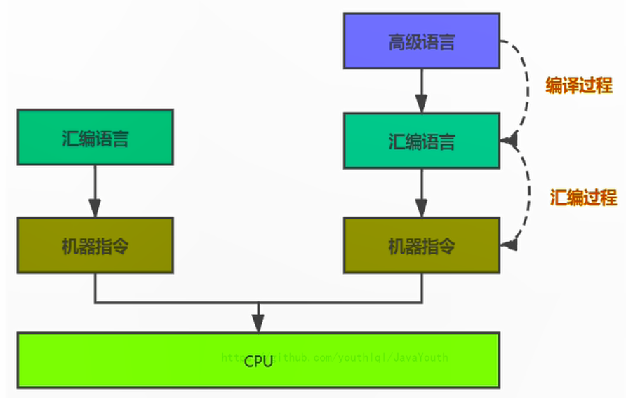


    
    
### 汇编语言
1. 在汇编语言中，用助记符（Mnemonics）代替机器指令的操作码，用地址符号（Symbol）
或标号（Label）代替指令或操作数的地址。
2. 不同硬件平台，汇编语言对应着不同的机器语言指令集，由于计算机只认识机器码，所以还要通
过汇编过程转换成机器指令。

### cpu指令
不同的硬件平台，各自支持的指令，是有差别的。因此每个平台所支持的指令，称之为对应平台的指令集。如常见的
1. x86指令集，对应的是x86架构的平台
2. ARM指令集，对应的是ARM架构的平台

指令就是把机器码中特定的0和1序列，简化成对应的指令（一般为英文简写，如mov，inc等），可读性稍好
具体相关的cpu指令可以参考计算机组成原理的一二三等地址指令设计过程。
### 机器码
1. 计算机能识别的二进制机器指令，叫做机器指令码，这就是机器语言。
2. 用它编写的程序一经输入计算机，CPU直接读取运行，因此和其他语言编的程序相比，执行速度最快。
3. 机器指令与CPU紧密相关，所以不同种类的CPU所对应的机器指令也就不同

## 执行引擎概述
**将字节码指令解释/编译为对应平台上的本地机器指令**。（因为本地机器指令无法识别字节码指令）
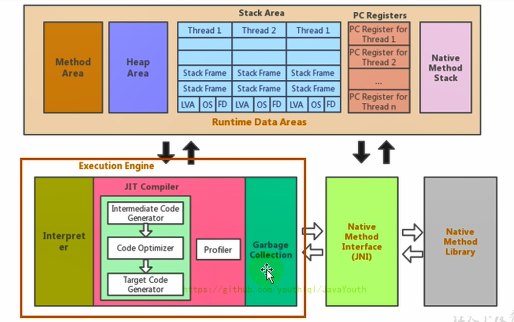
1. JVM的主要任务是负责装载字节码到其内部，但字节码并不能够直接运行在操作系统之上，因为
字节码指令并非等价于本地机器指令，它内部包含的仅仅只是一些能够被JVM所识别的字节码指
令、符号表，以及其他辅助信息。字节码如果要跑起来，必须通过执行引擎把字节码指令解释/编译
成对应平台的本地机器指令，简单来说**执行引擎是充当了字节码和机器语言之间的翻译官**。
2. 执行引擎是Java虚拟机核心的组成部分之一。“虚拟机”是一个相对于“物理机”的概念，这两种
机器都有代码执行能力，其区别是物理机的执行引擎是直接建立在处理器、缓存、指令集和操作
系统层面上的，而**虚拟机的执行引擎则是由软件自行实现的**，因此可以不受物理条件制约地定制
指令集与执行引擎的结构体系，能够执行那些不被硬件直接支持的指令集格式。

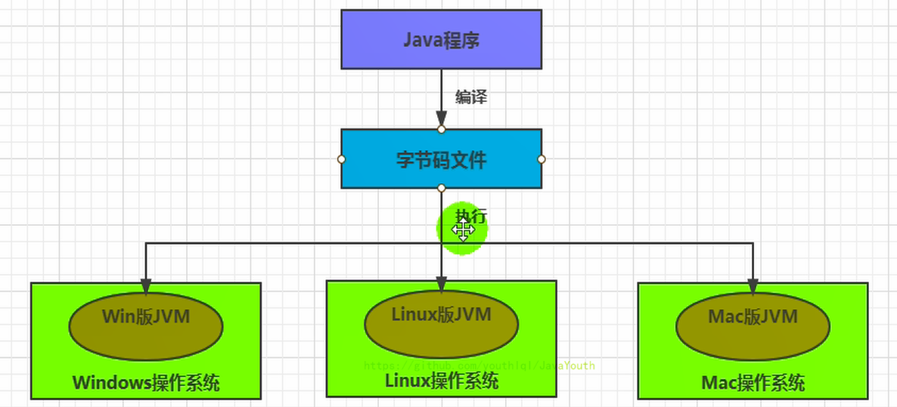

- 前端编译：从Java程序员.java -> 字节码.class文件的这个过程叫前端编译
- 执行引擎这里有两种行为：一种是解释执行，一种是编译执行（这里的是后端编译）。

### 执行引擎工作过程
1. **基于PC寄存器取下一条字节码指令**：执行引擎在执行的过程中究竟需要执行什么样的字节码指令
完全依赖于PC寄存器。每当执行完一项指令操作后，PC寄存器就会更新下一条需要被执行的指
令地址。
2. **执行引擎通过指针定位所需数据**：方法执行过程中会通过存储在（虚拟机栈）局部变量表中的对象
引用准确定位到存储在Java堆区中的对象实例信息，以及通过（堆）对象头中的元数据指针定位到目
标对象的（方法区）类型信息。
3. 执行引擎输入是字节码二进制流，处理是对字节码进行解析成机器指令执行
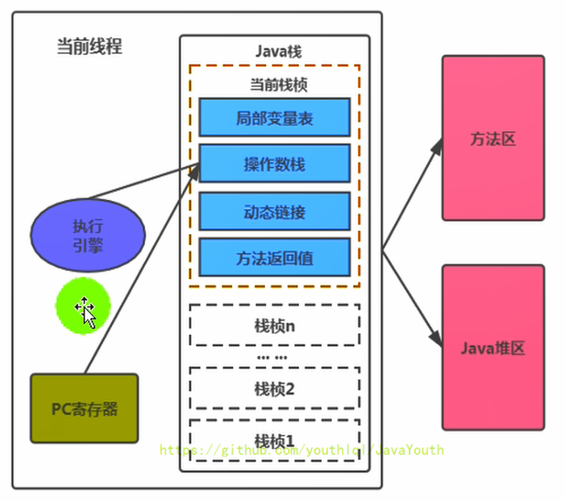

## java代码编译和执行过程

### 字节码解释执行和即时编译
大部分的程序代码转换成物理机的目标代码或虚拟机能执行的指令集之前，都需要经过下图中
的各个步骤
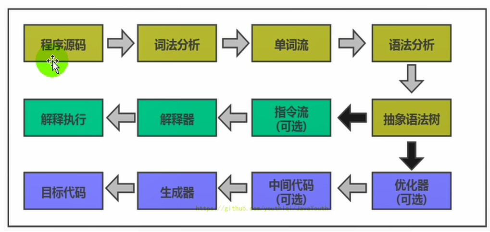
1. **前端编译（javac）.java -> .class**。前面橙色部分是javac编译器生成生成字节码文件的过程
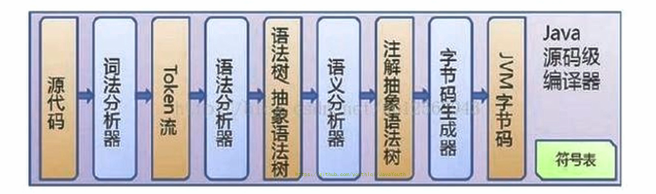
2. **后端编译：.class -> 机器码**。后面绿色（解释执行）和蓝色（即时编译）字节码具体执行才是JVM执行
引擎需要考虑的过程。
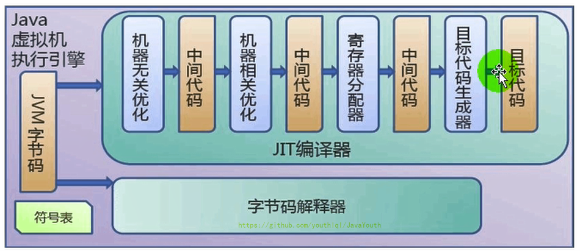

## 执行引擎组成（解释器+JIT编译器）
### 解释器 Intepreter
**解释器就是把字节码指令逐行翻译成机器指令。** 解释器真正意义上所承担的角色就是一个运行
时“翻译者”，执行引擎根据PC寄存器中记录的下一条需要执行的字节码指令取指令并且进行
翻译成机器指令执行。解释器设计的注重就满足Java跨平台特性，避免采用静态编译方式由高级
语言直接生成机器指令，从而诞生了解释器用来逐行翻译字节码。这也是字节码产生原因
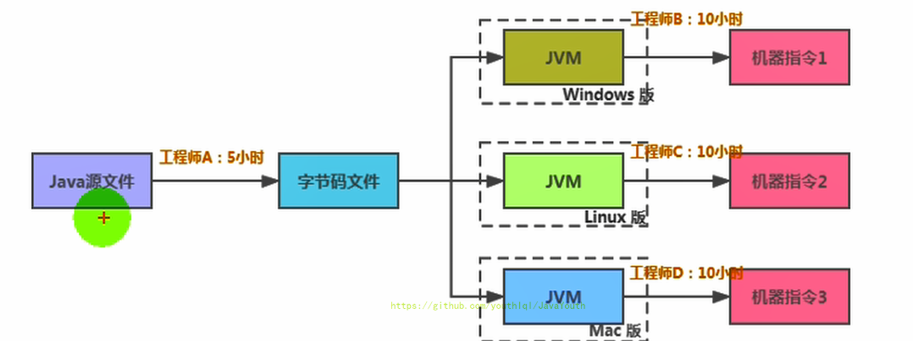
#### 解释器分类
古老的字节码解释器，普遍的模板解释器
- 字节码解释器在执行时通过纯软件代码模拟字节码的执行，效率非常低下。
- 模板解释器将每一条字节码和一个模板函数相关联，模板函数中直接产生这条字节码执行时的机器码，从而很大程
度上提高了解释器的性能。

在HotSpot VM中，解释器主要由Interpreter模块和Code模块构成。Interpreter模块：实现了解释器的核心功能，
Code模块：用于管理HotSpot VM在运行时生成的本地机器指令。
#### 解释器现状 
1. 由于解释器在设计和实现上非常简单，因此除了Java语言之外，还有许多高级语言同样也
是基于解释器执行的，比如Python、Perl、Ruby等。但是在今天，基于解释器执行已经沦落
为低效的代名词，并且时常被一些C/C++程序员所调侃。
2. 为了解决**解释器每条指令都要翻译成机器语言缺点**。JVM平台支持一种叫作即时编
译的技术。即时编译的目的是避免函数被解释执行，而是将整个函数体编译成为机器码，每次
函数执行时，只执行编译后的机器码即可，这种方式可以使执行效率大幅度提升。
### JIT编译器 JIT compliter
#### java中编译器概念
1. 前端编译器javac。javac编译器把.java文件变成 - > .class文件
2. 后端执行引擎的JIT编译器。把字节码转变成机器码（HotSpot VM的C1、C2编译器）
3. 静态提前编译器AOT。 JDK9引入AOT编译器，Ahead of time compiler，直接把.java变成本地机器码
存放到动态共享库中，静态AOT编译器是相对于JIT即时编译器来说的，JIT是在程序运行过程中
把字节码转换成机器码，但是AOT是程序运行前把字节码转换成机器码。

AOT编译器好处？java虚拟机加载已经预编译成共享二进制库，可以直接执行，速度最快。

AOT编译器缺点？破坏java“一次编译，到处运行”，因为执行方式不再是字节码，而是直接执行机器码，
机器码又和计算机平台有关，导致不同平台提前静态编译JOT不同发行包,降低了java链接过程的
动态性，JOT还在优化，JOT最初只支持Linux X64 java base。
#### JIT编译器诞生原因？
**解释器效率低。** 执行引擎的解释器虽然可以把字节码解析成机器语言，但是每条语句都要解释成机器语言，
如果一段代码多次调用同一个方法，那么每次方法都要解析成机器语言一次，因此没有机器语言
复用。JIT编译器诞生就是避免了函数被解释执行，把整个函数编译成机器码，每次函数被
调用时候，直接执行编译后的机器码，大大提高了效率（**JIT编译器效率比解释器快了十倍**）。

#### JIT编译器为什么高效？
**通过热点代码探测，把热点字节码翻译成本地机器指令，下次字节码调用直接执行对应机器码** 

1. 并不是所有的字节码都是启动JIT编译器进行编译成机器码，需要根据字节码被执行的频率，
执行频率高的字节码成为“热点代码”，JIT对这些热点字节码进行优化，直接翻译成本地
机器指令，从而提高性能。
2. 那么哪些字节码可称作“热点代码”？ 多次被调用的方法或者方法内部循环体。在方法执行
过程中，在栈上替换把这些字节码转换成机器码，下次执行这些字节码时直接执行机器码。
3. 方法或者循环体循环多少次才能变成“热点代码”？ JIT编译器对执行次数有一个阈值，通过
热点探测功能，把达到阈值的方法用JIT编译器编译成机器码，**Hotspot采用热点探测是
基于计数器的探测，HotSpot vm为每个方法建立方法调用计数器（统计方法调用次数）和
回边计数器（统计循环体执行次数）**

##### 方法调用计数器
这个计数器就用于统计方法被调用的次数，它的默认阀值在Client模式下是1500次，在Ser
ver模式下是10000次。超过这个阈值，就会触发JIT编译。阀值可以通过虚拟机参数 -XX:
CompileThreshold 来人为设定。

当一个方法被调用时，会先检查该方法是否存在被JIT编译过的版本
- 如果存在，则优先使用编译后的本地代码来执行（比解释器把字节码解析成机器码效率高）
- 如果不存在已被编译过的版本，则将此方法的调用计数器值加1，然后判断方法调用计数器
与回边计数器值之和是否超过方法调用计数器的阀值。如果已超过阈值，那么将会向即时编
译器提交一个该方法的代码编译请求。如果未超过阈值，则使用解释器对字节码文件解释执行
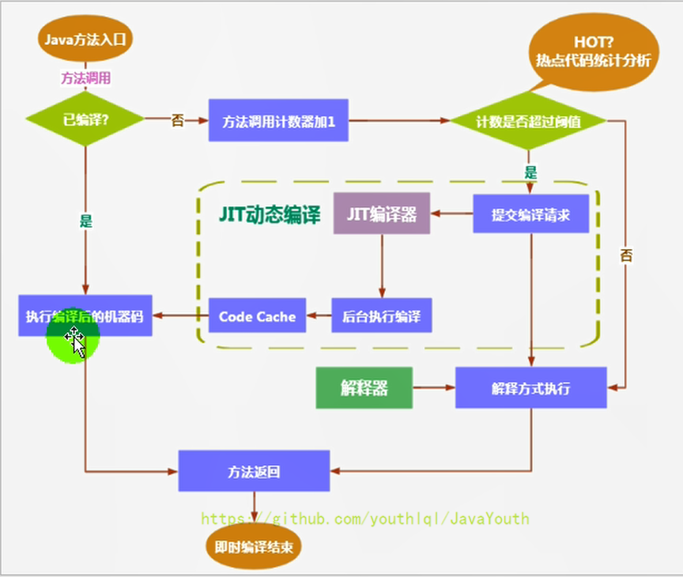
##### 回边计数器
它的作用是统计一个方法中循环体代码执行的次数，在字节码中遇到控制流向后跳转的指令称
为“回边”（Back Edge）。显然，建立回边计数器统计的目的就是为了触发OSR编译
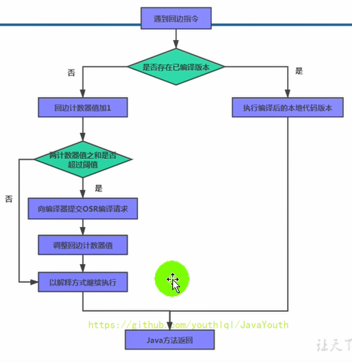

##### 热度衰减
1. 如果不做任何限制，方法调用计数器统计数值并不是被调用的绝对次数，而是一个相对的
执行频率，即一段时间之内方法被调用的次数。当超过一定的时间限度，如果方法的调用次
数仍然不足以让它提交给即时编译器编译，那这个方法的调用计数器就会被减少一半，这个
过程称为方法调用计数器热度的衰减（Counter Decay），而这段时间就称为此方法统计
的半衰周期（Counter Half Life Time）（半衰周期是化学中的概念，比如出土的文物
通过查看C60来获得文物的年龄）。
2. 进行**热度衰减的动作是在虚拟机进行垃圾收集时顺便进行的**，可以使用虚拟机参数 -XX:
-UseCounterDecay 来关闭热度衰减，让方法计数器统计方法调用的绝对次数，这样的话
，只要系统运行时间足够长，绝大部分方法都会被编译成本地代码
3. 另外，可以使用-XX:CounterHalfLifeTime参数设置半衰周期的时间，单位是秒。

#### 既然JIT编译器这么高效为什么HotSpot采用解释器和JIT并存架构？(面试问)
在JRockit VM虚拟机内，字节码执行引擎就不包括解释器，所有的字节码到机器码都是由编译器编译后执行。
因为JRocket只部署到服务器上，一般已经有时间让他进行指令编译的过程了，对于响应来
说要求不高，等及时编译器的编译完成后，就会提供更好的性能。

**总体上来说解释器和JIT编译器取长补短,各有优势**

**原因1、解释器响应速度快**：虚拟机启动的时候后，解释器可以马上发挥作用，响应速度快，不必
等待即时编译器全部编译完后再执行，省下很多时间。但是随着程序运行时间的推移
，即时编译器逐渐发挥作用，根据热点探测功能，把越来越多字节码编译为本地机器指令，这样可以减少
解释器的中间损耗，获得更高的程序执行效率。

**原因2、编译器执行效率高**，程序启动时必然花费大量时间把代码全部编译成本地机器
代码，但编译为本地代码后，执行效率高。对于服务应用来说，启动时间并不是重点，更
关注执行效率，因此JRocket只保留了编译器。

一般来说：机器在热机状态（已经运行了一段时间叫热机状态）可以承受的负载要大于冷
机状态（刚启动的时候叫冷机状态）。如果以热机状态时的流量进行切流，可能使处于冷机
状态的服务器因无法承载流量而假死。
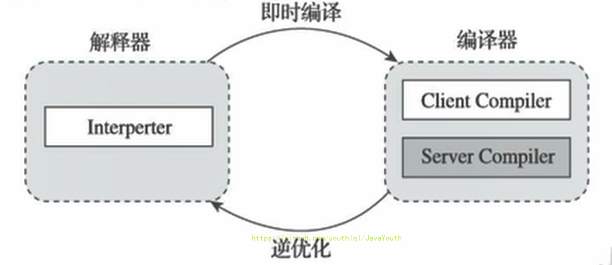
```java
public class JITTest {
    public static void main(String[] args) {
        ArrayList<String> list = new ArrayList<>();

        for (int i = 0; i < 1000; i++) {
            list.add("让天下没有难学的技术");
            try {
                Thread.sleep(1000);
            } catch (InterruptedException e) {
                e.printStackTrace();
            }
        }

    }
}

```
通过 JVisualVM 查看 JIT 编译器执行的编译次数
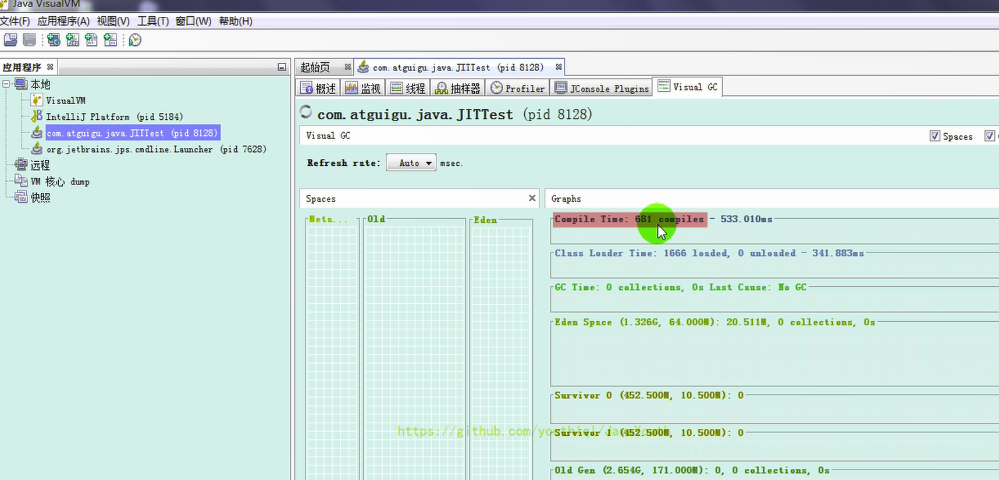

### HotSpotVM设置解释器和JIT编译器
默认HotSpot VM是采用解释器与即时编译器并存的架构，可以通过虚拟机参数指定执行方式。
1. -Xint：完全采用解释器模式执行程序；
2. -Xcomp：完全采用JIT编译器模式执行程序。如果即时编译出现问题，解释器会介入执行
3. -Xmixed：采用解释器+即时编译器的混合模式共同执行程序。
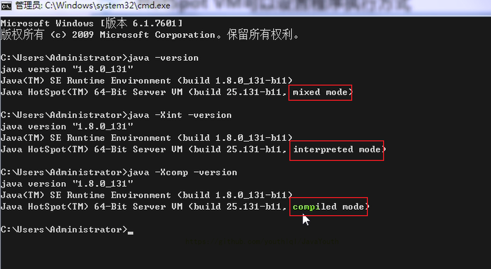

代码测试三种模式下执行效率
```java
/**
 * 测试解释器模式和JIT编译模式
 *  -Xint  : 6520ms
 *  -Xcomp : 950ms
 *  -Xmixed : 936ms
 */
public class IntCompTest {
    public static void main(String[] args) {
        long start = System.currentTimeMillis();
        testPrimeNumber(1000000);
        long end = System.currentTimeMillis();
        System.out.println("花费的时间为：" + (end - start));
    }
    public static void testPrimeNumber(int count){
        for (int i = 0; i < count; i++) {
            //计算100以内的质数
            label:for(int j = 2;j <= 100;j++){
                for(int k = 2;k <= Math.sqrt(j);k++){
                    if(j % k == 0){
                        continue label;
                    }
                }
            }
        }
    }
}

```
从结果也看出了，引入JIT编译器后，总体效率字节码->机器指令，比解释器提高了十倍，
这也解释了为什么要引入JIT编译器。

#### hotSpotVM jit分类
在HotSpot VM中内嵌有两个JIT编译器，分别为Client Compiler和Server Compiler
，但大多数情况下我们简称为**C1编译器 和 C2编译器**。HotSpot虚拟机通常是采用解释器与其中一个编译器直接搭配的方式工作,
开发人员可以通过如下命令显式指定Java虚拟机在运行时到底使用哪一种即时编译器，如下所示：

1. client模式下C1编译器会对字节码进行简单和可靠的优化，耗时短，以达到更快的编译速
度。C1编译器上优化策略主要有方法内联，去虚拟化、元余消除。
- 方法内联：将引用的函数代码编译到引用点处，这样可以减少栈帧的生成，减少参数传递以及跳转过程
- 去虚拟化：对唯一的实现樊进行内联
- 冗余消除：在运行期间把一些不会执行的代码折叠掉
2. server模式下，并使用C2编译器C2进行耗时较长的优化，以及激进优化，但优化的代码执
行效率更高。（使用C++），**C2的优化主要是在全局层面，逃逸分析是优化的基础** 。基于逃逸
分析在C2上有如下几种优化：（64位虚拟机默认server）
- 标量替换：用标量值代替聚合对象的属性值
- 栈上分配：对于未逃逸的对象分配对象在栈而不是堆（JIT实现栈上分配）
- 同步消除：清除同步操作，通常指synchronized

