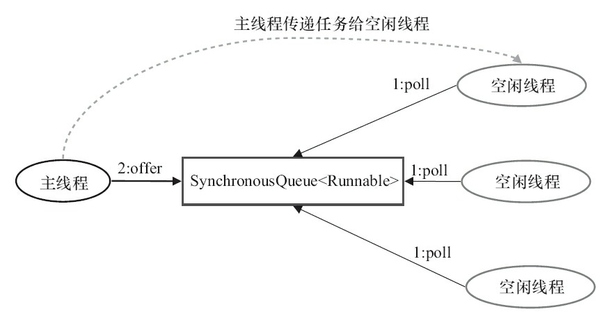

# Executor框架概述
在HotSpot VM的线程模型中，Java线程（java.lang.Thread）被一对一映射为本地操作系统线
程。，Java多线程程序通常把应用分解为若干个任务，然后使用用户级的调度器
（Executor框架）将这些任务映射为固定数量的线程；在底层，操作系统内核将这些线程映射到
  硬件处理器上。


## Executor框架基本机构
Executor框架中，任务的提交和任务的执行是分开的。
1. 任务：Runnable接口或Callable接口。
2. 任务的调度器：核心接口Executor，继承自ExecutorService，两个实现类ThreadPoolExecutor和ScheduledThreadPoolExecutor
3. 计算结果：Future和实现Future接口的FutureTask类


Executor框架使用过程。主线程创建实现Runnable或者Callable接口的任务对象，
把任务对象提交给ExecutorService执行ExecutorService.execute或者submit
执行结果返回给实现Future接口的对象FutureTask


## Executor框架主要成员
1. 任务：Runnable接口或Callable接口。
2. 任务的调度器：ThreadPoolExecutor和ScheduledThreadPoolExecutor
3. 计算结果：Future和实现Future接口的FutureTask类

# ThreadPoolExecutor详解（面试）

Executor框架最核心的类是ThreadPoolExecutor，它是线程池的实现类。
- corePool：核心线程池的大小。
- maximumPool：最大线程池的大小。
- BlockingQueue：用来暂时保存任务的工作队列。
- RejectedExecutionHandler：当ThreadPoolExecutor已经关闭或ThreadPoolExecutor已经饱和
时（达到了最大线程池大小且工作队列已满），execute()方法将要调用的Handler。
- 通过Executor框架的工具类Executors，可以创建3种类型的ThreadPoolExecutor。
1. FixedThreadPool。
2. SingleThreadExecutor。
3. CachedThreadPool。

## FixedThreadPool
FixedThreadPool被称为可重用固定线程数的线程池。
Executors.newFixedThreadPool(number)
```java_holder_method_tree
public static ExecutorService newFixedThreadPool(int nThreads) {
    return new ThreadPoolExecutor(nThreads, nThreads,
    0L, TimeUnit.MILLISECONDS,
    new LinkedBlockingQueue<Runnable>());
}
```
当线程池中的线程数大于corePoolSize时，keepAliveTime为多余的空闲线程等待新任务的
最长时间，超过这个时间后多余的线程将被终止。这里把keepAliveTime设置为0L，意味着多余
的空闲线程会被立即终止。


1. 如果当前运行的线程数少于corePoolSize，则创建新线程来执行任务。
2. 在线程池完成预热之后（当前运行的线程数等于corePoolSize），将任务加入
LinkedBlockingQueue。
3. 线程执行完1中的任务后，会在循环中反复从LinkedBlockingQueue获取任务来执行。
### 使用场景
为了满足资源管理的需求，而需要限制当前线程数量的应用场景，它适用于负载比较重的服务器

## SingleThreadExecutor详解
SingleThreadExecutor是使用单个worker线程的Executor
Executors.newSingleThreadExecutor()
```java_holder_method_tree
public static ExecutorService newSingleThreadExecutor() {
    return new FinalizableDelegatedExecutorService
    (new ThreadPoolExecutor(1, 1,0L, TimeUnit.MILLISECONDS,
    new LinkedBlockingQueue<Runnable>()));
}
```
corePoolSize和maximumPoolSize被设置为1,使用无界队列LinkedBlockingQueue作为线
程池的工作队列（队列的容量为Integer.MAX_VALUE）。

1. 如果当前运行的线程数少于corePoolSize（即线程池中无运行的线程），则创建一个新线
程来执行任务。
2. 在线程池完成预热之后（当前线程池中有一个运行的线程），将任务加入Linked-
BlockingQueue。
3. 线程执行完1中的任务后，会在一个无限循环中反复从LinkedBlockingQueue获取任务来
执行。
### 使用场景
适用于需要保证顺序地执行各个任务；并且在任意时间点，不会有多
个线程是活动的应用场景。

## CachedThreadPoo
CachedThreadPool是一个会根据需要创建新线程的线程池.
```java_holder_method_tree
public static ExecutorService newCachedThreadPool() {
    return new ThreadPoolExecutor(0, Integer.MAX_VALUE,
    60L, TimeUnit.SECONDS,
    new SynchronousQueue<Runnable>());
}
```
corePoolSize被设置为0,E，maximumPool是无界的,把keepAliveTime设置为60L，意味着
CachedThreadPool中的空闲线程等待新任务的最长时间为60秒，空闲线程超过60秒后将会被终止。
CachedThreadPool使用没有容量的SynchronousQueue作为线程池的工作队列，但
CachedThreadPool的maximumPool是无界的。这意味着，如果主线程提交任务的速度高于
maximumPool中线程处理任务的速度时，CachedThreadPool会不断创建新线程。极端情况下，
CachedThreadPool会因为创建过多线程而耗尽CPU和内存资源。


1. 首先执行SynchronousQueue.offer（Runnable task）。如果当前maximumPool中有空闲线程
正在执行SynchronousQueue.poll（keepAliveTime，TimeUnit.NANOSECONDS），那么主线程执行
offer操作与空闲线程执行的poll操作配对成功，主线程把任务交给空闲线程执行，execute()方
法执行完成；否则执行下面的步骤2）。
2. 当初始maximumPool为空，或者maximumPool中当前没有空闲线程时，将没有线程执行
SynchronousQueue.poll（keepAliveTime，TimeUnit.NANOSECONDS）。这种情况下，步骤1）将失
败。此时CachedThreadPool会创建一个新线程执行任务，execute()方法执行完成。
3. 在步骤2）中新创建的线程将任务执行完后，会执行
SynchronousQueue.poll（keepAliveTime，TimeUnit.NANOSECONDS）。这个poll操作会让空闲线
程最多在SynchronousQueue中等待60秒钟。如果60秒钟内主线程提交了一个新任务（主线程执
行步骤1）），那么这个空闲线程将执行主线程提交的新任务；否则，这个空闲线程将终止。由于
空闲60秒的空闲线程会被终止，因此长时间保持空闲的CachedThreadPool不会使用任何资源。


### 使用场景
适用于执行很多的短期异步任务的小程序，或者
是负载较轻的服务器。

# ScheduledThreadPoolExecutor（面试很少问）

ScheduledThreadPoolExecutor它主要用来在给定的延迟之后运行任务，或者定期执行任务,
构造函数中指定多个对应的后台线程数。

# FutureTask（面试少问）

待完成