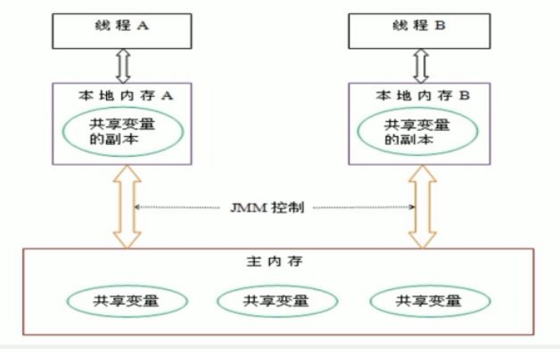

# Volatile

## 谈谈对Volatile的理解
Volatile在日常的单线程环境是应用不到的，volatile是轻量级（山寨）的synchronized，它在多处理器开发中保证了共享变量的“可见性”。
Volatile是Java虚拟机提供的轻量级的同步机制（三大特性）
- 保证可见性（内存屏障保证）
- 不保证原子性（i++写丢失）
- 禁止指令重排（内存屏障保证）

## Volatile保证可见性（内存屏障）

### 什么是可见性
**什么是可见性？**当一个线程修改一个共享变量时，另外一个线程能读到这个修改的值。
。如果一个字段被声明成volatile，Java线程内存模型JMM确保所有线程看到这个变量的值是一致的。
即：JMM内存模型的可见性，指的是当主内存区域中的值被某个线程写入更改后，其它线程会
马上知晓更改后的值，并重新得到更改后的值。
### 为什么会出现多线程共享数据的不可见问题？
为了提高处理器的执行速度，在处理器和内存之间增
加了多级缓存来提升。但是由于引入了多级缓存，就**存在缓存数据不一致问题**，导致线程
之间数据不可见。

### Volatile如何实现可见性？
不可见问题是由于存在缓存数据不一致，那么volatile作用就是解决缓存数据不一致。

```java_holder_method_tree
instance = new Singleton(); // instance是volatile变量
//汇编代码
0x01a3de1d: movb $0×0,0×1104800(%esi);0x01a3de24: lock addl $0×0,(%esp);
```
对由volatile修饰的共享变量进行写操作时候，汇编层面会加Lock指令，主要作用如下。

1. JVM向处理器发送Lock前缀指令，将当前处理器缓存行的数据写回到系统内存。
2. 这个写回内存的操作会使在其他CPU里缓存了该内存地址的数据无效。
- Lock前缀指令会引起处理器缓存回写到内存。现在的处理器声明Lock信号时候一般
不锁定总线，而是锁定这块内存区域对应的缓存，并且回写到主内存中，用缓存一致性协议
保证修改的原子性，这种操作时“缓存锁定”，缓存一致性协议阻止同时修改两个以上处理器缓存对应的内存区域数据。
- 一个处理器的缓存回写到主内存会导致其他处理器的缓存的该数据无效。处理器使用MESI
（修改、独占、共享、无效）控制协议去维护某个内部缓存和其他处理器缓存的一致性。
缓存一致性协议又是基于总线嗅探机制实现的，某个处理器嗅探到其他处理器准备写主存地址，那么
该处理器会把主内存对应自己缓存的缓存行无效。

**volatile写插入内存屏障：所有共享数据立刻刷新到主存**


**volatile读插入内存屏障：所有共享数据从主存中获取**


### 过多使用volatile修饰变量的缺点（总线风暴）
由于Volatile的MESI缓存一致性协议，需要不断的从主内存嗅探（通过总线获取数据）和CAS循环，无效的交互会
导致总线带宽达到峰值。因此不要大量使用volatile关键字，至于什么时候使用volatile、
什么时候用锁以及Syschonized都是需要根据实际场景的。

### JMM是什么
JMM是Java内存模型，也就是Java Memory Model，简称JMM，本身是**一种抽象的概念**，
实际上**并不存在**，它描述的是一组规则或规范，通过这组规范定义了程序中各个变量
（包括实例字段，静态字段和构成数组对象的元素）的访问方式。

JMM关于同步的规定(JMM规定保证原子性、可见性、有序性)：
- 线程解锁前，必须把共享变量的工作内存中值刷新回主内存
- 线程加锁前，必须读取主内存的最新值，到自己的工作内存
- 加锁和解锁是同一把锁

由于JVM运行程序的实体是线程，而每个线程创建时JVM都会为其创建一个工作内存（有些地方
称为栈空间），**工作内存是每个线程的私有数据区域**，而Java内存模型中规定所有变量都存储
在主内存，主内存是共享内存区域，所有线程都可以访问，但线程对变量的操作（读取赋值等）
必须在工作内存中进行，首先要将变量从主内存拷贝到自己的工作内存空间，然后对变量进行
操作，操作完成后再将变量写会主内存，**cpu不能直接操作主内存中的变量**，各个线程中的工作内存
中存储着主内存中的变量副本拷贝，因此不同的线程间无法访问对方的工作内存，线程间的
通信（传值）必须通过主内存来完成，其简要访问过程：


数据传输速率：硬盘 < 内存 < < cache < CPU
上面提到了两个概念：主内存 和 工作内存
- 主内存：就是计算机的内存，也就是经常提到的8G内存，16G内存
- 工作内存：但我们实例化 new student，那么 age = 25 也是存储在主内存中

当同时有三个线程同时访问 student中的age变量时，那么每个线程都会拷贝一份，到各自的工作内存，从而实现了变量的拷贝


### 可见性代码验证

#### 多线程操作共享数据（无可见性）
```java_holder_method_tree

/**
 * Volatile Java虚拟机提供的轻量级同步机制
 */

import java.util.concurrent.TimeUnit;

/**
 * 假设是主物理内存
 */
class MyData {

    int number = 0;

    public void addTo60() {
        this.number = 60;
    }
}

/**
 * 验证volatile的可见性
 * 1. 假设int number = 0， number变量之前没有添加volatile关键字修饰
 */
public class VolatileDemo {

    public static void main(String args []) {

        // 资源类
        MyData myData = new MyData();

        // AAA线程 实现了Runnable接口的，lambda表达式
        new Thread(() -> {

            System.out.println(Thread.currentThread().getName() + "\t come in");

            // 线程睡眠3秒，假设在进行运算
            try {
                TimeUnit.SECONDS.sleep(3);
            } catch (InterruptedException e) {
                e.printStackTrace();
            }
            // 修改number的值
            myData.addTo60();

            // 输出修改后的值
            System.out.println(Thread.currentThread().getName() + "\t update number value:" + myData.number);

        }, "AAA").start();

        while(myData.number == 0) {
            // main线程就一直在这里等待循环，直到number的值不等于零
        }

        // 按道理这个值是不可能打印出来的，因为主线程运行的时候，number的值为0，所以一直在循环
        // 如果能输出这句话，说明AAA线程在睡眠3秒后，更新的number的值，重新写入到主内存，并被main线程感知到了
        System.out.println(Thread.currentThread().getName() + "\t mission is over");

        /**
         * 最后输出结果：
         * AAA     come in
         * AAA     update number value:60
         * 最后线程没有停止，并行没有输出  mission is over 这句话，说明没有用volatile修饰的变量，是没有可见性
         */

    }
}

```
AAA线程修改了共享资源myData.number到主内存，但是Main线程由于从自己工作内存中拿myData.number数据，没有缓存一致性协议保证
因此缺少可见性。


#### 多线程操作共享数据（保证可见性）
```java_holder_method_tree
/**
 * 假设是主物理内存
 */
class MyData {
    /**
     * volatile 修饰的关键字，是为了增加 主线程和线程之间的可见性，只要有一个线程修改了内存中的值，其它线程也能马上感知
     */
    volatile int number = 0;

    public void addTo60() {
        this.number = 60;
    }
}
```
AAA线程修改了共享资源myData.number到主内存，由于是volatile变量，基于缓存一致性协议会使Main线程工作内存myData.number
数据失效，main线程从主内存从新读取myData.number的最新数值，因此保证了JMM内存模型的可见性。

## Volatile不保证原子性(写丢失)
先说结论：对任意单个volatile变量的读/写具有原子性（比如对volatile修饰的long64位变量读写操作都是原子性的，
但是对于非volatile修饰的64位置变量允许虚拟机读写操作划分为两次32位操作，但是目前主流商用虚拟机一般读写非volatile64修饰变量都是原子性的），
但类似于volatile++这种复合操作不具有原子性。

### 什么是原子性
不可分割，完整性，也就是说某个线程正在做某个具体业务时，中间不可以被加塞或者被分割，需要具体完成，要么同时成功，要么同时失败。
数据库也经常提到事务具备原子性

### 不保证原子性案例（volatile++）
20个线程同时操作共享变量执行i++操作
```java_holder_method_tree
 MyData myData = new MyData();
        // 创建10个线程，线程里面进行1000次循环
        for (int i = 0; i < 20; i++) {
            new Thread(() -> {
                // 里面
                for (int j = 0; j < 1000; j++) {
                    myData.addPlusPlus();
                }
            }, String.valueOf(i)).start();
        }
// 需要等待上面20个线程都计算完成后，在用main线程取得最终的结果值
while(Thread.activeCount() > 2) {
    // yield表示不执行
    Thread.yield();
}

```
然后在线程执行完毕后，我们在查看number的值，假设volatile保证原子性的话，那么最后输出的值应该是
20 * 1000 = 20000。但是最终执行结果出现了小于20000，出现了数值丢失。

### 为什么不保证原子性（写丢失）

各自线程在写入主内存的时候，出现了数据的丢失，而引起的数值缺失的问题。
将一个简单的number++操作，转换为字节码文件一探究竟
```java_holder_method_tree
public class T1 {
    volatile int n = 0;
    public void add() {
        n++;
    }
}
 i++字节码如下
 2: getfield      #2    // Field n:I
 5: iconst_1
 6: iadd
 7: putfield      #2    // Field n:I
```
- 执行getfield 从主内存拿到原始number放到线程工作内存中
- 执行iadd 对工作内存中number进行加1操作
- 执行putfileld 把工作内存中累加后的值number写回主内存

假设内存中有一个共享变量i=0，三个线程都执行getfield之后，三个线程内部的工作内存
中存储的number都是0，之后三个线程都执行了iadd后三个工作内存都变成了1，由于此时
还没有写入主内存（总线嗅探主内存没有变化），因此之后第一个线程执行了putfileld操作
把工作内存刷新到主内存此时主内存i=1，此时虽然有缓存一致性协议，其他线程缓存的是旧值
。但是其他线程已经执行完getfield和iadd操作，不需要在从主存中读取数据进行加一操作，
因此此后两个线程也执行了putfield操作，覆盖了原来的值造成了写丢失。

### 如何保证number++原子性

#### 杀鸡用牛刀Synchronzied
在方法上加入 synchronized(保证贡献变量的可见性、原子性、有序性)
```java_holder_method_tree
 public synchronized void addPlusPlus() {
        number ++;
    }
```

#### unsafe类的自旋锁+cas操作（往unsafe类的cas方向聊：详情查看2-3并发编程原子操作实现原理）
```java_holder_method_tree
**
     *  创建一个原子Integer包装类，默认为0
      */
    AtomicInteger atomicInteger = new AtomicInteger();

    public void addAtomic() {
        // 相当于 atomicInter ++
        atomicInteger.getAndIncrement();
    }
unsafe类的getAndIncrement
public final int getAndAddInt(Object var1, long var2, int var4) {
        int var5;
        do {
            var5 = this.getIntVolatile(var1, var2);
        } while(!this.compareAndSwapInt(var1, var2, var5, var5 + var4));

        return var5;
    }
```

[JVM 虚拟机字节码指令表](https://segmentfault.com/a/1190000008722128 "字节码")

## Volatile禁止指令重排

### 为什么存在指令重排
计算机在执行程序时，为了提高性能，编译器和处理器常常会对指令重排，一般分为以下三种：
源代码 -> 编译器优化的重排 -> 指令并行的重排 -> 内存系统的重排 -> 最终执行指令

JMM内存模型保证单线程环境无论挖掘潜在的指令指令重拍能力，最终执行结果和代码顺序的
结果一致。处理器在进行重排序时，必须要考虑指令之间的数据依赖性

多线程环境中线程交替执行，由于编译器优化重排的存在，两个线程中使用的变量能否保证一致性是无法确定的，结果无法预测

### 单线程指令重排（结果正常）
```java_holder_method_tree
public void mySort() {
    int x = 11;
    int y = 12;
    x = x + 5;
    y = x * x;
}
```
按照正常单线程环境，执行顺序是 1 2 3 4。但是编译器为了提高性能，对无数据依赖的指令
可能进行指令重排。比如重排 2 1 3 4或者 1 3 2 4等等。但是JMM保证单线程条件下
无论编译器怎么重排输出结果必须和顺序执行结果时候一致。

### 多线程指令重排（结果不一致）
共享变量 int a,b,x,y = 0

|  线程1   | 线程2  |
|  ----  | ----  |
| x = a  | y = b |
| b = 1  | a = 2 |
正常假设线程1和线程2交替执行，不存在指令重排。x=a,y=b,b=1,a=2。结果x=y=0

但是多线程并发情况下可能是交替执行。
对于线程1编译器认为 x和b的赋值操作不存在数据依赖可以考虑重排。对于线程2编译器任务y和a
的赋值操作不存在数据以来，可以考虑重排。因此可能重排结果如下所示。

|  线程1   | 线程2  |
|  ----  | ----  |
| b = 1  | a = 2 |
| x = a  | y = b |

指令重排后执行顺序，b=1,a=2,x=a=2,y=b=1。 **x=2,y=1**

**下一个案例：指令重排导致计算结果不一致**
```java_holder_method_tree
public class ResortSeqDemo {
    int a= 0;
    boolean flag = false;

    public void method01() {
        a = 1;
        flag = true;
    }

    public void method02() {
        if(flag) {
            a = a + 5;
            System.out.println("reValue:" + a);
        }
    }
}
```
我们按照正常的顺序执行思维，分别调用method01() 和 method02() 那么最终输出
要么不输出，要么输出输出6。但是实际并发执行的时候，输出结果还有可能是5，这就是
指令重排导致的，因为方法1 内部两个变量赋值不存在数据依赖因此编译器可以
考虑指令重排。
```java_holder_method_tree
        flag = true;
        a = 1;     
```
方法1重排指令先执行了flag=true后由于cpu调度执行了方法2导致输出是5.

### volatile如何实现禁止指令重排（插入内存屏障）

Volatile实现禁止指令重排优化，从而避免了多线程环境下程序出现乱序执行的现象。
首先了解一个概念，内存屏障（Memory Barrier）又称内存栅栏，是一个CPU指令，它的作用有两个
- **禁止指令重排**
- **保证**某些变量的**内存可见性**（利用该特性实现volatile的内存可见性）

由于编译器和处理器都能执行指令重排的优化，如果在指令间插入一条Memory Barrier则
会告诉编译器和CPU，不管什么指令都不能和这条Memory Barrier指令重排序，也就是说 
通过插入内存屏障禁止在内存屏障前后的指令执行重排序优化。 内存屏障另外一个作用是刷
新出各种CPU的缓存数，因此任何CPU上的线程都能读取到这些数据的最新版本。


volatile读写操作，通过插入内存屏障一方面可以禁止指令重排序，另一方面保证内存可见性(所有共享变量刷新到主存或者从主存中获取)。

**volatile写插入内存屏障**


**volatile读插入内存屏障**


## 哪里使用到volatile？

### 单例模式双重校验锁
背景：多线程中有时候需要通过延迟初始化手段降低初始化类和创建对象的开销。比如
一个单例对象需要懒加载，我第一次需要的时候在加载初始化。双重检查锁是常见的延迟初始化技术。

#### 版本1：非线程安全的延迟初始化
```java
    public class UnsafeLazyInitialization {
        private static Instance instance;
        public static Instance getInstance() {
        if (instance == null) // 1：A线程执行
            instance = new Instance(); // 2：B线程执行
            return instance;
        }
    }
```
A线程执行代码1的同时，B线程执行代码2。此时，线程A可能会看到instance引用的对象还没有完成初始化.
(初始化过程中重排序导致)

#### 版本2：JVM早期性能低下的线程安全延迟初始化
```java
public class SafeLazyInitialization {
    private static Instance instance;
    //早期上来就是一把重量级锁
    public synchronized static Instance getInstance() {
        if (instance == null)
        instance = new Instance();
        return instance;
    }
}
```
缺点：无论是单线程或者多线程频繁调用性能都很低（重锁）

#### 版本3：“聪明技巧”双重检查锁定
```java
public class DoubleCheckedLocking { // 1
    private static Instance instance; // 2
    public static Instance getInstance() { // 3
    if (instance == null) { // 4:第一次检查
        synchronized (DoubleCheckedLocking.class) { // 5:加锁
            if (instance == null) // 6:第二次检查
                instance = new Instance(); // 7:问题的根源出在这里
            } // 8
        } // 9
        return instance; // 10
    } // 11
}
```
第一次检查instance！=null,那么直接返回，因此降低了syn带来的性能开销。
但是，这个return返回的instance可能并没有初始化成功。（对象初始化重排序）
```java
    memory = allocate();　　// 1：分配对象的内存空间
    ctorInstance(memory);　 // 2：初始化对象
    instance = memory;　　 // 3：设置instance指向刚分配的内存地址
    
    memory = allocate();　　// 1：分配对象的内存空间
    instance = memory;　　 // 3：设置instance指向刚分配的内存地址
    // 注意，此时对象还没有被初始化！
    ctorInstance(memory);　 // 2：初始化对象
```
2,3这里可能重排序，导致对象未初始化成功就提前对instance指向内存了memery。


解决“聪明”双重校验方法
1. 不允许2和3重排序。volatile
2. 允许2和3重排序，但不允许其他线程“看到”这个重排序。

#### 基于volatile线程安全的双重校验

```java
public class SafeDoubleCheckedLocking {
    private volatile static Instance instance;
    //班级来一个插班生张三
    public static Instance getInstance() {
        if (instance == null) {//老师问座位上有没有人。此时没人
            synchronized (SafeDoubleCheckedLocking.class) {//老师又说这个座位我要占用
                if (instance == null)//老师再次确定这个座位有没有人，此刻没人
                    instance = new Instance(); // instance为volatile，现在没问题了。老师把位置分配给了张三
                }
            }
        return instance;
    }
}

instance变量赋值汇编代码
0x01a3de0f: mov $0x3375cdb0,%esi ;...beb0cd75 33
                                ; {oop('Singleton')}
0x01a3de14: mov %eax,0x150(%esi) ;...89865001 0000
0x01a3de1a: shr $0x9,%esi ;...c1ee09
0x01a3de1d: movb $0x0,0x1104800(%esi) ;...c6860048 100100
0x01a3de24: lock addl $0x0,(%esp)    ;...f0830424 00
                                    ;*putstatic instance
                                    ; - Singleton::getInstance@24
```
赋值后（前面mov%eax，0x150(%esi)这句便是赋值操作）多执行了一个“lock addl$0x0，
(%esp)”操作，这个操作的作用相当于一个内存屏障（Memory Barrier或Memory Fence，指
重排序时不能把后面的指令重排序到内存屏障之前的位置（禁止指令重排）。Lock指令（立刻同步保证可见性）它的作用是将本处理器的缓存写入
了内存，该写入动作也会引起别的处理器或者别的内核无效化（Invalidate）其缓存。
当声明对象的引用为volatile后，2和3之间的重排序，在多线程环境中将会被禁止。
```java
    memory = allocate();　　// 1：分配对象的内存空间
    ctorInstance(memory);　 // 2：初始化对象
    插入StoreStore屏障，直至2与3进行指令重排
    instance = memory;　　 // 3：设置instance指向刚分配的内存地址
    StoreLoad屏障
```

## Atomicinteger的value属性就是volatile，使用cas比较交换（详情查看2-3并发编程原子操作实现原理）


# 别人的博客文章

[再有人问你Java内存模型是什么，就把这篇文章发给他。](https://www.hollischuang.com/archives/2550 "afa")

[内存模型是怎么解决缓存一致性问题的？](https://www.hollischuang.com/archives/2662 "afa")

[深入理解Java中的volatile关键字](https://www.hollischuang.com/archives/2648 "asdfa")

[再有人问你volatile是什么，把这篇文章也发给他。](https://www.hollischuang.com/archives/2673 "fafda")

[既生synchronized，何生volatile](https://www.hollischuang.com/archives/3928 "adf")


