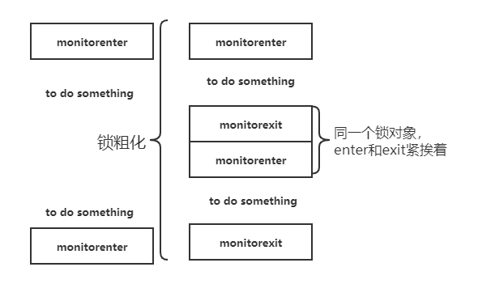

# 自旋锁

引入自旋锁背景：jdk1.6之前的synchronzied都是重量级锁，通过对象的Monitor进行加锁解锁，这是一把重量级锁
锁的申请需要操作系统的互斥信号量支持，因此会导致从用户态，内核态，用户态的切换，操作系统对线程状态的切换
开销很大。因此jdk开发团队引入了自旋锁提高获取锁释放锁性能。

例子：重量级锁情况-》去银行柜台办理业务，a用户取完号码后被叫到柜台，此时b用户也来办理业务取号，jdk1.6之前的做法是，让用户自己
走到休息区（操作系统帮助阻塞），自己做自己的事情，等待被叫号到柜台（操作系统帮助唤醒）。如果每个人去柜台只是去取款，耗时非常短，
但是重量级锁仍然要求操作系统帮助阻塞和唤醒（线程状态切换），很明显线程阻塞唤醒性能消耗远大于取款消耗，很明显不合理。

引入自旋锁之后-》 银行引入了取款机，用户只需要排队去取款机上取款就可以，不需要进入到休息区（线程阻塞），当a用户在取款时候，后面的b用户只需要不断地
观察（自旋）a是否取款完成，如果发现a取款完成，后面直接上去取款。b用户线程始终出于用户态，随然自旋观察a用户，但是这个耗时相比于线程状态切换，耗时非常短。
但是如果a后面有很多的排队用户，每个用户都在不停的自旋观察a是否取款结束，那么cpu自旋所占用的时间就变得很大。

## 自旋和阻塞区别
最大区别就是是否有线程状态的切换。自旋状态下，线程仍然是用户态，不断消耗cpu运行时间。但是阻塞状态下（休息区），线程从用户态到内核态
转换，并且出于阻塞态的阻塞队列中，此时不会消耗cpu运行时间。

# 锁消除

## 锁消除背景
锁的产生背景是多线程并发访问修改共享变量此时需要用锁来同步。但是问题来了，如果一个没有经验的程序员在不需要加锁同步的地方加了锁反而降低了效率。
如果你有并发编程经验的话，下面的函数中的锁obj是函数内局部变量，不可能被发布到函数外部，不会被共享。 因此不存在同步问题。

如果同步代码块中的锁，通过JIT的逃逸分析技术判定，该锁只能被一个线程访问，不可能“泄露”到外部被其他线程访问的话，JIT编译器就会取消对同步代码快的同步。

```java
public void lockEliminate(){
        Object obj=new Object();
        synchronized (obj){
            // to do
        }
    }
```

```java

经过JIT编译器逃逸技术分析优化后的效果
public void lockEliminate(){
        Object obj=new Object();
        
            // to do
        
    }
```
 
## 锁消除性能提升程度
```java
public static void main(String[] args) {
        long start = System.currentTimeMillis();
        for (int i = 0; i < 20000000; i++) {
            test();
        }
        long end = System.currentTimeMillis();
        System.out.println(end - start);
    }

    public static  void test(){
        //-server  -XX:+DoEscapeAnalysis  -XX:-EliminateLocks  关闭锁消除虚拟机参数
        //-server  -XX:+DoEscapeAnalysis  -XX:+EliminateLocks  开启锁消除虚拟机参数
        StringBuffer stringBuffer = new StringBuffer();
            stringBuffer.append("yan");

    } 
 ```
在关闭虚拟机锁消除的策略下，平均耗时900nm，打开虚拟机锁消除情况下平均耗时500nm.锁消除状态下的StringBuffer性能几乎接近StringBuilder，是StringBuilder耗时的120%，但是非锁消除状态是StringBuilder耗时的210%。


# 锁粗化
## 产生背景
HotSpot虚拟机还有一些额外的锁优化的技术，虽然从技术上讲它们并不属于逃逸分析子系统中的一部分，但也是通过分析作用域来提高内部锁的性能。当连续获取同一个对象的锁时，HotSpot虚拟机会去检查多个锁区域是否能合并成一个更大的锁区域。这种聚合被称作锁粗化，它能够减少加锁和解锁的消耗。
当HotSpot 
**JVM发现需要加锁时，它会尝试往前查找同一个对象的解锁操作。如果能匹配上，它会考虑是否要将两个锁区域作合并，并删除一组解锁/加锁操**作



```java
for(int i=0;i<100000;i++){  
    synchronized(this){  
        // to do 
         }
} 
```

```java
编译器会对锁进行粗化为

synchronized(this){  
for(int i=0;i<100000;i++){  
        // to do        
} 
}
```

# 嵌套锁

同步块可能会一个嵌套一个，进而两个块使用同一个对象的监视器锁来进行同步也是很有可能的。这种情况我们称之为嵌套锁，HotSpot虚拟机是可以识别出来并删除掉内部块中的锁的。当一个线程进入外部块时就已经获取到锁了，因此当它尝试进入内部块时，肯定也仍持有这个锁，所以这个时候删除锁是可行的。

在写作本文的时候，Java 8中的嵌套锁删除只有在锁被声明为static final或者锁的是this对象时才可能发生。

```java
Object object=new Object();
        synchronized (object){
            synchronized (object){
                System.out.println("synchronized");
            }
        }
```
```java
优化后的代码
Object object=new Object();
        synchronized (object){
            
                System.out.println("synchronized");
            
        }
```        
        
        
[jvm优化之逃逸分析及锁消除](http://ifeve.com/jvm%E4%BC%98%E5%8C%96%E4%B9%8B%E9%80%83%E9%80%B8%E5%88%86%E6%9E%90%E5%8F%8A%E9%94%81%E6%B6%88%E9%99%A4/)