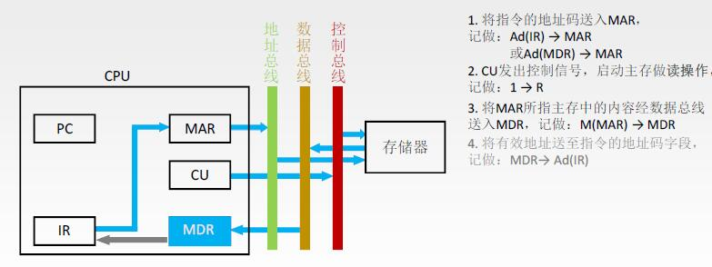
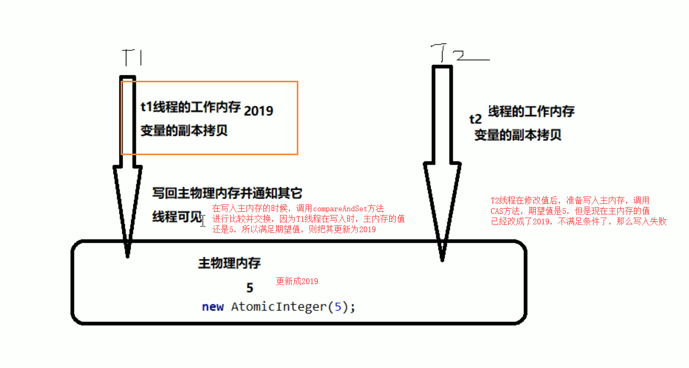
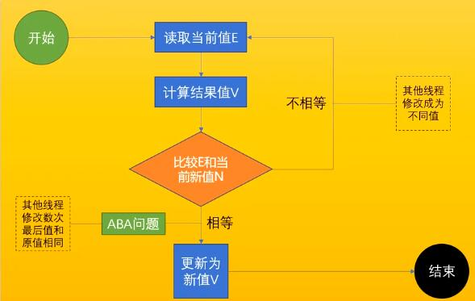
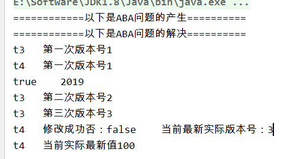

# 什么是原子操作

不可被中断的一个或一系列操作

## 处理器如何实现原子操作

一般通过缓存cache或总线加锁的方式实现多处理器之间原子操作。

### 总线加锁（重量级锁）

学过计算机组成原理的话应该知道，cpu的指令周期数据流中的间址周期中，cpu和存储器之间的数据交互
必须要通过总线（地址、数据、控制），比如cpu从存贮器地址xx0001中取出数据过程是，由mar地址传输到地址总线，CU控制单元发出控制信号开始读取。
读取的数据经过数据总线传输到MDR中，因此cpu和存储器的数据交互必须经过总线。多cpu情况下，为了保证对存储器中某个共享变量的修改的原子性比如i++，cpu1执行i++操作时候
使用总线锁LOCK#信号发送到总线上，其他cpu2如果想和存储器进行数据交互i++请求都会被阻塞住，因此可以保证cpu1执行i++操作的原子性。

缺点：这是一把重锁，虽然可以实现原子操作，但是如果其他处理器访问的不是i++那块存储器也会被阻塞住，很明显不合理。




### 缓存加锁保障原子性（轻量级锁）

所谓“缓存锁定”是指内存区域如果被缓存在处理器的缓存
行中，并且在Lock操作期间被锁定，那么当它执行锁操作回写到内存时，处理器不在总线上声
言LOCK＃信号，而是修改内部的内存地址，并允许它的缓存一致性机制来保证操作的原子
性，因为缓存一致性机制会阻止同时修改由两个以上处理器缓存的内存区域数据。


## java如何实现原子操作

主要两种方式 加锁synchronized和循环CAS方式

### 加锁实现原子操作

锁机制保证了只有获得锁的线程才能够操作锁定的内存区域。
```java
synchronized(obj){
    to do 1
    to do 2
    ....
}
```

### 循环cas(与JMM工作内存主内存有关)
CAS的全称是Compare-And-Swap，它是CPU并发原语它的功能是判断内存某个位置的值是否为
预期值，如果是则更改为新的值，这个过程是原子的CAS并发原语体现在Java语言中就是sun.
misc.Unsafe类的各个方法。调用UnSafe类中的CAS方法，JVM会帮我们实现出CAS汇编指令，
这是一种完全依赖于硬件的功能，通过它实现了原子操作，再次强调，由于CAS是一种系统原语，
原语属于操作系统用于范畴，是由若干条指令组成，用于完成某个功能的一个过程，并且原语的
执行必须是连续的，在执行过程中不允许被中断，也就是说CAS是一条CPU的原子指令，不会
造成所谓的数据不一致的问题，也就是说CAS是线程安全的。
JVM中CAS使用了cpu的cmpxchg指令实现，不断循环执行cas直到成功为止。

代码使用案例
```java_holder_method_tree
// 创建一个原子类
AtomicInteger atomicInteger = new AtomicInteger(5);
然后调用CAS方法，企图更新成2019，这里有两个参数，一个是5，表示期望值，第二个就是我们要更新的值
atomicInteger.compareAndSet(5, 2019)
然后再次使用了一个方法，同样将值改成1024
atomicInteger.compareAndSet(5, 1024)
```
完整代码
```java_holder_method_tree

public class CASDemo {
    public static void main(String[] args) {
        // 创建一个原子类
        AtomicInteger atomicInteger = new AtomicInteger(5);
        /**
         * 一个是期望值，一个是更新值，但期望值和原来的值相同时，才能够更改
         * 假设三秒前，我拿的是5，也就是expect为5，然后我需要更新成 2019
         */
        System.out.println(atomicInteger.compareAndSet(5, 2019) + "\t current data: " + atomicInteger.get());
        System.out.println(atomicInteger.compareAndSet(5, 1024) + "\t current data: " + atomicInteger.get());
        // true current data :2019
        // false current data:2019
    }
}
//AtomicInteger类
public final boolean compareAndSet(int expect, int update) {
        return unsafe.compareAndSwapInt(this, valueOffset, expect, update);
    }
```


**unsafe类的cas操作其实和JMM内存模型有关的**，unsafe.compareAndSwapInt(this, valueOffset, expect, update)
unsafe类根据this,valueOffset获取主内存变量值，expect是线程工作内存数值，如果这两个相等才去主内存变量跟
更新为update

#### CAS底层原理
常见的i++操作在AtomicInteger中的实现方式。
首先我们先看看 atomicInteger.getAndIncrement()方法的源码


从这里能够看到，底层又调用了一个unsafe类的getAndAddInt方法

1. unsafe类


Unsafe是CAS的核心类，由于Java方法无法直接访问底层系统，需要通过本地（Native）方法来访问，Unsafe相当于一个后门，基于该类可以直接操作特定的内存数据。Unsafe类存在sun.misc包中，其内部方法操作可以像C的指针一样直接操作内存，因为Java中的CAS操作的执行依赖于Unsafe类的方法。
注意Unsafe类的所有方法都是native修饰的，也就是说unsafe类中的方法都直接调用操作系统底层资源执行相应的任务

为什么Atomic修饰的包装类，能够保证原子性，依靠的就是底层的unsafe类

2. 变量valueOffset
表示该变量值在内存中的偏移地址，因为Unsafe就是根据内存偏移地址获取数据的。

从这里我们能够看到，通过valueOffset，直接通过内存地址，获取到值，然后进行加1的操作

3、变量value用volatile修饰
保证了多线程之间的内存可见性


var5：this.getIntVolatile(var1,var2)从主内存拷贝数据到工作内存(每次都要从主
内存拿到最新的值到自己的本地内存），然后执行compareAndSwapInt()工作内存中var5
和主内存数值进行比较，相等就更新为var5+var4。

假设执行 compareAndSwapInt返回false，说明主内存和当前工作内存var5数值不一样，
说明有别的线程更新了主内存数值，因此从新执行while循环。
- val1：AtomicInteger对象本身
- var2：该对象值得引用地址
- var4：需要增加的数值
- var5：根据val1和var2获取的工作内存数值
用该对象主内存数值与var5比较。
如果相同，更新var5 + var4 并返回true。
如果不同，继续取值然后再比较，直到更新完成。

假设线程A和线程B同时执行getAndInt操作（分别跑在不同的CPU上）

1. AtomicInteger里面的value原始值为3，即主内存中AtomicInteger的 value 为3，根据JMM模型，线程A和线程B各自持有一份价值为3的副本，分别存储在各自的工作内存
2. 线程A通过getIntVolatile(var1 , var2) 拿到工作内存value值3，这是线程A被挂起（该线程失去CPU执行权）
3. 线程B也通过getIntVolatile(var1, var2)方法获取到value值也是3，此时刚好线程B没有被挂起，并执行了compareAndSwapInt方法，比较内存的值也是3，成功修改内存值为4，线程B打完收工，一切OK
4. 这是线程A恢复，执行CAS方法，比较发现自己手里的数字3和主内存中的数字4不一致，说明该值已经被其它线程抢先一步修改过了，那么A线程本次修改失败，只能够重新读取后在来一遍了，也就是在执行do while
5. 线程A重新获取value值，因为变量value被volatile修饰，所以其它线程对它的修改，线程A总能够看到，线程A继续执行compareAndSwapInt进行比较替换，直到成功。
Unsafe类 + CAS思想： 也就是自旋，自我旋转

底层汇编：
Unsafe类中的compareAndSwapInt是一个本地方法，该方法的实现位于unsafe.cpp中
```java_holder_method_tree
return Atomic::cmpxchg(x, addr, e)==e;
```
1. 先想办法拿到变量value在内存中的地址
2. 通过Atomic::cmpxchg实现比较替换，其中参数X是即将更新的值，参数e是原内存的值




### cas缺点是什么
#### 因为cas只关注开始和结束导致 ABA问题
**先说结论：CAS只管开头和结尾，也就是头和尾是一样，那就修改成功，中间的这个过程，可能会被人修改过.**  线程1通过var5=getVolatile(var1,var2)获取到工作内存中是A1,此后cpu发生调度线程2
通过cas更新了A变成B之后又一次cas更新成A。此刻cpu发生调度，线程1执行cas发现
主内存是A自己工作内存也是A，以为变量没有发生变化，其实已经变化了多次。
解决： 使用版本号 1A->2B>3A

#### 原子引用类AtomicReference演示ABA问题
原子引用其实和原子包装类是差不多的概念，就是将一个java类，用原子引用类进行包装起来
，那么这个类就具备了原子性,只是比较与交换的是一个自定义的对象。对象引用的更新以源自方式更新。


```java_holder_method_tree
class User {
    String userName;
    int age;
    public User(String userName, int age) {
        this.userName = userName;
        this.age = age;
    }
    public String getUserName() {
        return userName;
    }
    public void setUserName(String userName) {
        this.userName = userName;
    }
    public int getAge() {
        return age;
    }
    public void setAge(int age) {
        this.age = age;
    }
    @Override
    public String toString() {
        return "User{" +
                "userName='" + userName + '\'' +
                ", age=" + age +
                '}';
    }
}
public class AtomicReferenceDemo {
    public static void main(String[] args) {
        User z3 = new User("z3", 22);
        User l4 = new User("l4", 25);
        // 创建原子引用包装类
        AtomicReference<User> atomicReference = new AtomicReference<>();
        // 现在主物理内存的共享变量，为z3
        atomicReference.set(z3);
        // 比较并交换，如果现在主物理内存的值为z3，那么交换成l4
        System.out.println(atomicReference.compareAndSet(z3, l4) + "\t " + atomicReference.get().toString());
        // 比较并交换，现在主物理内存的值是l4了，但是预期为z3，因此交换失败
        System.out.println(atomicReference.compareAndSet(z3, l4) + "\t " + atomicReference.get().toString());
    }
}
```
基于源自引用类演示ABA问题
```java_holder_method_tree
public class ABADemo {

    /**
     * 普通的原子引用包装类
     */
    static AtomicReference<Integer> atomicReference = new AtomicReference<>(100);

    public static void main(String[] args) {

        new Thread(() -> {
            // 把100 改成 101 然后在改成100，也就是ABA
            atomicReference.compareAndSet(100, 101);
            atomicReference.compareAndSet(101, 100);
        }, "t1").start();

        new Thread(() -> {
            try {
                // 睡眠一秒，保证t1线程，完成了ABA操作
                TimeUnit.SECONDS.sleep(1);
            } catch (InterruptedException e) {
                e.printStackTrace();
            }
            // 把100 改成 101 然后在改成100，也就是ABA
            System.out.println(atomicReference.compareAndSet(100, 2019) + "\t" + atomicReference.get());

        }, "t2").start();
    }
}

true / t 2019
```

#### 版本号AtomicStampedReference解决ABA问题
新增一种机制，也就是修改版本号，类似于时间戳的概念
```java_holder_method_tree
thread1： 100 1 2019 2
thread2： 100 1 101 2 100 3
```
如果T1修改的时候，版本号为2，落后于现在的版本号3，所以要重新获取最新值，这里就提出了一个使用时间戳版本号，来解决ABA问题的思路
AtomicStampedReference:时间戳原子引用，来这里应用于版本号的更新，也就是每次更新的时候，需要比较期望值和当前值，以及期望版本号和当前版本号

```java_holder_method_tree
public class ABADemo {

    /**
     * 普通的原子引用包装类
     */
    static AtomicReference<Integer> atomicReference = new AtomicReference<>(100);

    // 传递两个值，一个是初始值，一个是初始版本号
    static AtomicStampedReference<Integer> atomicStampedReference = new AtomicStampedReference<>(100, 1);

    public static void main(String[] args) {

        System.out.println("============以下是ABA问题的产生==========");

        new Thread(() -> {
            // 把100 改成 101 然后在改成100，也就是ABA
            atomicReference.compareAndSet(100, 101);
            atomicReference.compareAndSet(101, 100);
        }, "t1").start();

        new Thread(() -> {
            try {
                // 睡眠一秒，保证t1线程，完成了ABA操作
                TimeUnit.SECONDS.sleep(1);
            } catch (InterruptedException e) {
                e.printStackTrace();
            }
            // 把100 改成 101 然后在改成100，也就是ABA
            System.out.println(atomicReference.compareAndSet(100, 2019) + "\t" + atomicReference.get());

        }, "t2").start();

        System.out.println("============以下是ABA问题的解决==========");

        new Thread(() -> {

            // 获取版本号
            int stamp = atomicStampedReference.getStamp();
            System.out.println(Thread.currentThread().getName() + "\t 第一次版本号" + stamp);

            // 暂停t3一秒钟
            try {
                TimeUnit.SECONDS.sleep(1);
            } catch (InterruptedException e) {
                e.printStackTrace();
            }

            // 传入4个值，期望值，更新值，期望版本号，更新版本号
            atomicStampedReference.compareAndSet(100, 101, atomicStampedReference.getStamp(), atomicStampedReference.getStamp()+1);

            System.out.println(Thread.currentThread().getName() + "\t 第二次版本号" + atomicStampedReference.getStamp());

            atomicStampedReference.compareAndSet(101, 100, atomicStampedReference.getStamp(), atomicStampedReference.getStamp()+1);

            System.out.println(Thread.currentThread().getName() + "\t 第三次版本号" + atomicStampedReference.getStamp());

        }, "t3").start();

        new Thread(() -> {

            // 获取版本号
            int stamp = atomicStampedReference.getStamp();
            System.out.println(Thread.currentThread().getName() + "\t 第一次版本号" + stamp);

            // 暂停t4 3秒钟，保证t3线程也进行一次ABA问题
            try {
                TimeUnit.SECONDS.sleep(3);
            } catch (InterruptedException e) {
                e.printStackTrace();
            }

            boolean result = atomicStampedReference.compareAndSet(100, 2019, stamp, stamp+1);

            System.out.println(Thread.currentThread().getName() + "\t 修改成功否：" + result + "\t 当前最新实际版本号：" + atomicStampedReference.getStamp());

            System.out.println(Thread.currentThread().getName() + "\t 当前实际最新值" + atomicStampedReference.getReference());


        }, "t4").start();

    }
}
```

我们能够发现，线程t3，在进行ABA操作后，版本号变更成了3，而线程t4在进行操作的时候，就出现操作失败了，因为版本号和当初拿到的不一样

#### cas循环时间开销大

自旋CAS如果长时间不成功，会给CPU带来非常大的执行开销。
**更深入的话，JVM插入pause指令，防止消耗五段流水部件，以及防止内存访问冲突引起cpu流水线清空（计算机组成原理空指令、五段流水访存冲突）。**

```java_holder_method_tree
public final int getAndAddInt(Object var1, long var2, int var4) {
        int var5;
        do {
            var5 = this.getIntVolatile(var1, var2);
        } while(!this.compareAndSwapInt(var1, var2, var5, var5 + var4));

        return var5;
    }
```


#### cas只能保证一个变量原子

对多个共享变量操作时，循环CAS就无法保证操作的原子性。解决：有两个共享变量i＝2，j=a，合并一下ij=2a，然后用CAS来操作ij。