# 计算机的内存模型

## 缓存cache产生背景（cpu与内存速度差异过大）
我们应该都知道，计算机在执行程序的时候，每条指令都是在CPU中执行的，而执行的时候，又免不了要和数据打
交道。而计算机上面的数据，是存放在主存当中的，也就是计算机的物理内存啦。刚开始，还相
安无事的，但是随着CPU技术的发展，CPU的执行速度越来越快。而由于内存的技术并没有太大
的变化，所以从内存中读取和写入数据的过程和CPU的执行速度比起来差距就会越来越大,这就
导致CPU每次操作内存都要耗费很多等待时间。

可是，不能因为内存的读写速度慢，就不发展CPU技术了吧，总不能让内存成为计算机处理的瓶
颈吧。所以，人们想出来了一个好的办法，就是在CPU和内存之间增加高速缓存。缓存的概念大家都知道，
就是保存一份数据拷贝。他的特点是速度快，内存小，并且昂贵。

### 引入cache程序执行流程(cpu先访问cache后访问主存)
当程序在运行过程中，会将运算需要的数据从主存复制一份到CPU的高速缓存当中，那么CPU
进行计算时就可以直接从它的高速缓存读取数据和向其中写入数据，当运算结束之后，再将高
速缓存中的数据刷新到主存当中。

按照数据读取顺序和与CPU结合的紧密程度，CPU缓存可以分为一级缓存（L1），二级缓存
（L3），部分高端CPU还具有三级缓存（L3），每一级缓存中所储存的全部数据都是下一级
缓存的一部分。
**当CPU要读取一个数据时，首先从一级缓存中查找，如果没有找到再从二级缓存中查找，如果
还是没有就从三级缓存或内存中查找。**

### cpu+缓存+内存结构
单核CPU只含有一套L1，L2，L3缓存；如果CPU含有多个核心，即多核CPU，则每个核心都含有一套L1（甚至和L2）缓存，而共享L3（或者和L2）缓存。
下图为一个单CPU双核的缓存结构。
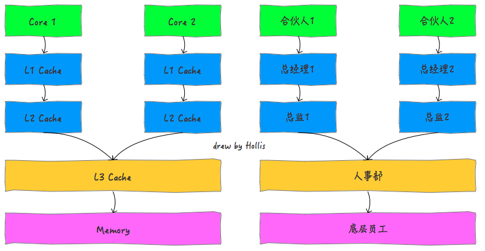

### 缓存的引入对单/多线程影响(多核cpu多线程导致缓存不一致)

1. 单线程。cpu核心的缓存只被一个线程访问。缓存独占，不会出现访问冲突等问题。
2. 单核CPU，多线程。进程中的多个线程会同时访问进程中的共享数据，CPU将某块内存加载
到缓存后，不同线程在访问相同的物理地址的时候，都会映射到相同的缓存位置，这样即使发
生线程的切换，缓存仍然不会失效。但由于任何时刻只能有一个线程在执行，因此不会出现缓存
访问冲突。
3. 多核CPU，多线程。每个核都至少有一个L1 缓存。多个线程访问进程中的某个共享内存，
且这多个线程分别在不同的核心上执行，则每个核心都会在各自的caehe中保留一份共享内
存的缓冲。由于多核是可以并行的，可能会出现多个线程同时写各自的缓存的情况，而各自的
cache之间的数据就有可能不同。

**由于CPU和主存之间增加缓存，在多线程多核cpu场景下就可能存在缓存一致性问题，也就是说，在
多核CPU中，每个核的自己的缓存中，关于同一个数据的缓存内容可能不一致。**

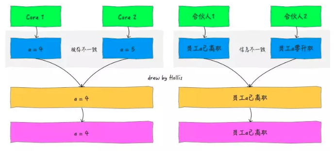

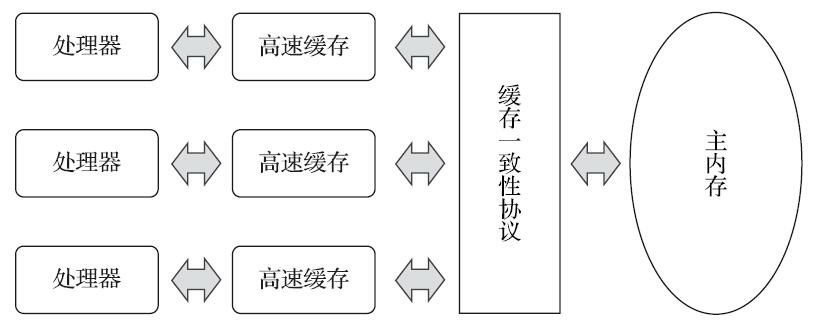

关于如何解决多核cpu下缓存一致性问题？ 基于缓存一致性协议，比如MESI等。

## 并发编程三大问题

1. 原子性是指在一个操作中就是cpu不可以在中途暂停然后再调度，既不被中断操作，要不
执行完成，要不就不执行。（**处理器优化可能导致原子性问题**）
2. 可见性是指当多个线程访问同一个变量时，一个线程修改了这个变量的值，其他线程能够
立即看得到修改的值。（**缓存一致性导致可见性问题**）
3. 有序性即程序执行的顺序按照代码的先后顺序执行。（**指令重排导致有序性**）

## 如何解决并发编程三大问题
一、最直接的方式就是禁止处理器优化、禁止指令重排、不适用cache。处理器对任何共享
变量的操作都是直接跟主内存打交道。虽然保证解决了三大问题，但是计算机处理效率极低。

二、为了保证共享内存的正确性（可见性、有序性、原子性），内存模型定义了共享内存
系统中多线程程序读写操作行为的规范。和缓存一致性、处理器优化、指令重排有关的规范。

内存模型解决并发问题方式：缓存一致性协议和内存屏障（禁止指令重排和缓存一致性）

## 什么是Java内存模型JMM

**简单来说就是解决多线程并发三大问题的规范（非真实存在只是规范）。**

Java内存模型（Java Memory Model ,JMM）就是**一种符合内存模型规范的，屏蔽了各种硬
件和操作系统的访问差异的，保证了Java程序在各种平台下对内存的访问都能保证效果一致
的机制及规范**。

**java内存模型存在的目的**：定义程序中各种变量的访问规则，即关注在虚拟机中把变量值存储到
内存和从内存中取出变量值这样的底层细节。（变量包括实例字段、静态字段、数组对象等共享的）


Java内存模型规定了所有的变量都存储在主内存中，每条线程还有自己的工作内存，线程的工
作内存中保存了该线程中是用到的变量的主内存副本拷贝（其实并不是整个对象完全拷贝），线程对变量的所有操作都必须在工
作内存中进行，而不能直接读写主内存。不同的线程之间也无法直接访问对方工作内存中的变
量，线程间变量的传递均需要自己的工作内存和主存之间进行数据同步进行。而JMM就作用于工作内存和主
存之间数据同步过程。他规定了如何做数据同步以及什么时候做数据同步。


这里面提到的主内存和工作内存，读者可以简单的类比成计算机内存模型中的主存和缓存的
概念。特别需要注意的是，主内存和工作内存与JVM内存结构中的Java堆、栈、方法区等并
不是同一个层次的内存划分，无法直接类比。《深入理解Java虚拟机》中认为，如果一定要
勉强对应起来的话，从变量、主内存、工作内存的定义来看，主内存主要对应于Java堆中
的对象实例数据部分。工作内存则对应于虚拟机栈中的部分区域。

**那么工作内存和主内存如何进行数据交互的呢？**
数据交互其实就是通过八种原子操作交互数据。一、主内存变量拷贝到工作内存 二、工作内存同步回主内存。

1. lock（锁定:不开放给程序员）：作用于主内存的变量，它把一个变量标识为一条线程独占的状态。
2. unlock（解锁:不开放给程序员）：作用于主内存的变量，它把一个处于锁定状态的变量释放出来，释放后的变量
才可以被其他线程锁定。
3. read（读取）：作用于主内存的变量，它把一个变量的值从主内存传输到线程的工作内存中，以
便随后的load动作使用。
4. load（载入）：作用于工作内存的变量，它把read操作从主内存中得到的变量值放入工作内存的
变量副本中。
5. use（使用）：作用于工作内存的变量，它把工作内存中一个变量的值传递给执行引擎cpu，每当虚
拟机遇到一个需要使用变量的值的字节码指令时将会执行这个操作。
6. assign（赋值）：作用于工作内存的变量，它把一个从执行引擎cpu接收的值赋给工作内存的变量，
每当虚拟机遇到一个给变量赋值的字节码指令时执行这个操作。
7. store（存储）：作用于工作内存的变量，它把工作内存中一个变量的值传送到主内存中，以便随
后的write操作使用。
8. write（写入）：作用于主内存的变量，它把store操作从工作内存中得到的变量的值放入主内存的
变量中。

以上八种原子操作可以简化为read、write、lock和unlock四种，只是语言描述上等价。因此一个i++操作
可以分解成六个个原子操作，从（read->load）>（use>assign）>（store->write）。


### Java内存模型如何实现
Java中提供了一系列和并发处理相关的关键字，比如volatile、synchronized、
final、concurren包等。其实这些就是Java内存模型封装了底层的实现后提供给程序
员使用的一些关键字。在开发多线程的代码的时候，我们可以直接使用synchronized等关
键字来控制并发，从来就不需要关心底层的编译器优化、缓存一致性等问题。所以，Java
内存模型，除了定义了一套规范，还提供了一系列原语，封装了底层实现后，供开发者
直接使用。

1. 原子性（monitor指令和基本类型读写）：一、JMM直接保证的原子性变量操作包括包括read、load、
assign、use、store和write这六个，基本类型的读写具备原子性（long和double非原子性协定了解即可）。
二、更大范围原子性保证。JMM提供了lock和unlock满足，但是虚拟机没有把该指令提供给程序员。但是
却提供了更高层次的字节码指令monitorenter和monitorexit隐式使用这两个操作，就是synchronized
2. 可见性（插入内存屏障保证）：Java内存模型是通过在变量修改后将新值同步回主内存，在变量读取前从主内存刷新变
量值的这种依赖主内存作为传递媒介的方式来实现的，普通变量也可以实现上述操作，但是不保证立刻同步到主内存。Java中的volatile关键字提供了一个功能，那
就是被其修饰的变量在被修改后可以立即同步到主内存，被其修饰的变量在每次是用之前都从
主内存刷新。因此，可以使用volatile来保证多线程操作时变量的可见性。
除了volatile，Java中的synchronized和final两个关键字也可以实现可见性。
3. 有序性（内存屏障禁止指令重排或者monitor指令禁止多线程访问）：在Java中，可以使用synchronized和volatile
来保证多线程之间操作的有序性。实现方式有所区别：volatile关键字会禁止指令重排。synchronized关键字保证同一时刻只允许一条线程操作（syn锁住的内部可以
进行指令重排）。


# JMM内存模型底层到底怎么实现

## 并发编程线程通信和同步

### 通信
共享内存（java）和消息传递。共享内存是读写内存中的公共状态进行通信，属于隐式通信。
消息传递方式中，线程之间通过发消息显示通信。
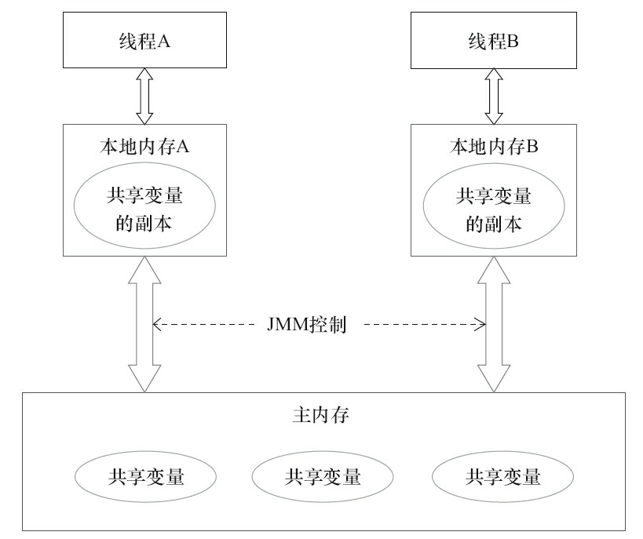
如果线程a和b通过共享内存方式进行通信，1）线程A把本地内存A中更新过的共享变量刷新到主内存中去。2）线程B到主内存中去读取线程A之前已更新过的共享变量。比如初始

## 同步
控制不同线程操作顺序，共享内存模型下，同步是显式进行的。

## 源代码到最终执行指令重排序
编译器和处理器为了提高性能常常对指令进行重排序。

1. 编译器优化的重排序。在不改变单线程程序语义的前提下，重新安排语指令执行顺序。
2. 指令级并行的重排序。现代处理器采用了指令级并行技术将多条指令重叠执行（五段流水中并行执行）。如果不存在数据依赖性，处理器可以改变语句对应
机器指令的执行顺序。
3. 内存系统的重排序。处理器使用缓存和读/写缓冲区，这使得加载（读内）和存储（写内存）操作看上去可能是在乱序执行。多数处理器都支持写-读操作重排序，因为都有cache

现在的处理器为了指令流水的性能，都引入了cache，处理器对数据的更改首先刷新到cache中，并且cache都提供了write back法，把修改后的数据
批量刷新到主存中，这也导致了一个问题就是内存可见性，每个处理器上的写缓冲区，仅仅对它所在的处理器可见。
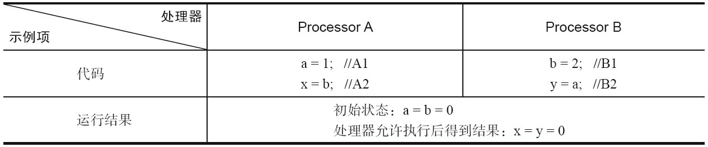
cacheA中a1把a=1写操作写入到cache中，x=b从主内存中读取b=0，后把cache中的a更新到主内存，cache B也是同样处理。处理器先执行a1后执行a2但是实际内存中执行顺序是先a2后a1，因此处理器A的内存操作顺序由于cache和wirite back算法导致指令重排了。

**如何解决上述cache引起的指令重排序导致内存可见性问题呢？**
通过a1和a2之间插入内存屏障Store-Load，执行a1时候把cache中的所有数据刷新到主存中。
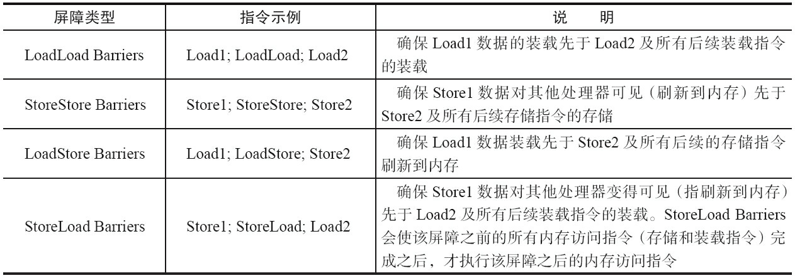
[常见的内存屏障讲解](https://www.bilibili.com/video/BV1X54y1Q75J?from=search&seid=9769013173264995151 "fa")

虽然指令重排提高了性能，但是很容易导致内存可见性问题，因此jmm内存模型的重排序规则会通过内存屏障指令来禁止特定类型的处理器重排序，为程序员提供内存可见性的保证。

### 禁止指令重排单线程数据依赖

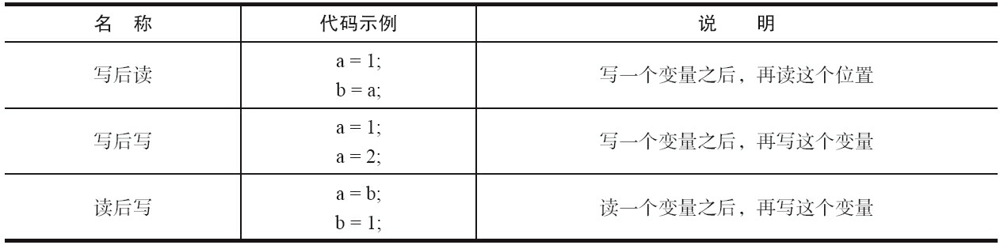
数据依赖仅仅针对单线程，编译器和处理器不会对指令进行重排，但是如果多线程之间的数据依赖就不能保证，比如上例中的写-读可见性问题。
### 允许指令重排单线程as-if-serial
as-if-serial:编译器处理器我允许你们重排，但是执行结果不能改变。

```java
double pi = 3.14; // A
double r = 1.0; // B
double area = pi * r * r; // C
```
A和C有数据依赖，B和C也有数据依赖，c不可以排序到AB之前。但是AB之间没有数据以来因此顺序可以是A->B>C也可以是B->A>C.
**as-if-serial给程序员提供了幻觉，单线程下程序好像是顺序执行的，不用担心内存可见性。** A happen before B，MM并不要求A一定要在B之前执行。JMM仅仅要求前一个操作（执行的结果）对后一个操作可见，且前一个操作按顺序排在第二个操作之前。
### 多线程指令重排序
多线程重排序情况下，可能导致内存可见性问题，影响执行结果。
```java
class ReorderExample {
        int a = 0; //a和flag被写入后立即被另一个线程可见。
        boolean flag = false;//
        public void writer() {
        a = 1;       // 1
        flag = true; // 2
        }
        public void reader() {
        if (flag) { // 3
        int i = a * a; // 4
        }
    }
}
```
问题：4不一定能看到1写入的数值。
讨论：1，2之间无数据依赖，3，4之间无数据依赖，因此编译器和处理器可以对他们进行指令重排，虽然2和3之间有数据依赖，但是这是不同的线程。
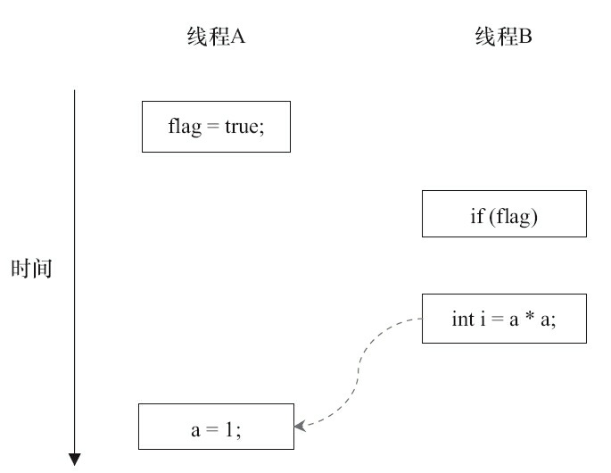
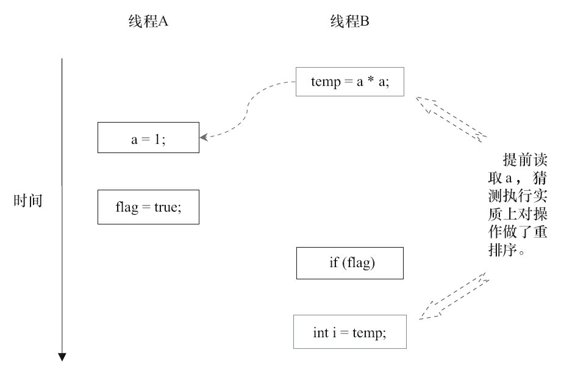
操作3和操作4存在控制依赖关系。编译器和处理器会采用猜测（Speculation）执行来克服控制相关性对并行度的影响，先把a*a写入硬件缓存中，如果flag为真
后直接把硬件缓存中赋值给i。 **指令重排可能直接破坏了多线程程序语义。**

## 顺序一致性
### 顺序一致性模型
一个被过于理想化的模型，给程序员提供了很强的内存可见性保证（禁止指令重排和数据立即刷新到主存）。
**JMM对对内存一致性的保证**，如果程序是正确同步的，程序的执行将具有顺序一致性——即程序的执行结果与该程序在顺序一致性内存模型中的**执行结果相同（仅仅是结果，不保证不指令重排）**。如果程序非同步的，
程序不仅整体执行无序，并且各个线程对所看到的操作也可能不一致。（比如cache导致的写-读重排序，写cache仅对当前线程可见）
#### 特点
1. 一个线程中的所有操作必须按照程序的顺序来执行。（**禁止指令重排**）
2. （不管程序是否同步）所有线程都只能看到一个单一的操作执行顺序，每个操作都必须原子执行且立刻对所有线程可见。（**数据立刻刷新到主存**）
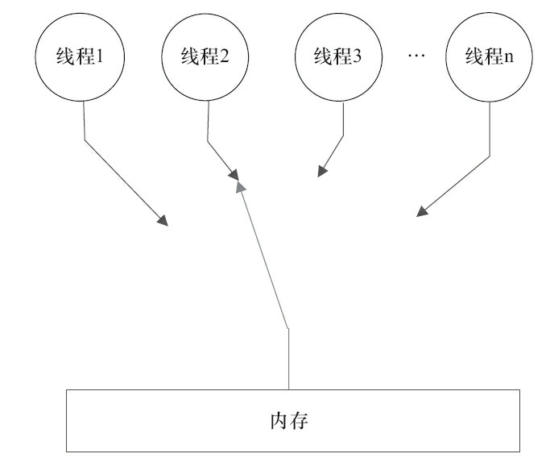
#### 多线程同步/非同步下的顺序一致性
1. 线程a a1->a2->a3
2. 线程b b1->b2->b3
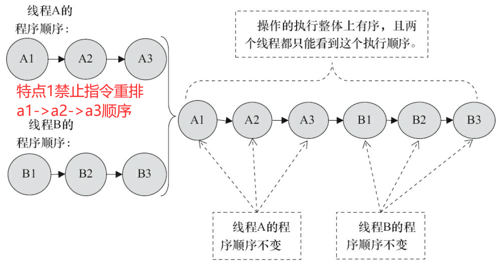
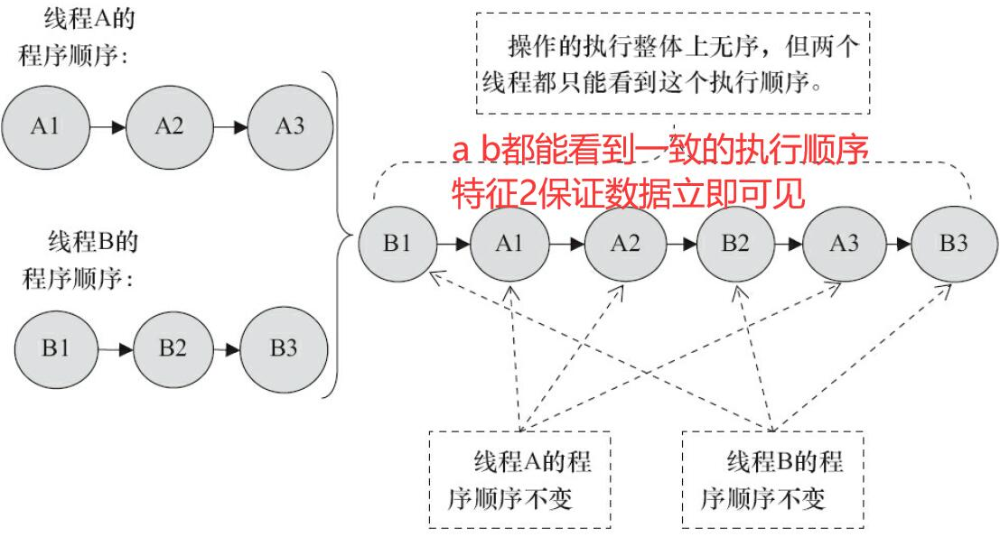

```java

class SynchronizedExample {
    int a = 0;
    boolean flag = false;
    public synchronized void writer() { // 获取锁
    a = 1;
    flag = true;
    } // 释放锁
    public synchronized void reader() { // 获取锁
    if (flag) {
    int i = a;
    } // 释放锁
    }
}
```
**同步情况下顺序一致性和JMM执行流程**
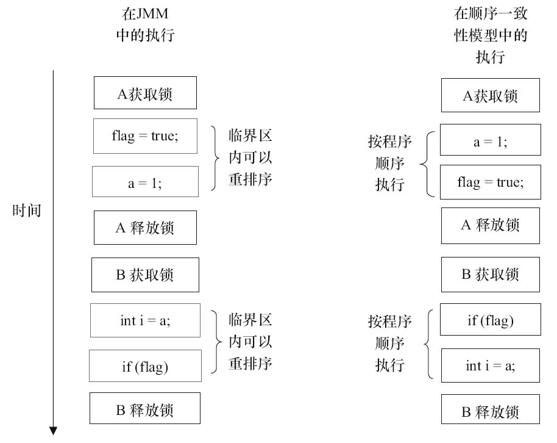

**未同步情况下顺序一致性和JMM执行流程**
对于未同步或未正确同步的多线程程序，JMM只提供最小安全性，即JMM拿到的数据不会无中生有（至少内存清零后数据初始化默认值）。
JMM不保证未同步程序和顺序一致性一样，因为这会导致JMM对编译器处理器大量优化（数据立即可见，禁止指令重排），导致降低性能。

1. 顺序一致性模型保证单线程内的操作会按程序的顺序执行，而JMM不保证单线程内的
操作会按程序的顺序执行（比如上面正确同步的多线程程序在临界区内的重排序）。这一点前
面已经讲过了，这里就不再赘述。
2. 顺序一致性模型保证所有线程只能看到一致的操作执行顺序，而JMM不保证所有线程
能看到一致的操作执行顺序。（cache中读写导致的重排序）
3. JMM不保证对64位的long型和double型变量的写操作具有原子性，而顺序一致性模型保证对所有的内存读/写操作都具有原子性。

从JSR-133内存模型开始（即从JDK5开始），只允许把一个64位long/double型变量的写操作拆分为两个32位的写操作来执行，任意的读操作在JSR-
133中都必须具有原子性（即任意读操作必须要在单个读事务中执行）

## volatile内存语义
### volatile两大特性概述
简单理解volatile就是一把轻量锁，对volatile变量的读写操作用“锁”同步。
```java
class VolatileFeaturesExample {
    volatile long vl = 0L; // 使用volatile声明64位的long型变量
        public void set(long l) {
        vl = l; // 单个volatile变量的写
        }
        public void getAndIncrement () {
        vl++; // 复合（多个）volatile变量的读/写非原子操作
        }
        public long get() {
        return vl; // 单个volatile变量的读
        }
}
// “加锁等价形式”
class VolatileFeaturesExample {
    long vl = 0L; // 64位的long型普通变量
    public synchronized void set(long l) { // 对单个的普通变量的写用同一个锁同步
    vl = l;
    }
    public void getAndIncrement () { // 普通方法调用
    long temp = get(); // 调用已同步的读方法
    temp += 1L; // 普通写操作
    set(temp); // 调用已同步的写方法
    }
    public synchronized long get() { // 对单个的普通变量的读用同一个锁同步
    return vl;
    }
}
```

“volatile锁”根据happen-before规则，保证释放锁和获取锁线程内存的可见性（释放锁数据刷新到主存），
同时“锁”又保证了了单个变量的读写操作时原子性。
1. 原子性：保证单个volatile变量读写有原子性
2. 可见性：读volatile变量的线程，立即可见其他线程对该变量的修改

### volatile读写的内存语义

写内存语义：写一个volatile变量时，JMM会把该线程对应的本地内存中的**所有的共享变量值刷新到主内存**。
和锁syn的释放有相同的内存语义（lock.unlock()锁释放，共享变量刷新到主存中）
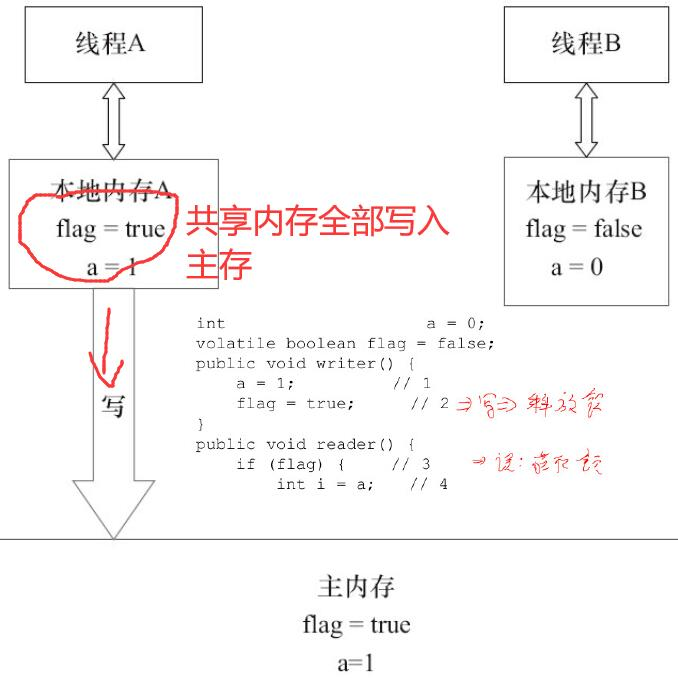
读内存语义：当读一个volatile变量时，JMM会把该线程对应的**本地内存所有共享变量置为无效**。线程接下来将从**主内存中读取所有（包含非volatile变量）共享变量**。
和锁syn的获取有相同的内存语义（锁获取lock.lock()，线程从主内存中读取共享数据）
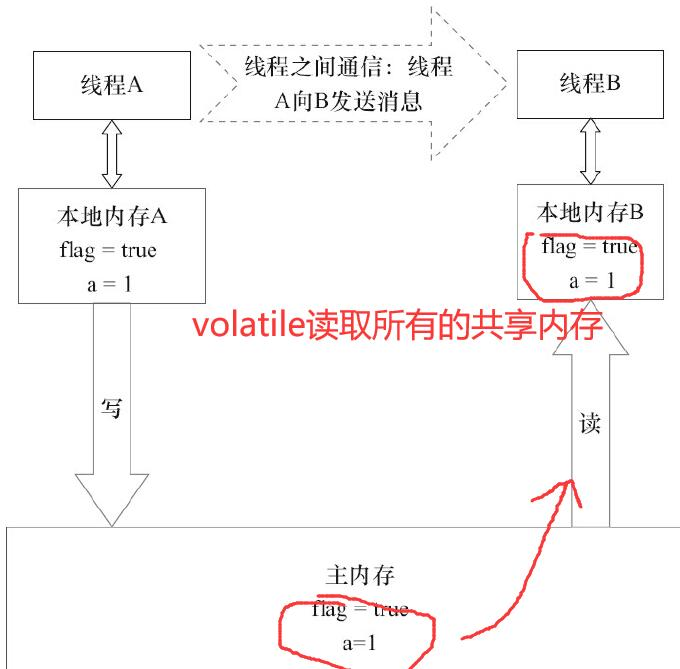

### volatile读写的内存语义实现方式

为了实现volatile读写内存的语义，需要禁止编译器，处理器进行执行重排序,禁止重排序需要插入内存屏障。
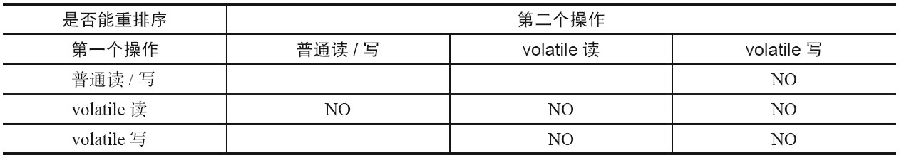
1. 在每个volatile写操作的前面插入一个StoreStore屏障。
2. 在每个volatile写操作的后面插入一个StoreLoad屏障。
3. 在每个volatile读操作的后面插入一个LoadLoad屏障。
4. 在每个volatile读操作的后面插入一个LoadStore屏障

**volatile写插入内存屏障**


**volatile读插入内存屏障**


## syn锁的内存语义
java中的锁主要用来同步的，即临界区代码（包含共享变量）互斥执行。但是锁还有另一个功能，锁的内存语义是线程通信（共享内存方式），
即A线程锁的释放后，共享变量刷新到主内存，当线程B锁再次获取后a线程中修改后的共享数据立即被B可见，这就通过共享内存完成了从线程a到b的通信。

### 锁的释放获取内存语义
```java
class MonitorExample {
    int a = 0;
    public synchronized void writer() {//加锁   // 1
        a++;                                   // 2
    }                                  //释放锁 // 3
    public synchronized void reader() {//加锁  // 4
        int i = a;                              // 5
       }                               //释放锁 // 6
}

```
释放锁内存语义：当线程释放锁时，JMM会把该线程对应的本地内存中的共享变量刷新到主内存中。
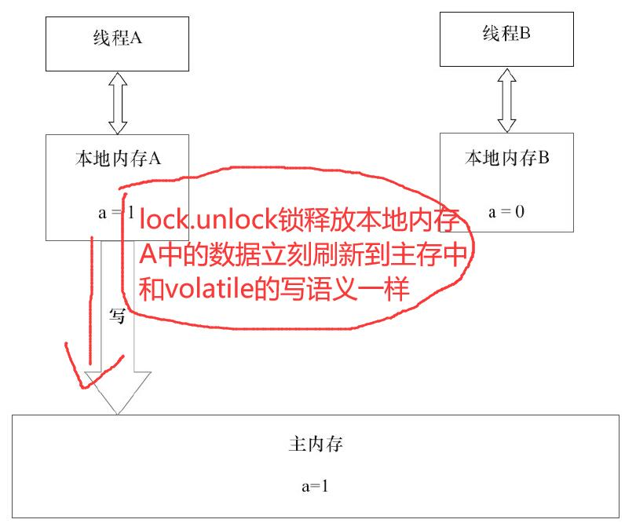
获取锁内存语义：当线程获取锁时，JMM会把该线程对应的本地内存置为无效。从而使得被监视器保护的临界区代码必须从主内存中读取共享变量。
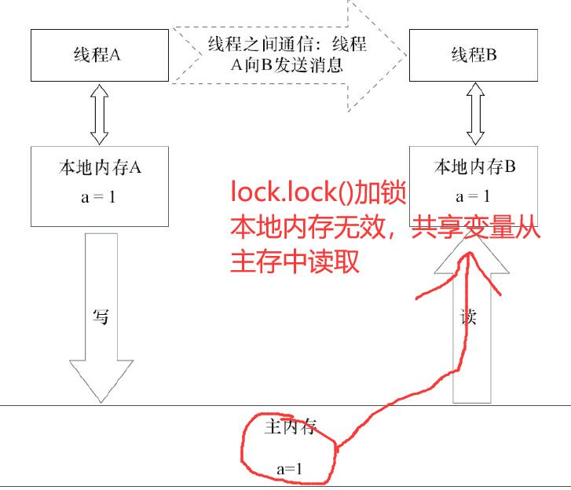
### 锁内存语义实现
深入理解的话，需要阅读Reentrantlock源码

1. 利用volatile变量的写-读所具有的内存语义。
2. 利用CAS所附带的volatile读和volatile写的内存语义。
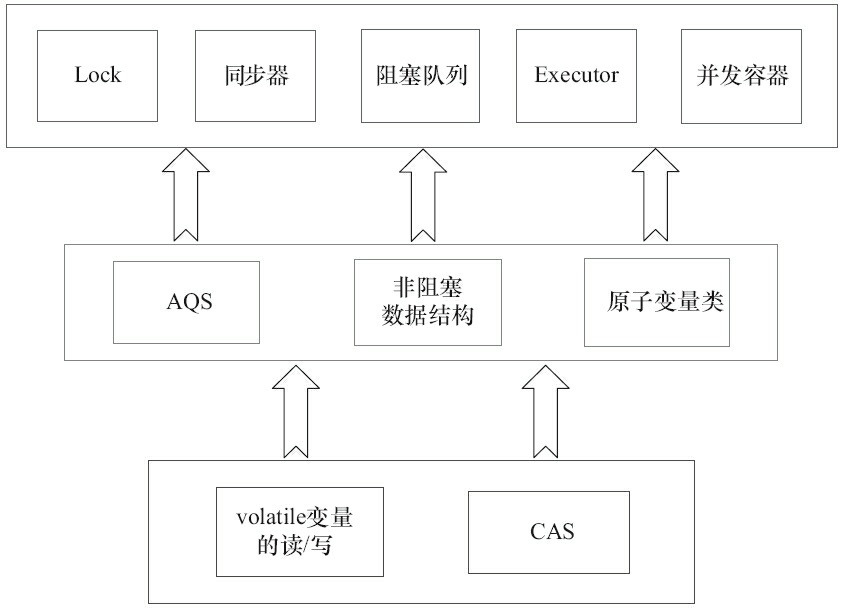
基于锁的内存语义两种实现方式，最底层java线程通信的四种方式。
1. A线程写volatile变量，随后B线程读这个volatile变量。
2. A线程写volatile变量，随后B线程用CAS更新这个volatile变量。
3. A线程用CAS更新一个volatile变量，随后B线程用CAS更新这个volatile变量。
4. A线程用CAS更新一个volatile变量，随后B线程读这个volatile变量。


#### cas原理

如果当前状态值等于预期值，则以原子方式将同步状态设置为给定的更新值。此操作具有volatile读和写的内存语义。
编译器不会对volatile读与volatile读后面的任意内存操作重排序；编译器不会对volatile写与volatile写前面的任意内存操作重排序。
因此编译器不能对CAS与CAS前面和后面的任意内存操作重排序。
```java
//jdk中的cas
protected final boolean compareAndSetState(int expect, int update) {
    return unsafe.compareAndSwapInt(this, stateOffset, expect, update);
}
```
```
     //c ++ cas实现方式
    `inline jint Atomic::cmpxchg (jint exchange_value, volatile jint* dest,
    jint compare_value) {
        // alternative for InterlockedCompareExchange
        int mp = os::is_MP();
        __asm {
        mov edx, dest
        mov ecx, exchange_value
        mov eax, compare_value
        LOCK_IF_MP(mp) //MP代表多处理器
        cmpxchg dword ptr [edx], ecx
    }`
}
```
如果当前是多处理器MP则在cmpxchg指令前面加上lock，反之单处理器省略lock（单处理器自身会维护单处理器内的顺序一致性，不需要lock前缀提供的内存屏障禁止重排序）。

lock指令作用

1. 确保对内存的读-改-写操作原子执行，通过锁总线或者锁住缓存行。
2. 禁止该指令，与之前和之后的读和写指令重排序。volatile禁止指令重排语义
3. 把写缓冲区中的所有数据刷新到内存中。volatile写语义内存可见性

## final内存语义
### 基本用法
1. 修饰类： 当用final修饰一个类时，表明这个类不能被继承。
2. 修饰方法： final修饰的方法表示此方法已经是“最后的、最终的”含义，亦即此方法不能被重写
3. 修饰变量：表示常量，只能被赋值一次，赋值后值不再改变

### final域重排序
#### 基本数据类型
1. 在构造函数内对一个final域的写入，与随后把这个被构造对象的引用赋值给一个引用
变量，这两个操作之间不能重排序。(禁止构造函数内把构造对象“逃逸”，否则可能读取到final未初始化之前的数值，下次读取就可能是初始化后的数值)
2. 初次读一个包含final域的对象的引用，与随后初次读这个final域，这两个操作之间不能
重排序。

```java
public class FinalExample {
    int i;　　　　　　　　　　 // 普通变量
    final int j;　　　　　　　　 // final变量
    static FinalExample obj;
    public FinalExample () {　　 // 构造函数
        i = 1;　　　　　　　　 // 写普通域
        j = 2;　　　　　　　　 // 写final域
        }
    public static void writer () {　 // 写线程A执行
        obj = new FinalExample ();
        }
    public static void reader () {　 // 读线程B执行
        FinalExample object = obj; // 读对象引用
        int a = object.i;　　　　　 // 读普通域
        int b = object.j;　　　　　 // 读final域
        }
}
```

#### 引用数据类型
除了包含上述基本数据类型的重排序规则之外，还有：在构造函数内对一个final引用的对象的成员域的写入，与随后在构造函数外把这个被构造对象的引用赋值给
一个引用变量，这两个操作之间不能重排序。

```java
public class FinalReferenceExample {
    final int[] intArray; // final是引用类型
    static FinalReferenceExample obj;
    public FinalReferenceExample () { // 构造函数
        intArray = new int[1]; // 1
        intArray[0] = 1; // 2
        }
    public static void writerOne () { // 写线程A执行
        obj = new FinalReferenceExample (); // 3
        }
    public static void writerTwo () { // 写线程B执行
        obj.intArray[0] = 2; // 4
        }
    public static void reader () { // 读线程C执行
        if (obj != null) { // 5
        int temp1 = obj.intArray[0]; // 6
        }
    }
}
```

### 写final域重排序规则
写final域的重排序规则禁止把final域的写重排序到构造函数之外
1. JMM禁止编译器把final域的写重排序到构造函数之外。
2. 编译器会在final域的写之后，构造函数return之前，插入一个StoreStore屏障。这个屏障
禁止处理器把final域的写重排序到构造函数之外,但是写普通域可能重排序构造函数之外。
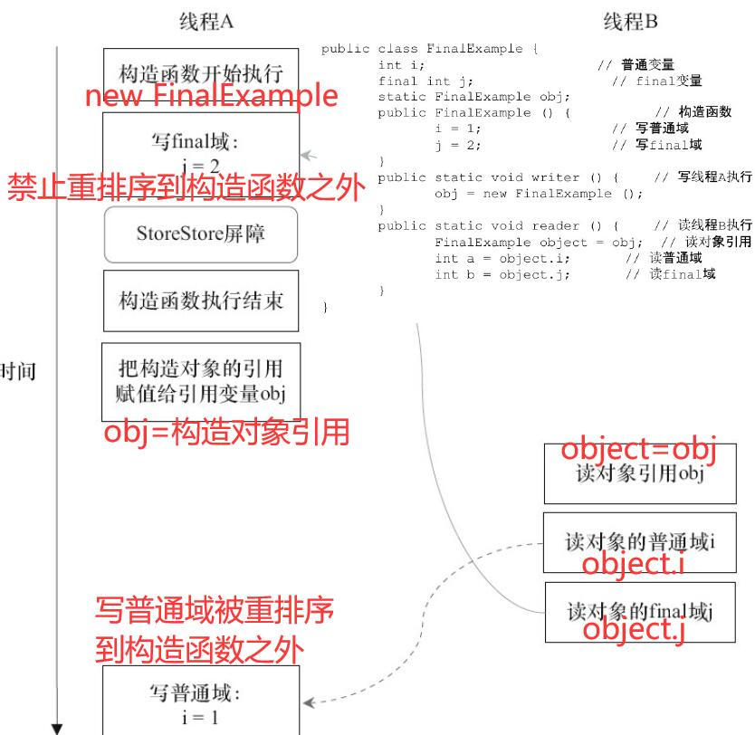

### 读final域重排序规则
在一个线程中，1初次读对象引用与2初次读该对象包含的final域，JMM禁止处理器重排序这两个操作（注意，这个规则仅仅针对处理器）。编译器会在读final
域操作的前面插入一个LoadLoad屏障。1,2这两个操作有间接依赖关系编译器不会进行重排序，并且多数处理器也不会对此进行重排序，但是极少数处理器会进行重排序。
通过插入LoadLoad屏障，禁止这种处理器进行重排序。

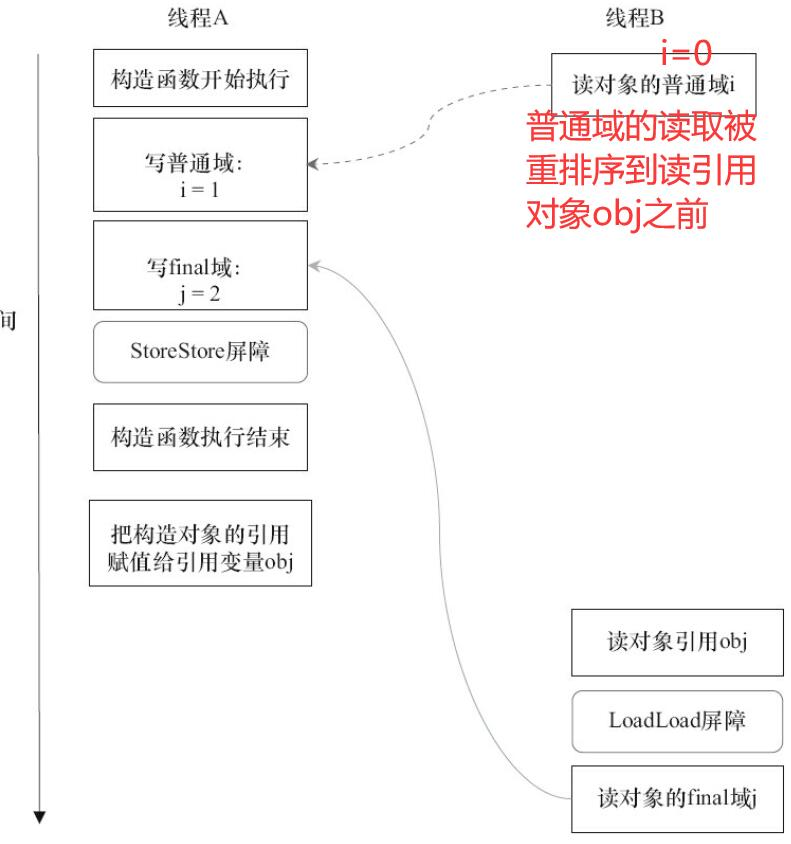

### 处理器如何实现final域的读写重排序规则

禁止特定类型的重排序都是插入内存屏障：写final域的重排序规则会要求编译器在final域的写之后，构造函数return之前插入一个StoreStore障屏。读final域的重排序规则要求编译器在读final域的操作前面插入
一个LoadLoad屏障。

## happen-before规则

### JMM设计思路
1. 程序员：对内存模型的使用。程序员希望内存模型易于理解、易于编程。程序员希望基于
一个强内存模型（比如立刻可见，禁止重排序）来编写代码。
2. 编译器和处理器：对内存模型的实现。编译器和处理器希望内存模型对它们的束缚越少越
好，这样它们就可以做尽可能多的优化来提高性能。编译器和处理器希望实现一个弱内存模
型。（指令重排，批量刷新）

上述两种两种因素是相互矛盾的，因此JMM设计的核心：既要为程序员提供足够强的内存可见性保证，又要对编译器
处理器不束缚他们。JMM在不改变单线程和正确同步的多线程结果下，怎么优化提升性能都可以（例子：锁消除）。

```java
    double pi = 3.14;　　 // A
    double r = 1.0;　　　　 // B
    double area = pi * r * r;　 // C
    A happens-before B。 //非必须happen-before
    B happens-before C。 //必须happen-before
    A happens-before C。 //必须happen-before
```
JMM把happens-before要求禁止的重排序分为了下面两类.
1. 会改变程序执行结果的重排序，JMM要求编译器和处理器必须禁止这种重排序。B happenbefore c , a happenbefore c
2. 不会改变程序执行结果的重排序，JMM对编译器和处理器不做要求（JMM允许这种重排序）。a happenbefore b
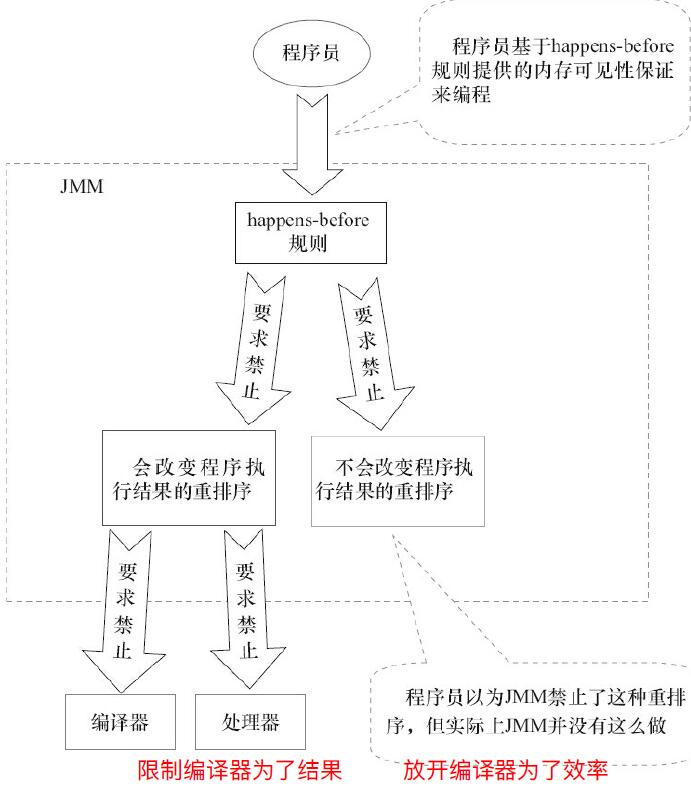

### happenbefore定义
1. happens-before（单/多线程都可）仅仅要求前一个操作（执行的结果）对后一个操作**可见**，且前一
个操作按顺序排在第二个操作**之前**。（对程序员承诺）
2. 两个操作存在happens-before关系，并不意味着必须要按照happens-before关系指定的顺序来执行（上例中a happenbefore b 也可以重排序b happenbefore a），
如果重排序结果不影响最终结果，则jmm允许这种重排序。（对处理器编译器承诺）

as-if-serial语义保证单线程内程序的执行结果不被改变，happens-before关系保证正确同步的多线程程序的执行结果不被改变。
as-if-serial语义给编写单线程程序的程序员创造了一个幻境：单线程程序是按程序的顺序（重排序不影响结果）来执行的。
happens-before关系给编写正确同步的多线程程序的程序员创造了一个幻境：正确同步的多线程程序（syn代码块内部也可以重排序）是按happens-before指定的顺序来执行的。


一个happens-before规则对应于一个或多个编译器和处理器重排序规则。
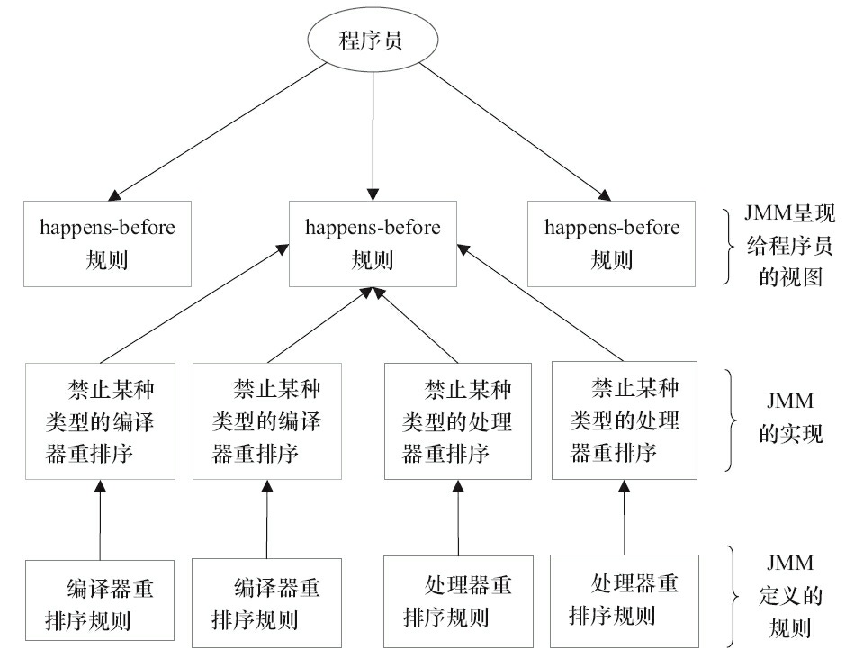
1. 程序顺序规则：一个线程中的每个操作，happens-before于该线程中的任意后续操作。
2. 监视器锁规则：对一个锁的解锁，happens-before于随后对这个锁的加锁。
3. volatile变量规则：对一个volatile域的写，happens-before于任意后续对这个volatile域的
读。
4. 传递性：如果A happens-before B，且B happens-before C，那么A happens-before C。

## 双重校验和延迟初始化

背景：多线程中有时候需要通过延迟初始化手段降低初始化类和创建对象的开销。比如
一个单例对象需要懒加载，我第一次需要的时候在加载初始化。双重检查锁是常见的延迟初始化技术。

### 版本1：非线程安全的延迟初始化
```java
    public class UnsafeLazyInitialization {
        private static Instance instance;
        public static Instance getInstance() {
        if (instance == null) // 1：A线程执行
            instance = new Instance(); // 2：B线程执行
            return instance;
        }
    }
```
A线程执行代码1的同时，B线程执行代码2。此时，线程A可能会看到instance引用的对象还没有完成初始化.
(初始化过程中重排序导致)

### 版本2：JVM早期性能低下的线程安全延迟初始化
```java
public class SafeLazyInitialization {
    private static Instance instance;
    //早期上来就是一把重量级锁
    public synchronized static Instance getInstance() {
        if (instance == null)
        instance = new Instance();
        return instance;
    }
}
```
缺点：无论是单线程或者多线程频繁调用性能都很低（重锁）

### 版本3：“聪明技巧”双重检查锁定
```java
public class DoubleCheckedLocking { // 1
    private static Instance instance; // 2
    public static Instance getInstance() { // 3
    if (instance == null) { // 4:第一次检查
        synchronized (DoubleCheckedLocking.class) { // 5:加锁
            if (instance == null) // 6:第二次检查
                instance = new Instance(); // 7:问题的根源出在这里
            } // 8
        } // 9
        return instance; // 10
    } // 11
}
```
第一次检查instance！=null,那么直接返回，因此降低了syn带来的性能开销。
但是，这个return返回的instance可能并没有初始化成功。（对象初始化重排序）
```java
    memory = allocate();　　// 1：分配对象的内存空间
    ctorInstance(memory);　 // 2：初始化对象
    instance = memory;　　 // 3：设置instance指向刚分配的内存地址
    
    memory = allocate();　　// 1：分配对象的内存空间
    instance = memory;　　 // 3：设置instance指向刚分配的内存地址
    // 注意，此时对象还没有被初始化！
    ctorInstance(memory);　 // 2：初始化对象
```
2,3这里可能重排序，导致对象未初始化成功就提前对instance指向内存了memery。


解决“聪明”双重校验方法
1. 不允许2和3重排序。volatile
2. 允许2和3重排序，但不允许其他线程“看到”这个重排序。

### 基于volatile线程安全的双重校验

```java
public class SafeDoubleCheckedLocking {
    private volatile static Instance instance;
    public static Instance getInstance() {
        if (instance == null) {
            synchronized (SafeDoubleCheckedLocking.class) {
                if (instance == null)
                    instance = new Instance(); // instance为volatile，现在没问题了
                }
            }
        return instance;
    }
}
```
当声明对象的引用为volatile后，2和3之间的重排序，在多线程环境中将会被禁止。
```java
    memory = allocate();　　// 1：分配对象的内存空间
    ctorInstance(memory);　 // 2：初始化对象
    插入StoreStore屏障，直至2与3进行指令重排
    instance = memory;　　 // 3：设置instance指向刚分配的内存地址
    StoreLoad屏障
```
### 基于类初始化让其他线程看不到2，3重排序
思想：A线程被允许对类初始化过程中重排序，但是B线程在A线程初始化过程中看不到。
```java
public class InstanceFactory {
    private static class InstanceHolder {
        public static Instance instance = new Instance();
    }
    public static Instance getInstance() {
        return InstanceHolder.instance ;　　// 这里将导致InstanceHolder类被初始化
    }
}
```
JVM在类的初始化阶段（即在Class被加载后，且被线程使用之前），会执行类的初始化。在执行类的初始化期间，JVM会去获取一个锁（每一个类和接口都会有唯一一个初始化所LC）。
这个锁可以同步多个线程对同一个类的初始化。
有点像对初始化对象过程进行“加锁”。
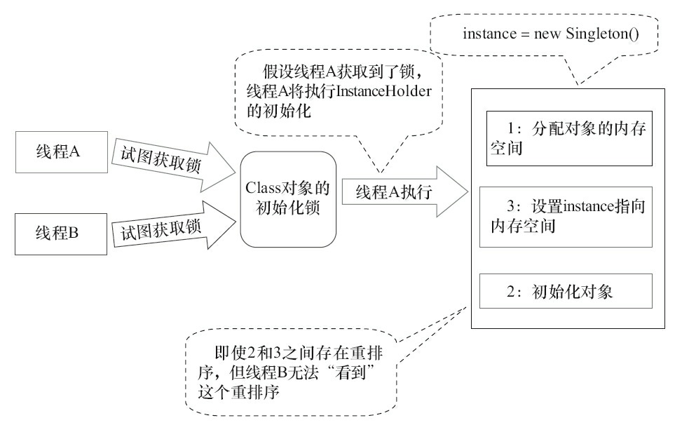

类初始化五个阶段。过程比较多，但是很好理解，请自行查看java并发编程艺术第三章。

[再有人问你Java内存模型是什么，就把这篇文章发给他。](https://www.hollischuang.com/archives/2550 "A")