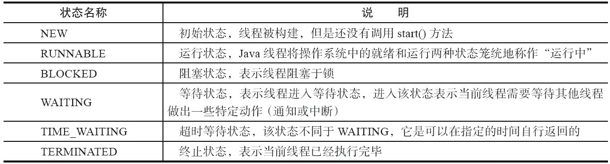
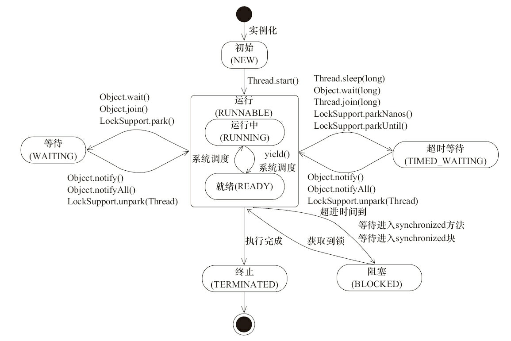
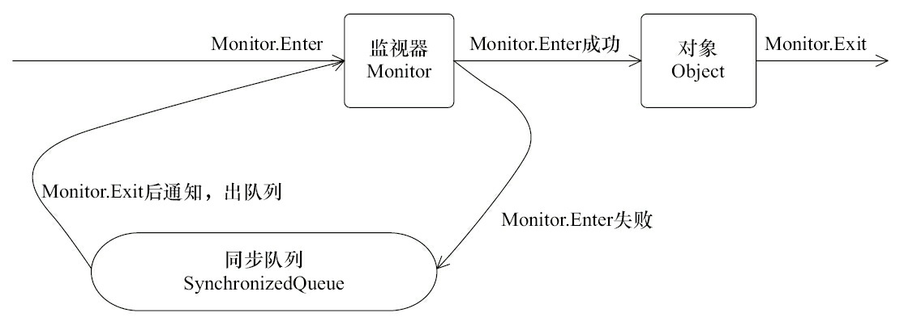
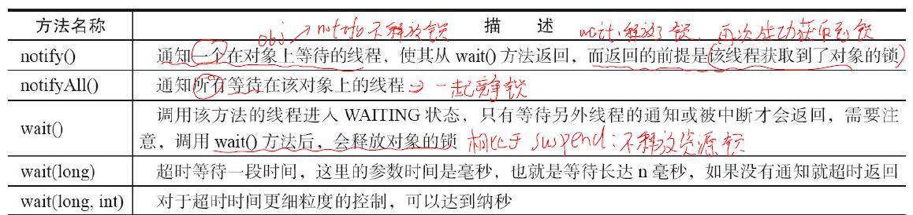
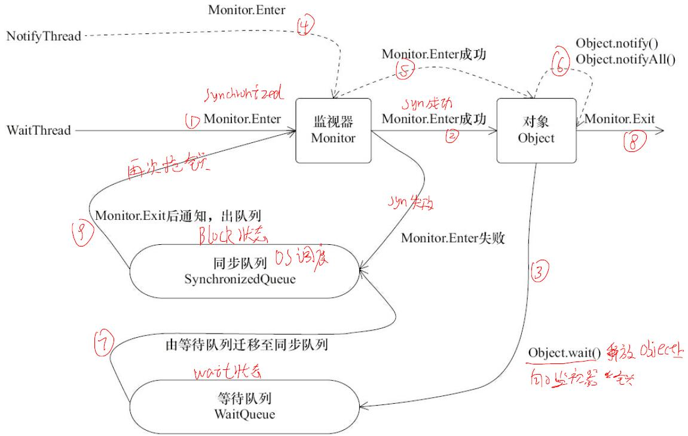

##线程简介

### 六大线程状态



### Daemon线程
Daemon线程是一种支持型线程，因为它主要被用作程序中后台调度以及支持性工作。这
意味着，当一个Java虚拟机中不存在非Daemon线程的时候，Java虚拟机将会退出。
但是在Java虚拟机退出时Daemon线程中的finally块并不一定会执行。下面的main线程结束，虚拟机中无非Daemon线程，虚拟机会退出，finally不会退出。
```java
public class Daemon {
    public static void main(String[] args) {
        Thread thread = new Thread(new DaemonRunner(), "DaemonRunner");
        thread.setDaemon(true);
        thread.start();
    }
    static class DaemonRunner implements Runnable {
        @Override
        public void run() {
            try {
            SleepUtils.second(10);
            } finally {
                System.out.println("DaemonThread finally run.");
                }
        }
    }
}

```

### 过期的suspend()、resume()和stop()

CD机对音乐播放做出的暂停、恢复和停止操作对应在线程Thread的API就是suspend()、resume()和stop()
但是这些API是过期的，也就是不建议使用的。不建议使用的原因主要有：以suspend()方法为例，在调用后，线程不会释放已经占有的资源（比如锁），
而是占有着资源进入睡眠状态，这样容易引发死锁问题。同样，stop()方法在终结一个线程时不会保证线程的资源正常释放，通常是没有给予线程完成资源释放工作的机会，
因此会导致程序可能工作在不确定状态下.

## 线程间通信方式
我们知道java线程通信方式是通过共享内存方式，即a线程把数据写入到内存memery后b线程读取内存，完成从a到b通信。

### volatile和synchronzied实现线程通信

**volatile线程通信**
多线程对于共享变量（共享内存）的访问一般是拥有该变量的副本（拷贝到本地内存）目的是程序执行，因此一个线程看到的变量
不一定是最新的。volatile可以用来修饰字段（成员变量），就是告知程序任何对该变量的访问均需要从共享内存（主内存）中获取，
而对它的改变必须同步刷新回共享内存，它能保证所有线程对变量访问的可见性。

**synchronzied通信**
主要确保多个线程在同一个时刻，只能有一个线程处于方法或者同步块中，
它保证了线程对变量访问的可见性和排他性。synchronzied释放锁时会把本地内存中的共享变量全部
刷新到主内存，synchronized获取锁时候，共享变量从主内存中读取。这就完成了数据从释放锁的线程a向加锁线程b之间的数据通信。

```java
    //monitorenter
    synchronized (lock){ //
            
        }
    //monitorexit
```
java每个对象都和一个监视器绑定Monitor，下图是对象、监视器、同步队列（block阻塞态）和线程关系。


### 等待/通知实现线程通信
比如两个线程生产者a和消费者b，生产者a生产完数据后通知消费者b取数据。那么如何实现呢？

```java
    while (value != desire) { //检查到时候满足某个条件
        Thread.sleep(1000);
        } 
    doSomething();//消费数据
```
上述代码虽然可以完成消费者功能，但问题是不能确保及时消费数据，以及处理器资源的浪费。
java通过内置的等待/通知机制可以很好的解决这个问题。

等待/通知机制，是指一个线程A调用了对象O的wait()方法进入等待状态，而另一个线程B
调用了对象O的notify()或者notifyAll()方法，线程A收到通知后从对象O的wait()方法返回，进而
执行后续操作。上述两个线程通过对象O（共享内存）来完成交互。
```java
public class WaitNotify {
    static boolean flag = true;
    static Object lock = new Object();
    public static void main(String[] args) throws Exception {
        Thread waitThread = new Thread(new Wait(), "WaitThread");
        waitThread.start();
        TimeUnit.SECONDS.sleep(1);
        Thread notifyThread = new Thread(new Notify(), "NotifyThread");
        notifyThread.start();
    }
static class Wait implements Runnable {
    public void run() {
    // 加锁，拥有lock的Monitor
    synchronized (lock) {
    // 当条件不满足时，继续wait，同时释放了lock的锁
    while (flag) {
        try {
            lock.wait();//此时Wait线程释放lock锁，进入wait等待队列中等待waiting
            //消费者等待消费数据（消费者给我信号）
        } catch (InterruptedException e) {
        }
    }
    // 条件满足时，完成工作
    //消费者开始消费数据
        
            }
        }
    }
static class Notify implements Runnable {
    public void run() {
    // 加锁，拥有lock的Monitor
    synchronized (lock) {
        // 获取lock的锁，然后进行通知，通知时不会释放lock的锁，
        // 直到当前线程释放了lock后，WaitThread才能从wait方法中返回
             // 生产者生产数据中
        lock.notifyAll();//把wait队列中所有的（waiting）线程移到同步队列（block）中
        flag = false;
    }//monitorexit，同步队列（block）状态的所有线程开始抢锁syn,尝试monitorenter
    // 再次加锁
    synchronized (lock) { //尝试monitorenter
        System.out.println(Thread.currentThread() + " hold lock again. sleep
        @ " + new SimpleDateFormat("HH:mm:ss").format(new Date()));
        SleepUtils.second(5);
        }
        }
    }
}
```


1. 使用wait()、notify()和notifyAll()时需要先对调用对象加锁。
2. 调用wait()方法后，线程状态由RUNNING变为WAITING，并将当前线程放置到对象的
等待队列。
3. notify()或notifyAll()方法调用后，等待线程依旧不会从wait()返回，需要调用notify()或
notifAll()的线程释放锁之后，等待线程才有机会从wait()返回。
4. notify()方法将等待队列中的一个等待线程从等待队列中移到同步队列中，而notifyAll()
方法则是将等待队列中所有的线程全部移到同步队列，被移动的线程状态由WAITING变为
BLOCKED。
5. 从wait()方法返回的前提是获得了调用对象的锁。

#### 等待/通知写线程通信经典模式
等待方遵循如下原则。
1. 获取对象的锁。
2. 如果条件不满足，那么调用对象的wait()方法，被通知后仍要检查条件。
3. 条件满足则执行对应的逻辑。
```java
synchronized(对象) {
    while(条件不满足) {
    对象.wait();//等待生产者通知我干活
    }
    //对应的处理逻辑，消费数据
}
```
通知方遵循如下原则。
1. 获得对象的锁。
2. 改变条件。
3. 通知所有等待在对象上的线程。
```java
synchronized(对象) {
    //生产数据
    改变条件
    对象.notifyAll();//waiting状态的线程进入到同步队列block状态
}// os调度block状态写的线程抢锁
```

### 管道输入/输出流实现多线程通信

管道输入/输出流它主要用于线程之间的数据传输，而传输的媒介为内存（共享内存通信）。
PipedOutputStream、PipedInputStream、
PipedReader和PipedWriter，前两种面向字节，而后两种面向字符。具体实现代码很简单，网上都是。


### Thread.join()实现线程通信
如果一个线程ThreadA执行了ThreadB.join()语句，其含义是：当前线程A等待线程B终止之后才
从thread.join()返回。这里涉及了等待/通知机制（等待前驱线程结束，接收前驱线程结束通知）。
因此，Thread.join()底层就是jdk的等待唤醒wait,notifyAll机制。
```java
线程A执行了ThreadB.join()语句
// 加锁当前线程对象,jdk的join源码
public final synchronized void join() throws InterruptedException {//这里锁匙ThreadB
    // 条件不满足，继续等待
        while (isAlive()) {
        wait(0);//当前线程ThreadA进入到ThreadB对象锁的等待队列Waiting，
        // 当线程B执行完之后，会自动notifyAll唤醒ThreadB上的等待队列到同步队列Block中。
    }
    // 条件符合，方法返回
}

```

### 通过threadLocal实现线程通信

[参考hollis大神的面试几乎必问](https://www.hollischuang.com/archives/4859 "参考hollis大神的")
[马士兵讲解:强软弱虚＋threadlocal](https://www.bilibili.com/video/BV1fA411b7SX?from=search&seid=16512905782384903835)
## 线程池技术讲解
等待更新。。。。。
