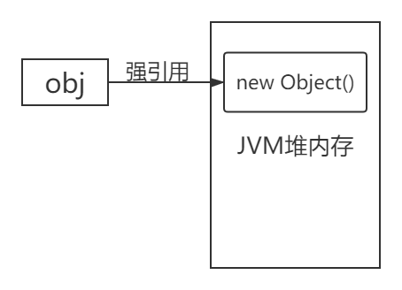
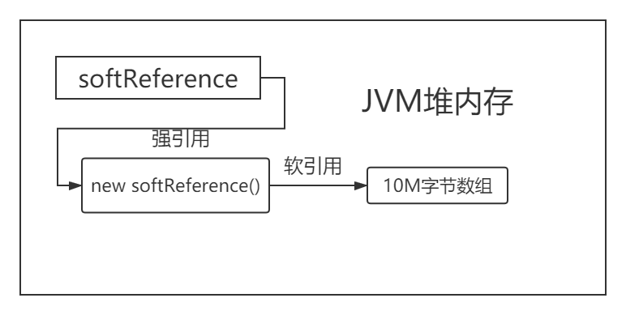
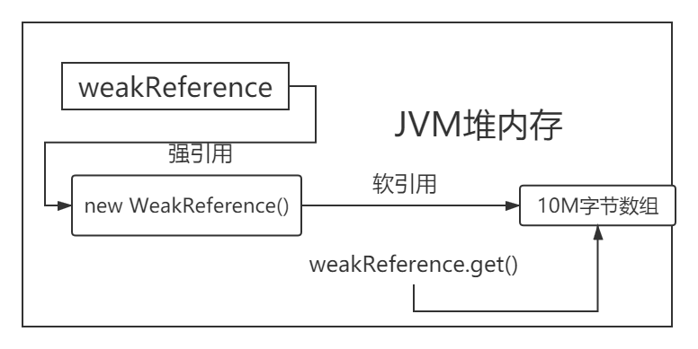
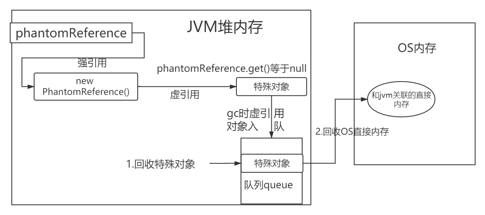
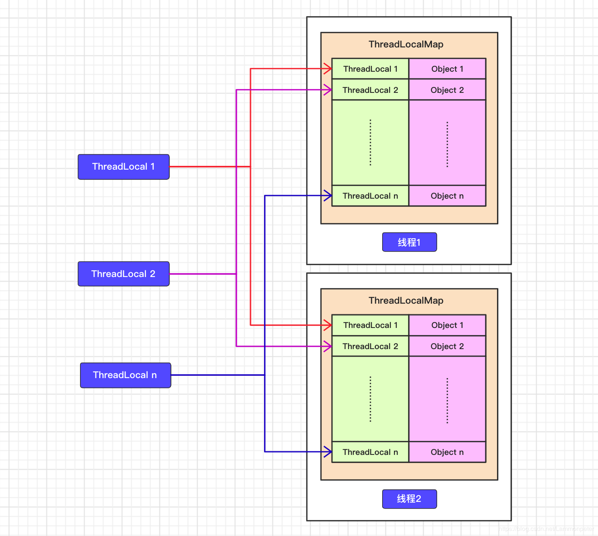
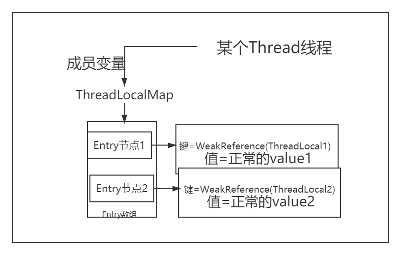
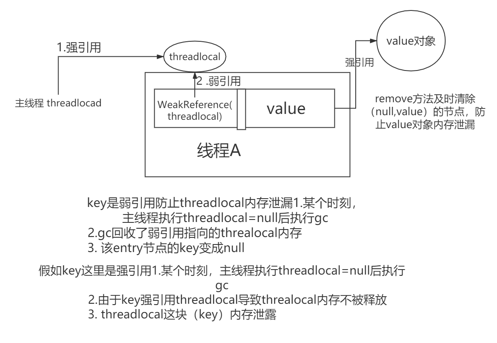

#java中四种引用类型（强软弱虚）
## 强引用 StrongReference
当我们使用 new 这个关键字创建对象时创建出来的对象就是强引用(new出来对象为强引用)  如Object obj = new Object()
这个obj就是一个强引用了，如果一个对象具有强引用。垃圾回收器就不会回收有强引用的对象。如当jvm内存不足时，具备强引用的对象，
虚拟机宁可会抛出OutOfMemoryError(内存空间不足)，使程序终止，也不会靠垃圾回收器去回收该对象来解决内存。
```java
    Object obj=new Object();//这里的obj就是强引用
    System.gc();//让垃圾回收期工作
    Thread.sleep(2000);
    System.out.println(object);//强引用，即使垃圾回收甚至OOM都不会回收强引用指向的内存
```


## 软引用 SoftReference

被引用对象可有可无，内存充足时候，垃圾回收器不会回收软引用指向的对象，如果内存不足时gc直接清除软引用指向的对象。
```java
        //软引用指向了10M堆内存
               SoftReference<byte[]> softReference=new SoftReference(new Byte[1024*1024*10]);
               System.out.println(softReference.get());
               System.gc();
               Thread.sleep(500);
               System.out.println(softReference.get());//内存充足，软引用对象保留
               //强引用指向了15M堆内存。－Xmx:20。堆内存最大
               byte[] b=new byte[1024*1024*15];//20-15=5，堆内存不足
               System.out.println("内存不足 "+softReference.get());
```

### 应用场景
软引用可用来实现内存敏感的高速缓存。软引用可有可无的特性和缓存特性一致。缓存使用原则，
如果缓存中有就从缓存获取，如果没有就从数据库中获取，缓存的存在是为了加快计算速度，如果因为缓存导致了内存不足进而整个程序崩溃，那就得不偿失了。

## 弱引用WeakReference（ThreadLocal中应用）
弱引用的对象拥有更短暂的生命周期。在垃圾回收器线程扫描它所管辖的内存区域的过程中，
gc一旦发现了只具有弱引用的对象，不管当前内存空间足够与否，都会回收它的内存。

```java
        WeakReference<byte[]> weakReference=new WeakReference(new Byte[1024*1024*10]);
        //weakReference.get()获取指向字节数组的若引用
        System.out.println(weakReference.get()); //正常打印Byte数组。Byte;@1540e19d
        System.gc(); //gc发现弱引用，立刻回收
        Thread.sleep(5000);
        System.out.println(weakReference.get());//不能打印弱引用数组 null
        System.out.println(weakReference);//weakReference这是一个强引用，可以打印。WeakReference@677327b6

```


应用场景：ThreadLocal中防止Entry节点的key weakreference(threadlocal)内存泄漏。

## 虚引用
“虚引用”顾名思义，就是形同虚设。它的get()方法无论何时返回的都只会是null。
所以单独使用虚引用时，没有什么意义，需要和引用队列ReferenceQueue类联合使用。
当执行Java GC时如果一个对象只有虚引用，就会把这个对象加入到与之关联的ReferenceQueue中。
```java
           static List list=new ArrayList();
           static ReferenceQueue queue=new ReferenceQueue();
           public static void main(String[] args) throws  Exception{
               PhantomReference phantomReference=new PhantomReference(new OverFinalizeObject(), queue);
               new Thread(()->{
                   while (true){
                       list.add(new byte[1024*1024]);//不断添加数据，导致堆内存溢出，发生gc,回收虚引用
                       try {
                           Thread.sleep(1000);
                       }catch (Exception e){
                           e.printStackTrace();
                       }
                       System.out.println("获取虚幻引用"+phantomReference.get());//由于是虚引用，每次都是null
                   }
               }).start();
       
               new Thread(()->{
                   while (true){//不断检测是否有虚引用对象加入到回收队列中
                       Reference<? extends OverFinalizeObject> poll=queue.poll();
                       if (poll!=null){//被立即回收的虚引用会首先加入到队列中
                            1。回收虚引用·
                           System.out.println("这是虚引用回收的东西"+poll);//
                            2。回收虚引用对象OverFinalizeObject关联的os直接内存
                       }
                   }
               }).start();
       
               try {
                   Thread.sleep(500);
               }catch (Exception e){
                   e.printStackTrace();
               }
       
           }

class OverFinalizeObject{
    protected void finalize() throws Throwable {
        System.out.println("我是OverFinalizeObject对象，即将被gc回收");
    }
}
```
第一个线程往集合里面塞数据，随着数据越来越多，肯定会发生GC。 
第二个线程死循环，从queue里面拿数据，如果拿出来的数据不是null，就打印出来。从运行结果可以看到：
当**发生GC，虚引用就会被回收，并且会把回收的通知放到ReferenceQueue中**。
虚引用有什么用呢？在NIO中，就运用了虚引用管理堆外内存.



### 引用场景
主要是java堆内存和OS直接内存进行数据交互时候，为了JVM释放堆内存中对象后，与该对象关联的OS直接内存空间（比如网络数据流之类的）也能安全释放。
在**NIO中，就运用了虚引用管理堆外内存.**(设计NIO知识，后期整理)


#ThreadLocal
[黑马视频讲解](https://www.bilibili.com/video/BV1N741127FH?from=search&seid=2056157373705791531&spm_id_from=333.337.0.0 "1")
[黑马文档,参考](https://blog.csdn.net/weixin_44050144/article/details/113061884 "!")
## threalocal应用场景
1. ThreadLocal 用作保存每个线程独享的对象，为每个线程都创建一个副本，这样每个线程都可以修改自己所拥有的副本, 而不会影响其他线程的副本，确保了线程安全。
2. ThreadLocal 用作每个线程内需要独立保存信息，以便供其他方法更方便地获取该信息的场景。每个线程获取到的信息可能都是不一样的，
前面执行的方法保存了信息后，后续方法可以通过ThreadLocal 直接获取到，避免了传参，类似于全局变量的概念。Spring的@Transaction事务注解

## Thread,ThreadLocalMap,(ThreadLocal,value)关系

Thread类对象中维护了ThreadLocalMap(key,value形式)成员变量，
而ThreadLocalMap维护了以ThreadLocal为key，需要存储的数据为value的Entry数组。这是它们三者之间的基本包含关系.

### k,value最底层Entry节点

ThreadLocalMap准确来说不是一个简单的map形式，底层实现方式是ThreadLocalMap维护的
一个Entry的数组，这个Entry数组每个节点由key和value进行构造的。

```java
static class Entry extends WeakReference<ThreadLocal<?>> {
    /** The value associated with this ThreadLocal. */
    Object value;
    Entry(ThreadLocal<?> k, Object v) {
        super(k);//key是ThreadLocal进行包装成弱引用.
        value = v;//value就是正常的value
    }
}
```
Entry结构实际上是继承了一个ThreadLocal类型的弱引用并将其作为key，value为Object类型。这里为什么要使用弱引用，后文讨论。


### entry上一层ThreadLocalMap

```java
    // 默认的数组初始化容量
    private static final int INITIAL_CAPACITY = 16;
    // Entry数组，大小必须为2的幂
    //这个就是最底层村塾（WeakReference(threadlocal),value）数组结构
    private Entry[] table;
    // 数组内部元素个数
    private int size = 0;
    // 数组扩容阈值，默认为0，创建了ThreadLocalMap对象后会被重新设置
    private int threshold;

//初始化ThreadLocal
ThreadLocalMap(ThreadLocal<?> firstKey, Object firstValue) {
    // 初始化Entry数组，大小 16
    table = new Entry[INITIAL_CAPACITY];
    // 用第一个键的哈希值对初始大小取模得到索引，和HashMap的位运算代替取模原理一样
    int i = firstKey.threadLocalHashCode & (INITIAL_CAPACITY - 1);
    // 将Entry对象存入数组指定位置
    table[i] = new Entry(firstKey, firstValue);
    size = 1;
    // 初始化扩容阈值，第一次设置为10
    setThreshold(INITIAL_CAPACITY);
}
```
### threalocalMap上一层Thread

```java
//thread类的成员变量，也就是说每个thread绑定一个threadlocalmap
ThreadLocal.ThreadLocalMap threadLocals = null;
```
**看到这里应该能清楚ThreadLocal的整体架构，每个线程都有一个threadlocalMap
这个threadlocalmap种可以存放Entry数组，数组中每个节点是以WeakReference(threadlocal)为key,
以正常value为value的结构。**


[参考hollis大神的面试几乎必问](https://www.hollischuang.com/archives/4859 "参考hollis大神的")
[马士兵讲解:强软弱虚＋threadlocal](https://www.bilibili.com/video/BV1fA411b7SX?from=search&seid=16512905782384903835)

## threadlocal的set方法
当前线程a调用threadlocal.set(value)方法时候，会以weakreference
(threadlocal),value以entry节点形式，放到a线程的threadlocapMap的entry数组中。

```java
public void set(T value) {
    // 首先获取调用此方法的线程
    Thread t = Thread.currentThread();
    // 将线程传递到getMap方法中来获取ThreadLocalMap，其实就是获取到当前线程的成员变量threadLocals所指向的ThreadLocalMap对象
    ThreadLocalMap map = getMap(t);//获取当前线程的threadlocalmap
    // 判断Map是否为空
    if (map != null)
        // 如果Map为不空，说明当前线程内部已经有ThreadLocalMap对象了，那么直接将本ThreadLocal对象作为键，存入的value作为值存储到ThreadLocalMap中
        map.set(this, value);
    else //当前线程第一次调用threadlocal.set方法
        // 创建一个ThreadLocalMap对象并将值存入到该对象中，并赋值给当前线程的threadLocals成员变量
        createMap(t, value);
}

// 获取到当前线程的成员变量threadLocals所指向的ThreadLocalMap对象
ThreadLocalMap getMap(Thread t) {
    return t.threadLocals;
}

// 创建一个ThreadLocalMap对象并将值存入到该对象中，并赋值给当前线程的threadLocals成员变量
void createMap(Thread t, T firstValue) {
    t.threadLocals = new ThreadLocalMap(this, firstValue);
}
ThreadLocalMap(ThreadLocal<?> firstKey, Object firstValue) {
            table = new Entry[INITIAL_CAPACITY];
            int i = firstKey.threadLocalHashCode & (INITIAL_CAPACITY - 1);
            table[i] = new Entry(firstKey, firstValue);
            size = 1;
            setThreshold(INITIAL_CAPACITY);
        }
```
ThreadLocalMap的set方法，源码分析如下所示：
```java
private void set(ThreadLocal<?> key, Object value) {
    Entry[] tab = table;
    int len = tab.length;
    // 计算当前ThreadLocal对象作为键在Entry数组中的下标索引
    int i = key.threadLocalHashCode & (len-1);

    // 线性遍历，首先获取到指定下标的Entry对象，如果不为空，则进入到for循环体内，
    // 判断当前的ThreadLocal对象是否是同一个对象，如果是，那么直接进行值替换，并结束方法，
    // 如果不是，再判断当前Entry的key是否失效，如果失效，则直接将失效的key和值进行替换。
    // 这两点都不满足的话，那么就调用nextIndex方法进行搜寻下一个合适的位置，进行同样的操作，
    // 直到找到某个位置，内部数据为空，也就是Entry为null，那么就直接将键值对设置到这个位置上。
    // 最后判断是否达到了扩容的条件，如果达到了，那么就进行扩容。
    for (Entry e = tab[i]; e != null; e = tab[i = nextIndex(i, len)]) {
        ThreadLocal<?> k = e.get();

        if (k == key) {
            //多次设置的threadlocal，节点value直接替换最新
            e.value = value;
            return;
        }
        //WeakReference(threadlocal)弱引用失效，其他线程使得threadlocal=null
        //并且gc发现了这个弱引用后就会清除threadlocal因此key变成null
        if (k == null) {
            replaceStaleEntry(key, value, i);
            return;
        }
    }

    tab[i] = new Entry(key, value);
    int sz = ++size;
    if (!cleanSomeSlots(i, sz) && sz >= threshold)
        rehash();
}
```
线性遍历，首先获取到指定下标的Entry对象，如果不为空，则进入到for循环体内，判断当前的ThreadLocal对象是否是同一个对象

如果是，那么直接进行值替换，并结束方法。如果不是，再判断当前Entry的key是否失效(entry节点key的弱引用设计精妙之处)，如果失效，则直接将失效的key和值进行替换。
这两点都不满足的话，那么就调用nextIndex方法进行搜寻下一个合适的位置（开放地址法寻找写一个节点）

## threadlocal的get方法

整体思路是获取当前线程的threadlocalMap成员变量，后计算当前threadlocal在Entry数组中的下表，
根据下标获取entry数组的entry节点后获得value。

```java
public T get() {
    // 获取当前线程的ThreadLocalMap对象
    Thread t = Thread.currentThread();
    ThreadLocalMap map = getMap(t);
    if (map != null) {
        // 如果map不为空，那么尝试获取Entry数组中以当前ThreadLocal对象为键的Entry对象
        ThreadLocalMap.Entry e = map.getEntry(this);
        if (e != null) {
            // 如果找到，那么直接返回value
            @SuppressWarnings("unchecked")
            T result = (T)e.value;
            return result;
        }
    }
    // 如果Map为空或者在Entry数组中没有找到以当前ThreadLocal对象为键的Entry对象，
    // 那么就在这里进行值初始化，值初始化的过程是将null作为值，当前ThreadLocal对象作为键，
    // 存入到当前线程的ThreadLocalMap对象中
    return setInitialValue();
}
//根据ThreadLocal获取节点Entry
private Entry getEntry(ThreadLocal<?> key) {
            int i = key.threadLocalHashCode & (table.length - 1);
            Entry e = table[i];
            if (e != null && e.get() == key)
                return e;
            else
                return getEntryAfterMiss(key, i, e);
}


// 值初始化过程
private T setInitialValue() {
    T value = initialValue();
    Thread t = Thread.currentThread();
    ThreadLocalMap map = getMap(t);
    if (map != null)
        map.set(this, value);
    else
        createMap(t, value);
    return value;
}
```

值初始化过程是这样的一个过程，如果调用新的ThreadLocal对象的get
方法，那么在当前线程的成员变量threadLocals中必定不存在key为当前
ThreadLocal对象的Entry对象，那么这里值初始话就将此
ThreadLocal对象作为key，null作为值存储到ThreadLocalMap的
Entry数组中。

## ThreadLocal的remove方法

ThreadLocal这个工具的时候，一般提倡使用完后及时清理存储在ThreadLocalMap中的值，
**防止内存泄露**。
整体思路还是根据threadlocal计算entry数组的下标，然后清除该Entry节点。
```java
public void remove() {
    ThreadLocalMap m = getMap(Thread.currentThread());
    if (m != null)
        m.remove(this);
}

// 具体的删除指定的值，也是通过遍历寻找，找到就删除，找不到就算了
private void remove(ThreadLocal<?> key) {
    Entry[] tab = table;
    int len = tab.length;
    int i = key.threadLocalHashCode & (len-1);
    for (Entry e = tab[i]; e != null; e = tab[i = nextIndex(i, len)]) {
        if (e.get() == key) {
            e.clear(); //这里世界把该weakReference（threadlocal）置为null
            expungeStaleEntry(i);
            return;
        }
    }
}
```

## threadlocal内存泄漏相关

### 弱引用防止threadlocal内存泄漏
由于使用了，threadlocal的弱引用避免了key的内存泄漏。
1. 某个时刻，主线程执行threadlocal=null后执行gc
2. gc回收了弱引用指向的threalocal内存                 
3. 该entry节点的key变成null，value仍然指向value对象。

### 弱引用被回收导致value内存泄漏


在上述主线程执行threadlocal=null后执行gc回收了threadloca内存，此时Entry节点变成（null,value强引用指向value对象）
由于key变成了null,因此导致value指向的强引用对象不能被当前线程访问，并且强引用gc不会回收该部分内存。导致value对象内存泄漏，不能释放。

解决方式：
1. 及时remove掉entry节点防止value内存泄漏。
2. newTheadLocal.set(newValue)方法时候，会计算newThreaLocal所在的Entry节点，如果该节点的key是null的话，就会清除所有的过期节点。
但是如果set时候计算节点的key不是null的话，仍然导致内存泄漏，因此即使remove才是正确解决方式。


### 及时remove掉entry节点防止线程池内存泄漏
假设一个线程池中有多个线程，某个线程A1执行任务t1后A1的线程池没有及时remove掉，当t1任务执行结束后
a1放回线程池，此时又让线程A1执行任务t2，此时t2也要用threadlocal的set或者get方法，
因此就可能get到上一个任务t1中的数据，导致内存泄漏和逻辑错误。

