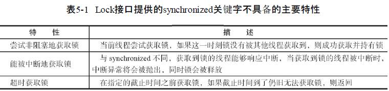
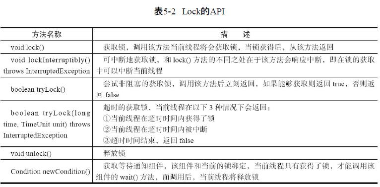
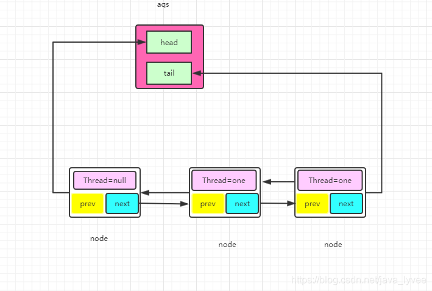

# Lock接口

jdk1.6之前java靠synchronized（重量级锁）关键字实现锁功能的,
，而Java SE 5之后，并发包中新增了Lock接口用来实现锁功能，它提供了与synchronized关键字类似的同步功
能，使需要显式地获取和释放锁,但是却拥有了锁获取与释放的可操作性、可中断的获取锁以
及超时获取锁等多种synchronized关键字所不具备的同步特性.

```java
Lock lock = new ReentrantLock();
    lock.lock();
    try {

    } finally {
        lock.unlock();//保证在获取到锁之后，最终能够被释放。
    }

```



# [美团技术点评AQS](https://tech.meituan.com/2019/12/05/aqs-theory-and-apply.html "美团技术原文地址")
# 队列同步器AQS
1. 锁对象：其实就是ReentrantLock的实例对象，下文应用代码第一行中的lock对象就是所谓的锁
2. 自由状态：自由状态表示锁对象没有被别的线程持有，计数器为0
3. 计数器：再lock对象中有一个字段state用来记录上锁次数，比如lock对象是自由状态则state为0，如果大于零则表示被线程持有了，当然也有重入那么state则>1
4. waitStatus：仅仅是一个状态而已；ws是一个过渡状态，在不同方法里面判断ws的状态做不同的处理，所以ws=0有其存在的必要性
tail：队列的队尾 head：队列的对首 ts：第二个给lock加锁的线程 tf：第一个给lock加锁的线程 tc：当前给线程加锁的线程
tl：最后一个加锁的线程 tn：随便某个线程
5. 节点：就是上面的Node类的对象，里面封装了线程，所以某种意义上node就等于一个线程

## AQS队列结构

同步器依赖内部的同步队列（一个FIFO双向队列）来完成同步状态的管理，当前线程获取
同步状态（setStatus）失败时，同步器会将当前线程以及等待状态等信息构造成为一个节点（Node）并将其
加入同步队列，同时会阻塞（LockSupport.park(node.thread)）当前线程，当同步状态释放时，会把首节点中的线程唤醒
(LockSupport.unpark(HeadNode.next.thread))，使其再
次尝试获取同步状态(setStatus)。
```java
private transient volatile Node head; //队首
private transient volatile Node tail;//尾
private volatile int state;//锁状态，加锁成功则为1，重入+1 解锁则为0
volatile Thread thread;//入队排队的线程引用
```


## reentrantlock上锁过程
```java
final ReentrantLock lock = new ReentrantLock(true);
 Thread t1= new Thread("t1"){
     @Override
     public void run() {
         lock.lock();
         logic();
         lock.unlock();
     }
 };
t1.start();
```

**非公平锁NonfairSync上锁**

```java
 final void lock() {
            if (compareAndSetState(0, 1))//非公平锁，线程执行lock方法后，上来就cas加锁。
                setExclusiveOwnerThread(Thread.currentThread());
            else//上来加锁失败，准备入队去
                acquire(1);
        }
```
**公平锁FairSync上锁**
```java
public final void acquire(int arg) { //arg=1
        if (!tryAcquire(arg) &&
            acquireQueued(addWaiter(Node.EXCLUSIVE), arg))
            selfInterrupt();
    }
```


公平锁的上锁是必须判断自己是不是需要排队；而非公平锁上来直接CAS修改计数器看能不能加锁成功；
如果加锁不成功则乖乖排队(调用acquire)；不管公平还是不公平；只要进到了AQS队列当中那么他就会排队；**一朝排队；永远排队**

### acquire(1)加锁
```java
public final void acquire(int arg) {//公平锁直接进到这里，非公平锁cas加锁失败进入这里
    //tryAcquire(arg)尝试加锁，如果加锁失败则会调用acquireQueued方法加入队列去排队，如果加锁成功则不会调用，整个方法返回，线程执行后续“同步代码”
    //acquireQueued方法下文会有解释
    //加入队列之后线程会立马park，等到解锁之后会被unpark，醒来之后判断自己是否被打断了；被打断下次分析
    //为什么需要执行这个方法？下文解释
    if (!tryAcquire(arg) &&
        acquireQueued(addWaiter(Node.EXCLUSIVE), arg))
        selfInterrupt();
}
```
#### tryAcquire(1)尝试加锁
尝试加锁，如果加锁失败则会调用acquireQueued方法加入队列去排队，如果加锁成功则不会调用，整个方法返回，当前线程获得到了锁，线程执行后续“同步代码”

**非公平锁tryAcquire(1)**
```java
final boolean nonfairTryAcquire(int acquires) {
            final Thread current = Thread.currentThread();//获取当前线程
            int c = getState();//获取AQS锁状态
//进入到这里说明，非公平锁在之前t1时刻cas失败了，现在是t2时刻，可能在t1到t2期间
//state锁被释放置为0，reentrantlock尽可能不让线程阻塞，因此来了一次自旋。            
            if (c == 0) { //t1时刻cas失败，现在t2在尝试一次cas。如果这里cas成功，非公平锁直接返回，成功获取锁。
                if (compareAndSetState(0, acquires)) {
                    setExclusiveOwnerThread(current);
                    return true;
                }
            }
            //c！=0说明有人占用锁，如果占用锁的线程不是自己，这次tryAcquire加锁失败。
            else if (current == getExclusiveOwnerThread()) {
                int nextc = c + acquires;
                if (nextc < 0) // overflow
                    throw new Error("Maximum lock count exceeded");
                setState(nextc);
                return true;
            }
            return false;
        }

```

**公平锁tryAcquire(1)**
```java
protected final boolean tryAcquire(int acquires) {
    //获取当前线程
    final Thread current = Thread.currentThread();
    //获取lock对象的上锁状态，如果锁是自由状态则=0，如果被上锁则为1，大于1表示重入
    int c = getState();
    if (c == 0) {//没人占用锁--->我要去上锁----1、锁是自由状态。锁是自由状态，当前线程不能直接加锁，要判断AQS队列中是否有排队的线程，因为是公平锁
        //hasQueuedPredecessors，判断自己是否需要排队这个方法比较复杂，
        //下面我会单独介绍，如果不需要排队则进行cas尝试加锁，如果加锁成功则把当前线程设置为拥有锁的线程
        //继而返回true
        if (!hasQueuedPredecessors() &&
            compareAndSetState(0, acquires)) {
            //设置当前线程为拥有锁的线程，方面后面判断是不是重入（只需把这个线程拿出来判断是否当前线程即可判断重入）    
            setExclusiveOwnerThread(current);
            return true;
        }
    }
    //如果C不等于0，而且当前线程不等于拥有锁的线程则不会进else if 直接返回false，加锁失败
    //如果C不等于0，但是当前线程等于拥有锁的线程则表示这是一次重入，那么直接把状态+1表示重入次数+1
    //那么这里也侧面说明了reentrantlock是可以重入的，因为如果是重入也返回true，也能lock成功
    else if (current == getExclusiveOwnerThread()) {
        int nextc = c + acquires;//锁重入了。次数+1
        if (nextc < 0)
            throw new Error("Maximum lock count exceeded");
        setState(nextc);
        return true;
    }
    return false;
}

```

##### hasQueuedPredecessors判断是否需要排队的源码分析
公平锁：一个线程进来发现锁的状态state=0那么由于是公平锁，当前线程需要判断是否有排队的线程（不可以上来就加锁，否则就不是公平锁）
如果发现AQS队列中没有排队的线程，则直接来cas加锁尝试。

```java
public final boolean hasQueuedPredecessors() {
    Node t = tail; 
    Node h = head;
    Node s;
    /**
     * 下面提到的所有不需要排队，并不是字面意义，我实在想不出什么词语来描述这个“不需要排队”；不需要排队有两种情况
     * 一：队列没有初始化，不需要排队，不需要排队，不需要排队；直接去加锁，但是可能会失败；为什么会失败呢？
     * 假设两个线程同时来lock，都看到队列没有初始化，都认为不需要排队，都去进行CAS修改计数器；有一个必然失败
     * 比如t1先拿到锁，那么另外一个t2则会CAS失败，这个时候t2就会去初始化队列，并排队
     *
     * 二：队列被初始化了，但是tc过来加锁，发觉队列当中第一个排队的就是自己；比如重入；
     * 那么什么叫做第一个排队的呢？下面解释了，很重要往下看；
     * 这个时候他也不需要排队，不需要排队，不需要排队；为什么不需要排对？
     * 因为队列当中第一个排队的线程他会去尝试获取一下锁，因为有可能这个时候持有锁锁的那个线程可能释放了锁；
     * 如果释放了就直接获取锁执行。但是如果没有释放他就会去排队，
     * 所以这里的不需要排队，不是真的不需要排队
     *
     * h != t 判断首不等于尾这里要分三种情况
     * 1、队列没有初始化，也就是第一个线程tf来加锁的时候那么这个时候队列没有初始化，
     * h和t都是null，那么这个时候判断不等于则不成立（false）那么由于是&&运算后面的就不会走了，
     * 直接返回false表示不需要排队，而前面又是取反（if (!hasQueuedPredecessors()），所以会直接去cas加锁。
     * ----------第一种情况总结：队列没有初始化没人排队，那么我直接不排队，直接上锁；合情合理、有理有据令人信服；
     * 好比你去火车站买票，服务员都闲的蛋疼，整个队列都没有形成；没人排队，你直接过去交钱拿票
     *
     * 2、队列被初始化了，后面会分析队列初始化的流程，如果队列被初始化那么h!=t则成立；（不绝对，还有第3中情况）
     * h != t 返回true；但是由于是&&运算，故而代码还需要进行后续的判断
     * （有人可能会疑问，比如队列初始化了；里面只有一个数据，那么头和尾都是同一个怎么会成立呢？
     * 其实这是第3种情况--对头等于对尾；但是这里先不考虑，我们假设现在队列里面有大于1个数据）
     * 大于1个数据则成立;继续判断把h.next赋值给s；s有是对头的下一个Node，
     * 这个时候s则表示他是队列当中参与排队的线程而且是排在最前面的；
     * 为什么是s最前面不是h嘛？诚然h是队列里面的第一个，但是不是排队的第一个；下文有详细解释
     * 因为h也就是对头对应的Node对象或者线程他是持有锁的，但是不参与排队；
     * 这个很好理解，比如你去买车票，你如果是第一个这个时候售票员已经在给你服务了，你不算排队，你后面的才算排队；
     * 队列里面的h是不参与排队的这点一定要明白；参考下面关于队列初始化的解释；
     * 因为h要么是虚拟出来的节点，要么是持有锁的节点；什么时候是虚拟的呢？什么时候是持有锁的节点呢？下文分析
     * 然后判断s是否等于空，其实就是判断队列里面是否只有一个数据；
     * 假设队列大于1个，那么肯定不成立（s==null---->false），因为大于一个Node的时候h.next肯定不为空；
     * 由于是||运算如果返回false，还要判断s.thread != Thread.currentThread()；这里又分为两种情况
     *        2.1 s.thread != Thread.currentThread() 返回true，就是当前线程不等于在排队的第一个线程s；
     *              那么这个时候整体结果就是h!=t：true; （s==null false || s.thread != Thread.currentThread() true  最后true）
     *              结果： true && true 方法最终放回true，所以需要去排队
     *              其实这样符合情理，试想一下买火车票，队列不为空，有人在排队；
     *              而且第一个排队的人和现在来参与竞争的人不是同一个，那么你就乖乖去排队
     *        2.2 s.thread != Thread.currentThread() 返回false 表示当前来参与竞争锁的线程和第一个排队的线程是同一个线程
     *             这个时候整体结果就是h!=t---->true; （s==null false || s.thread != Thread.currentThread() false-----> 最后false）
     *            结果：true && false 方法最终放回false，所以不需要去排队
     *            不需要排队则调用 compareAndSetState(0, acquires) 去改变计数器尝试上锁；
     *            这里又分为两种情况（日了狗了这一行代码；有同学课后反应说子路老师老师老是说这个AQS难，
     *            你现在仔细看看这一行代码的意义，真的不简单的）
     *             2.2.1  第一种情况加锁成功？有人会问为什么会成功啊，如这个时候h也就是持有锁的那个线程执行完了
     *                      释放锁了，那么肯定成功啊；成功则执行 setExclusiveOwnerThread(current); 然后返回true 自己看代码
     *             2.2.2  第二种情况加锁失败？有人会问为什么会失败啊。假如这个时候h也就是持有锁的那个线程没执行完
     *                       没释放锁，那么肯定失败啊；失败则直接返回false，不会进else if（else if是相对于 if (c == 0)的）
     *                      那么如果失败怎么办呢？后面分析；
     *
     *----------第二种情况总结，如果队列被初始化了，而且至少有一个人在排队那么自己也去排队；但是有个插曲；
     * ----------他会去看看那个第一个排队的人是不是自己，如果是自己那么他就去尝试加锁；尝试看看锁有没有释放
     *----------也合情合理，好比你去买票，如果有人排队，那么你乖乖排队，但是你会去看第一个排队的人是不是你女朋友；
     *----------如果是你女朋友就相当于是你自己（这里实在想不出现实世界关于重入的例子，只能用男女朋友来替代）；
     * --------- 你就叫你女朋友看看售票员有没有搞完，有没有轮到你女朋友，因为你女朋友是第一个排队的
     * 疑问：比如如果在在排队，那么他是park状态，如果是park状态，自己怎么还可能重入啊。
     * 希望有同学可以想出来为什么和我讨论一下，作为一个菜逼，希望有人教教我
     *  
     * 
     * 3、队列被初始化了，但是里面只有一个数据；什么情况下才会出现这种情况呢？ts加锁的时候里面就只有一个数据？
     * 其实不是，因为队列初始化的时候会虚拟一个h作为头结点，tc=ts作为第一个排队的节点；tf为持有锁的节点
     * 为什么这么做呢？因为AQS认为h永远是不排队的，假设你不虚拟节点出来那么ts就是h，
     *  而ts其实需要排队的，因为这个时候tf可能没有执行完，还持有着锁，ts得不到锁，故而他需要排队；
     * 那么为什么要虚拟为什么ts不直接排在tf之后呢，上面已经时说明白了，tf来上锁的时候队列都没有，他不进队列，
     * 故而ts无法排在tf之后，只能虚拟一个thread=null的节点出来（Node对象当中的thread为null）；
     * 那么问题来了；究竟什么时候会出现队列当中只有一个数据呢？假设原队列里面有5个人在排队，当前面4个都执行完了
     * 轮到第五个线程得到锁的时候；他会把自己设置成为头部，而尾部又没有，故而队列当中只有一个h就是第五个
     * 至于为什么需要把自己设置成头部；其实已经解释了，因为这个时候五个线程已经不排队了，他拿到锁了；
     * 所以他不参与排队，故而需要设置成为h；即头部；所以这个时间内，队列当中只有一个节点
     * 关于加锁成功后把自己设置成为头部的源码，后面会解析到；继续第三种情况的代码分析
     * 记得这个时候队列已经初始化了，但是只有一个数据，并且这个数据所代表的线程是持有锁
     * h != t false 由于后面是&&运算，故而返回false可以不参与运算，整个方法返回false；不需要排队
     *
     *
     *-------------第三种情况总结：如果队列当中只有一个节点，而这种情况我们分析了，
     *-------------这个节点就是当前持有锁的那个节点，故而我不需要排队，进行cas；尝试加锁
     *-------------这是AQS的设计原理，他会判断你入队之前，队列里面有没有人排队；
     *-------------有没有人排队分两种情况；队列没有初始化，不需要排队
     *--------------队列初始化了，按时只有一个节点，也是没人排队，自己先也不排队
     *--------------只要认定自己不需要排队，则先尝试加锁；加锁失败之后再排队；
     *--------------再一次解释了不需要排队这个词的歧义性
     *-------------如果加锁失败了，在去park，下文有详细解释这样设计源码和原因
     *-------------如果持有锁的线程释放了锁，那么我能成功上锁
     *
     **/
    return h != t &&
        ((s = h.next) == null || s.thread != Thread.currentThread());
}

```

#### acquireQueued(addWaiter(Node.exclusive),arg))

如果代码能执行到这里说当前线程需要排队，需要排队有两种情况
1. t1持有了锁，并没有释放，所以t2来加锁的时候需要排队，但这个时候—队列并没有初始化。
2. t3持有了锁，那么由于加锁t3!=t1(t1是属于第一种情况，我们现在不考虑t1)，所以队列是一定被初始化了的，t2来加锁，那么队列当中有人在排队，故而他也去排队

##### addWaiter(Node.EXCLUSIVE)源码分析
返回的刚入队线程的Node
```java
private Node addWaiter(Node mode) { // mode标志排他锁或者共享锁,返回入队的节点Node
    //由于AQS队列当中的元素类型为Node，故而需要把当前线程tc封装成为一个Node对象,下文我们叫做nc
    Node node = new Node(Thread.currentThread(), mode);
    //tail为对尾，赋值给pred 
    Node pred = tail;
    //判断pred是否为空，其实就是判断对尾是否有节点，其实只要队列被初始化了对尾肯定不为空，
    //假设队列里面只有一个元素，那么对尾和对首都是这个元素
    //换言之就是判断队列有没有初始化
    //上面我们说过代码执行到这里有两种情况，1、队列没有初始化和2、队列已经初始化了
    //pred不等于空表示第二种情况，队列被初始化了，如果是第二种情况那比较简单
   //直接把当前线程封装的nc的上一个节点设置成为pred即原来的对尾
   //继而把pred的下一个节点设置为当nc，这个nc自己成为对尾了
    if (pred != null) {
        //直接把当前线程封装的nc的上一个节点设置成为pred即原来的对尾，对应 10行的注释
        node.prev = pred;
        //这里需要cas，因为防止多个线程加锁，确保nc入队的时候是原子操作
        if (compareAndSetTail(pred, node)) {
            //继而把pred的下一个节点设置为当nc，这个nc自己成为对尾了 对应第11行注释
            pred.next = node;
            //然后把nc返回出去，方法结束
            return node;
        }
    }
    //if tail==null ,表示第一种情况队列并没有初始化
    enq(node);
    //返回nc
    return node;
}


private Node enq(final Node node) {//进入这里说明队列没有初始化，head=tail=null
    //死循环
    for (;;) {
        //对尾复制给t，上面已经说过队列没有初始化，
        //故而第一次循环t==null（因为是死循环，因此强调第一次，后面可能还有第二次、第三次，每次t的情况肯定不同）
        Node t = tail;
        //第一次循环成了成立
        if (t == null) { // Must initialize，初始化队列头节点，设置为头部。（头节点的Thread始终是null）
            //new Node就是实例化一个Node对象下文我们称为nn，
            //调用无参构造方法实例化出来的Node里面三个属性都为null，可以关联Node类的结构，
            //compareAndSetHead入队操作；把这个nn设置成为队列当中的头部，cas防止多线程、确保原子操作；
            //记住这个时候队列当中只有一个，即nn
            if (compareAndSetHead(new Node()))
                //这个时候AQS队列当中只有一个元素，即头部=nn，所以为了确保队列的完整，设置头部等于尾部，即nn即是头也是尾
                //然后第一次循环结束；接着执行第二次循环，第二次循环代码我写在了下面，接着往下看就行
                tail = head;
        } else {
            node.prev = t;
            if (compareAndSetTail(t, node)) {
                t.next = node;
                return t;
            }
        }
    }
}


//为了方便 第二次循环我再贴一次代码来对第二遍循环解释
private Node enq(final Node node) {//这里的node就是当前线程封装的node也就是nc
    //死循环
    for (;;) {
        //对尾复制给t，由于第二次循环，故而tail==nn，即new出来的那个node
        Node t = tail;
        //第二次循环不成立
        if (t == null) { // Must initialize
            if (compareAndSetHead(new Node()))
                tail = head;
        } else {
            //不成立故而进入else
            //首先把nc，当前线程所代表的的node的上一个节点改变为nn，因为这个时候nc需要入队，入队的时候需要把关系维护好
            //所谓的维护关系就是形成链表，nc的上一个节点只能为nn，这个很好理解
            node.prev = t;
            //入队操作--把nc设置为对尾，对首是nn，
            if (compareAndSetTail(t, node)) {
                //上面我们说了为了维护关系把nc的上一个节点设置为nn
                //这里同样为了维护关系，把nn的下一个节点设置为nc
                t.next = node;
                //然后返回t，即nn，死循环结束，enq(node);方法返回
                //这个返回其实就是为了终止循环，返回出去的t，没有意义
                return t;
            }
        }
    }
}

  //这个方法已经解释完成了
  enq(node);
  //返回nc，不管哪种情况都会返回nc；到此addWaiter方法解释完成
  return node;


//再次贴出node的结构方便大家查看
public class Node{
    volatile Node prev;
    volatile Node next;
    volatile Thread thread;
}


-------------------总结：addWaiter方法就是让nc入队-并且维护队列的链表关系，但是由于情况复杂做了不同处理
-------------------主要针对队列是否有初始化，没有初始化则new一个新的Node nn作为对首，nn里面的线程为null
-------------------接下来分析acquireQueued方法

```

#### acquireQueued方法
```java
final boolean acquireQueued(final Node node, int arg) {//这里的node 就是当前线程封装的那个node 下文叫做nc
    //记住标志很重要
    boolean failed = true;
    try {
        //同样是一个标志
        boolean interrupted = false;
        //死循环
        for (;;) {
            //获取nc的上一个节点，有两种情况；1、上一个节点为头部；2上一个节点不为头部
            final Node p = node.predecessor();
            //如果nc的上一个节点为头部，则表示nc为队列当中的第二个元素，为队列当中的第一个排队的Node；
            //这里的第一和第二不冲突；我上文有解释；
            //如果nc为队列当中的第二个元素，第一个排队的则调用tryAcquire去尝试加锁---关于tryAcquire看上面的分析
            //只有nc为第二个元素；第一个排队的情况下才会尝试加锁，其他情况直接去park了，
            //因为第一个排队的执行到这里的时候需要看看持有有锁的线程有没有释放锁，释放了就轮到我了，就不park了
            //有人会疑惑说开始调用tryAcquire加锁失败了（需要排队），这里为什么还要进行tryAcquire不是重复了吗？
            //其实不然，因为第一次tryAcquire判断是否需要排队，如果需要排队，那么我就入队；
            //当我入队之后我发觉前面那个人就是第一个，持有锁的那个，那么我不死心，再次问问前面那个人搞完没有
            //如果他搞完了，我就不park，接着他搞我自己的事；如果他没有搞完，那么我则在队列当中去park，等待别人叫我
            //但是如果我去排队，发觉前面那个人在睡觉，前面那个人都在睡觉，那么我也睡觉把---------------好好理解一下
            if (p == head && tryAcquire(arg)) {
                //能够执行到这里表示我来加锁的时候，锁被持有了，我去排队，进到队列当中的时候发觉我前面那个人没有park，
                //前面那个人就是当前持有锁的那个人，那么我问问他搞完没有
                //能够进到这个里面就表示前面那个人搞完了；所以这里能执行到的几率比较小；但是在高并发的世界中这种情况真的需要考虑
                //如果我前面那个人搞完了，我nc得到锁了，那么前面那个人直接出队列，我自己则是对首；这行代码就是设置自己为对首
                setHead(node);
                //这里的P代表的就是刚刚搞完事的那个人，由于他的事情搞完了，要出队；怎么出队？把链表关系删除
                p.next = null; // help GC
                //设置表示---记住记加锁成功的时候为false
                failed = false;
                //返回false；为什么返回false？下次博客解释---比较复杂和加锁无关
                return interrupted;
            }
            //进到这里分为两种情况
            //1、nc的上一个节点不是头部，说白了，就是我去排队了，但是我上一个人不是队列第一个
            //2、第二种情况，我去排队了，发觉上一个节点是第一个，但是他还在搞事没有释放锁
            //不管哪种情况这个时候我都需要park，park之前我需要把上一个节点的状态改成park状态
            //这里比较难以理解为什么我需要去改变上一个节点的park状态呢？每个node都有一个状态，默认为0，表示无状态
            //-1表示在park；当时不能自己把自己改成-1状态？为什么呢？因为你得确定你自己park了才是能改为-1；
            //不然你自己改成自己为-1；但是改完之后你没有park那不就骗人？
            //你对外宣布自己是单身状态，但是实际和刘宏斌私下约会；这有点坑人
            //所以只能先park；在改状态；但是问题你自己都park了；完全释放CPU资源了，故而没有办法执行任何代码了，
            //所以只能别人来改；故而可以看到每次都是自己的后一个节点把自己改成-1状态
            //关于shouldParkAfterFailedAcquire这个方法的源码下次博客继续讲吧
            if (shouldParkAfterFailedAcquire(p, node) &&
                //改上一个节点的状态成功之后；自己park；到此加锁过程说完了
                parkAndCheckInterrupt())
                interrupted = true;
        }
    } finally {
        if (failed)
            cancelAcquire(node);
    }
}

private static boolean shouldParkAfterFailedAcquire(Node pred, Node node) {
        int ws = pred.waitStatus;
        if (ws == Node.SIGNAL)//前一个结点的状态时，-1时候，说明当前节点的前一个结点已经park了，因此自己应该直接park
            /*
             * This node has already set status asking a release
             * to signal it, so it can safely park.
             */
            return true;
        if (ws > 0) {
            /*
             * Predecessor was cancelled. Skip over predecessors and
             * indicate retry.
             */
            do {
                node.prev = pred = pred.prev;
            } while (pred.waitStatus > 0);
            pred.next = node;
        } else { //前一个结点状态是0，前一个已经park，需要我这个节点cas把他的标签设置为-1
            /*
             * waitStatus must be 0 or PROPAGATE.  Indicate that we
             * need a signal, but don't park yet.  Caller will need to
             * retry to make sure it cannot acquire before parking.
             */
            compareAndSetWaitStatus(pred, ws, Node.SIGNAL);
        }
        return false;
    }

private final boolean parkAndCheckInterrupt() {
        LockSupport.park(this);//park当前线程
        return Thread.interrupted();
    }


public final void acquire(int arg) {
    if (!tryAcquire(arg) &&
        acquireQueued(addWaiter(Node.EXCLUSIVE), arg))
        selfInterrupt();
}

```

## 释放锁过程

我们已经剖析了加锁过程中的基本流程，接下来再对解锁的基本流程进行分析。由于ReentrantLock在解锁的时候，并不区分公平锁和非公平锁，所以我们直接看解锁的源码：
```java
// java.util.concurrent.locks.ReentrantLock

public void unlock() {
	sync.release(1);
}
```

可以看到，本质释放锁的地方，是通过框架来完成的。
```java

// java.util.concurrent.locks.AbstractQueuedSynchronizer

public final boolean release(int arg) {
	if (tryRelease(arg)) {
		Node h = head;
		if (h != null && h.waitStatus != 0)
			unparkSuccessor(h);
		return true;
	}
	return false;
}
```

在ReentrantLock里面的公平锁和非公平锁的父类Sync定义了可重入锁的释放锁机制。
```java


// java.util.concurrent.locks.ReentrantLock.Sync

// 方法返回当前锁是不是没有被线程持有
protected final boolean tryRelease(int releases) {
	// 减少可重入次数
	int c = getState() - releases;
	// 当前线程不是持有锁的线程，抛出异常
	if (Thread.currentThread() != getExclusiveOwnerThread())
		throw new IllegalMonitorStateException();
	boolean free = false;
	// 如果持有线程全部释放，将当前独占锁所有线程设置为null，并更新state
	if (c == 0) {
		free = true;
		setExclusiveOwnerThread(null);
	}
	setState(c);
	return free;
}
```
我们来解释下述源码：

```java


// java.util.concurrent.locks.AbstractQueuedSynchronizer

public final boolean release(int arg) {
	// 上边自定义的tryRelease如果返回true，说明该锁没有被任何线程持有
	if (tryRelease(arg)) {
		// 获取头结点
		Node h = head;
		// 头结点不为空并且头结点的waitStatus不是初始化节点情况，解除线程挂起状态
		if (h != null && h.waitStatus != 0)
			unparkSuccessor(h);
		return true;
	}
	return false;
}
```
这里的判断条件为什么是h != null && h.waitStatus != 0？

h == null Head还没初始化。初始情况下，head == null，第一个节点入队，Head会被初始化一个虚拟节点。所以说，这里如果还没来得及入队，就会出现head == null 的情况。

h != null && waitStatus == 0 表明后继节点对应的线程仍在运行中，不需要唤醒。

h != null && waitStatus < 0 表明后继节点可能被阻塞了，需要唤醒。

再看一下unparkSuccessor方法：

```java


// java.util.concurrent.locks.AbstractQueuedSynchronizer

private void unparkSuccessor(Node node) {
	// 获取头结点waitStatus
	int ws = node.waitStatus;
	if (ws < 0)
		compareAndSetWaitStatus(node, ws, 0);
	// 获取当前节点的下一个节点
	Node s = node.next;
	// 如果下个节点是null或者下个节点被cancelled，就找到队列最开始的非cancelled的节点
	if (s == null || s.waitStatus > 0) {
		s = null;
		// 就从尾部节点开始找，到队首，找到队列第一个waitStatus<0的节点。
		for (Node t = tail; t != null && t != node; t = t.prev)
			if (t.waitStatus <= 0)
				s = t;
	}
	// 如果当前节点的下个节点不为空，而且状态<=0，就把当前节点unpark
	if (s != null)
		LockSupport.unpark(s.thread);
}
```


