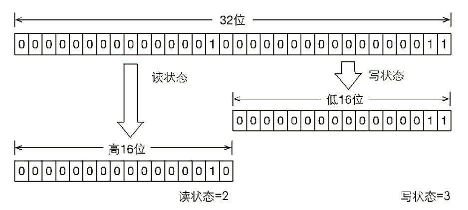

# 读写锁产生背景
ReentrantLock和Synchronized等是排他锁，这些锁在同一时刻只允许一个线程进行访问。
读写锁在同一时刻允许多个读线程访问，但是在写线程访问时，所有的读
线程和其他写线程均被阻塞。读写锁维护了一对锁，一个读锁和一个写锁，通过分离读锁和写
锁，使得**并发性相比一般的排他锁有了很大提升**。

## 读写锁特性
1. 如果某个线程获取到了读锁，其余线程都可以获取读锁，然和线程获取写锁都被阻塞
2. 如果某个线程获取到了写锁，除了自身可以获取读锁之外，其余线程无论是获取读还是写锁都阻塞


## 场景应用
**大多数场景都是读大于写**。比如一个缓冲区，大部分时间都是读取操作（搜索、查询），很少进行写操作（修改），一旦写要保证
对所有线程的可见性。此时读写锁性能最高，排他锁性能非常低。其实这个场景就是操作系统的读者写者问题。

```java
public class Cache {
    static Map<String, Object> map = new HashMap<String, Object>();//缓冲区
    static ReentrantReadWriteLock rwl = new ReentrantReadWriteLock();
    static Lock r = rwl.readLock();//读写锁维护的读锁
    static Lock w = rwl.writeLock();//读写锁维护的写锁
// 获取一个key对应的value
public static final Object get(String key) {
    r.lock();
    try {
         return map.get(key);//读取数据
        } finally {
        r.unlock();
    }
}
// 设置key对应的value，并返回旧的value
public static final Object put(String key, Object value) {
    w.lock();
    try {
        return map.put(key, value);//写数据
    } finally {
        w.unlock();
    }
}
// 清空所有的内容
public static final void clear() {
    w.lock();
    try {
        map.clear();
        } finally {
        w.unlock();
        }
    }
}
```

## 读写锁实现原理

### 读写状态区分

读写锁同样依赖自定义同步器来实现同步功能，ReentrantLock是排他锁中state代表冲入次数。
读写锁中需要在同步状态state维护多个读线程和一个写线程的状态。读写锁将变量state切分成了
两个部分，高16位表示读（所有线程读重入次数，单个线程重入次数存在ThreadLocal中），低16位表示写（
获取写线程的写锁重入次数）。


1. 获取写状态 state&0x0000FFFF
2. 获取读状态 state>>>16

### 写锁的获取和释放
写锁是支持重进入的排它锁。如果当前线程已经获取了写锁，则增加写状态(state+0x00000001)。如果当
前线程在获取写锁时，存在读锁或者当前获取线程不是已经获取写锁的线程，则当前线程进入等待状态。

1. 判断是否有读锁可以根据state读锁高16是否是0，不是0说明有读锁线程在。
2. 判断是否有写锁可以根据state写锁低16是否是0，不是0说明有写锁线程在，或者根据owner是否是null判断
```java
protected final boolean tryAcquire(int acquires) {
    Thread current = Thread.currentThread();
    int c = getState();
    int w = exclusiveCount(c);
    if (c != 0) {
        // 存在读锁或者当前获取线程不是已经获取写锁的线程
        if (w == 0 || current != getExclusiveOwnerThread())
            return false;
        if (w + exclusiveCount(acquires) > MAX_COUNT)
        throw new Error("Maximum lock count exceeded");
            setState(c + acquires);
        return true;
    }
    if (writerShouldBlock() || !compareAndSetState(c, c + acquires)) {
        return false;
    }
    setExclusiveOwnerThread(current);
    return true;
}
```
写锁的释放与ReentrantLock的释放过程基本类似，每次释放均减少写状态，当写状态为0
时表示写锁已被释放，

### 读锁的获取和释放

1. 判断是否有读锁可以根据state读锁高16是否是0，不是0说明有读锁线程在。
2. 判断是否有写锁可以根据state写锁低16是否是0，不是0说明有写锁线程在，或者根据owner是否是null判断

读锁是支持重进入的共享锁，它能够被多个线程同时获取，在没有其他写线程访问
（或者写状态为0）时，读锁总会被成功地获取，而所做的也只是（线程安全的）增加读状态。如
果当前线程已经获取了读锁，则增加读状态（存在ThreadLocal中）。如果当前线程在获取读锁时，写锁已被其他线程
获取，则进入等待状态。

读锁线程检测owner（拥有写锁的线程）是否是当前线程，如果是可以直接加读锁。如果state写锁标志位
是0，表示没有人加写锁，此时owner是null。此时读锁可以直接加锁。
```java
protected final int tryAcquireShared(int unused) {
    for (;;) {
        int c = getState();
        int nextc = c + (1 << 16);
        if (nextc < c)
            throw new Error("Maximum lock count exceeded");
        if (exclusiveCount(c) != 0 && owner != Thread.currentThread())
            return -1;
        if (compareAndSetState(c, nextc))
            return 1;
    }
}
```
读锁的每次释放（线程安全的，可能有多个读线程同时释放读锁）均减少读状态，减少的
值是（1<<16）。

### 锁降级（非重）
锁降级指的是写锁降级成为读锁，是指把持住（当前拥有的）写锁，再获取到读锁，
随后释放（先前拥有的）写锁的过程。
```java
writeLock.lock()
readerLock.lock()
writeLock.unLock() //此时当前线程拥有的锁，从写锁降到读锁
oracle的ReentrantReadWriteLock示例代码
class CachedData {
   Object data;//操作的数据
   volatile boolean cacheValid;//一个标志，初始是false
   final ReentrantReadWriteLock rwl = new ReentrantReadWriteLock();

   void processCachedData() {
     rwl.readLock().lock();//上读锁
     if (!cacheValid) {
       // Must release read lock before acquiring write lock
       rwl.readLock().unlock();//写锁之前释放读锁

       rwl.writeLock().lock();//修改，准备数据，需要加写锁
       try {
         // Recheck state because another thread might have
         // acquired write lock and changed state before we did.
         if (!cacheValid) {
           data = ... //数据修改或者准备数据
           cacheValid = true;
         }
         // Downgrade by acquiring read lock before releasing write lock
         rwl.readLock().lock();//锁降级，先加读锁
       } finally {
        //写锁释放，降级为写锁。
         rwl.writeLock().unlock(); // Unlock write, still hold read
       }
     }

     try {
       use(data);//使用数据
     } finally {
       rwl.readLock().unlock();
     }
   }
 }

```
锁降级是否有必要？
目的：保证数据可见性。（**书中讲的比较抽象**）
如果当前线程不获取读锁而是直接释放写锁，假设此刻另一个线程T获取了写锁并修
改了数据，那么当前线程无法感知线程T的数据更新。如果当前线程获取读锁，即遵循锁降级
的步骤，则线程T将会被阻塞，直到当前线程使用数据并释放读锁之后，线程T才能获取写锁进
行数据更新。

我们使用读写锁，完成的是1.数据data的修改，2.数据data的读取。那么这里的锁降级是否一定是必要的??
**不是必须的。**

在这个问题里，如果不想使用锁降级
1. 可以继续持有写锁，完成后续的操作。（能完成，但性能低下）
2. 也可以先把写锁释放，再获取读锁。（存在数据错误的可能性）

**如果继续持有写锁**
```java
writeLock.lock()
prepareData
如果 use 函数耗时较长，那么就不必要的阻塞了可能的读流程。导致数据已经修改完成，但是只能单个线程使用
use(Data) 
writeLock.unLock()
```
**如果先把写锁释放，再获取读锁。**

在有些逻辑里，这个 cache 值可能被修改也可能被移除，这个看能不能接受。另外，降级锁比释放写再获取读性能要好，
因为当前只有一个写锁，可以直接不竞争的降级。而释放写锁，获取读锁的过程就面对着其他读锁请求的竞争，引入额外不必要的开销。

**锁降级只是提供了一个手段，这个手段可以让流程（修改数据，读取数据）不被中断的降低到低级别锁**，并且相对同样满足业务要求的其他手段性能更为良好。


RentrantReadWriteLock不支持锁升级（把持读锁、获取写锁，最后释放读锁的过程）。
目的是保证数据可见性，如果读锁已被多个线程获取，其中任意线程成功获取了写锁并更新了
数据，则其更新对其他获取到读锁的线程是不可见的

# 操作系统的读者写者问题

## 读进程优先，写进程可能饥饿
```java

semaphore rw=1; //用于实现对文件的互斥访问，表示当前是否有进程在访问共享文件
int count = 0; //记录当前有几个读进程正在访问文件
semaphore mutex = 1;//用于保证对count变量的互斥访问

writer (){
    while(1){
    P(rw); //写之前加锁
    写文件
    V(rw); //写之后解锁
    }
}

reader (){
    while(1){
        P(mutex); //各进程互斥访问count
        if(count==0)
            P(rw); //第一个读进程负责加锁
        count++; //访问文件的读进程+1
        V(mutex);
        读取文件
        P(mutex); //各读进程互斥访问count
        count--; //访问文件的读进程-1
        if(count==0)
            V(rw); //最后一个读进程负责解锁
        V(mutex);
    }
}

```

## 写进程优先
```java

semaphore rw=1; //用于实现对文件的互斥访问，表示当前是否有进程在访问共享文件
int count = 0; //记录当前有几个读进程正在访问文件
semaphore mutex = 1;//用于保证对count变量的互斥访问
semaphore w = 1; //用于实现写优先
writer (){
    while(1){
    P(w)//保证写优先
    P(rw); //写之前加锁
    写文件
    V(rw); //写之后解锁
    V(w）//保证写优先
    }
}

reader (){
    while(1){
        P(w)
        P(mutex); //各进程互斥访问count
        if(count==0)
            P(rw); //第一个读进程负责加锁
        count++; //访问文件的读进程+1
        V(mutex);
        V(w)
        读取文件
        P(mutex); //各读进程互斥访问count
        count--; //访问文件的读进程-1
        if(count==0)
            V(rw); //最后一个读进程负责解锁
        V(mutex);
    }
}

```

# 面试相关读写锁(下面源码解析没看)
百度：读写锁中加读锁后如何避免写线程饿死？
读写锁原理
手写一个读写锁
[并发编程之——写锁源码分析](https://www.cnblogs.com/stateis0/p/9062057.html  "fasdf")
[并发编程之——读锁源码分析(解释关于锁降级的争议)](https://www.jianshu.com/p/cd485e16456e "fasdf")
[Java 读写锁 ReentrantReadWriteLock 源码分析](https://www.javadoop.com/post/reentrant-read-write-lock#toc5 "af")

http://ifeve.com/java-%E8%AF%BB%E5%86%99%E9%94%81%E7%9A%84%E5%AE%9E%E7%8E%B0%E5%8E%9F%E7%90%86/