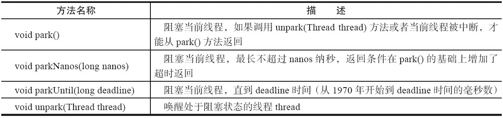
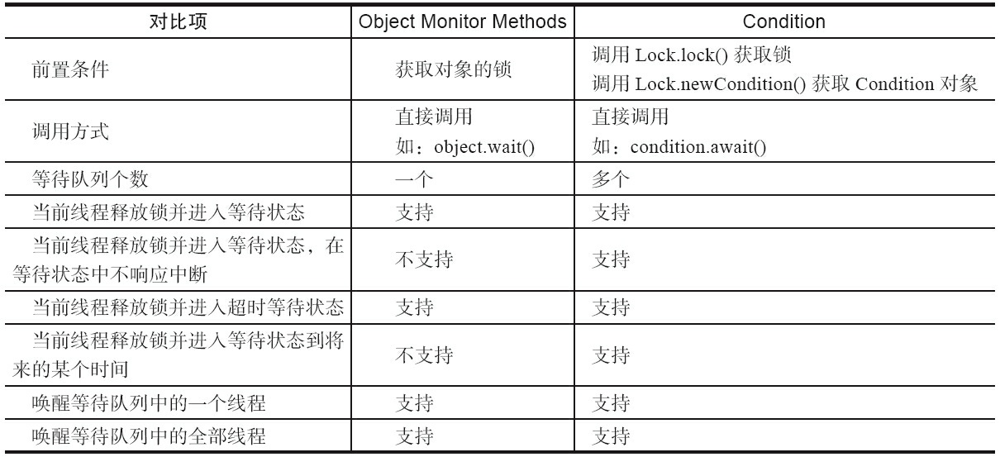
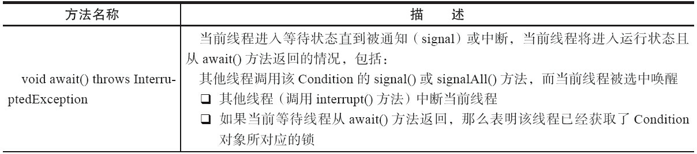
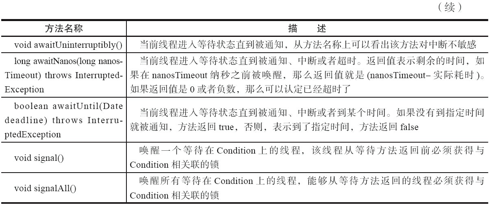
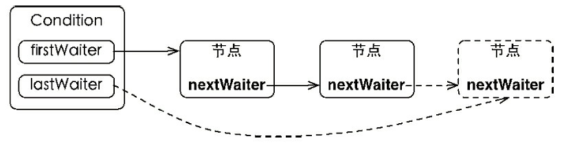
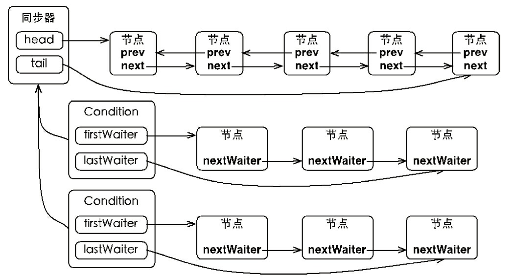
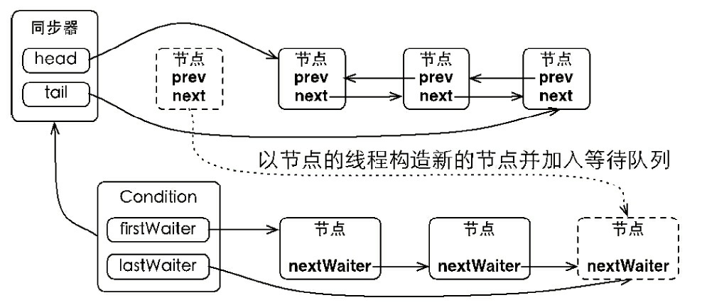
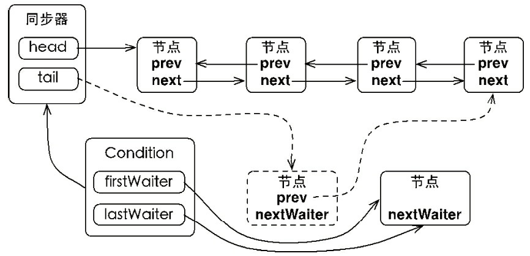

#LockSupport概述
LockSupport定义了一组以park开头的方法用来阻塞当前线程，以及unpark(Thread thread)
方法来唤醒一个被阻塞的线程。Park有停车的意思，假设线程为车辆，那么park方法代表着停
车，而unpark方法则是指车辆启动离开



在Java 6中，LockSupport增加了park(Object blocker)、parkNanos(Object blocker,long nanos)
和parkUntil(Object blocker,long deadline)3个方法，用于实现阻塞当前线程的功能，其中参数
blocker是用来标识当前线程在等待的对象（以下称为阻塞对象），该对象主要用于问题排查和
系统监控。这个blocker对象，通过unsafe类绑定到当前线程Thread的parkBlocker属性中。

```java
public static void park() {//LockSupport的park()方法
        UNSAFE.park(false, 0L);
    }

public static void park(Object blocker) {//LockSupport的park(object)方法
        Thread t = Thread.currentThread();
        setBlocker(t, blocker);
        UNSAFE.park(false, 0L);//jdk native方法，由c++实现
        setBlocker(t, null);
    }
// Even though volatile, hotspot doesn't need a write barrier here.
        //LockSupport的setBlocker方法
        UNSAFE.putObject(t, parkBlockerOffset, arg);
public class Thread implements Runnable {
  volatile Object parkBlocker;//Thread类的parkBlocker对象。
}


```

# Condation条件等待队列

Condition接口也提供了类似Object的监视器方法，与Lock配合可以实现等
待/通知模式（synchronized配合object.wait和object.signal）。
Condition只是一个接口，具体的实现类包括在AbstractQueuedSynchronizer同步器
的内部类ConditionObject实现的Condition接口。

Object的监视器方法与Condition接口的对比

Condition的（部分）方法以及描述(注意通知、中断、超时三个条件)



## Condition接口的简单使用

Condition定义了等待/通知两种类型的方法，当前线程调用这些方法时，需要提前获取到
Condition对象关联的锁（ReentrantLock的锁）。

### condition简单实用例子
```java
Lock lock = new ReentrantLock();
Condition condition = lock.newCondition();//获取一个条件等待队列
public void conditionWait() throws InterruptedException {
        lock.lock();
        try {
            //有点类似os的信号量p操作（初始0，p一次就要阻塞）
            condition.await();


        } finally {
            lock.unlock();
    }
    } 
    public void conditionSignal() throws InterruptedException {
        lock.lock();
        try {
            //有点类似os信号量v操作，如果没有阻塞的await线程，
            // 不用类似os中v+1，直接返回。
            condition.signal();

        } finally {
            lock.unlock();
    }
}
```

### condition实现环形缓冲区生产者消费者模型(阻塞队列)

操作系统中生产者消费者模型

概述：生产者消费者共享初始为空、大小n的缓冲区，缓冲区未满生产者把产品放入缓冲区
否则必须等待。缓冲区不空，消费者才能从中取产品，否则必须等待。缓冲区临界资源，
各个进程互斥访问。

```java
semaphore mutex = 1; //互斥信号量，缓冲区互斥访问
semaphore empty = n; //同步信号量，空闲缓冲区数量
semaphore full = 0; //同步信号量，产品数量
producer (){
    while(1){
        
        P(empty);消耗一个空闲缓冲区
        P(mutex);
        产品放入缓冲区
        V(mutex);
        V(full);//增加一个产品
    }
}

consumer (){
    while(1){
        P(full);消耗一个产品
        P(mutex);
        从缓冲区中取出产品
        V(mutex);
        V(empty);增加一个空闲缓冲区
   
}

```
现在这个缓冲区是一个特殊的队列，由数组构成的环形队列，队列空时，获取操作阻塞线程。
队列满时，插入操作阻塞直到出现空位。

```java
public class BoundedQueue<T> {
    private Object[] items;
    // 添加的下标，删除的下标和数组当前数量
    private int addIndex, removeIndex, count;
    private Lock lock = new ReentrantLock();
    private Condition notEmpty = lock.newCondition();
    private Condition notFull = lock.newCondition();

    public BoundedQueue(int size) {
    items = new Object[size];
    }
// 添加一个元素，如果数组满，则添加线程进入等待状态，直到有"空位"
    public void add(T t) throws InterruptedException {
        lock.lock();//保证数组数据的可见性，排他性
        try {
            while (count == items.length)//队列满了
                notFull.await();//阻塞当前线程到notFullCondition队列中
                items[addIndex] = t;//唤醒后，缓冲区中添加一个元素
                if (++addIndex == items.length)//实现环形缓冲
                    addIndex = 0;
                    ++count;
             //新增一个产品，v操作（但是如果没有wait的notEmptyCondition）,则直接返回不做任何操作
                    notEmpty.signal();
                } finally {
                    lock.unlock();
        }
    }
    // 由头部删除一个元素，如果数组空，则删除线程进入等待状态，直到有新添加元素
    @SuppressWarnings("unchecked")
    public T remove() throws InterruptedException {
        lock.lock();//保证数组数据的可见性，排他性
        try {
            while (count == 0) //缓冲区空
                notEmpty.await();//消费者阻塞到notEmptyCondition中
        Object x = items[removeIndex];//阻塞唤醒，消费数据
        if (++removeIndex == items.length)//保证环形缓冲
            removeIndex = 0;
            --count;
            notFull.signal();//唤醒阻塞的notFullCondition中的生产者
            //如果没有，则直接返回了
            return (T) x;
        } finally {
            lock.unlock();
            }
        }
}

```

## Condition的等待队列
上文中提高了Condition只是一个接口，具体的实现类有ConditionObject是同步器AbstractQueuedSynchronizer的内部类，
因为Condition操作要获取AQS的锁，很合理。

等待队列ConditionObject是一个FIFO队列，节点复用了同步器AQS的节点，当线程调用condition.wait时候，
当前线程释放aqs锁，构造新节点加入到ConditionObject对应的队列中等待。

新加入Condition队列中的节点，不需要cas入队更新尾节点，因为调用await方法的线程已经
获得aqs锁了。

## Condition的wait等待

线程执行condition.await方法后，1.线程进入到aqs关联的condition队列中，2.释放aqs的锁。3.唤醒aqs同步队列节点 4.
当前线程进入到等待状态(
换句话来说，就是aqs同步队列中头节点对应的线程节点，转移到condition队列中尾部
)

```java
public final void await() throws InterruptedException {
    if (Thread.interrupted())
         throw new InterruptedException();
    // 当前线程加入等待队列
    Node node = addConditionWaiter();
    // 释放同步状态，也就是释放锁
    int savedState = fullyRelease(node);
    int interruptMode = 0;
    while (!isOnSyncQueue(node)) {
        LockSupport.park(this);
        if ((interruptMode = checkInterruptWhileWaiting(node)) != 0)
                break;
        }
    if (acquireQueued(node, savedState) && interruptMode != THROW_IE)
        interruptMode = REINTERRUPT;
    if (node.nextWaiter != null)
        unlinkCancelledWaiters();
    if (interruptMode != 0)
        reportInterruptAfterWait(interruptMode);
    }
```


## Condition的signal通知
Condition的signal()方法，将会唤醒在等待队列中等待时间最长(FIFO)的节点（首节点），在
唤醒节点之前，会将节点移到AQS同步队列中尾部。
```java
public final void signal() {
    if (!isHeldExclusively())
         throw new IllegalMonitorStateException();
    Node first = firstWaiter;
        if (first != null)
    doSignal(first);
}
```
唤醒signal的前提是当前线程获取到了aqs的锁，否则抛出监视器异常。接着把等待队列
的首节点，移动到同步队列enq(被唤醒的线程Node)中，并且用LockSupport唤醒节点中线程。
唤醒县城后，调用aqs的acquireQueued方法加入到获取aqs锁的竞争中。如果成功获得到
aqs的锁，那么从之前await方法返回。Condition的signalAll()方法，是唤醒在Condition
等待队列中所有的线程节点，加入到aqs的同步队列中。

