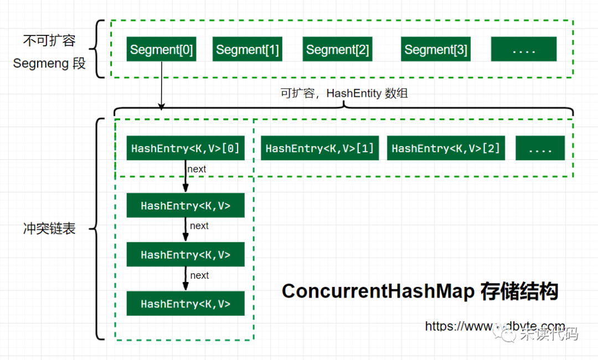

# ConcurrentHashMap jdk1.7
## 使用背景

多线性共享使用同一个map结构的集合时候。

## 为什么使用ConcurrentHashMap
原因主要两个
1. 并发编程HashMap在put扩容时候可能导致死循环，导致CPU利用率接近100%。（具体请看hashmap文章）
2. 线程安全的HashTable效率又非常低下。HashTable容器使用synchronized来保证线程安全，
在线程竞争激烈的情况下HashTable的效率非常低下。因为当一个线程访问HashTable的同步方法，其他线程也访问HashTable的同
步方法时，会进入阻塞或轮询状态。**访问HashTable的线程都必须竞争同一把锁**，显然不合理，Doug Lea看不惯。

如何保证线程安全（hashmap不安全）的同时又能保证高效（hashtable低效）：
1. 安全性：加锁ReentrantLock来控制。
2. 高效性：由多把锁(分段锁)一起控制。
假如容器里有多把锁，每把锁用于锁容器其中一部分数据，那么当多线程访问容器里不同数据段
的数据时，线程间就不会存在锁竞争，从而可以有效提高并发访问效率，这就是ConcurrentHashMap所使用的锁分段技术。

## ConcurrentHashMap存储结构


java 7 中 ConcurrentHashMap 的存储结构如上图，ConcurrnetHashMap 由很多个 Segment 组合，
而每一个 Segment 是一个类似于 HashMap（HashEntry数组+拉链链表） 的结构，所以每一个 HashMap 的内部可以进行扩容。
但是 Segment 的个数一旦初始化就不能改变，默认 Segment 的个数是 16 个，你也可以认为 
ConcurrentHashMap 默认支持最多 16 个线程并发。
**每个Segment就是一把锁**，真正数据是存储在Segment内部的HashEntry数组中。

## ConcurrentHashMap初始化

### 初始化Segments数组
```java_holder_method_tree
        if (concurrencyLevel > MAX_SEGMENTS)
            concurrencyLevel = MAX_SEGMENTS;
        int sshift = 0;
        int ssize = 1;
        while (ssize < concurrencyLevel) {//计算出大于等于councurrentcyLevel的最小2的次方数
            ++sshift;
            ssize <<= 1;
        }
        segmentShift = 32 - sshift;//32-4=28
        segmentMask = ssize - 1;//16-1=15
        this.segments = Segment.newArray(ssize);
```
segments数组长度是大于等于并发级别的2的N次方。目的：按位与散列算法定位segments数组索引
### 初始化segmentShift和segmentMask
1. segmentShift:定位参与散列运算的位数。segmentShift=32-sshift=28默认
2. segmentMask:散列运算掩码。segmentMask=ssize-1=15默认
### 初始化每个segment
输入参数initialCapacity是ConcurrentHashMap的初始化容量，loadfactor是每个segment的负
载因子。
```java_holder_method_tree
    if (initialCapacity > MAXIMUM_CAPACITY)
        initialCapacity = MAXIMUM_CAPACITY;
    int c = initialCapacity / ssize;
    if (c * ssize < initialCapacity)
    ++c;
    int cap = 1;
    while (cap < c)
    cap <<= 1;
    for (int i = 0; i < this.segments.length; ++i)
    this.segments[i] = new Segment<K,V>(cap, loadFactor);
```
1. cap就是segment内hashentry数组长度=[c=initialCapacity（默认16）/ssize(默认16)]>1?(cap=大于c的2的N次方):cap=1]
2. segment的容量threshold＝（int）cap*loadFactor
### segment定位（散列算法）
散列算法是找到每个元素应该放入的segment的索引位置。CouncurrentHashmap的
散列算法Jenkins hash的变种算法**对元素的hashCode进行一次再散列**。
```java_holder_method_tree
private static int hash(int h) {
    h += (h << 15) ^ 0xffffcd7d;
    h ^= (h >>> 10);
    h += (h << 3);
    h ^= (h >>> 6);
    h += (h << 2) + (h << 14);
    return h ^ (h >>> 16);
}
```
**再散列目的：减少散列冲突，元素均匀分布在不同的Segment上，提高容器存取效率。**

假如不通过再散列，直接用对象的hashcode & length-1，导致只要是低位一样，就会散列冲突。
```java_holder_method_tree
System.out.println(Integer.parseInt("0001111", 2) & 15);
System.out.println(Integer.parseInt("0011111", 2) & 15);
System.out.println(Integer.parseInt("0111111", 2) & 15);
System.out.println(Integer.parseInt("1111111", 2) & 15);
//输出全是15，第四位相同，不管高位，散列值相同。
```
如果使用上述再散列算法，每一位都参与散列运算减少冲突，散列结果如下
```java_holder_method_tree
0100｜0111｜0110｜0111｜1101｜1010｜0100｜1110
1111｜0111｜0100｜0011｜0000｜0001｜1011｜1000
0111｜0111｜0110｜1001｜0100｜0110｜0011｜1110
1000｜0011｜0000｜0000｜1100｜1000｜0001｜1010
```
index=hash>>>segmentShift(28) ^ segmentMask(15)
结果分别是，4，15，7，8，更加分散没有冲突。

**与hashmap索引定位算法对比**：hashmap对hashcode使用了四次扰动函数后 & length-1。和councurrenthashmap
整体思路是一样的，都是把hashcode尽可能所有位置都参与哈希运算，散列更加分散。

### 初始化源码
```java_holder_method_tree
@SuppressWarnings("unchecked")
public ConcurrentHashMap(int initialCapacity,float loadFactor, int concurrencyLevel) {
    // 参数校验
    if (!(loadFactor > 0) || initialCapacity < 0 || concurrencyLevel <= 0)
        throw new IllegalArgumentException();
    // 校验并发级别大小，大于 1<<16，重置为 65536
    if (concurrencyLevel > MAX_SEGMENTS)
        concurrencyLevel = MAX_SEGMENTS;
    // Find power-of-two sizes best matching arguments
    // 2的多少次方
    int sshift = 0;
    int ssize = 1;
    // 这个循环可以找到 大于concurrencyLevel 之上最近的 2的次方值
    while (ssize < concurrencyLevel) {
        ++sshift;
        ssize <<= 1;
    }
    // 记录段偏移量
    this.segmentShift = 32 - sshift;
    // 记录段掩码
    this.segmentMask = ssize - 1;
    // 设置容量
    if (initialCapacity > MAXIMUM_CAPACITY)
        initialCapacity = MAXIMUM_CAPACITY;
    // c = 容量 / ssize ，默认 16 / 16 = 1，这里是计算每个 Segment 中的类似于 HashMap 的容量
    int c = initialCapacity / ssize;
    if (c * ssize < initialCapacity)
        ++c;
    int cap = MIN_SEGMENT_TABLE_CAPACITY;
    //Segment 中的类似于 HashMap 的容量至少是2或者2的倍数
    while (cap < c)
        cap <<= 1;
    // create segments and segments[0]
    // 创建 Segment 数组，设置 segments[0]
    Segment<K,V> s0 = new Segment<K,V>(loadFactor, (int)(cap * loadFactor),
                         (HashEntry<K,V>[])new HashEntry[cap]);
    Segment<K,V>[] ss = (Segment<K,V>[])new Segment[ssize];
    //Unsafe写入到Segments[0]位置一个segment对象。
    UNSAFE.putOrderedObject(ss, SBASE, s0); // ordered write of segments[0]
    this.segments = ss;
}
```
1. 必要参数校验。
2. 校验并发级别 concurrencyLevel 大小，如果大于最大值，重置为最大值。无惨构造默认值是 16.
3. 寻找并发级别 concurrencyLevel 之上最近的 2 的幂次方值，作为初始化容量大小，默认是 16。
4. 记录 segmentShift 偏移量，这个值为【容量 = 2 的N次方】中的 N，在后面 Put 时计算位置时会用到。默认是 32 - sshift = 28.
5. 记录 segmentMask，默认是 ssize - 1 = 16 -1 = 15.
6. 初始化 segments[0]，默认大小为 2，负载因子 0.75，扩容阀值是 2*0.75=1.5，插入第二个值时才会进行扩容。

## put操作
### 可能初始化Segments[index]位置的Segment对象
```java_holder_method_tree
public V put(K key, V value) {
    Segment<K,V> s;
    if (value == null) //councurrenthashmap禁止key等于空
        throw new NullPointerException();
    int hash = hash(key);//key的hashcode经过在散列算法，散列更加均匀，提高存取效率
    // hash 值无符号右移 28位（初始化时获得），然后与 segmentMask=15 做与运算
    // 其实也就是把高4位与segmentMask（1111）做与运算
    int j = (hash >>> segmentShift) & segmentMask;//j就是segments数组索引初始化位置
    if ((s = (Segment<K,V>)UNSAFE.getObject          // nonvolatile; recheck
         (segments, (j << SSHIFT) + SBASE)) == null) //  in ensureSegment
        // 如果查找到的 Segments[j]位置的segment对象为空，初始化该位置的segment对象
        s = ensureSegment(j);
    return s.put(key, hash, value, false);
}

@SuppressWarnings("unchecked")
private Segment<K,V> ensureSegment(int k) {
    final Segment<K,V>[] ss = this.segments;
    long u = (k << SSHIFT) + SBASE; // Segments数组的第k个位置内存偏移量
    Segment<K,V> seg;
    // 判断 u 位置的 Segment 是否为null
    if ((seg = (Segment<K,V>)UNSAFE.getObjectVolatile(ss, u)) == null) {
        Segment<K,V> proto = ss[0]; //ConcurrentHashMap初始化时候，初始化了Segments数组和Segments[0]位置的segment对象。
        //Segments[0]位置的segment作为原型用于初始化其他位置segment对象内加载因子，长度等。
        // 获取0号 segment 里的 HashEntry<K,V> 初始化长度
        int cap = proto.table.length;
        // 获取0号 segment 里的 hash 表里的扩容负载因子，所有的 segment 的 loadFactor 是相同的
        float lf = proto.loadFactor;
        // 计算扩容阀值
        int threshold = (int)(cap * lf);
        // 创建一个 cap 容量的 HashEntry 数组
        HashEntry<K,V>[] tab = (HashEntry<K,V>[])new HashEntry[cap];
        if ((seg = (Segment<K,V>)UNSAFE.getObjectVolatile(ss, u)) == null) { // 再
            // 再次检查 u 位置的 Segment 是否为null，如果非空说明其他线程对该位置进行了初始化，直接返回
            Segment<K,V> s = new Segment<K,V>(lf, threshold, tab);
            // 自旋检查 u 位置的 Segment 是否为null
            while ((seg = (Segment<K,V>)UNSAFE.getObjectVolatile(ss, u))
                   == null) {
                // 由当前线程通过使用CAS 赋值，成功直接返回。失败说明其他线程cas成功，当前线程在while条件不满足退出
                if (UNSAFE.compareAndSwapObject(ss, u, null, seg = s))
                    break; //
            }
        }
    }
    return seg;
}
```

上面的源码分析了 ConcurrentHashMap 在 put 一个数据时的处理流程，下面梳理下具体流程。

1. 计算要 put 的 key 的位置，获取指定位置的 Segment。
2. 如果指定位置的 Segment 为空，则初始化这个 Segment.

初始化 Segment 流程：

1. 检查计算得到的位置的 Segment 是否为null.
2. 为 null 继续初始化，使用 Segment[0] 的容量和负载因子创建一个 HashEntry 数组。
3. 再次检查计算得到的指定位置的 Segment 是否为null.(再多的check都没用，只是为了提高效率，如果检查非空，直接返回，后面代码不用执行)
4. 使用创建的 HashEntry 数组初始化这个 Segment.
5. 自旋判断计算得到的指定位置的 Segment 是否为null，使用Unsafe类的 CAS 在segmens数组的index位置赋值Segment.

### Segment的put操作
```java_holder_method_tree
final V put(K key, int hash, V value, boolean onlyIfAbsent) {
    // 获取 ReentrantLock 独占锁，获取不到，scanAndLockForPut 获取。
    HashEntry<K,V> node = tryLock() ? null : scanAndLockForPut(key, hash, value);
    V oldValue;
    try {
        HashEntry<K,V>[] tab = table;
        // 计算要put的数据位置,这里计算Entry数组下标不同于计算Segments数组下标，
        //利用hash(hashcode再散列) & length-1，目的是进一步分布均匀。
        int index = (tab.length - 1) & hash;
        // CAS 获取 index 坐标的值
        HashEntry<K,V> first = entryAt(tab, index);
        for (HashEntry<K,V> e = first;;) {
            if (e != null) {
                // 检查是否 key 已经存在，如果存在，则遍历链表寻找位置，找到后替换 value
                K k;
                if ((k = e.key) == key || //==判断是绝对相等，同一个对象
                    //先判断hash相等，为了提高效率。hash不等，equals一定不等。equals才是充要条件
                    (e.hash == hash && key.equals(k))) {
                    oldValue = e.value;
                    if (!onlyIfAbsent) {
                        e.value = value;
                        ++modCount;
                    }
                    break;
                }
                e = e.next;
            }
            else {
                // first 有值没说明 index 位置已经有值了，有冲突，链表头插法。
                if (node != null)
                    node.setNext(first);
                else
                    node = new HashEntry<K,V>(hash, key, value, first);
                int c = count + 1;
                // 容量大于扩容阀值，小于最大容量，进行扩容
                if (c > threshold && tab.length < MAXIMUM_CAPACITY)
                    rehash(node);//不同于hashmap，这里是先扩容后add新的节点
                    //hashmap是先增加节点后，如果大于阈值，则扩容
                else
                    // index 位置赋值 node，node 可能是一个元素，也可能是一个链表的表头
                    setEntryAt(tab, index, node);
                ++modCount;
                count = c;
                oldValue = null;
                break;
            }
        }
    } finally {
        unlock();
    }
    return oldValue;
}
```


由于 Segment 继承了 ReentrantLock，所以 Segment 内部可以很方便的获取锁，put 流程就用到了这个功能。

1. tryLock() 获取锁（获取成功返回true否则false），获取不到使用 scanAndLockForPut（调用lock方法，获取不到就阻塞） 方法继续获取。

2. 计算 put 的数据要放入的 index（hash & length-1，计算方式不同于Segments数组下标） 位置，然后获取这个位置上的 HashEntry 。

3. 遍历 put 新元素，为什么要遍历？因为这里获取的 HashEntry 可能是一个空元素，也可能是链表已存在，所以要区别对待。
4. 如果要插入的位置之前已经存在，替换后返回旧值，否则返回 null.

如果这个位置上的 HashEntry 不存在：

如果这个位置上的 HashEntry 存在：
- 如果当前容量大于扩容阀值，小于最大容量，进行扩容。
- 直接链表头插法插入。
- 判断链表当前元素 Key 和 hash 值是否和要 put 的 key 和 hash 值一致。一致则替换值
- 不一致，获取链表下一个节点，直到发现相同进行值替换，或者链表表里完毕没有相同的。
- 如果当前容量大于扩容阀值，小于最大容量，进行扩容。
- 直接头插法插入。

这里面的第一步中的 scanAndLockForPut 操作这里没有介绍，这个方法做的操作就是**不断的自旋 tryLock() 获取锁**。
当自旋次数大于指定次数时，使用 lock() 阻塞获取锁。在自旋时顺表获取下 hash 位置的 HashEntry。

```java_holder_method_tree
private HashEntry<K,V> scanAndLockForPut(K key, int hash, V value) {
    HashEntry<K,V> first = entryForHash(this, hash);
    HashEntry<K,V> e = first;
    HashEntry<K,V> node = null;
    int retries = -1; // negative while locating node

    // 循环获取锁
    while (!tryLock()) {
        HashEntry<K,V> f; // to recheck first below
        if (retries < 0) {
            if (e == null) {
                if (node == null) // speculatively create node
                    // 进到这里说明数组该位置的链表是空的，没有任何元素
                    // 当然，进到这里的另一个原因是 tryLock() 失败，所以该槽存在并发，不一定是该位置
                    node = new HashEntry<K,V>(hash, key, value, null);
                retries = 0;
            }
            else if (key.equals(e.key))
                retries = 0;
            else
                // 顺着链表往下走
                e = e.next;
        }
        // 重试次数如果超过 MAX_SCAN_RETRIES（单核1多核64），那么不抢了，进入到阻塞队列等待锁
        //    lock() 是阻塞方法，直到获取锁后返回
        else if (++retries > MAX_SCAN_RETRIES) {
            lock();
            break;
        }
        else if ((retries & 1) == 0 &&
                 // 这个时候是有大问题了，那就是有新的元素进到了链表，成为了新的表头
                 //     所以这边的策略是，相当于重新走一遍这个 scanAndLockForPut 方法
                 (f = entryForHash(this, hash)) != first) {
            e = first = f; // re-traverse if entry changed
            retries = -1;
        }
    }
    return node;
}
```
这个方法有两个出口，一个是 tryLock() 成功了，循环终止，另一个就是重试次数超过了 MAX_SCAN_RETRIES，进到 lock() 方法，此方法会阻塞等待，直到成功拿到独占锁。

这个方法就是看似复杂，但是其实就是做了一件事，那就是获取该 segment 的独占锁，如果需要的话顺便实例化了一下 node。
## 扩容rehash
ConcurrentHashMap 的**扩容只会扩容到原来的两倍**。老数组里的数据移动到新的数组时，位置要么不变，
要么变为 index+ oldSize，参数里的 node 会在扩容之后使用链表**头插法插入到指定位置**.

```java_holder_method_tree
private void rehash(HashEntry<K,V> node) {
    HashEntry<K,V>[] oldTable = table;
    // 老容量
    int oldCapacity = oldTable.length;
    // 新容量，扩大两倍
    int newCapacity = oldCapacity << 1;
    // 新的扩容阀值 
    threshold = (int)(newCapacity * loadFactor);
    // 创建新的数组
    HashEntry<K,V>[] newTable = (HashEntry<K,V>[]) new HashEntry[newCapacity];
    // 新的掩码，默认2扩容后是4，-1是3，二进制就是11。
    int sizeMask = newCapacity - 1;
    for (int i = 0; i < oldCapacity ; i++) {
        // 遍历老数组
        HashEntry<K,V> e = oldTable[i];
        if (e != null) {
            HashEntry<K,V> next = e.next;
            // 计算新的位置，新的位置只可能是不便或者是老的位置+老的容量。
            int idx = e.hash & sizeMask;
            if (next == null)   //  Single node on list
                // 如果当前位置还不是链表，只是一个元素，直接赋值
                newTable[idx] = e;
            else { // Reuse consecutive sequence at same slot
                // 如果是链表了
                HashEntry<K,V> lastRun = e;
                int lastIdx = idx;
                // 新的位置只可能是不便或者是老的位置+老的容量。
                // 遍历结束后，lastRun 后面的元素位置都是相同的
                for (HashEntry<K,V> last = next; last != null; last = last.next) {
                    int k = last.hash & sizeMask;
                    if (k != lastIdx) {
                        lastIdx = k;
                        lastRun = last;
                    }
                }
                // ，lastRun 后面的元素位置都是相同的，直接作为链表赋值到新位置。
                newTable[lastIdx] = lastRun;
                // Clone remaining nodes
                for (HashEntry<K,V> p = e; p != lastRun; p = p.next) {
                    // 遍历剩余元素，头插法到指定 k 位置。
                    V v = p.value;
                    int h = p.hash;
                    int k = h & sizeMask;
                    HashEntry<K,V> n = newTable[k];
                    newTable[k] = new HashEntry<K,V>(h, p.key, v, n);
                }
            }
        }
    }
    // 头插法插入新的节点
    int nodeIndex = node.hash & sizeMask; // add the new node
    node.setNext(newTable[nodeIndex]);
    newTable[nodeIndex] = node;
    table = newTable;
}
```
有些同学可能会对最后的两个 for 循环有疑惑，这里第一个 for 是为了寻找这样一个节点，这个节点后面的所有 next 节点的新位置都是
相同的。然后把这个作为一个链表赋值到新位置。第二个 for 循环是为了把剩余的元素通过头插法插入到指定位置链表。这样实现的原因
可能是基于概率统计，有深入研究的同学可以发表下意见。

## get操作
1. 计算得到 key 的存放位置。
2. 遍历指定位置查找相同 key 的 value 值。

```java_holder_method_tree
public V get(Object key) {
    Segment<K,V> s; // manually integrate access methods to reduce overhead
    HashEntry<K,V>[] tab;
    int h = hash(key);//hashcode再散列的哈希值
    long u = (((h >>> segmentShift) & segmentMask) << SSHIFT) + SBASE;
    // 计算得到 key 的存放位置
    if ((s = (Segment<K,V>)UNSAFE.getObjectVolatile(segments, u)) != null &&
        (tab = s.table) != null) {
        for (HashEntry<K,V> e = (HashEntry<K,V>) UNSAFE.getObjectVolatile
                 (tab, ((long)(((tab.length - 1) & h)) << TSHIFT) + TBASE);
             e != null; e = e.next) {
            // 如果是链表，遍历查找到相同 key 的 value。
            K k;
            //==是判断同一个对象，hash==h只是提高效率，对象相等充要条件还是equals
            if ((k = e.key) == key || (e.hash == h && key.equals(k)))
                return e.value;
        }
    }
    return null;
}
```


# 参考文章
[还不懂 ConcurrentHashMap ？1.7和1.8都可以这份源码分析了解一下](https://mp.weixin.qq.com/s/AHWzboztt53ZfFZmsSnMSw)

[b站hashmap，concurrenthashmap视频](https://www.bilibili.com/video/BV1x741117jq) 看到了第三级，90分钟


# 面试题
concurrenthashmap实现原理，加锁机制
ConcurrentHashMap的put()为什么是线程安全的
hashmap与 ConcurrentHashMap中扩容的区别
ConcurrentHashMap 比 HashTable 效率要高？
concurrentHashMap的底层里面对节点进行加锁的具体实现方式有过了解吗？
concurrentHashMap里面的锁有没有使用到volatile