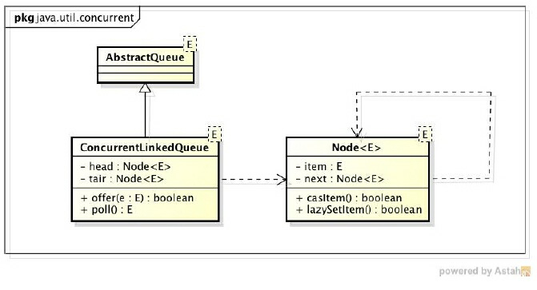
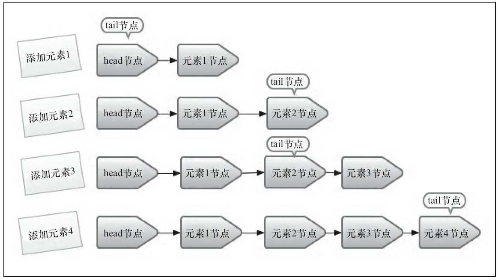
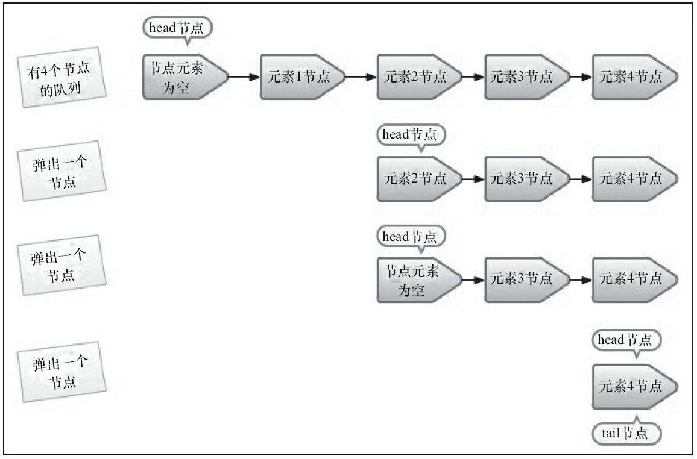

并发编程中，有时候需要使用线程安全的队列
1. 阻塞算法实现。入队出队一把锁或者两把锁
2. 循环+cas实现（ConcurrentLinkedQueue）
# ConcurrentLinkedQueue基本结构
ConcurrentLinkedQueue是基于链表结构的无界线性安全队列，FIFO规则对节点排序。

队列中节点是Node类型，内部包含了指向具体数据的引用item以及指向next节点的指针，节点之间
通过next关联起来，组成链表。 外层是ConcurrentLinkedQueue，包含head,tail节点以及offer入队
出队poll方法。
```
private static class Node<E> {
        volatile E item;
        volatile Node<E> next;
        boolean casItem(E cmp, E val) {
             return UNSAFE.compareAndSwapObject(this, itemOffset, cmp, val);
         }
        boolean casNext(Node<E> cmp, Node<E> val) {
            return UNSAFE.compareAndSwapObject(this, nextOffset, cmp, val);
        }
}
 
public class ConcurrentLinkedQueue<E> extends AbstractQueue<E>
        implements Queue<E>, java.io.Serializable {
    private transient volatile Node<E> head;
    private transient volatile Node<E> tail;
    
    offer()入队
    poll()出队
}

```

# 节点入队
入队列就是将入队节点添加到队列的尾部.
入队做两件事。一、入队节点设置成尾节点的下一个节点，二、更新tail节点（tail的next
如果非空，则tail直接指向刚入队的节点，否则用把如对节点设置成tail的next节点）。**因此第一步一定做，第二步更新tail不一定。**



## 普通人如何实现线程安全入队？
如果不能用锁（synchronized和Reentrantlock）的话，如何保证线程安全入队？**（死循环+两个cas操作**），好处是
多线程并发情况下，不会导致线程状态切换。
假设tail指针使用指向最后一个节点，那么新节点newNode入队包含两个操作。第一、tail.next指向newNode。第二、tail指针
指向newNode最后一个节点。
```java_holder_method_tree
public boolean offer(E e) {
            if (e == null)
                throw new NullPointerException();
            Node<E> n = new Node<E>(e);
            for (;;) {//死循环保证一定能入队。
                Node<E> t = tail;
                //第一个cas保证tail.next指向newNode，第二个cas保证tail指针指向刚加入的newNode
                //只有两个cas同时成功才表明入队成功，否则循环重试
                if (t.casNext(null, n) && casTail(t, n)) {
                    return true;
                }
            }
        }
```
缺点：每次for循环都要cas更新tail（由volatile修饰），并发大师doug lea认为这种cas方式
太过频繁，如果for循环内能减少cas更新tail（volatile写）的次数，就能提高入队的效率。

## 并发大师写的for循环+cas入队源码 jdk1.6

```java_holder_method_tree

public boolean offer(E e) {
            if (e == null) throw new NullPointerException();
            // 入队前，创建一个入队节点
            Node<E> n = new Node<E>(e);
            retry:
            // 死循环，入队不成功反复入队。
            for (;;) {
                // 创建一个指向tail节点的引用
                Node<E> t = tail;
                // p用来表示队列的尾节点，默认情况下等于tail节点。
                Node<E> p = t;
                for (int hops = 0; ; hops++) {
                    // 获得p节点的下一个节点。
                    Node<E> next = succ(p);
                    // next节点不为空，说明p不是尾节点，需要更新p后在将它指向next节点
                    if (next != null) {
                        // 循环了两次及其以上，并且当前节点还是不等于尾节点
                        if (hops > HOPS && t != tail)
                            continue retry;
                        p = next;
                    }
                    // 如果p是尾节点，则设置p节点的next节点为入队节点。
                    else if (p.casNext(null, n)) {
        /*如果tail节点有大于等于1个next节点，则将入队节点设置成tail节点，
        更新失败了也没关系，因为失败了表示有其他线程成功更新了tail节点*/
                        if (hops >= HOPS)
                            casTail(t, n); // 更新tail节点，允许失败
                        return true;
                    }
                    // p有next节点,表示p的next节点是尾节点，则重新设置p节点
                    else {
                        p = succ(p);
                    }
                }
            }
        }
```
入队过程主要做两件事情：第一是定位出tailNode尾节点(多线程条件下，可能被不断更改，因此要不断地确定尾节点)；第二是使用
CAS算法将入队节点设置成尾节点的next节点，如不成功则重试。

两种情况：如果tail的next等于null的话，一次cas就可以，cas设置tail.next=newNode。如果tail的next不是空
的话，两次cas，第一次cas设置 尾部节点.next=newNode,第二次cas设置tail=newNode。
相比于上面的“普通人”想法，doug lea通过hops=1变量，控制只有tail节点和尾节点的距离大于HOPS=1
时候，才利用cas更新尾节点。减少了cas更新volatile变量tail的次数。但是距离长带来的问题是，需要定位
尾节点，通过循环体内多一次循环来定位出尾节点。本质上是通过增加对volatile变量的读取，降低了
volatile变量的写入次数（写开销远大于读），所以还是提升了入队效率。
## 定位尾节点
tail节点并不总是尾节点，所以每次入队都必须先通过tail节点来找到尾节点。尾节点可能
是tail节点，也可能是tail节点的next节点。初始用p指向tail后，用p指向尾节点。

# 出队列
出队列就是从队列返回一个节点元素并且清空该节点元素的引用。

并发大师设计的出队列方式，并不是直接移除队首节点后head.next指向新的队首节点。而是当head节点里有元素时，直接弹出head
节点里的元素，而不会更新head节点。只有当head节点里没有元素时，出队操作才会更新head
节点。这种做法也是通过hops变量来减少使用CAS更新head（减少了一半volatile写）节点的消耗，从而提高出队效率。

```java_holder_method_tree
   public E poll() {
        Node<E> h = head;
// p表示头节点，需要出队的节点
        Node<E> p = h;
        for (int hops = 0;; hops++) {
// 获取p节点的元素
            E item = p.getItem();
// 如果p节点的元素不为空，使用CAS设置p节点引用的元素为null,
// 如果成功则返回p节点的元素。
            if (item != null && p.casItem(item, null)) {
                if (hops >= HOPS) {
// 将p节点下一个节点设置成head节点
                    Node<E> q = p.getNext();
                    updateHead(h, (q != null) q : p);
                }
                return item;
            }
// 如果头节点的元素为空或头节点发生了变化，这说明头节点已经被另外
// 一个线程修改了。那么获取p节点的下一个节点
            Node<E> next = succ(p);
// 如果p的下一个节点也为空，说明这个队列已经空了
            if (next == null) {
// 更新头节点。
                updateHead(h, p);
                break;
            }
// 如果下一个元素不为空，则将头节点的下一个节点设置成头节点
            p = next;
        }
        return null;
    }
```
首先获取头节点的元素，然后判断头节点元素是否为空，如果为空，表示另外一个线程已
经进行了一次出队操作将该节点的元素取走，如果不为空，则使用CAS的方式将头节点的引
用设置成null，如果CAS成功，则直接返回头节点的元素，如果不成功，表示另外一个线程已经
进行了一次出队操作更新了head节点，导致元素发生了变化，需要重新获取头节点。

# 面试题
ConcurrentLinkedQueue出入队如何不并发控制会产生什么问题，讲述出入对的CAS操作


