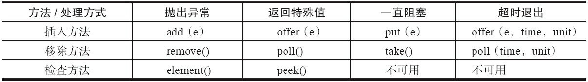

## 什么是阻塞队列
除了普通的队列入队出队方法之外附加两个操作,阻塞队列主要用于生产者消费者场景。
1. 支持阻塞的插入方法：当队列满时，队列会阻塞插入元素的线程，直到队列不
满。
2. 支持阻塞的移除方法：在队列为空时，获取元素的线程会等待队列变为非空。



## JDK提供的常见阻塞队列
- ArrayBlockingQueue：一个由数组结构组成的有界阻塞队列。
- LinkedBlockingQueue：一个由链表结构组成的有界阻塞队列。
- PriorityBlockingQueue：一个支持优先级排序的无界阻塞队列。
- DelayQueue：一个使用优先级队列实现的无界阻塞队列。
- SynchronousQueue：一个不存储元素的阻塞队列。
- LinkedTransferQueue：一个由链表结构组成的无界阻塞队列。
- LinkedBlockingDeque：一个由链表结构组成的双向阻塞队列。

## 阻塞队列实现之ArrayBlockingQueue
ArrayBlockingQueue是一个用数组实现的有界阻塞队列，元素按照FIFO排序。默认情况下不保证线程公平的访问队列
，意思是不保证先阻塞的线程在唤醒后最先拿到锁访问到队列。所有阻塞被环形的线程都有资格竞争队列，
提高了吞吐量，但是不公平，也可以设置成公平的阻塞队列。
```java_holder_method_tree
public ArrayBlockingQueue(int capacity, boolean fair) {
        if (capacity <= 0)
            throw new IllegalArgumentException();
        this.items = new Object[capacity];
        lock = new ReentrantLock(fair);
        notEmpty = lock.newCondition();
        notFull = lock.newCondition();
    }
```
其并发控制采用可重入锁来控制，不管是插入操作还是读取操作，都需要获取到锁才能进行操作。
```java_holder_method_tree
ArrayBlockingQueue 共有以下几个属性：
// 用于存放元素的数组
final Object[] items;
// 下一次读取操作的位置
int takeIndex;
// 下一次写入操作的位置
int putIndex;
// 队列中的元素数量
int count;

// 以下几个就是控制并发用的同步器
final ReentrantLock lock;
private final Condition notEmpty;
private final Condition notFull;

```
ArrayBlockingQueue 实现并发同步的原理就是，读操作和写操作都需要获取到 AQS 独占锁才能进行操作。
如果队列为空，这个时候读操作的线程进入到读线程队列排队，等待写线程写入新的元素，然后唤醒读线程队列的第一个等待线程。如果队列已满，
这个时候写操作的线程进入到写线程队列排队，等待读线程将队列元素移除腾出空间，然后唤醒写线程队列的第一个等待线程。

对于 ArrayBlockingQueue，我们可以在构造的时候指定以下三个参数：
- 队列容量，其限制了队列中最多允许的元素个数；
- 指定独占锁是公平锁还是非公平锁。非公平锁的吞吐量比较高，公平锁可以保证每次都是等待最久的线程获取到锁；
- 可以指定用一个集合来初始化，将此集合中的元素在构造方法期间就先添加到队列中。

```java_holder_method_tree
阻塞入队源码
public void put(E e) throws InterruptedException {
        checkNotNull(e);
        final ReentrantLock lock = this.lock;
        lock.lockInterruptibly();
        try {
            while (count == items.length)
                notFull.await();
            enqueue(e);
        } finally {
            lock.unlock();
        }
    }
阻塞出队源码
public E take() throws InterruptedException {
        final ReentrantLock lock = this.lock;
        lock.lockInterruptibly();
        try {
            while (count == 0)
                notEmpty.await();
            return dequeue();
        } finally {
            lock.unlock();
        }
    }
```


## 阻塞队列实现之LinkedBlockingQueue
底层由链表结构组成的双向阻塞队列。所谓双向队列指的是可以从队列的两端插入和移出元素
。可以当做无界队列也可以当做有界队列来使用。看构造方法：
```java_holder_method_tree
// 传说中的无界队列
public LinkedBlockingQueue() {
    this(Integer.MAX_VALUE);
}
// 传说中的有界队列
public LinkedBlockingQueue(int capacity) {
    if (capacity <= 0) throw new IllegalArgumentException();
    this.capacity = capacity;
    last = head = new Node<E>(null);
}
// 队列容量
private final int capacity;

// 队列中的元素数量
private final AtomicInteger count = new AtomicInteger(0);

// 队头
private transient Node<E> head;

// 队尾
private transient Node<E> last;

// take, poll, peek 等读操作的方法需要获取到这个锁
private final ReentrantLock takeLock = new ReentrantLock();

// 如果读操作的时候队列是空的，那么等待 notEmpty 条件
private final Condition notEmpty = takeLock.newCondition();

// put, offer 等写操作的方法需要获取到这个锁
private final ReentrantLock putLock = new ReentrantLock();

// 如果写操作的时候队列是满的，那么等待 notFull 条件
private final Condition notFull = putLock.newCondition();
```
这里用了两个锁，两个 Condition，简单介绍如下：

- **takeLock 和 notEmpty 怎么搭配：**如果要获取（take）一个元素，需要获取 takeLock 锁，但是获取了锁还不够，如果队列此时为空，还需要队列不为空（notEmpty）这个条件（Condition）。

- **putLock 需要和 notFull 搭配：**如果要插入（put）一个元素，需要获取 putLock 锁，但是获取了锁还不够，如果队列此时已满，还需要队列不是满的（notFull）这个条件（Condition）。

首先，这里用一个示意图来看看 LinkedBlockingQueue 的并发读写控制，然后再开始分析源码：

```java_holder_method_tree
public void put(E e) throws InterruptedException {
    if (e == null) throw new NullPointerException();
    // 如果你纠结这里为什么是 -1，可以看看 offer 方法。这就是个标识成功、失败的标志而已。
    int c = -1;
    Node<E> node = new Node(e);
    final ReentrantLock putLock = this.putLock;
    final AtomicInteger count = this.count;
    // 必须要获取到 putLock 才可以进行插入操作
    putLock.lockInterruptibly();
    try {
        // 如果队列满，等待 notFull 的条件满足。
        while (count.get() == capacity) {
            notFull.await();
        }
        // 入队
        enqueue(node);
        // count 原子加 1，c 还是加 1 前的值
        c = count.getAndIncrement();
        // 如果这个元素入队后，还有至少一个槽可以使用，调用 notFull.signal() 唤醒等待线程。
        // 哪些线程会等待在 notFull 这个 Condition 上呢？
        if (c + 1 < capacity)
            notFull.signal();
    } finally {
        // 入队后，释放掉 putLock
        putLock.unlock();
    }
    // 如果 c == 0，那么代表队列在这个元素入队前是空的（不包括head空节点），
    // 那么所有的读线程都在等待 notEmpty 这个条件，等待唤醒，这里做一次唤醒操作
    if (c == 0)
        signalNotEmpty();
}

// 入队的代码非常简单，就是将 last 属性指向这个新元素，并且让原队尾的 next 指向这个元素
// 这里入队没有并发问题，因为只有获取到 putLock 独占锁以后，才可以进行此操作
private void enqueue(Node<E> node) {
    // assert putLock.isHeldByCurrentThread();
    // assert last.next == null;
    last = last.next = node;
}

// 元素入队后，如果需要，调用这个方法唤醒读线程来读
private void signalNotEmpty() {
    final ReentrantLock takeLock = this.takeLock;
    takeLock.lock();
    try {
        notEmpty.signal();
    } finally {
        takeLock.unlock();
    }
}

public E take() throws InterruptedException {
    E x;
    int c = -1;
    final AtomicInteger count = this.count;
    final ReentrantLock takeLock = this.takeLock;
    // 首先，需要获取到 takeLock 才能进行出队操作
    takeLock.lockInterruptibly();
    try {
        // 如果队列为空，等待 notEmpty 这个条件满足再继续执行
        while (count.get() == 0) {
            notEmpty.await();
        }
        // 出队
        x = dequeue();
        // count 进行原子减 1
        c = count.getAndDecrement();
        // 如果这次出队后，队列中至少还有一个元素，那么调用 notEmpty.signal() 唤醒其他的读线程
        if (c > 1)
            notEmpty.signal();
    } finally {
        // 出队后释放掉 takeLock
        takeLock.unlock();
    }
    // 如果 c == capacity，那么说明在这个 take 方法发生的时候，队列是满的
    // 既然出队了一个，那么意味着队列不满了，唤醒写线程去写
    if (c == capacity)
        signalNotFull();
    return x;
}
// 取队头，出队
private E dequeue() {
    // assert takeLock.isHeldByCurrentThread();
    // assert head.item == null;
    // 之前说了，头结点是空的
    Node<E> h = head;
    Node<E> first = h.next;
    h.next = h; // help GC
    // 设置这个为新的头结点
    head = first;
    E x = first.item;
    first.item = null;
    return x;
}
// 元素出队后，如果需要，调用这个方法唤醒写线程来写
private void signalNotFull() {
    final ReentrantLock putLock = this.putLock;
    putLock.lock();
    try {
        notFull.signal();
    } finally {
        putLock.unlock();
    }
}
```

## 如何实现一个阻塞队列
队列为空，消费者等待，队列已满，生产者等待，**使用消息通知模式实现**。

当生产者往满的队列里添加元素时会阻塞住生产者consumer.wait，当消费者消费了一个队列中的元素后，
会通知生产者consumer.signal当前队列可用。
```java_holder_method_tree
阻塞入队源码
public void put(E e) throws InterruptedException {
        checkNotNull(e);
        final ReentrantLock lock = this.lock;
        lock.lockInterruptibly();
        try {
            while (count == items.length)
                notFull.await();
            enqueue(e);
        } finally {
            lock.unlock();
        }
    }
阻塞出队源码
public E take() throws InterruptedException {
        final ReentrantLock lock = this.lock;
        lock.lockInterruptibly();
        try {
            while (count == 0)
                notEmpty.await();调用LockSupport.park(notEmpty)
            return dequeue();
        } finally {
            lock.unlock();
        }
    }
```
当队列中已经满时候，生产者通过调用LockSupport.park()方法阻塞自己到一个Condition队列中。
此时线程状态进入到WAITING（parking）状态

```java_holder_method_tree
public static void park(Object blocker) {
    Thread t = Thread.currentThread();
    setBlocker(t, blocker);//保存要阻塞的线程
    unsafe.park(false, 0L);
    setBlocker(t, null);
}
```

线程从park中返回，只有以下四种情况发生。

- 与park对应的unpark执行或已经执行时。“已经执行”是指unpark先执行，然后再执行park
的情况。
- 线程被中断时。
- 等待完time参数指定的毫秒数时。
- 异常现象发生时，这个异常现象没有任何原因。


