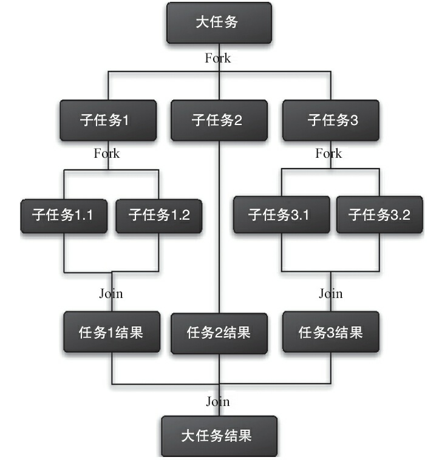
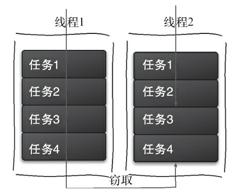

# 什么是ForkJoin框架
ForkJoin是并行执行任务的框架，是一个把大任务分割成若干
个小任务，最终汇总每个小任务结果后得到大任务结果的框架



## 工作窃取算法
工作窃取（work-stealing）算法是指某个线程从其他队列里窃取任务来执行。一个大任务分割成
若干个子任务，每个子任务放到不同双端队列中，每个队列单独由一个线程执行任务。如果有的线程
提前把自己双端队列中任务做完了，就会窃取其他线程的任务队列执行。


## Fork/Join设计
①ForkJoinTask：我们要使用ForkJoin框架，必须首先创建一个ForkJoin任务。它提供在任务
中执行fork()和join()操作的机制。通常情况下，我们不需要直接继承ForkJoinTask类，只需要继
承它的子类，Fork/Join框架提供了以下两个子类。
- RecursiveAction：用于没有返回结果的任务。
- RecursiveTask：用于有返回结果的任务。

②ForkJoinPool：ForkJoinTask需要通过ForkJoinPool来执行。
任务分割出的子任务会添加到当前工作线程所维护的双端队列中，进入队列的头部。当
一个工作线程的队列里暂时没有任务时，它会随机从其他工作线程的队列的尾部获取一个任
务。

## forkjoin实现原理
ForkJoinPool由ForkJoinTask数组和ForkJoinWorkerThread数组组成，ForkJoinTask数组负责
将存放程序提交给ForkJoinPool的任务，而ForkJoinWorkerThread数组负责执行这些任务。

### ForkJoinTask的fork方法实现原理
调用ForkJoinTask的fork方法时，程序会调用ForkJoinWorkerThread的pushTask方法
异步地执行这个任务
```java_holder_method_tree
public final ForkJoinTask<V> fork() {
    ((ForkJoinWorkerThread) Thread.currentThread())
        .pushTask(this);
    return this;
}
```
pushTask方法把当前任务存放在ForkJoinTask数组队列里。然后再调用ForkJoinPool的
signalWork()方法唤醒或创建一个工作线程来执行任务
```java_holder_method_tree
final void pushTask(ForkJoinTask<> t) {
        ForkJoinTask<>[] q; int s, m;
        if ((q = queue) != null) {　　　　// ignore if queue removed
            long u = (((s = queueTop) & (m = q.length - 1)) << ASHIFT) + ABASE;
            UNSAFE.putOrderedObject(q, u, t);//当前任务加入到ForkJoinTask数组中
            queueTop = s + 1;　　　　　　// or use putOrderedInt
            if ((s -= queueBase) <= 2)
                pool.signalWork();//唤醒或创建一个工作线程来执行任务
            else if (s == m)
                growQueue();
        }
    }
```
### ForkJoinTask的join方法实现原理
**Join方法的主要作用是阻塞当前线程并等待获取结果**
```java_holder_method_tree
    public final V join() {
        if (doJoin() != NORMAL)
            return reportResult();
        else
            return getRawResult();
    } private V
    reportResult() {
        int s; Throwable ex;
        if ((s = status) == CANCELLED)
            throw new CancellationException();
        if (s == EXCEPTIONAL && (ex = getThrowableException()) != null)
            UNSAFE.throwException(ex);
        return getRawResult();
    }
```
doJoin()方法里，首先通过查看任务的状态，看任务是否已经执行完成，如果执行完成，
则直接返回任务状态；如果没有执行完，则从任务数组里取出任务并执行


## 实例
1+2+3+4任务中，每个子任务最多执行两个数相加。
```java_holder_method_tree
public class CountTask extends RecursiveTask<Integer> {
        private static final int THRESHOLD = 2;　　// 阈值
        private int start;
        private int end;
        public CountTask(int start, int end) {
            this.start = start;
            this.end = end;
        }
        @Override
        protected Integer compute() {
            int sum = 0;
// 如果任务足够小就计算任务
            boolean canCompute = (end - start) <= THRESHOLD;
            if (canCompute) {
                for (int i = start; i <= end; i++) {
                    sum += i;
                }
            } else {
// 如果任务大于阈值，就分裂成两个子任务计算
                int middle = (start + end) / 2;
                CountTask leftTask = new CountTask(start, middle);
                CountTask rightTask = new CountTask(middle + 1, end);
// 执行子任务
                leftTask.fork();
                rightTask.fork();
// 等待子任务执行完，并得到其结果
                int leftResult=leftTask.join();
                int rightResult=rightTask.join();
// 合并子任务
                sum = leftResult + rightResult;
            }
            return sum;
        }
public static void main(String[] args) {
        ForkJoinPool forkJoinPool = new ForkJoinPool();
// 生成一个计算任务，负责计算1+2+3+4
        CountTask task = new CountTask(1, 4);
// 执行一个任务
        Future<Integer> result = forkJoinPool.submit(task);
        try {
            System.out.println(result.get());
        } catch (InterruptedException e) {
        } catch (ExecutionException e) {
        }
    }
}
```