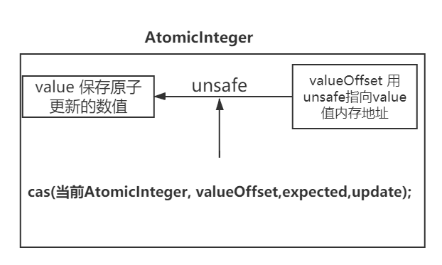

# 原子更新概述

常见的i++操作，并不是原子操作。假设i=0时，两个线程同时执行i++后，
可能最后i结果不是3，而是2。
```java
i++
1. cpu通过总线把内存i变量位置读取到cpu寄存器中
2. cpu的运算器执行 i+1操作
3. cpu通过总线把i+1数值更新到内存i位置
```
如何实现i++源自更新？
1. 重量锁。synchronized
2. 原子更新类Atomic（底层unsafe类实现）。

# 原子更新基本类型int

1. AtomicBoolean：原子更新布尔类型。
2. AtomicInteger：原子更新整型。
3. AtomicLong：原子更新长整型。

常见更新方法
1. int addAndGet（int delta）：输入值(delta)与实例中的值（AtomicInteger里的
value）相加，并返回结果。
2. boolean compareAndSet（int expect，int update）：如果输入的数值等于预期值AtomicInteger里的value），则以原子方
式将该值设置为输入的值。
3. int getAndIncrement()：以原子方式将当前值(AtomicInteger里的value）加1，注意，这里返回的是自增前的值

```java
import java.util.concurrent.atomic.AtomicInteger;
public class AtomicIntegerTest {
    static AtomicInteger ai = new AtomicInteger(1);
    public static void main(String[] args) {
        System.out.println(ai.getAndIncrement()); //实现 i++操作
        System.out.println(ai.get());
    }
}
public class AtomicInteger extends Number implements java.io.Serializable {
    private static final long serialVersionUID = 6214790243416807050L;

    // setup to use Unsafe.compareAndSwapInt for updates
    private static final Unsafe unsafe = Unsafe.getUnsafe();
    private static final long valueOffset;

    static {
        try {
            valueOffset = unsafe.objectFieldOffset
                    (AtomicInteger.class.getDeclaredField("value"));
        } catch (Exception ex) { throw new Error(ex); }
    }

    private volatile int value;//value是为了保证value数据的可见性，一个数据对value更新同步到主存，读取从主存中读取
    public final int getAndIncrement() {//AtomicInteger方法
        for (;;) {//死循环+cas保证，必须成功更新。更新成功正常返回current，退出for死循环
            int current = get();//每次读取最新的数值,获取当前对象的value字段，通过unsafe+offset获得current
            int next = current + 1;
            if (compareAndSet(current, next))
                 return current;
            }
        } 
        public final boolean compareAndSet(int expect, int update) {//AtomicInteger方法
            //cas底层还是用unsafe类的cas方法（更新的类，类中成员value偏移量，预期数值，更新后数值）
            return unsafe.compareAndSwapInt(this, valueOffset, expect, update);
        }
}
//1.8的unsafe的getAndAddInt源码
    //O:AtomicInteger对象，offset是AtomicInteger对象内部valatile int value的偏移量，delta=1
public final int getAndAddInt(Object o, long offset, int delta) {
        int v;
        do {
        v = getIntVolatile(o, offset);
        } while (!compareAndSwapInt(o, offset, v, v + delta));
        return v;
        }
```


Atomic包提供了3种基本类型的原子更新，char,float,double怎么实现的呢，unsafe类其实也没有提供boolean类的原子更新
只是Atomic包提供的boolean更新转换成int类型的cas更新，char,float,double也可以用类似的思路。
```java
AtomicBoolean类的cas更新boolean类型
public final boolean compareAndSet(boolean expect, boolean update) {
        int e = expect ? 1 : 0;
        int u = update ? 1 : 0;
        return unsafe.compareAndSwapInt(this, valueOffset, e, u);
    }
```

# 原子更新数组
通过原子的方式更新数组里的某个索引位置index的数值

1. AtomicIntegerArray：原子更新整型数组里的元素。
2. AtomicLongArray：原子更新长整型数组里的元素。
3. AtomicReferenceArray：原子更新引用类型数组里的元素

常用跟新方法（AtomicIntegerArray）
1. int addAndGet（int index，int 增加数值）：以原子方式将输入值与数组中索引i的元素相加。
2. boolean compareAndSet（int index，int expect，int update）：如果当前值等于预期值，则以原子
方式将数组位置i的元素设置成update值。
以

```java
public class AtomicIntegerArrayTest {
    static int[] value = new int[] { 1， 2 };
    static AtomicIntegerArray ai = new AtomicIntegerArray(value);
    public static void main(String[] args) {
        ai.getAndSet(0， 3);//设置0索引位置变为3，源自更新
        //value通过构造方法传入AtomicIntegerArray会将当前数组复制一份
        System.out.println(ai.get(0));//3
        System.out.println(value[0]);//1
    }
}
public final int getAndSet(int i, int newValue) {//AtomicIntegerArray类方法
        return unsafe.getAndSetInt(array, checkedByteOffset(i), newValue);
    }
//unsafe类的方法
public final int getAndSetInt(更新的对象,需要更新的偏移量, 新值) {
        int 旧值;
        do {
            旧值 = this.getIntVolatile(更新的对象, 需要更新的偏移量);
        } while(!this.compareAndSwapInt(更新的对象, 需要更新的偏移量, 旧值, 新值));

        return 旧值;
    }
```
更新数组索引i位置，还是通过unsafe类的cas操作cas(修改的数组对象，由index索引计算的内存偏移量，newValue))


# 原子更新引用类型
原子更新基本类型的AtomicInteger，只能更新一个变量,如果要原子更新多个变量，可以把多条数据封装
成引用对象的属性，用原子更新引用类进行更新。

1. AtomicReference：原子更新引用类型。
2. AtomicReferenceFieldUpdater：原子更新引用类型里的字段。
```java
public class AtomicReferenceTest {
    public static AtomicReference<user> atomicUserRef = new AtomicReference<user>();
    public static void main(String[] args) {
        User user = new User("conan",15);
        atomicUserRef.set(user);
        User updateUser = new User("Shinichi",17);
        atomicUserRef.compareAndSet(user, updateUser);
        System.out.println(atomicUserRef.get().getName());
        System.out.println(atomicUserRef.get().getOld());
    }
    static class User {
        private String name;
        private int old;
        public User(String name,int old) {
            this.name = name;
            this.old = old;
        }
        public String getName() {
            return name;
        }
        public int getOld() {
            return old;
        }
    }
}
//AtomicReference类
public final boolean compareAndSet(V expect, V update) {
        return unsafe.compareAndSwapObject(AtomicReference类对象, 内部对象的偏移量, 期待对象, 更新对象);
    }
```

# 原子更新字段类
原子地更新某个类Class里的某个字段Field时，就需要使用原子更新字段类

1. AtomicIntegerFieldUpdater：原子更新整型的字段的更新器。
2. AtomicLongFieldUpdater：原子更新长整型字段的更新器。
3. AtomicStampedReference：原子更新带有版本号的引用类型,解决cas可能出现的aba问题

如何源自更新字段类？
1. 静态方法newUpdater()创建一个更新器，并设置想要更新的类和属性
2. 更新的字段必须要用public volatile修饰

```java
public class AtomicIntegerFieldUpdaterTest {
    // 创建原子更新器，并设置需要更新的对象类User和对象的old属性
    private static AtomicIntegerFieldUpdater<User> a = AtomicIntegerFieldUpdater.newUpdater(User.class,"old");
    public static void main(String[] args) {
    // 设置柯南的年龄是10岁
    User conan = new User("conan",10);
    // 柯南长了一岁，但是仍然会输出旧的年龄
    System.out.println(a.getAndIncrement(conan));//原子性更新conan对象的，old年龄属性。
    // 输出柯南现在的年龄
    System.out.println(a.get(conan));//get获取新数值
    }
    public static class User {
        private String name;
        public volatile int old;//待原子性更新的字段
        public User(String name,int old) {
            this.name = name;
            this.old = old;
        }
        public String getName() {
            return name;
        }
        public int getOld() {
            return old;
        }
    }
}
```
原子更新字段类底层调用的unsafe方法
```java
public final int getAndAddInt(更新对象, 属性字段偏移量, 1) {
        int 当前值;
        do {
            当前值 = this.getIntVolatile(更新对象, 属性字段偏移量);
        } while(!this.compareAndSwapInt(更新对象, 属性字段偏移量, 当前值, 当前值 + 1));

        return var5;
    }
```