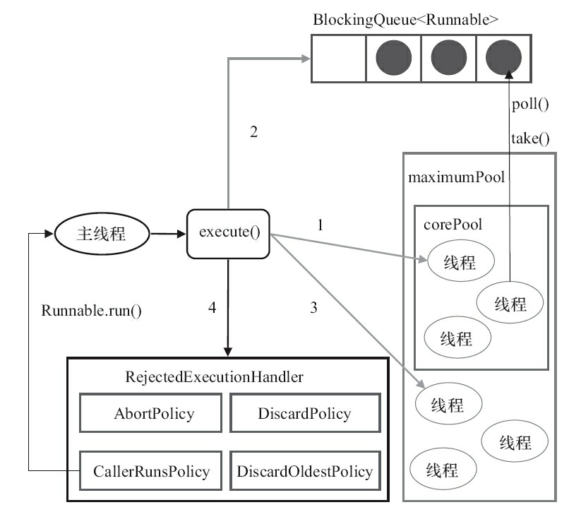
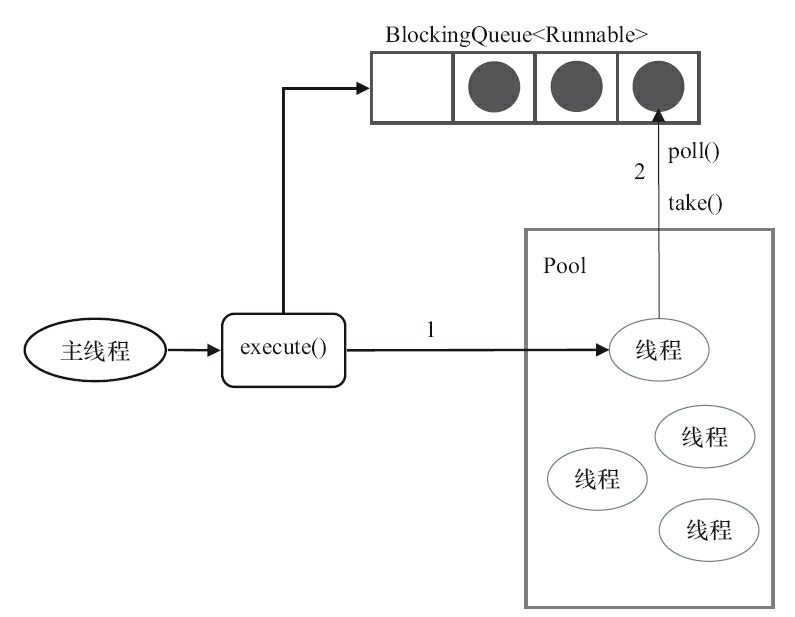

#
## 使用线程池好处（面试）
1. **降低资源消耗**。线程创建销毁开销很大，通过重复利用已经创建的线程降低消耗。（JVM的线程和内核级线程是一对一映射）
2. **提高响应速度**。当任务到达时，任务可以不需要等到线程创建就能立即执行。
3. **提高线程的可管理性**。线程是稀缺资源，如果无限制地创建，不仅会消耗系统资源，还会降低系统的稳定性，使用线程池可以进行统一分配、调优和监控
## 线程池参数（面试）
```java_holder_method_tree
new ThreadPoolExecutor(corePoolSize, maximumPoolSize, keepAliveTime,
milliseconds,runnableTaskQueue, handler);
```
1. corePoolSize（线程池的基本大小存放的是“正式员工线程”）：当提交一个任务到线程池时，线程池会创建一个线
程来执行任务，即使其他空闲的基本线程能够执行新任务也会创建线程，等到需要执行的任
务数大于线程池基本大小时就不再创建。如果调用了线程池的prestartAllCoreThreads()方法，
线程池会提前创建并启动所有基本线程。
2. runnableTaskQueue（任务队列）：用于保存等待执行的任务的阻塞队列。可以选择以下几
个阻塞队列。
- ArrayBlockingQueue：是一个基于数组结构的有界阻塞队列，此队列按FIFO（先进先出）原
则对元素进行排序。
- LinkedBlockingQueue：一个基于链表结构的阻塞队列，此队列按FIFO排序元素，吞吐量通
常要高于ArrayBlockingQueue。静态工厂方法Executors.newFixedThreadPool()使用了这个队列。
- SynchronousQueue：一个不存储元素的阻塞队列。每个插入操作必须等到另一个线程调用
移除操作，否则插入操作一直处于阻塞状态，吞吐量通常要高于Linked-BlockingQueue，静态工
厂方法Executors.newCachedThreadPool使用了这个队列。
- PriorityBlockingQueue：一个具有优先级的无限阻塞队列。
3. maximumPoolSize（线程池最大数量，额外创建的“临时工线程”）：线程池允许创建的最大线程数。如果队列满了，并
且已创建的线程数小于最大线程数，则线程池会再创建新的线程执行任务。值得注意的是，如
果使用了无界的任务队列这个参数就没什么效果。
4. keepAliveTime（“临时工线程”活动保持时间）：线程池的“临时工线程”空闲后，保持存活的时间。所以，
如果任务很多，并且每个任务执行的时间比较短，可以调大时间，提高线程的利用率
5. ThreadFactory：用于设置创建线程的工厂，可以通过线程工厂给每个创建出来的线程设
置更有意义的名字。
6. RejectedExecutionHandler（拒绝策略）：当队列和线程池都满了，说明线程池处于饱和状
 态，那么必须采取一种策略处理提交的新任务。
- AbortPolicy：丢弃任务并且抛出异常。停止策略。**场景**：比较关键的业务，在系统不能承载更大的并发量的时候，抛出异常及时发现。
- DiscardPolicy：丢弃任务不抛异常。丢弃策略。**场景**：可有可无的业务。博客文章的阅读量统计。
- DiscardOldestPolicy：丢弃队列里最前面任务，并执行当前任务。弃老策略。**场景**：根据实际业务是否容许丢弃老任务来认真衡量，
发布消息和修改消息，当旧消息发布出去后，还未执行，此时更新的消息又来了，这个时候未执行的消息的版本比如今提交的消息版本要低就能够被丢弃了。
- CallerRunsPolicy：由调用线程来处理任务。调用者运行策略。**场景**：通常在不容许失败的、对性能要求不高、并发量较小的场景下使用
[决绝策略参考](https://www.shangmayuan.com/a/de158fdc49f740e99502923c.html "a")

也可以根据应用场景需要来实现RejectedExecutionHandler接口自定义策略

## 线程池实现原理（面试）
新任务到达时，线程池处理流程。
1. 判断当前线程数是不是小于核心线程数，如果是则直接创建新的核心线程来执行任务。如果不是，判断是否有空闲的
核心线程池，如果是则把任务交给空闲的核心线程。如果核心线程数量满了，并且核心线程都在忙则进入到下一步
2. 线程池判断工作队列是否已经满。如果工作队列没有满，则将新提交的任务存储在这
个工作队列里。如果工作队列满了，则进入下个流程。
3. 判断线程池的线程数量是否都到达最大线程数量。如果没有，则创建一个新的工作线程
来执行任务（不用排队，相当于临时工线程）。如果已经满了，则交给饱和策略来处理这个任务


ThreadPoolExecutor执行execute方法分下面4种情况。
1. 如果当前运行的线程少于corePoolSize，则创建新线程来执行任务（注意，执行这一步骤
需要获取全局锁）。
2. 如果运行的线程等于或多于corePoolSize，则将任务加入BlockingQueue。
3. 如果无法将任务加入BlockingQueue（队列已满），并且当前运行线程个数<maximumPoolSize 则创建新的线程（临时工线程）来处理任务（注意，执
行这一步骤需要获取全局锁）。
4. 如果创建新线程将使当前运行的线程超出maximumPoolSize，任务将被拒绝，并调用
RejectedExecutionHandler.rejectedExecution()方法。

### 线程池执行源码
```java_holder_method_tree
public void execute(Runnable command) {
    if (command == null)
        throw new NullPointerException();
        // 如果线程数小于基本线程数，则创建线程并执行当前任务
    if (poolSize >= corePoolSize || !addIfUnderCorePoolSize(command)) {
    // 如线程数大于等于基本线程数或线程创建失败，则将当前任务放到工作队列中。
        if (runState == RUNNING && workQueue.offer(command)) {
            if (runState != RUNNING || poolSize == 0)
            ensureQueuedTaskHandled(command);
        } 
        // 则创建一个线程执行任务。
        else if (!addIfUnderMaximumPoolSize(command))
        // 抛出RejectedExecutionException异常
        reject(command); // is shutdown or saturated
        }
}
```
线程封装成工作线程Worker，Worker在执行完任务后，还会循环获取工作队列里的任务来执

```java_holder_method_tree
    public void run() {
        try {
            Runnable task = firstTask;
            firstTask = null;
            while (task != null || (task = getTask()) != null) {
                runTask(task);
                task = null;
            }
        } finally {
            workerDone(this);
        }
    }
```


## 线程池提交任务execute和submit（面试）
execute()方法用于提交不需要返回值的任务，submit()方法用于提交需要返回值的任务,线程池会返回一个future类型的对象.
通过过future的get()方法来获取返回值，get()方法会阻塞当前线程直到任务完成。
```java_holder_method_tree
threadsPool.execute(new Runnable() {
        @Override
        public void run() {

        }
    });
  Future<Object> future = executor.submit(harReturnValuetask);
        try {
            Object s = future.get();
        } catch (InterruptedException e) {
        // 处理中断异常
        } catch (ExecutionException e) {
        // 处理无法执行任务异常
        } finally {
        // 关闭线程池
            executor.shutdown();
        }
```

## 如何合理配置线程池（面试）
不同的角度分析。
1. 任务的性质：CPU密集型任务、IO密集型任务和混合型任务。CPU密集型任务应配置尽可能小的
线程，如配置Ncpu+1个线程的线程池。由于IO密集型任务线程并不是一直在执行任务，则应配
 置尽可能多的线程，如2*Ncpu。
2. 任务的优先级：高、中和低。使用优先级队列PriorityBlockingQueue
3. 任务的执行时间：长、中和短。交给不同规模的线程池来处理，或者优先级队列
4. 任务的依赖性：是否依赖其他系统资源，如数据库连接。CPU空闲时间就越长，那么线程数应该设置得越大，这样才能更好地利用CPU


## 线程池关闭
通过调用线程池的shutdown或shutdownNow方法，底层通过调用线程的interrupt中断。
它们存在一定的区别，shutdownNow首先将线程池的状态设置成
STOP，然后尝试停止所有的正在执行或暂停任务的线程，并返回等待执行任务的列表，而
shutdown只是将线程池的状态设置成SHUTDOWN状态，然后中断所有没有正在执行任务的线
程，队列中等待的任务仍然会被执行。


# 推荐博客
[java线程池学习总结](https://github.com/Snailclimb/JavaGuide/blob/master/docs/java/multi-thread/java%E7%BA%BF%E7%A8%8B%E6%B1%A0%E5%AD%A6%E4%B9%A0%E6%80%BB%E7%BB%93.md "asfa") 
[美团技术 线程池实现原理及其在美团业务中的实践](https://tech.meituan.com/2020/04/02/java-pooling-pratice-in-meituan.html "afafds")

#面试
线程池的类型

使用线程池的好处

多线程4种拒绝拒绝策略和使用场景

线程池的各个参数

线程池execute 和 submit的区别

任务队列的类型。ArrayBlockingQueue和LinkedBlockingQueue区别

如何合理的配置线程池？（考虑CPU密集型和IO密集型）